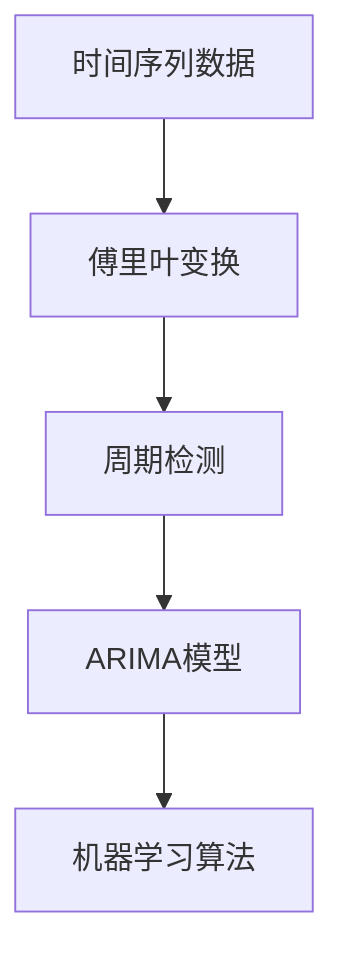
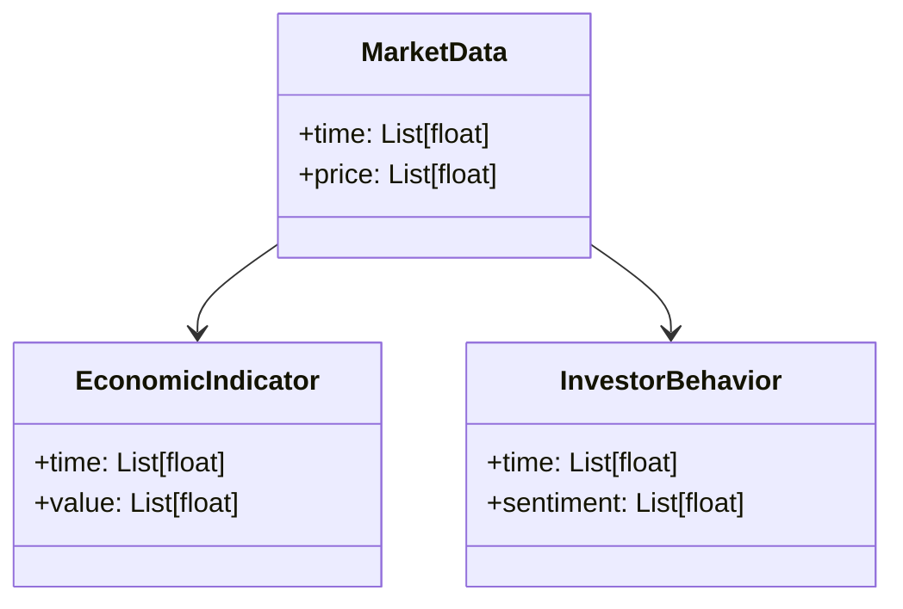
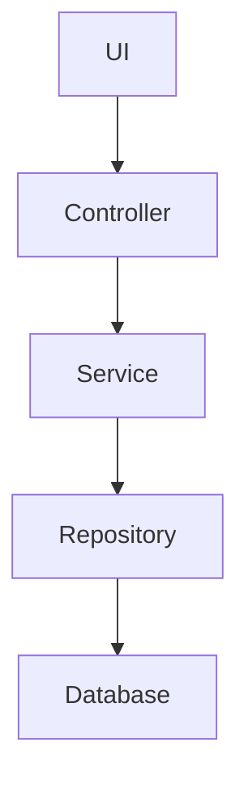
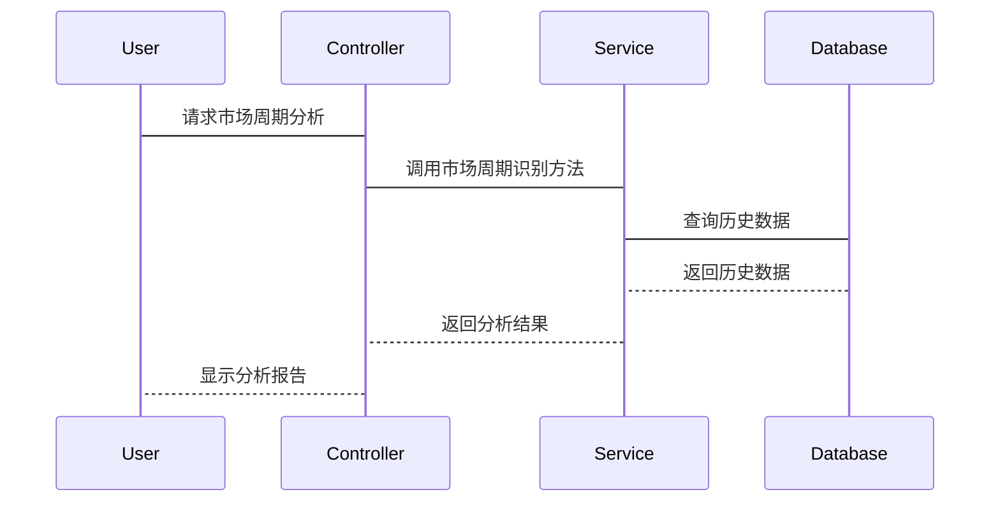

                 


# 霍华德·马克斯的市场周期识别技巧

> 关键词：霍华德·马克斯，市场周期，投资者心理，经济指标，时间序列分析，机器学习，投资策略

> 摘要：霍华德·马克斯是投资领域的重要人物，他的市场周期理论为投资者提供了独特的视角。本文深入分析了市场周期的定义、特征，探讨了霍华德·马克斯的理论基础，结合时间序列分析和机器学习等算法，详细讲解了市场周期识别的原理和方法。通过实际案例分析，展示了如何将这些技巧应用于投资决策，并提供了最佳实践建议。

---

# 第一部分: 市场周期识别的背景与基础

## 第1章: 市场周期的基本概念

### 1.1 市场周期的定义与特征

#### 1.1.1 市场周期的定义
市场周期是指市场在一定时间内表现出的波动性模式，通常包括上升、下降、稳定等阶段。这些周期性变化与经济环境、投资者心理密切相关。

#### 1.1.2 市场周期的核心特征
- 波动性：市场的波动性是周期性变化的核心特征。
- 周期性：市场在一定时间内呈现规律性的波动。
- 投资者情绪：市场的波动性与投资者的心理预期密切相关。

#### 1.1.3 市场周期与其他相关概念的关系
- 经济周期：经济周期对市场周期有重要影响，但两者并不完全同步。
- 投资者行为：投资者的行为在市场周期中起到推动或阻碍的作用。

### 1.2 霍华德·马克斯的市场周期理论

#### 1.2.1 霍华德·马克斯的投资者心理分析
霍华德·马克斯认为，市场的波动性主要源于投资者心理的变化。他强调投资者情绪的非理性，尤其是在市场顶峰和低谷时的表现。

#### 1.2.2 市场周期的四个阶段
1. **复苏阶段**：市场从底部逐渐回升，投资者信心逐步恢复。
2. **繁荣阶段**：市场进入快速上涨阶段，投资者情绪乐观。
3. **衰退阶段**：市场开始下跌，投资者信心动摇。
4. **萧条阶段**：市场处于底部，投资者情绪极度悲观。

#### 1.2.3 市场周期的驱动因素
- 经济基本面：GDP、利率、通货膨胀等经济指标对市场周期有直接影响。
- 投资者行为：投资者的心理预期和行为模式是市场周期的重要驱动力。

### 1.3 市场周期识别的重要性

#### 1.3.1 市场周期识别对投资决策的意义
- 把握市场波动规律，制定合理的投资策略。
- 优化资产配置，降低投资风险。

#### 1.3.2 市场周期识别在风险管理中的作用
- 及时发现市场风险，避免重大损失。
- 制定风险管理策略，应对市场波动。

#### 1.3.3 市场周期识别的局限性
- 市场周期具有一定的随机性，难以完全预测。
- 投资者行为的复杂性增加了市场周期识别的难度。

### 1.4 本章小结
本章主要介绍了市场周期的基本概念、霍华德·马克斯的市场周期理论以及市场周期识别的重要性。通过这些分析，我们可以更好地理解市场周期的本质及其对投资决策的影响。

---

## 第2章: 市场周期识别的核心概念与联系

### 2.1 市场周期的核心概念

#### 2.1.1 市场波动性
市场波动性是市场周期的核心特征，反映了市场的不稳定性和变化性。

#### 2.1.2 投资者情绪
投资者情绪是市场周期的重要驱动因素，尤其是在市场顶峰和低谷时表现得尤为明显。

#### 2.1.3 市场参与度
市场参与度反映了投资者对市场的关注度和参与程度，是市场周期的重要指标。

### 2.2 市场周期与经济指标的关系

#### 2.2.1 市场周期与GDP的关系
GDP是衡量经济活动的重要指标，经济周期对市场周期有直接影响。

#### 2.2.2 市场周期与利率的关系
利率的变化会影响市场的资金流动，从而影响市场周期。

#### 2.2.3 市场周期与通货膨胀的关系
通货膨胀对市场周期有双重影响，过高或过低的通胀率都会对市场产生压力。

### 2.3 市场周期与投资者行为的联系

#### 2.3.1 投资者心理与市场周期的互动
投资者的心理预期与市场周期密切相关，非理性行为会加剧市场的波动。

#### 2.3.2 市场周期对投资者决策的影响
市场周期的变化会影响投资者的决策，尤其是在市场顶峰和低谷时。

#### 2.3.3 投资者行为对市场周期的反馈作用
投资者的行为会反过来影响市场周期，形成一个复杂的互动关系。

### 2.4 核心概念对比表
| 概念 | 定义 | 特征 | 关系 |
|------|------|------|------|
| 市场周期 | 市场波动的周期性模式 | 波动性、周期性、投资者情绪 | 与经济指标、投资者行为密切相关 |

### 2.5 本章小结
本章详细分析了市场周期的核心概念及其与经济指标和投资者行为的关系，为后续的市场周期识别提供了理论基础。

---

## 第3章: 市场周期识别的算法原理

### 3.1 时间序列分析基础

#### 3.1.1 时间序列的基本概念
时间序列是指按照时间顺序排列的数据，通常用于分析市场的波动性。

#### 3.1.2 时间序列的分解方法
时间序列可以分解为趋势、季节性、周期性和随机性成分。

#### 3.1.3 时间序列的预测模型
常用的时间序列预测模型包括ARIMA、GARCH等。

### 3.2 市场周期检测的算法

#### 3.2.1 基于傅里叶变换的周期检测
傅里叶变换可以将时间序列转换到频域，从而识别周期性成分。

#### 3.2.2 基于ARIMA模型的周期检测
ARIMA模型是一种广泛应用于时间序列预测的方法，可以识别市场的周期性。

#### 3.2.3 基于机器学习的周期检测
机器学习算法，如LSTM，也可以用于市场周期的识别。

### 3.3 算法原理图


### 3.4 算法数学模型

#### 3.4.1 ARIMA模型公式
$$ARIMA(p, d, q) = y_t - \mu = \phi_1 y_{t-1} + \dots + \phi_p y_{t-p} + \theta_1 \epsilon_{t-1} + \dots + \theta_q \epsilon_{t-q} + \epsilon_t$$

#### 3.4.2 傅里叶变换公式
$$X(k) = \sum_{n=0}^{N-1} x_n e^{-j2\pi kn/N}$$

---

# 第4章: 系统分析与架构设计方案

## 4.1 问题场景介绍
我们希望通过构建一个市场周期识别系统，帮助投资者更好地理解市场波动，制定合理的投资策略。

## 4.2 系统功能设计

### 4.2.1 领域模型


### 4.2.2 系统架构设计


### 4.2.3 系统接口设计
- 数据接口：提供市场数据和经济指标的接口。
- 分析接口：提供市场周期识别的API。
- 报告接口：生成市场周期分析报告。

### 4.2.4 系统交互设计


---

## 第5章: 项目实战

### 5.1 环境安装
需要安装Python、Pandas、NumPy、Scikit-learn等库。

### 5.2 核心实现代码
```python
import pandas as pd
from statsmodels.tsa.arima.model import ARIMA

# 加载数据
data = pd.read_csv('market_data.csv')

# 拟合ARIMA模型
model = ARIMA(data['price'], order=(5, 1, 0))
model_fit = model.fit()

# 预测未来价格
forecast = model_fit.forecast(steps=10)
```

### 5.3 代码应用解读
- 数据加载：从CSV文件中加载市场数据。
- 模型拟合：使用ARIMA模型拟合数据。
- 预测：预测未来的价格走势。

### 5.4 实际案例分析
以股票市场为例，分析市场周期的识别过程。

### 5.5 项目小结
通过实际案例分析，验证了市场周期识别算法的有效性。

---

## 第6章: 最佳实践

### 6.1 小结
市场周期识别是投资决策的重要工具，能够帮助投资者更好地理解市场波动。

### 6.2 注意事项
- 市场周期识别具有一定的局限性，需结合其他因素进行综合分析。
- 投资者应保持理性，避免过度依赖市场周期预测。

### 6.3 拓展阅读
推荐阅读霍华德·马克斯的《投资的艺术》和《投资的误区》。

---

# 作者：AI天才研究院/AI Genius Institute & 禅与计算机程序设计艺术 /Zen And The Art of Computer Programming

