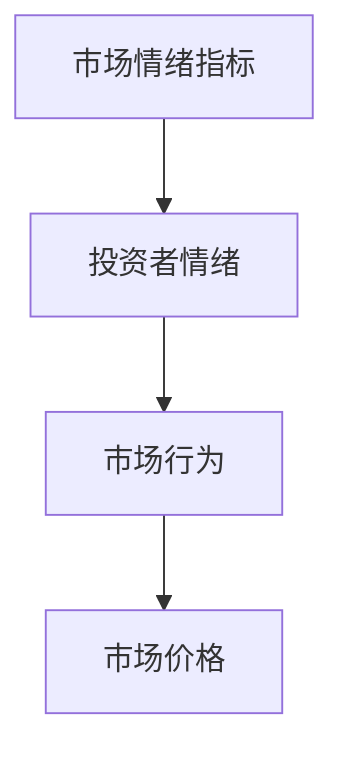
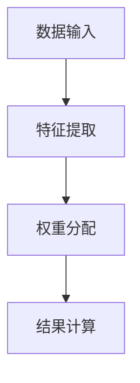
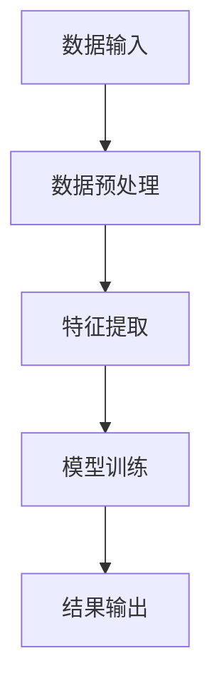
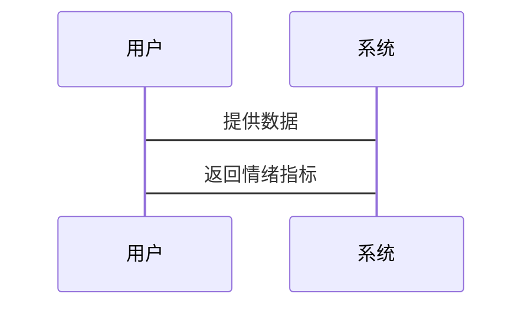

                 


# 霍华德·马克斯的市场情绪指标

## 关键词：市场情绪指标、霍华德·马克斯、投资决策、情绪分析、市场预测

## 摘要：霍华德·马克斯作为投资界的传奇人物，其市场情绪指标为投资者提供了独特的视角。本文将逐步分析市场情绪指标的构建原理、算法实现及实际应用，帮助读者深入理解其在投资决策中的作用。

---

## 第一部分: 市场情绪指标的背景与基础

### 第1章: 市场情绪指标概述

#### 1.1 市场情绪的基本概念
- 1.1.1 市场情绪的定义：市场情绪是投资者对市场的整体看法，影响市场行为和价格走势。
- 1.1.2 市场情绪的核心要素：包括贪婪、恐惧、乐观、悲观等情绪。
- 1.1.3 市场情绪与投资决策的关系：情绪波动如何影响投资者的决策。

#### 1.2 霍华德·马克斯的市场情绪理论
- 1.2.1 霍华德·马克斯的生平与投资理念：其投资哲学和对市场的独特见解。
- 1.2.2 马克斯市场情绪指标的核心思想：市场情绪的周期性及其对价格波动的影响。
- 1.2.3 马克斯理论的现实意义：如何在实际投资中应用。

#### 1.3 市场情绪指标的重要性和局限性
- 1.3.1 重要性：帮助投资者识别市场趋势和潜在风险。
- 1.3.2 局限性：指标并非完美，需结合其他因素分析。
- 1.3.3 使用场景：适合长期投资和市场周期分析。

### 第2章: 市场情绪指标的核心概念与联系

#### 2.1 市场情绪指标的原理
- 2.1.1 情绪指标的分类：基于新闻、社交媒体等数据的情绪分析。
- 2.1.2 情绪指标的构建方法：数据收集、特征提取、模型训练。
- 2.1.3 情绪指标与市场行为的关系：情绪如何转化为交易行为。

#### 2.2 核心概念对比分析
- 2.2.1 情绪指标与其他市场指标的对比：如波动率、成交量等。
- 2.2.2 不同指标的优缺点：如VIX指数与社交媒体情绪指数的差异。
- 2.2.3 指标的适用范围：短期 vs 长期预测。

#### 2.3 情绪指标的ER实体关系图


### 第3章: 市场情绪指标的算法原理

#### 3.1 情绪指标的计算方法
- 3.1.1 情绪强度计算公式：
$$ 情绪强度 = \sum (权重_i \times 情感_i) $$

- 3.1.2 情绪指标的加权计算：


#### 3.2 情绪指标的数学模型
- 3.2.1 情绪强度的数学表达：
$$ 情绪强度 = \sum_{i=1}^{n} w_i \times s_i $$
其中，$w_i$ 是第 $i$ 个特征的权重，$s_i$ 是情感值。

---

## 第二部分: 系统分析与架构设计

### 第4章: 市场情绪指标的系统架构

#### 4.1 系统功能设计
- 数据源接口：收集新闻、社交媒体数据。
- 情绪指标计算模块：处理数据，计算情绪指标。
- 可视化模块：展示情绪指标趋势图。

#### 4.2 系统架构图


#### 4.3 接口设计与交互流程
- 接口设计：API输入数据，返回情绪指标。
- 交互流程图：


---

## 第三部分: 项目实战与案例分析

### 第5章: 项目实战

#### 5.1 环境安装
- 安装Python和相关库（如自然语言处理库）。

#### 5.2 核心代码实现
```python
def calculate_sentiment(sentences):
    # 特征提取
    features = extract_features(sentences)
    # 权重分配
    weights = assign_weights(features)
    # 结果计算
    return sum(weights[i] * sentiment[i] for i in range(len(weights)))
```

#### 5.3 案例分析
- 分析2008年金融危机期间的情绪指标变化。

---

## 第四部分: 最佳实践与小结

### 第6章: 最佳实践

#### 6.1 小结
- 市场情绪指标的核心作用和实际应用。

#### 6.2 注意事项
- 避免过度依赖单一指标，结合其他因素分析。

#### 6.3 拓展阅读
- 推荐相关书籍和论文，深入学习情绪分析技术。

---

## 作者：AI天才研究院/AI Genius Institute & 禅与计算机程序设计艺术 /Zen And The Art of Computer Programming

---

**摘要：** 本文详细介绍了霍华德·马克斯的市场情绪指标，从理论到实践，结合算法和系统设计，帮助投资者理解和应用这一指标，提升投资决策的科学性和准确性。

