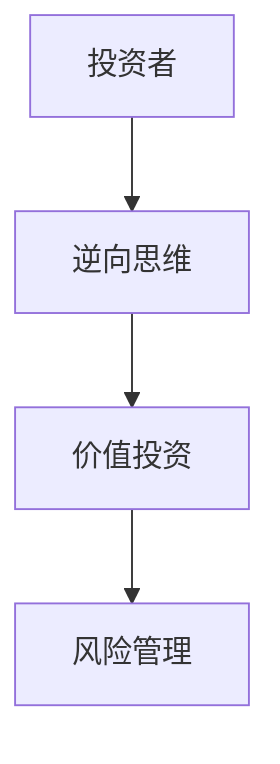
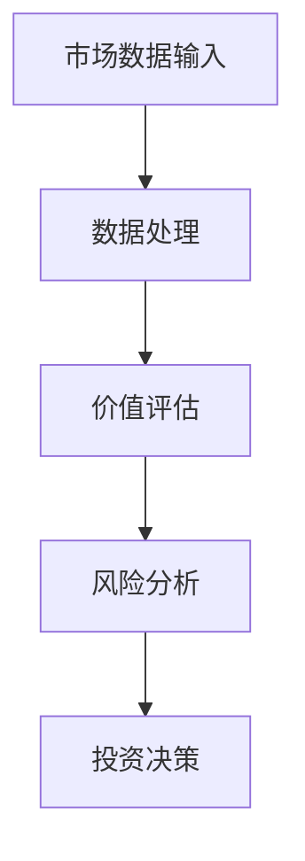
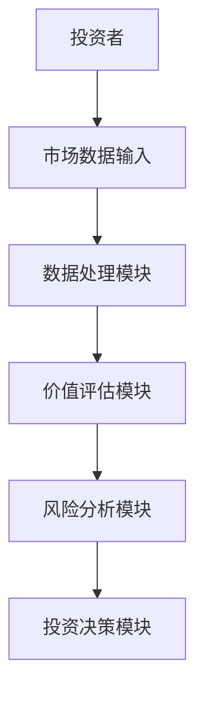

                 


# 霍华德·马克斯的逆向投资哲学

## 关键词

- 逆向投资
- 霍华德·马克斯
- 价值投资
- 风险管理
- 投资哲学

## 摘要

霍华德·马克斯的逆向投资哲学是一种以价值为导向、逆市场趋势的投资策略，强调在市场恐慌时寻找机会，在市场狂热时保持冷静。本文将从逆向投资的背景、核心概念、算法原理、系统架构、项目实战等方面进行详细阐述，并结合实例和数学模型，深入剖析霍华德·马克斯的投资理念和方法。

---

## 第一部分: 霍华德·马克斯的逆向投资哲学概述

### 第1章: 逆向投资的起源与发展

#### 1.1 逆向投资的定义与核心理念

- **1.1.1 逆向投资的定义**
  - 逆向投资是一种与市场趋势相反的投资策略，强调在市场低估时买入，在市场高估时卖出。
- **1.1.2 逆向投资的核心理念**
  - 市场波动性：市场情绪的波动导致价格偏离价值。
  - 逆向思维：在市场恐慌时寻找低估资产，在市场狂热时规避风险。
- **1.1.3 霍华德·马克斯的贡献**
  - 马克斯通过《投资的谬误》等著作，系统阐述了逆向投资的理论和实践。

#### 1.2 霍华德·马克斯的生平与投资哲学

- **1.2.1 霍华德·马克斯的生平简介**
  - 美国著名投资者，橡树资本创始人，被誉为“逆向投资之父”。
- **1.2.2 马克斯投资哲学的核心思想**
  - 强调安全边际：买入价格低于内在价值的资产。
  - 风险管理：优先考虑本金的安全性，而非追求高收益。
- **1.2.3 马克斯的投资策略与风格**
  - 逆向选股：寻找市场忽视的低估资产。
  - 长期持有：避免频繁交易，降低交易成本。

### 第2章: 逆向投资的背景与问题背景

#### 2.1 传统投资方法的局限性

- **2.1.1 传统投资方法的优缺点**
  - 优点：基于历史数据和趋势分析。
  - 缺点：忽视市场情绪，容易随市场波动而盲目跟风。
- **2.1.2 传统投资方法在市场中的不足**
  - 在市场泡沫时推高股价，导致投资决策失误。
  - 在市场恐慌时低估资产价值，错失投资机会。

#### 2.2 逆向投资的兴起与市场需求

- **2.2.1 逆向投资兴起的背景**
  - 2008年金融危机后，市场波动加剧，传统投资方法失效。
  - 投资者对安全性和稳定性的需求增加。
- **2.2.2 市场对逆向投资的需求**
  - 在市场低迷时，寻找低估资产的需求增加。
  - 投资者对风险管理的关注度提升。

#### 2.3 霍华德·马克斯逆向投资哲学的提出

- **2.3.1 问题背景的描述**
  - 市场情绪的极端化导致资产价格偏离内在价值。
  - 投资者在市场恐慌时倾向于抛售，而在市场狂热时盲目买入。
- **2.3.2 问题解决的思路**
  - 通过逆向思维，识别市场非理性行为，寻找投资机会。
  - 强调安全边际，降低投资风险。
- **2.3.3 霍华德·马克斯哲学的核心要素**
  - 价值评估：基于内在价值的投资决策。
  - 逆向思维：在市场低谷时买入，在市场高点时卖出。
  - 风险管理：优先考虑本金安全。

### 第3章: 逆向投资的核心概念与联系

#### 3.1 核心概念的定义与解释

- **3.1.1 逆向思维**
  - 逆向思维是指在市场情绪与实际价值相悖时，采取与市场相反的行动。
- **3.1.2 价值投资**
  - 价值投资是指以低于内在价值的价格买入资产，等待其价值回归。
- **3.1.3 风险管理**
  - 风险管理是指通过分散投资、设定止损等方式，降低投资风险。

#### 3.2 核心概念的属性特征对比

| 概念      | 特性               | 对比点         |
|-----------|--------------------|---------------|
| 逆向思维   | 市场反向操作       | 与市场趋势相反 |
| 价值投资   | 基于内在价值       | 独立于市场情绪 |
| 风险管理   | 降低潜在损失       | 保护本金安全   |

#### 3.3 实体关系图（ER图）



---

## 第四部分: 逆向投资的算法原理与数学模型

### 第4章: 逆向投资的算法原理与数学模型

#### 4.1 逆向投资的算法原理

- **4.1.1 简单逆向筛选算法**

  ```mermaid
  graph TD
  A[市场数据输入] --> B[逆向筛选]
  B --> C[投资决策]
  ```

  - 算法步骤：
    1. 收集市场数据，包括股票价格、市盈率、市净率等。
    2. 筛选出价格低于内在价值的资产。
    3. 根据筛选结果制定投资决策。

#### 4.2 数学模型与公式

- **4.2.1 价值评估公式**

  $$ V = \frac{E}{P} $$

  其中，$V$ 表示内在价值，$E$ 表示企业价值，$P$ 表示市场价格。

- **4.2.2 风险调整收益公式**

  $$ R = \frac{R_p - R_f}{\sigma_p} $$

  其中，$R$ 表示风险调整收益，$R_p$ 表示投资回报率，$R_f$ 表示无风险利率，$\sigma_p$ 表示投资风险。

#### 4.3 举例说明

- **4.3.1 简单逆向筛选算法的示例**

  ```python
  def inverse_selection(data, threshold):
      selected = data[data < threshold]
      return selected
  ```

  - 示例数据：
    ```python
    prices = [10, 20, 15, 25, 30]
    threshold = 20
    selected = inverse_selection(prices, threshold)
    print(selected)  # 输出 [10, 15]
    ```

---

## 第五部分: 逆向投资的系统分析与架构设计

### 第5章: 逆向投资的系统架构与设计

#### 5.1 投资决策系统的总体架构



- **系统功能模块：**
  - 数据采集：收集市场数据，包括股票价格、财务指标等。
  - 数据处理：清洗和预处理数据，确保数据准确性。
  - 价值评估：计算资产的内在价值，识别低估资产。
  - 风险分析：评估投资风险，制定风险管理策略。
  - 投资决策：基于评估结果，制定投资策略。

#### 5.2 系统架构设计



---

## 第六部分: 逆向投资的项目实战

### 第6章: 逆向投资的项目实战

#### 6.1 环境安装

- **工具安装：**
  - 安装Python编程环境（如Anaconda）。
  - 安装必要的库（如pandas、numpy、matplotlib）。

#### 6.2 核心实现源代码

- **价值评估函数：**

  ```python
  def calculate_intrinsic_value(company_financials):
      E = company_financials['Enterprise Value']
      P = company_financials['Market Price']
      V = E / P
      return V
  ```

  - 示例使用：
    ```python
    financials = {
        'Enterprise Value': 100,
        'Market Price': 50
    }
    value = calculate_intrinsic_value(financials)
    print(value)  # 输出 2.0
    ```

- **风险管理函数：**

  ```python
  def calculate_risk_adjusted_return(returns, risk_free_rate):
      import numpy as np
      variance = np.var(returns)
      standard_deviation = np.sqrt(variance)
      R = (returns - risk_free_rate) / standard_deviation
      return R
  ```

  - 示例使用：
    ```python
    returns = [0.1, 0.2, -0.05, 0.15]
    risk_free_rate = 0.02
    R = calculate_risk_adjust_return(returns, risk_free_rate)
    print(R)  # 输出 [0.08, 0.18, -0.07, 0.13]
    ```

#### 6.3 案例分析

- **案例分析：**
  - 假设市场中有两只股票，A和B。
  - 股票A的市场价格为20，内在价值为25，风险系数为0.1。
  - 股票B的市场价格为30，内在价值为28，风险系数为0.15。
  - 根据逆向投资策略，股票A的价值被市场低估，适合买入；股票B的价值接近市场价格，风险较高，适合规避。

---

## 第七部分: 最佳实践与小结

### 第7章: 最佳实践与小结

#### 7.1 最佳实践

- **分散投资：** 通过投资多个低估资产，降低投资风险。
- **长期持有：** 避免频繁交易，减少交易成本。
- **持续学习：** 关注市场动态，更新投资策略。

#### 7.2 小结

霍华德·马克斯的逆向投资哲学是一种以价值为导向、逆市场趋势的投资策略。通过识别市场非理性行为，寻找低估资产，投资者可以在市场波动中获得超额收益。然而，逆向投资需要投资者具备坚强的纪律性和长期的耐心，才能在市场恐慌时保持冷静，在市场狂热时保持理性。

#### 7.3 注意事项

- **避免过度逆向：** 过度逆向可能导致错失市场上涨机会。
- **注意市场周期：** 逆向投资在市场周期的不同阶段表现不同。
- **结合其他策略：** 逆向投资可以与其他策略结合，如股息投资、成长投资等。

#### 7.4 拓展阅读

- 霍华德·马克斯的《投资的谬误》。
- 本杰明·格雷厄姆的价值投资理论。
- 约翰·坦博的Deep Value投资策略。

---

## 作者：AI天才研究院/AI Genius Institute & 禅与计算机程序设计艺术 /Zen And The Art of Computer Programming

