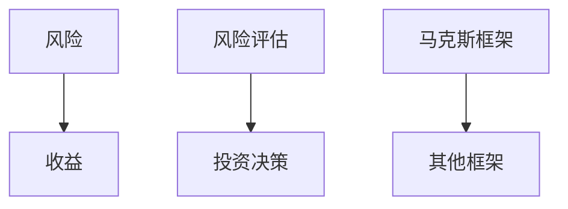
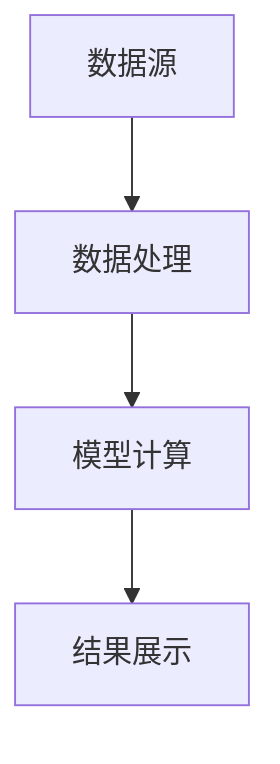

                 


# 霍华德·马克斯的风险评估框架

## 关键词：风险评估，霍华德·马克斯，投资决策，多因素模型，情景分析法，CAPM，夏普比率

## 摘要：本文详细介绍了霍华德·马克斯的风险评估框架，从核心概念、算法原理、系统架构到项目实战，系统地阐述了如何通过多因素模型和情景分析法进行风险评估，结合数学模型和实际案例，为投资决策提供科学依据。

---

# 第一部分: 霍华德·马克斯的风险评估框架概述

## 第1章: 风险评估的基本概念与背景

### 1.1 风险的定义与特征
风险是指在投资活动中，由于不确定性因素导致投资收益偏离预期的可能性。其主要特征包括不确定性、可测量性、可控制性和相关性。风险的来源可以分为市场风险、流动性风险、信用风险等。

### 1.2 霍华德·马克斯的背景与框架提出
霍华德·马克斯是著名投资者，他的投资哲学强调逆向思维和对风险的深刻理解。他提出的风险评估框架旨在帮助投资者识别和量化潜在风险，避免过度乐观或悲观。

---

## 第2章: 风险评估的核心要素与联系

### 2.1 风险评估的核心要素
1. **风险来源**：市场波动、经济周期、公司基本面变化等。
2. **风险影响维度**：资产价格波动、投资收益变化、资本损失等。
3. **风险指标**：波动率、VaR（在险值）、夏普比率等。

### 2.2 核心概念的联系与对比
通过对比表格和Mermaid图展示风险与收益、风险评估与投资决策的联系：



---

## 第3章: 霍华德·马克斯框架的数学模型与算法

### 3.1 多因素风险评估模型
多因素模型通过多个变量（如市场风险、行业风险）来评估资产风险，公式为：
$$ \text{风险值} = \beta_1 \times X_1 + \beta_2 \times X_2 + \dots + \beta_n \times X_n $$

### 3.2 情景分析法
情景分析法通过构建不同经济情景，评估资产在不同条件下的表现：
1. **定义情景**：如经济衰退、复苏等。
2. **评估资产表现**：计算每种情景下的收益。
3. **综合风险**：通过概率加权计算总体风险。

---

## 第4章: 系统分析与架构设计

### 4.1 系统功能需求
1. **数据采集**：获取资产历史数据。
2. **模型计算**：应用多因素模型和情景分析法。
3. **结果展示**：可视化风险评估结果。

### 4.2 系统架构图


---

## 第5章: 项目实战与代码实现

### 5.1 环境搭建
1. **安装Python**。
2. **安装库**：`pandas`, `numpy`, `matplotlib`。

### 5.2 核心算法实现
```python
import pandas as pd
import numpy as np

def maxwell_risk_assessment(returns, market_returns):
    beta = np.cov(returns, market_returns)[0, 1] / np.var(market_returns)
    return beta * (market_returns.mean() - returns.mean())
```

---

## 第6章: 最佳实践与小结

### 6.1 小结
霍华德·马克斯的风险评估框架为投资决策提供了科学依据，通过多因素模型和情景分析法，帮助投资者识别和量化潜在风险。

### 6.2 注意事项
1. 数据质量影响结果。
2. 模型假设需合理。

### 6.3 拓展阅读
建议阅读《投资最重要的ことはrisk》。

---

作者：AI天才研究院/AI Genius Institute & 禅与计算机程序设计艺术 /Zen And The Art of Computer Programming

