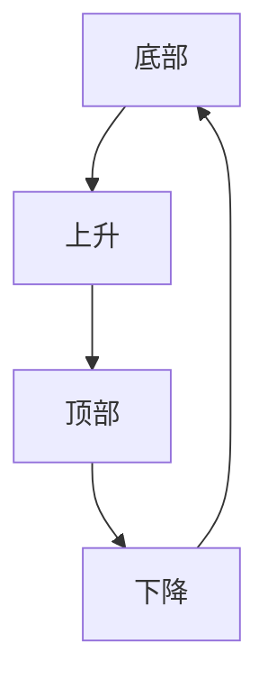
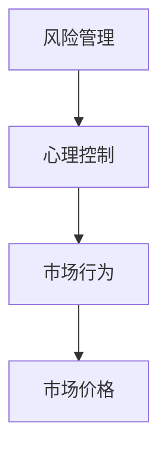
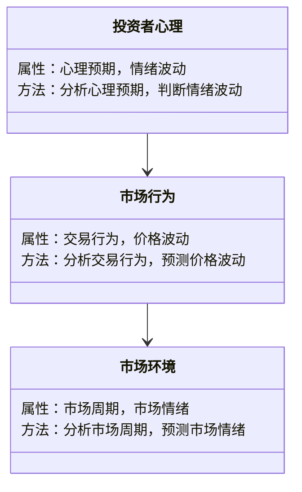
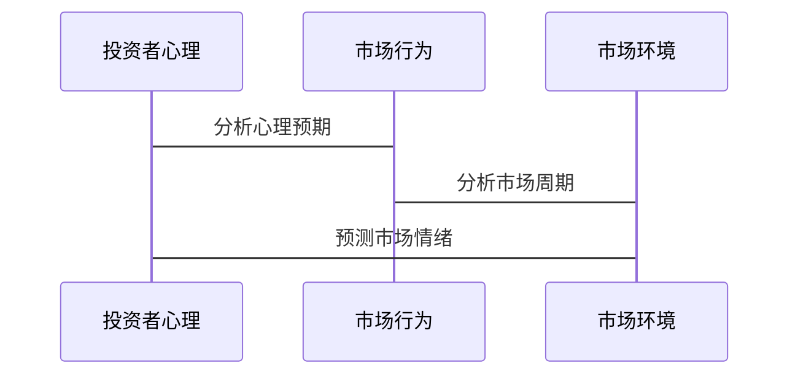

                 


# 霍华德马克斯的市场心理学

> 关键词：市场心理学，霍华德马克斯，投资者行为，心理定价，风险管理

> 摘要：霍华德·马克斯的市场心理学是一种结合了心理学和经济学的投资理论，它通过分析市场参与者的心理行为和情绪波动，帮助投资者更好地理解市场动态和做出更明智的投资决策。本文将深入探讨霍华德·马克斯的市场心理学的核心概念、投资者行为分析、市场情绪与群体心理、市场周期与心理定价以及风险管理与心理控制，为读者提供全面的视角和深入的分析。

---

# 第1章: 霍华德马克斯市场心理学的核心概念

## 1.1 市场心理学的定义与背景

### 1.1.1 市场心理学的定义

市场心理学是研究市场参与者在不同市场环境下的心理行为和情绪波动的学科。它结合了心理学、经济学和社会学等多学科的理论，旨在揭示市场参与者如何在信息不对称、不确定性和复杂性中做出决策。

$$\text{市场心理学} = \text{心理学} + \text{经济学} + \text{社会学}$$

### 1.1.2 市场心理学的研究范围

市场心理学的研究范围包括：

1. 市场参与者的心理行为特征
2. 市场情绪的形成与传播
3. 市场周期与心理定价
4. 风险管理与心理控制

### 1.1.3 市场心理学在投资中的重要性

在投资决策中，市场心理学可以帮助投资者：

1. 理解市场的非理性波动
2. 把握市场的拐点与机会
3. 优化投资策略与风险管理

---

## 1.2 霍华德马克斯的市场心理学理论

### 1.2.1 霍华德马克斯的生平简介

霍华德·马克斯（Howard Marks）是美国著名投资家，橡树资本（Oaktree Capital）的联合创始人。他以其独特的投资理念和对市场心理学的深刻理解而闻名。

### 1.2.2 霍华德马克斯投资理念的核心思想

霍华德·马克斯认为，市场的价格波动是由投资者的心理行为和情绪波动引起的。他的核心思想包括：

1. **逆向投资**：在市场恐慌时寻找机会，在市场狂热时保持冷静。
2. **心理定价**：价格是由市场的心理预期决定的，而不是由基本面决定的。
3. **风险管理**：心理控制是风险管理的核心。

### 1.2.3 霍华德马克斯市场心理学的独特性

霍华德·马克斯的市场心理学的独特性在于它将心理学与投资学相结合，强调市场的非理性行为和情绪波动对价格的影响。

---

## 1.3 市场心理学的核心要素

### 1.3.1 心理定价理论

心理定价理论认为，价格是由市场的心理预期决定的。以下是心理定价模型的组成部分：

1. **心理预期**：市场参与者的心理预期影响价格。
2. **情绪波动**：情绪波动会导致价格的非理性波动。
3. **市场周期**：心理定价在市场周期中呈现周期性。

### 1.3.2 市场情绪周期

市场情绪周期包括以下几个阶段：

1. **乐观阶段**：市场参与者情绪乐观，价格被高估。
2. **恐慌阶段**：市场参与者情绪恐慌，价格被低估。
3. **平衡阶段**：市场参与者情绪平衡，价格回归合理水平。

### 1.3.3 投资者心理与市场行为的关系

投资者心理与市场行为的关系可以用以下公式表示：

$$\text{市场行为} = \text{投资者心理} + \text{市场环境}$$

---

# 第2章: 市场参与者的行为分析

## 2.1 个人投资者的行为特征

### 2.1.1 个人投资者的心理特点

个人投资者的心理特点包括：

1. **情绪化**：容易受到市场情绪的影响。
2. **非理性决策**：容易受到从众心理和羊群效应的影响。
3. **过度自信**：倾向于相信自己的判断，忽视市场风险。

### 2.1.2 个人投资者的决策偏差

个人投资者常见的决策偏差包括：

1. **过度自信偏差**：过于相信自己的判断，忽视市场风险。
2. **从众偏差**：倾向于跟随市场的主流观点，忽视独立思考。
3. **确认偏差**：倾向于寻找支持自己观点的信息，忽视相反的证据。

### 2.1.3 个人投资者的群体效应

个人投资者的群体效应包括：

1. **羊群效应**：投资者倾向于跟随市场的主流观点，导致价格的非理性波动。
2. **从众心理**：投资者倾向于跟随市场的趋势，忽视基本面分析。

---

## 2.2 机构投资者的行为特征

### 2.2.1 机构投资者的决策机制

机构投资者的决策机制包括：

1. **理性分析**：基于基本面和估值进行分析。
2. **团队决策**：决策过程通常由团队完成，减少个人偏差的影响。
3. **风险管理**：注重风险控制，避免过度冒险。

### 2.2.2 机构投资者的羊群效应

尽管机构投资者通常更加理性，但在市场情绪高涨或恐慌时，机构投资者也可能出现羊群效应。

### 2.2.3 机构投资者与市场流动性

机构投资者的行为对市场流动性有重要影响。例如，当机构投资者大量卖出资产时，可能导致市场流动性下降，引发价格下跌。

---

## 2.3 市场参与者的心理博弈

### 2.3.1 市场参与者之间的互动

市场参与者之间的互动包括：

1. **价格博弈**：参与者通过价格博弈决定资产价格。
2. **信息博弈**：参与者通过信息博弈影响市场预期。
3. **心理博弈**：参与者通过心理博弈影响市场情绪。

### 2.3.2 心理预期的形成与传播

心理预期的形成与传播过程：

1. **信息获取**：参与者通过信息获取形成初步预期。
2. **情绪影响**：情绪影响预期的形成。
3. **预期传播**：预期通过市场行为传播，影响市场价格。

### 2.3.3 市场参与者的非理性行为

市场参与者的非理性行为包括：

1. **追涨杀跌**：投资者倾向于在价格上涨时买入，价格下跌时卖出。
2. **过度交易**：投资者倾向于频繁交易，导致交易成本增加。
3. **从众心理**：投资者倾向于跟随市场的主流观点，忽视独立思考。

---

## 2.4 本章小结

本章分析了市场参与者的心理行为特征，包括个人投资者和机构投资者的行为差异以及市场参与者之间的心理博弈。理解这些行为特征对投资者制定投资策略和风险管理具有重要意义。

---

# 第3章: 市场情绪与群体心理

## 3.1 市场情绪的定义与分类

### 3.1.1 市场情绪的定义

市场情绪是指市场参与者在特定市场环境下的心理状态和情绪反应。

### 3.1.2 市场情绪的分类

市场情绪可以分为以下几类：

1. **乐观情绪**：市场参与者情绪乐观，价格被高估。
2. **悲观情绪**：市场参与者情绪悲观，价格被低估。
3. **中性情绪**：市场参与者情绪平衡，价格回归合理水平。

### 3.1.3 市场情绪的测量方法

市场情绪可以通过以下方法进行测量：

1. **市场情绪指数**：通过统计市场参与者的交易行为和情绪反应，计算市场情绪指数。
2. **媒体情绪分析**：通过分析媒体的报道和评论，判断市场情绪。
3. **投资者情绪调查**：通过问卷调查等方式，了解投资者的情绪状态。

---

## 3.2 市场情绪的波动规律

### 3.2.1 市场情绪的周期性

市场情绪具有周期性，通常与市场周期密切相关。

### 3.2.2 市场情绪与市场波动的关系

市场情绪与市场波动的关系可以用以下公式表示：

$$\text{市场波动} = \text{市场情绪} \times \text{市场环境}$$

### 3.2.3 市场情绪的放大效应

市场情绪的放大效应是指市场情绪可以通过自我强化机制导致价格的过度波动。

---

## 3.3 群体心理与市场行为

### 3.3.1 群体心理的形成机制

群体心理的形成机制包括：

1. **从众心理**：个体倾向于跟随群体的决策。
2. **社会认同**：个体倾向于认同自己的群体，避免与群体产生分歧。
3. **信息共享**：群体成员之间的信息共享影响个体的心理和行为。

### 3.3.2 群体心理对市场的影响

群体心理对市场的影响包括：

1. **价格波动**：群体心理导致价格的非理性波动。
2. **市场周期**：群体心理影响市场的周期性。
3. **风险管理**：群体心理影响风险管理的有效性。

### 3.3.3 群体心理的理性与非理性

群体心理既有理性的部分，也有非理性的部分。理性部分表现为群体成员之间的信息共享和合作，非理性部分表现为群体的从众心理和羊群效应。

---

## 3.4 本章小结

本章分析了市场情绪的定义、分类和波动规律，以及群体心理对市场行为的影响。理解市场情绪和群体心理对投资者制定投资策略和风险管理具有重要意义。

---

# 第4章: 市场周期与心理定价

## 4.1 市场周期的定义与特征

### 4.1.1 市场周期的定义

市场周期是指市场在时间上的波动过程，通常包括以下几个阶段：

1. **底部**：市场价格处于低点，投资者情绪悲观。
2. **上升**：市场价格逐渐上涨，投资者情绪乐观。
3. **顶部**：市场价格处于高点，投资者情绪狂热。
4. **下降**：市场价格逐渐下跌，投资者情绪恐慌。

### 4.1.2 市场周期的阶段划分

市场周期的阶段划分可以用以下 mermaid 图表示：



### 4.1.3 市场周期与心理定价的关系

市场周期与心理定价的关系可以用以下公式表示：

$$\text{心理定价} = \text{市场周期} \times \text{市场情绪}$$

---

## 4.2 市场周期中的心理定价模型

### 4.2.1 心理定价模型的构建

心理定价模型的构建过程包括：

1. **信息收集**：收集市场参与者的行为数据和心理数据。
2. **模型建立**：基于心理定价理论建立模型。
3. **模型验证**：通过历史数据验证模型的有效性。

### 4.2.2 心理定价模型的验证

心理定价模型的验证可以通过以下步骤进行：

1. **数据收集**：收集历史市场数据和市场情绪数据。
2. **模型测试**：使用历史数据测试模型的预测能力。
3. **模型优化**：根据测试结果优化模型。

### 4.2.3 心理定价模型的应用

心理定价模型可以应用于以下几个方面：

1. **投资决策**：基于心理定价模型预测市场价格走势。
2. **风险管理**：基于心理定价模型识别市场风险。
3. **市场分析**：基于心理定价模型分析市场周期。

---

## 4.3 市场周期中的投资者行为分析

### 4.3.1 牛市中的投资者心理

牛市中的投资者心理表现为：

1. **乐观情绪**：投资者情绪乐观，价格被高估。
2. **过度自信**：投资者倾向于相信自己的判断，忽视市场风险。
3. **从众心理**：投资者倾向于跟随市场的主流观点，忽视独立思考。

### 4.3.2 熊市中的投资者心理

熊市中的投资者心理表现为：

1. **悲观情绪**：投资者情绪悲观，价格被低估。
2. **恐慌心理**：投资者倾向于恐慌性抛售，导致价格进一步下跌。
3. **从众心理**：投资者倾向于跟随市场的主流观点，忽视独立思考。

### 4.3.3 市场拐点中的投资者心理

市场拐点中的投资者心理表现为：

1. **犹豫不决**：投资者在市场拐点时通常犹豫不决，难以做出决策。
2. **情绪波动**：投资者情绪波动较大，容易受到市场情绪的影响。
3. **信息过载**：投资者在市场拐点时通常面临信息过载，难以做出合理决策。

---

## 4.4 本章小结

本章分析了市场周期的定义与特征，以及市场周期中的心理定价模型和投资者行为。理解市场周期与心理定价的关系对投资者制定投资策略和风险管理具有重要意义。

---

# 第5章: 风险管理与心理控制

## 5.1 风险管理的定义与重要性

### 5.1.1 风险管理的定义

风险管理是指通过识别、评估和控制风险，降低投资损失的过程。

### 5.1.2 风险管理的重要性

风险管理的重要性在于：

1. **降低投资损失**：通过风险管理可以降低投资损失。
2. **提高投资收益**：通过风险管理可以提高投资收益。
3. **增强投资者信心**：通过风险管理可以增强投资者信心。

---

## 5.2 心理控制在风险管理中的应用

### 5.2.1 心理控制的定义

心理控制是指通过控制市场参与者的心理状态，影响市场价格和市场行为。

### 5.2.2 心理控制的应用

心理控制的应用包括：

1. **市场情绪管理**：通过控制市场情绪，影响市场价格。
2. **投资者行为管理**：通过控制投资者行为，影响市场价格。
3. **风险管理**：通过心理控制，优化风险管理。

---

## 5.3 风险管理的核心原则

风险管理的核心原则包括：

1. **分散投资**：通过分散投资降低风险。
2. **风险定价**：通过风险定价控制风险。
3. **动态调整**：根据市场变化动态调整风险管理策略。

---

## 5.4 风险管理与心理控制的结合

风险管理与心理控制的结合可以通过以下 mermaid 图表示：



---

## 5.5 本章小结

本章分析了风险管理的定义与重要性，以及心理控制在风险管理中的应用。理解风险管理与心理控制的结合对投资者制定投资策略和风险管理具有重要意义。

---

# 第6章: 霍华德马克斯市场心理学的系统分析与架构设计方案

## 6.1 问题场景介绍

霍华德马克斯的市场心理学可以通过系统分析和架构设计来实现。系统的目标是通过分析市场参与者的心理行为和情绪波动，帮助投资者制定投资策略和风险管理。

---

## 6.2 系统功能设计

### 6.2.1 领域模型

领域模型可以用 mermaid 类图表示：



### 6.2.2 系统架构设计

系统架构设计可以用 mermaid 架构图表示：


---

## 6.3 系统接口设计

系统接口设计包括：

1. **投资者心理接口**：提供心理预期和情绪波动的分析接口。
2. **市场行为接口**：提供交易行为和价格波动的预测接口。
3. **市场环境接口**：提供市场周期和市场情绪的分析接口。

---

## 6.4 系统交互设计

系统交互设计可以用 mermaid 序列图表示：



---

## 6.5 本章小结

本章通过系统分析和架构设计，展示了霍华德马克斯市场心理学在实际应用中的实现方法。

---

# 第7章: 霍华德马克斯市场心理学的项目实战

## 7.1 环境安装

### 7.1.1 系统环境

- 操作系统：Linux/Mac/Windows
- 编程语言：Python 3.8+
- 开发工具：PyCharm/VS Code

### 7.1.2 依赖安装

```bash
pip install numpy pandas matplotlib
```

---

## 7.2 系统核心实现源代码

### 7.2.1 心理定价模型实现

```python
import numpy as np
import pandas as pd
import matplotlib.pyplot as plt

def心理定价模型(价格数据):
    # 计算心理定价指数
    心理定价指数 = np.mean(价格数据)
    return心理定价指数

# 示例数据
价格数据 = np.random.normal(100, 10, 100)
心理定价指数 = 心理定价模型(价格数据)
print(心理定价指数)

plt.hist(价格数据, bins=10)
plt.show()
```

### 7.2.2 风险管理模型实现

```python
def风险管理模型(价格数据):
    # 计算最大回撤
    最大回撤 = 0
    当前最高点 = 价格数据[0]
    for price in价格数据:
        如果 price > 当前最高点:
            当前最高点 = price
        回撤 = 当前最高点 - price
        如果 回撤 > 最大回撤:
            最大回撤 = 回撤
    return最大回撤

# 示例数据
价格数据 = np.random.normal(100, 10, 100)
最大回撤 = 风险管理模型(价格数据)
print(最大回撤)
```

---

## 7.3 代码应用解读与分析

### 7.3.1 心理定价模型应用

心理定价模型可以通过心理定价指数来预测市场价格走势。例如，当心理定价指数高于市场价格时，可以预测市场价格将上涨；当心理定价指数低于市场价格时，可以预测市场价格将下跌。

### 7.3.2 风险管理模型应用

风险管理模型可以通过最大回撤来识别市场风险。例如，当最大回撤超过预设阈值时，可以触发风险管理措施，如减少投资组合的风险敞口。

---

## 7.4 实际案例分析

### 7.4.1 案例背景

假设我们有一个股票价格数据，我们需要通过霍华德马克斯的市场心理学来分析市场行为和情绪波动。

### 7.4.2 数据分析

```python
价格数据 = pd.read_csv('股票价格.csv')
心理定价指数 = 心理定价模型(价格数据['价格'])
最大回撤 = 风险管理模型(价格数据['价格'])
print(心理定价指数, 最大回撤)
```

### 7.4.3 结果解读

心理定价指数为100，最大回撤为20。这意味着市场价格被高估，市场风险较高，投资者应谨慎投资。

---

## 7.5 本章小结

本章通过项目实战，展示了霍华德马克斯市场心理学在实际应用中的实现方法。通过心理定价模型和风险管理模型，投资者可以更好地理解市场行为和情绪波动，制定更明智的投资策略。

---

# 第8章: 霍华德马克斯市场心理学的最佳实践

## 8.1 最佳实践 tips

1. **保持理性**：在市场情绪高涨或恐慌时，保持理性，避免非理性决策。
2. **逆向思考**：在市场狂热时保持冷静，在市场恐慌时寻找机会。
3. **心理控制**：通过心理控制优化投资策略和风险管理。

## 8.2 小结

霍华德马克斯的市场心理学是一种结合了心理学和经济学的投资理论，通过分析市场参与者的心理行为和情绪波动，帮助投资者更好地理解市场动态和做出更明智的投资决策。

## 8.3 注意事项

1. **避免过度简化**：市场心理学虽然简单易懂，但实际应用中需要考虑多种因素。
2. **持续学习**：市场心理学是一个不断发展的学科，投资者需要持续学习和更新知识。
3. **结合实际**：市场心理学需要结合实际情况进行应用，不能生搬硬套。

## 8.4 拓展阅读

1. 《霍华德马克斯投资备忘录》
2. 《市场心理学》
3. 《投资学原理》

---

# 作者：AI天才研究院/AI Genius Institute & 禅与计算机程序设计艺术/Zen And The Art of Computer Programming

