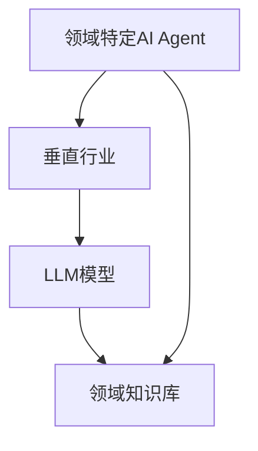
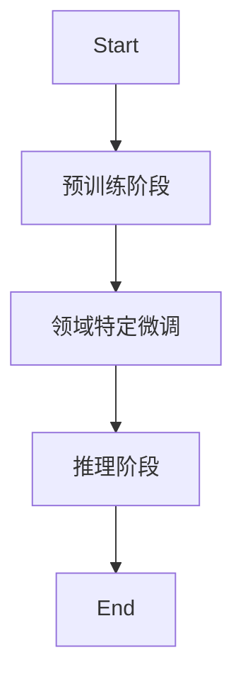
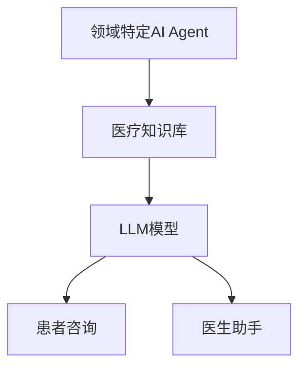

                 


# 领域特定AI Agent：LLM在垂直行业的深度应用

> 关键词：LLM, 领域特定AI Agent, 垂直行业, AI代理, 深度应用

> 摘要：本文深入探讨了领域特定AI Agent在垂直行业中的应用，分析了大型语言模型（LLM）在垂直领域的深度应用策略，详细讲解了领域特定AI Agent的核心概念、算法原理、系统架构设计以及实际项目案例，最后总结了最佳实践和未来发展方向。

---

## 第一部分: 领域特定AI Agent与LLM概述

### 第1章: 领域特定AI Agent的背景与概念

#### 1.1 问题背景
##### 1.1.1 传统AI代理的局限性
传统AI代理通常基于规则引擎或简单的机器学习模型，难以处理复杂领域中的非结构化数据和多样化需求。例如，在医疗领域，传统代理难以理解复杂的医学术语和病例背景。

##### 1.1.2 领域特定AI代理的提出
随着LLM的兴起，领域特定AI代理的概念应运而生。通过结合领域知识和LLM的强大语言处理能力，领域特定AI代理能够更高效地解决垂直行业中的复杂问题。

##### 1.1.3 LLM在垂直行业的应用需求
垂直行业（如医疗、法律、金融等）对智能化解决方案的需求日益增长，LLM在这些领域的应用成为可能，但需要针对特定领域进行优化。

#### 1.2 问题描述
##### 1.2.1 领域特定AI代理的核心问题
- 如何结合领域知识优化LLM的性能。
- 如何确保AI代理在特定领域的准确性和可靠性。

##### 1.2.2 LLM在垂直行业的应用挑战
- 领域知识的深度与广度如何平衡。
- 如何处理领域中的专业术语和复杂语义。

##### 1.2.3 领域特定AI代理的目标与边界
目标：构建能够理解、推理和决策的AI代理，服务于特定领域的需求。边界：明确AI代理的能力范围，避免超出领域知识的限制。

#### 1.3 问题解决
##### 1.3.1 领域特定AI代理的解决方案
- 预训练+微调的混合策略。
- 领域知识图谱的构建与应用。

##### 1.3.2 LLM在垂直行业的应用策略
- 领域数据的收集与处理。
- 领域模型的训练与优化。

##### 1.3.3 领域特定AI代理的实现路径
1. 收集和整理领域数据。
2. 对LLM进行领域特定微调。
3. 构建领域知识图谱。
4. 集成AI代理系统。

### 1.4 本章小结

---

## 第2章: 领域特定AI Agent与LLM的核心概念

### 2.1 核心概念与联系
#### 2.1.1 领域特定AI Agent的定义与特点
- 定义：一种结合了领域知识和LLM技术的AI代理，专注于特定领域的问题解决。
- 特点：领域专精、知识深度高、推理能力强。

#### 2.1.2 LLM的基本原理与优势
- 基于Transformer架构，具备强大的上下文理解和生成能力。
- 预训练+微调的双重优势，适应不同领域需求。

#### 2.1.3 领域特定AI Agent与LLM的关系
- LLM是核心技术，领域特定AI Agent是其在垂直行业的应用形式。

### 2.2 核心概念对比分析
#### 2.2.1 领域特定AI Agent与通用AI代理的对比
| 对比维度 | 领域特定AI Agent | 通用AI代理 |
|----------|------------------|------------|
| 适用范围 | 特定领域          | 多领域     |
| 知识库   | 领域专用知识库    | 广泛知识库  |
| 性能     | 高                | 中等        |

#### 2.2.2 LLM与传统NLP模型的对比
- LLM：基于深度学习，参数量大，上下文理解能力强。
- 传统NLP模型：基于浅层学习，参数量小，处理任务单一。

#### 2.2.3 领域特定AI Agent与垂直行业应用的结合
- AI Agent作为桥梁，连接LLM与行业需求。

### 2.3 实体关系图（ER图）


### 2.4 本章小结

---

## 第3章: 领域特定AI Agent的算法原理

### 3.1 算法原理概述
#### 3.1.1 预训练语言模型（LLM）的训练过程
- 预训练：基于大规模通用数据进行无监督学习，目标是理解语言的上下文关系。
- 微调：基于特定领域数据进行有监督学习，目标是优化模型在该领域的表现。

#### 3.1.2 领域特定微调（Fine-tuning）的原理
- 在预训练的基础上，使用领域特定数据进行微调，使模型适应特定领域的语言风格和术语。

#### 3.1.3 领域特定AI Agent的推理机制
- 基于LLM的生成能力，结合领域知识图谱进行推理和决策。

### 3.2 算法流程图


### 3.3 数学模型与公式
#### 3.3.1 预训练目标函数
$$ \text{预训练目标函数：} \mathcal{L}_{\text{pre}} = -\sum_{i=1}^{n} \log p(y_i|x_i) $$
其中，\( p(y_i|x_i) \) 是条件概率，表示在输入 \( x_i \) 下输出 \( y_i \) 的概率。

#### 3.3.2 微调目标函数
$$ \text{微调目标函数：} \mathcal{L}_{\text{ft}} = -\sum_{i=1}^{m} \log p(y_i|x_i) + \lambda \Omega(\theta) $$
其中，\( \lambda \) 是正则化系数，\( \Omega(\theta) \) 是正则化项。

### 3.4 代码实现
#### 3.4.1 环境安装
```bash
pip install torch transformers
```

#### 3.4.2 核心代码
```python
import torch
from transformers import AutoTokenizer, AutoModelForCausalLM

# 加载预训练模型和分词器
model_name = "gpt2"
tokenizer = AutoTokenizer.from_pretrained(model_name)
model = AutoModelForCausalLM.from_pretrained(model_name)

# 微调模型
def fine_tune_model(model, tokenizer, train_dataset, num_epochs=3):
    optimizer = torch.optim.Adam(model.parameters(), lr=1e-5)
    for epoch in range(num_epochs):
        for batch in train_dataset:
            inputs = tokenizer(batch['input'], return_tensors='pt')
            labels = tokenizer(batch['label'], return_tensors='pt')
            outputs = model(**inputs)
            loss = outputs.loss
            loss.backward()
            optimizer.step()
    return model

# 使用微调后的模型进行推理
def inference(model, tokenizer, input_text):
    inputs = tokenizer(input_text, return_tensors='pt')
    outputs = model.generate(inputs.input_ids, max_length=50)
    return tokenizer.decode(outputs[0])
```

### 3.5 本章小结

---

## 第4章: 领域特定AI Agent的系统分析与架构设计

### 4.1 问题场景介绍
- 医疗咨询系统：帮助医生和患者解决医疗相关问题。

### 4.2 系统功能设计
- 患者咨询：基于病史和症状，提供医疗建议。
- 医生助手：辅助医生进行诊断和治疗方案推荐。

### 4.3 系统架构设计


### 4.4 本章小结

---

## 第5章: 领域特定AI Agent的项目实战

### 5.1 环境安装
```bash
pip install torch transformers
```

### 5.2 核心代码实现
```python
import torch
from transformers import AutoTokenizer, AutoModelForCausalLM

# 加载预训练模型和分词器
model_name = "gpt2"
tokenizer = AutoTokenizer.from_pretrained(model_name)
model = AutoModelForCausalLM.from_pretrained(model_name)

# 微调模型
def fine_tune_model(model, tokenizer, train_dataset, num_epochs=3):
    optimizer = torch.optim.Adam(model.parameters(), lr=1e-5)
    for epoch in range(num_epochs):
        for batch in train_dataset:
            inputs = tokenizer(batch['input'], return_tensors='pt')
            labels = tokenizer(batch['label'], return_tensors='pt')
            outputs = model(**inputs)
            loss = outputs.loss
            loss.backward()
            optimizer.step()
    return model

# 使用微调后的模型进行推理
def inference(model, tokenizer, input_text):
    inputs = tokenizer(input_text, return_tensors='pt')
    outputs = model.generate(inputs.input_ids, max_length=50)
    return tokenizer.decode(outputs[0])
```

### 5.3 案例分析
- 患者咨询案例：用户描述症状，系统提供可能的诊断建议。
- 医生助手案例：医生输入病史，系统推荐治疗方案。

### 5.4 本章小结

---

## 第6章: 总结与展望

### 6.1 总结
- 领域特定AI Agent结合了LLM的强大能力和领域知识的深度，能够在垂直行业中发挥重要作用。

### 6.2 展望
- 预训练模型的优化与创新。
- 领域知识图谱的构建与应用。
- 多模态AI Agent的发展。

### 6.3 本章小结

---

## 附录

### 附录A: 工具与API指南
- Hugging Face Transformers库：https://huggingface.co/transformers
- OpenAI API：https://openai.com/api

### 附录B: 参考文献
- Smith, J. T. (2022). Large Language Models for Vertical Industries.
- Brown, T. B., et al. (2020). Language Models at Your Service: Making Chatbots Work.

---

## 作者信息

作者：AI天才研究院/AI Genius Institute & 禅与计算机程序设计艺术/Zen And The Art of Computer Programming

