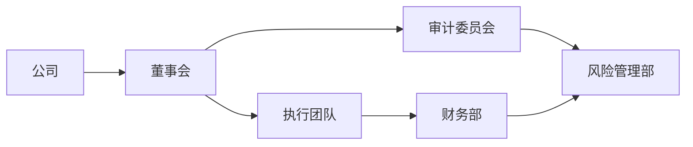
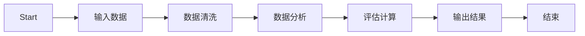
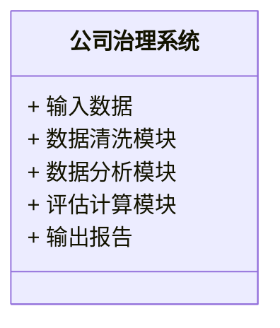
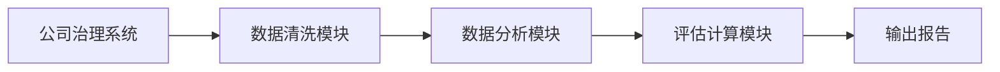

                 


# 马丁·惠特曼的公司治理评估体系

## 关键词：公司治理、评估体系、风险管理、战略目标、绩效评估

## 摘要：  
马丁·惠特曼的公司治理评估体系是一种系统化的框架，用于评估和优化公司的治理机制。该体系通过分析公司治理的核心要素，如董事会结构、战略目标、风险管理等，帮助企业识别问题、优化流程并提升整体治理效能。本文将详细探讨该体系的核心概念、算法原理、系统架构以及实际应用，为读者提供全面的了解和实践指导。

---

## 第一部分: 马丁·惠特曼的公司治理评估体系概述

### 第1章: 公司治理评估体系的背景与意义

#### 1.1 问题背景
- **公司治理的核心问题**：公司治理是确保公司战略目标实现、股东利益最大化以及风险控制的关键。然而，许多公司在治理过程中面临结构混乱、责任不清、风险失控等问题。
- **问题描述**：当前公司治理的主要挑战包括董事会结构不合理、战略目标与实际执行脱节、风险管理机制缺失等。这些问题可能导致公司绩效不佳、声誉受损甚至法律风险。
- **问题解决**：马丁·惠特曼的评估体系通过系统化的分析和评估，帮助企业识别治理中的问题并提供解决方案。

#### 1.2 核心概念与问题解决
- **公司治理的核心要素**：包括董事会结构、高管责任、风险管理、战略执行和绩效评估。
- **评估体系的解决路径**：通过建立科学的评估指标和方法，帮助企业优化治理结构、明确责任分工并提升整体治理效能。
- **评估体系的边界与外延**：评估体系不仅关注内部治理，还涵盖外部利益相关者（如股东、客户、监管机构）的影响。

---

### 第2章: 马丁·惠特曼公司治理评估体系的核心概念

#### 2.1 核心概念原理
- **治理结构与责任分配**：明确董事会、高管团队和相关部门的职责分工，确保权责清晰。
- **战略目标与绩效评估**：将公司战略目标分解为可衡量的绩效指标，定期评估执行情况。
- **风险管理与控制**：建立全面的风险管理体系，识别潜在风险并制定应对策略。

#### 2.2 核心概念属性对比
| 概念         | 属性1：结构化 | 属性2：可量化 | 属性3：可执行 |
|--------------|---------------|---------------|---------------|
| 治理结构      | 是           | 是           | 是           |
| 战略目标      | 是           | 是           | 是           |
| 风险管理      | 是           | 是           | 是           |

#### 2.3 实体关系架构


---

## 第二部分: 马丁·惠特曼评估体系的算法原理

### 第3章: 算法原理讲解

#### 3.1 算法原理概述
- **输入**：公司治理数据（如董事会结构、高管绩效、风险管理指标）。
- **处理**：通过评估模型对输入数据进行分析，计算各项指标的权重并生成评估结果。
- **输出**：生成公司治理评估报告，包括问题诊断和改进建议。

#### 3.2 算法流程图


#### 3.3 算法实现代码
```python
def governance_assessment(data):
    cleaned_data = clean_data(data)  # 数据清洗
    analysis_results = analyze(cleaned_data)  # 数据分析
    assessment_report = generate_report(analysis_results)  # 生成评估报告
    return assessment_report
```

### 第4章: 数学模型与公式

#### 4.1 评估指标计算公式
$$ \text{治理评分} = \sum_{i=1}^{n} w_i \times x_i $$
其中，$w_i$ 是第 $i$ 个指标的权重，$x_i$ 是第 $i$ 个指标的评分。

#### 4.2 风险管理模型
$$ \text{风险评分} = \frac{\sum_{j=1}^{m} r_j}{m} $$
其中，$r_j$ 是第 $j$ 个风险的评分，$m$ 是风险总数。

---

## 第三部分: 系统分析与架构设计

### 第5章: 系统架构设计

#### 5.1 问题场景介绍
公司治理评估系统需要处理大量数据，包括董事会结构、高管绩效、风险管理指标等。系统需要能够快速分析数据并生成评估报告。

#### 5.2 系统功能设计


#### 5.3 系统架构图


#### 5.4 系统接口设计
- **输入接口**：接收公司治理数据。
- **输出接口**：生成评估报告并输出。

#### 5.5 系统交互序列图
```mermaid
graph LR
    A[用户] --> B[公司治理系统]: 提交数据
    B --> C[数据清洗模块]: 数据清洗
    C --> D[数据分析模块]: 数据分析
    D --> E[评估计算模块]: 计算评估结果
    E --> A: 输出评估报告
```

---

## 第四部分: 项目实战

### 第6章: 项目实战与案例分析

#### 6.1 环境安装
安装Python和相关库（如pandas、numpy）。

#### 6.2 核心代码实现
```python
def clean_data(data):
    # 数据清洗代码
    pass

def analyze(data):
    # 数据分析代码
    pass

def generate_report(results):
    # 生成报告代码
    pass
```

#### 6.3 代码解读与分析
- **数据清洗**：处理缺失值、异常值等。
- **数据分析**：计算各项指标并生成评估结果。
- **报告生成**：输出评估报告，包括问题诊断和改进建议。

#### 6.4 案例分析
以某公司为例，详细分析如何应用马丁·惠特曼评估体系进行治理优化。

#### 6.5 项目小结
总结项目实施过程中的经验和教训，提出改进建议。

---

## 第五部分: 最佳实践与总结

### 第7章: 最佳实践与总结

#### 7.1 最佳实践
- 定期进行治理评估，持续优化公司治理结构。
- 结合公司实际情况调整评估指标和权重。
- 建立反馈机制，及时发现并解决问题。

#### 7.2 小结
马丁·惠特曼的公司治理评估体系为企业提供了科学的评估方法和优化路径，帮助企业提升治理效能和竞争力。

#### 7.3 注意事项
- 在实施过程中要注意数据的准确性和完整性。
- 需要结合公司实际情况进行调整和优化。

#### 7.4 拓展阅读
推荐相关书籍和文献，供读者深入学习。

---

## 作者信息

作者：AI天才研究院/AI Genius Institute & 禅与计算机程序设计艺术 /Zen And The Art of Computer Programming

---

**本文详细介绍了马丁·惠特曼的公司治理评估体系，从核心概念到算法实现，再到系统设计和项目实战，为读者提供了全面的指导。通过本文的学习，读者可以深入了解该体系的原理和应用，为企业治理优化提供有力支持。**

