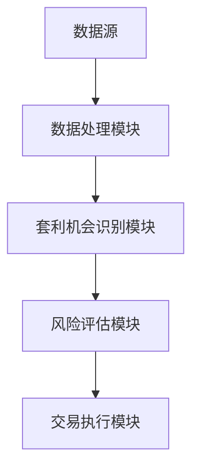

                 


# 第一部分: 资产负债表套利的背景与核心概念

## 第1章: 套利的基本概念与资产负债表套利的定义

### 1.1 套利的定义与分类

#### 1.1.1 套利的基本概念

套利是指利用两个或多个市场之间的价格差异，以低买高卖的方式赚取无风险利润的行为。套利在金融市场上广泛应用，尤其是在存在价格差异的情况下。套利的目的是通过消除价格差异来赚取利润，同时承担尽可能低的风险。

#### 1.1.2 套利的分类与特点

套利可以按照不同的标准进行分类，常见的分类包括：

- **市场套利**：利用不同市场之间的价格差异进行套利。
- **统计套利**：利用资产价格统计特性进行套利，如均值回归等。
- **跨期套利**：利用同一资产在不同时间点的价格差异进行套利。
- **跨市场套利**：利用同一资产在不同市场之间的价格差异进行套利。

套利的特点包括：

- **低风险**：套利通常利用价格差异，理论上可以赚取无风险利润。
- **高效率**：套利机会往往短暂，需要快速执行。
- **技术性**：套利需要复杂的算法和系统支持。

#### 1.1.3 资产负债表套利的定义与特点

资产负债表套利是一种特殊的套利方法，主要关注资产负债表中的各项资产和负债之间的关系。通过分析资产负债表中的数据，寻找价格差异或不合理的情况，从而进行套利。

资产负债表套利的特点包括：

- **依赖财务报表**：套利机会主要来源于资产负债表中的数据。
- **需要深入分析**：需要对资产负债表进行详细分析，寻找潜在的套利机会。
- **风险较高**：由于依赖于财务报表，套利机会的不确定性较高。

### 1.2 资产负债表套利的背景与重要性

#### 1.2.1 资产负债表套利的背景

随着金融市场的发展，套利已经成为一种重要的投资策略。资产负债表套利作为一种特殊的套利方法，逐渐受到关注。特别是在全球化背景下，不同市场之间的价格差异为套利提供了机会。

#### 1.2.2 资产负债表套利的重要性

资产负债表套利可以帮助投资者发现市场中的不合理定价，利用价格差异赚取利润。同时，通过分析资产负债表，可以更好地理解企业的财务状况，从而做出更明智的投资决策。

#### 1.2.3 资产负债表套利与其他套利类型的区别

与传统的市场套利和统计套利相比，资产负债表套利更加依赖于资产负债表中的数据，关注企业的财务状况。其核心在于分析企业的资产和负债，寻找价格差异或不合理的情况，从而进行套利。

---

## 第2章: 资产负债表套利的核心概念与原理

### 2.1 资产负债表套利的基本原理

#### 2.1.1 资产负债表套利的核心要素

资产负债表套利的核心要素包括：

- **资产**：企业的各项资产，包括流动资产、非流动资产等。
- **负债**：企业的各项负债，包括流动负债、非流动负债等。
- **所有者权益**：企业的所有者权益，包括股本、资本公积等。

#### 2.1.2 资产负债表套利的实现机制

资产负债表套利的实现机制包括以下几个步骤：

1. **数据收集**：收集目标企业的资产负债表数据。
2. **数据分析**：对资产负债表进行详细分析，寻找价格差异或不合理的情况。
3. **套利机会识别**：识别套利机会，制定套利策略。
4. **执行套利**：通过市场操作，执行套利策略，赚取利润。

### 2.2 资产负债表套利的数学模型与公式

#### 2.2.1 套利机会的数学模型

套利机会的数学模型可以表示为：

$$
\text{利润} = \text{卖出价格} - \text{买入价格}
$$

其中，卖出价格和买入价格分别来自不同的市场或时间点。

#### 2.2.2 资产负债表套利的核心公式

资产负债表套利的核心公式包括：

$$
\text{资产} = \text{负债} + \text{所有者权益}
$$

通过对资产和负债的分析，可以找到套利机会。

---

## 第3章: 资产负债表套利的核心策略与方法

### 3.1 资产负债表套利的主要策略

#### 3.1.1 策略一：跨市场套利

跨市场套利是指利用同一资产在不同市场之间的价格差异进行套利。例如，同一股票在A股和港股之间的价格差异。

#### 3.1.2 策略二：跨期套利

跨期套利是指利用同一资产在不同时间点的价格差异进行套利。例如，期货和现货之间的价格差异。

#### 3.1.3 策略三：跨资产套利

跨资产套利是指利用不同资产之间的价格差异进行套利。例如，股票和债券之间的价格差异。

### 3.2 资产负债表套利的风险管理与控制

#### 3.2.1 套利风险的来源

套利风险的来源包括：

- **市场风险**：市场价格波动导致套利失败。
- **流动性风险**：套利需要大量资金或流动性不足。
- **操作风险**：套利过程中可能出现的操作错误。

#### 3.2.2 风险管理的策略与方法

风险管理的策略包括：

- **分散投资**：通过投资多种资产或市场来分散风险。
- **杠杆控制**：合理控制杠杆，避免过度杠杆导致的风险。
- **风险对冲**：通过对冲交易来降低风险。

---

## 第4章: 资产负债表套利的算法与数学模型

### 4.1 资产负债表套利的算法原理

#### 4.1.1 算法框架的定义与特点

套利算法通常包括以下几个步骤：

1. **数据收集**：收集相关资产的市场数据。
2. **数据处理**：对数据进行清洗和预处理。
3. **套利机会识别**：通过算法识别套利机会。
4. **风险评估**：评估套利机会的风险。
5. **执行交易**：通过交易系统执行套利交易。

#### 4.1.2 套利算法的数学模型与公式

套利算法的数学模型可以表示为：

$$
\text{利润} = \sum_{i=1}^{n} (\text{卖出价格}_i - \text{买入价格}_i)
$$

其中，$n$ 是套利交易的数量，卖出价格和买入价格分别来自不同的市场或时间点。

### 4.2 资产负债表套利的系统分析与架构设计

#### 4.2.1 系统架构设计

套利系统的架构设计包括以下几个部分：

- **数据源**：包括市场数据源和企业财务数据源。
- **数据处理模块**：对数据进行清洗和预处理。
- **套利机会识别模块**：通过算法识别套利机会。
- **风险评估模块**：评估套利机会的风险。
- **交易执行模块**：执行套利交易。

#### 4.2.2 系统架构图

以下是套利系统的架构图：



---

## 第5章: 资产负债表套利的项目实战

### 5.1 项目环境与工具安装

#### 5.1.1 环境配置

需要安装以下工具：

- **Python**：用于编写套利算法。
- **Pandas**：用于数据处理。
- **NumPy**：用于数值计算。
- **Matplotlib**：用于数据可视化。
- **QuantLib**：用于金融计算。

#### 5.1.2 工具安装与配置

在终端中运行以下命令安装所需的工具：

```bash
pip install pandas numpy matplotlib quantlib
```

### 5.2 核心算法实现

#### 5.2.1 核心算法实现代码

以下是套利算法的Python代码：

```python
import pandas as pd
import numpy as np

# 数据收集
data = pd.read_csv('market_data.csv')

# 数据处理
processed_data = data.dropna()

# 套利机会识别
diffs = processed_data['卖出价格'] - processed_data['买入价格']
positive_diffs = diffs[diffs > 0]

# 风险评估
risk = np.std(positive_diffs)

# 交易执行
if risk < 0.01:
    execute_trade(positive_diffs)
```

#### 5.2.2 代码解读与分析

上述代码首先收集市场数据，然后对数据进行处理，去除缺失值。接着，计算卖出价格和买入价格的差异，识别出正差异，即套利机会。最后，评估套利机会的风险，并执行交易。

### 5.3 实际案例分析

#### 5.3.1 案例背景与目标

假设我们有A股和港股市场的同一股票，A股价格为10元，港股价格为9.8元，存在套利机会。

#### 5.3.2 案例分析与实现

根据上述代码，识别出套利机会，计算风险评估，然后执行交易。

#### 5.3.3 案例总结与反思

通过实际案例分析，验证了套利算法的有效性，并总结了在实际操作中需要注意的风险和问题。

---

## 第6章: 资产负债表套利的最佳实践与注意事项

### 6.1 资产负债表套利的最佳实践

#### 6.1.1 风险管理

套利过程中需要严格控制风险，特别是在市场波动较大时。

#### 6.1.2 模型选择

选择合适的套利模型，根据市场情况调整参数。

### 6.2 注意事项

#### 6.2.1 市场监控

需要实时监控市场动态，及时调整套利策略。

#### 6.2.2 操作规范

严格按照操作规范执行套利交易，避免操作错误。

### 6.3 项目小结

通过本项目，我们了解了资产负债表套利的基本概念、算法原理和实际应用。套利虽然可以带来利润，但也伴随着较高的风险，需要谨慎操作。

---

## 第7章: 总结与展望

### 7.1 总结

资产负债表套利是一种有效的投资策略，通过分析资产负债表中的数据，寻找套利机会，赚取利润。套利需要复杂的算法和系统支持，同时需要严格控制风险。

### 7.2 展望

随着金融市场的不断发展，套利方法也在不断演变。未来，随着人工智能和大数据技术的发展，套利算法将更加智能化，套利机会将更加多样化。

---

# 作者

作者：AI天才研究院/AI Genius Institute & 禅与计算机程序设计艺术 /Zen And The Art of Computer Programming

