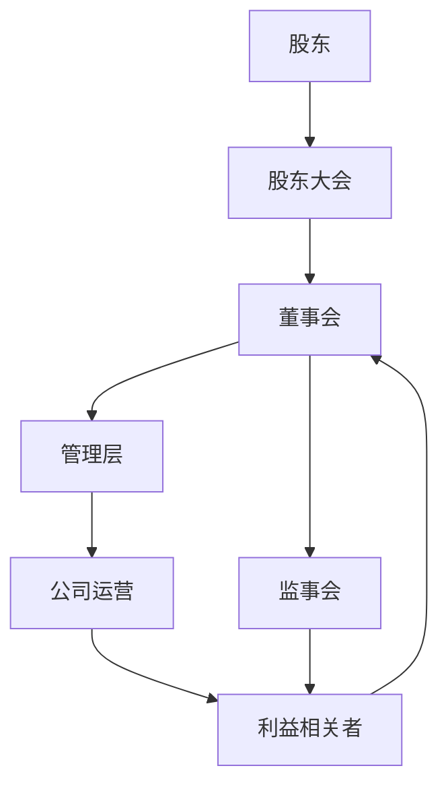
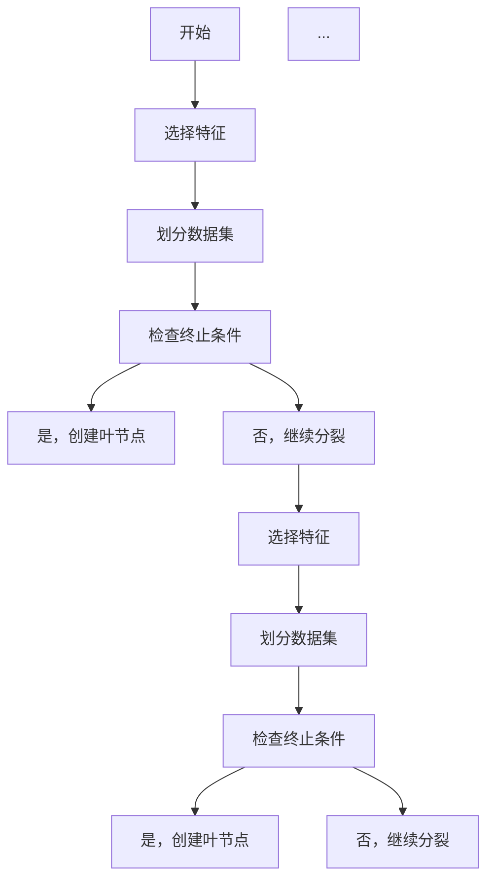
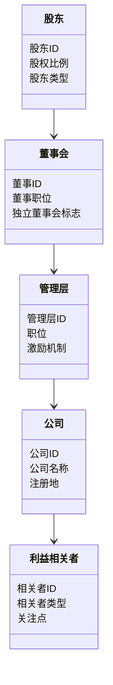
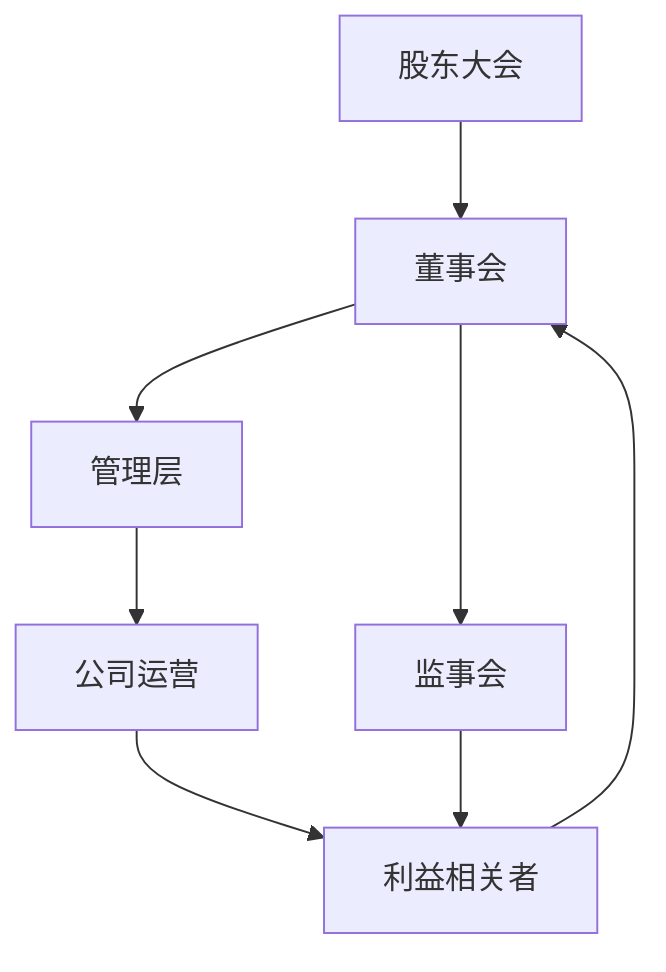
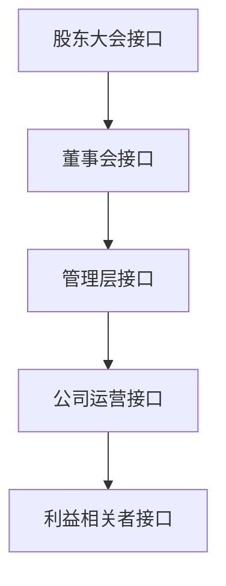

                 


# 第一部分: 公司治理的背景与核心概念

## 第1章: 公司治理的基本概念

### 1.1 公司治理的定义与内涵
#### 1.1.1 公司治理的定义
公司治理是指公司内部和外部的利益相关者之间为了实现公司价值最大化和可持续发展而建立的一系列制度、政策和实践。公司治理的核心在于合理分配权力、责任和利益，确保公司决策的科学性和有效性。

#### 1.1.2 公司治理的核心内涵
公司治理不仅仅是董事会的职责，还涉及到股东、管理层、员工、客户、供应商等多方利益相关者的互动与协调。公司治理的内涵包括战略制定、风险管理、信息披露、激励机制等多个方面。

#### 1.1.3 公司治理的边界与外延
公司治理的边界主要在于公司内部管理与外部监管的关系。外延则涉及公司治理的全球化、数字化转型以及环境、社会和治理（ESG）等因素的影响。

### 1.2 公司治理的主要参与者
#### 1.2.1 股东
股东是公司治理的核心参与者之一，拥有对公司重大事项的决策权和监督权。股东可以是机构投资者或个人投资者，他们在公司治理中扮演着监督者和利益维护者的角色。

#### 1.2.2 董事会
董事会是公司治理的最高决策机构，负责制定公司战略、监督管理层的执行情况，并确保公司合规经营。董事会成员通常包括执行董事和非执行董事，后者在监督和制衡方面起着重要作用。

#### 1.2.3 高级管理层
高级管理层负责公司日常运营的决策和执行，是董事会决策的具体执行者。他们对公司治理的合规性和有效性负有直接责任。

#### 1.2.4 利益相关者
利益相关者包括员工、客户、供应商、债权人、政府机构等。他们对公司治理的影响主要体现在对公司政策、产品和服务的评价，以及对公司社会责任的关注。

### 1.3 公司治理的目标与原则
#### 1.3.1 公司治理的目标
公司治理的目标是实现公司价值的最大化，同时平衡各利益相关者的利益，确保公司的可持续发展。这包括优化资源配置、降低风险、提升透明度和增强公司信誉。

#### 1.3.2 公司治理的基本原则
公司治理的基本原则包括透明度、公平性、独立性、制衡性和有效性。透明度要求公司信息披露真实、及时；公平性要求平等对待所有利益相关者；独立性要求董事会和管理层之间保持独立，避免利益冲突；制衡性要求建立有效的监督机制；有效性要求公司治理机制能够有效运作并实现目标。

#### 1.3.3 公司治理的实现机制
公司治理的实现机制包括公司章程、治理结构、决策流程、监督机制和激励机制等。公司章程是公司治理的基本框架，决策流程和治理结构确保决策的科学性和高效性，监督机制确保公司合规经营，激励机制则激发管理层的积极性。

## 第2章: 公司治理的历史演变与现状

### 2.1 公司治理的起源与发展
#### 2.1.1 传统公司治理的形成
传统公司治理起源于工业革命时期，当时公司主要由家族或控股股东控制，治理结构相对简单，主要关注公司的盈利能力和股东利益。

#### 2.1.2 现代公司治理的兴起
随着公司规模的扩大和股份制的发展，现代公司治理逐渐兴起。20世纪初，股东结构多元化，出现了机构投资者和分散股东，这促使公司治理更加注重透明度和独立性。

#### 2.1.3 全球化背景下的公司治理变革
全球化和信息技术的发展推动了公司治理的进一步变革。跨国公司和全球市场的出现，使得公司治理需要适应不同国家的法律和文化环境。同时，信息技术的应用使得公司治理更加透明和高效。

### 2.2 公司治理的主要理论与流派
#### 2.2.1 股权制衡理论
股权制衡理论认为，公司治理的效率和效果取决于股权结构的制衡机制。分散的股权结构有助于防止控股股东滥用权力，而集中的股权结构则有助于提高决策效率。

#### 2.2.2 委托-代理理论
委托-代理理论是公司治理的核心理论之一，主要研究委托人（股东）与代理人（管理层）之间的利益冲突和协调问题。该理论强调通过激励机制和监督机制来解决代理问题，确保管理层的利益与股东利益一致。

#### 2.2.3 资本市场理论
资本市场理论认为，公司治理的优劣直接影响公司的市场价值和资本成本。有效的公司治理能够提升投资者信心，降低资本成本，并提高公司的市场价值。

### 2.3 当前公司治理的挑战与趋势
#### 2.3.1 数字化转型对公司治理的影响
数字化转型使得公司治理面临新的挑战和机遇。数据隐私、网络安全等问题成为公司治理的重要内容，同时数字化工具的应用也提高了公司治理的效率和透明度。

#### 2.3.2 环境、社会与治理（ESG）的兴起
随着社会对可持续发展的关注增加，环境、社会和治理（ESG）成为公司治理的重要组成部分。越来越多的投资者将ESG因素纳入投资决策，推动公司更加注重社会责任和可持续发展。

#### 2.3.3 全球公司治理标准的整合
国际上对公司治理的标准化趋势日益明显，如OECD的公司治理原则、国际证监会组织（IOSCO）的建议等。这些标准的整合促进了全球公司治理的统一性和可比性。

# 第二部分: 公司治理的核心概念与联系

## 第3章: 公司治理的核心要素与关系

### 3.1 公司治理的核心要素
#### 3.1.1 股权结构
股权结构是公司治理的重要组成部分，决定了股东的权力分配和制衡机制。分散的股权结构有助于防止控股股东滥用权力，而集中的股权结构则有助于提高决策效率。

#### 3.1.2 董事会结构
董事会结构包括董事会的组成、独立性、职责和运作方式。有效的董事会结构能够确保公司治理的独立性和有效性，关键在于平衡董事会的执行和监督职能。

#### 3.1.3 经理人激励机制
经理人激励机制是解决委托-代理问题的重要手段，通常包括股权激励、奖金、股票期权等多种形式。有效的激励机制能够激发经理人的积极性，实现股东利益最大化。

#### 3.1.4 监督机制
监督机制包括内部审计、监事会、外部审计等，确保公司合规经营和管理层的有效监督。有效的监督机制能够及时发现和纠正公司治理中的问题，降低风险。

### 3.2 公司治理的主要关系
#### 3.2.1 股东与董事会的关系
股东是公司的所有者，董事会是股东的受托人，代表股东利益行使决策权。股东通过股东大会选举和更换董事会成员，董事会则向股东负责，定期向股东汇报公司经营状况。

#### 3.2.2 董事会与管理层的关系
董事会是公司治理的最高决策机构，负责制定公司战略和监督管理层的执行情况。管理层负责日常经营管理和决策的执行，董事会与管理层之间需要建立良好的沟通和制衡机制。

#### 3.2.3 利益相关者的关系
公司治理不仅仅是股东和董事会的事，还涉及到员工、客户、供应商等利益相关者。公司治理的透明度和公平性能够增强利益相关者的信任和合作，促进公司可持续发展。

### 3.3 公司治理的属性特征对比
#### 3.3.1 股权结构的属性特征
- 股权集中度：反映股权结构的集中程度，通常影响公司治理的独立性和制衡性。
- 股权流动性：反映股权的买卖难易程度，影响股东的进出和公司治理的灵活性。
- 股东类型：包括控股股东、机构投资者和散户投资者等，不同类型的股东对公司治理的影响不同。

#### 3.3.2 董事会结构的属性特征
- 董事会独立性：反映董事会成员中独立董事的比例和独立性，独立董事会能够有效监督管理层。
- 董事会规模：反映董事会的人数，通常影响董事会的决策效率和多样性。
- 董事会职责：包括战略制定、风险管理、监督执行等，不同职责的分配影响公司治理的效果。

#### 3.3.3 监督机制的属性特征
- 监督主体：包括内部审计部门、监事会、外部审计机构等，不同主体的监督能力不同。
- 监督频率：反映监督的周期，定期监督能够及时发现和纠正问题。
- 监督范围：包括财务、内部控制、风险管理等方面，监督范围的广度影响公司治理的全面性。

## 第4章: 公司治理的ER实体关系图

### 4.1 公司治理的实体关系
公司治理涉及多个实体之间的关系，包括股东、董事会、管理层、利益相关者和公司本身。这些实体之间的关系通过ER图展示，能够清晰地反映公司治理的结构和流程。

#### 4.1.1 股东与公司
股东是公司的所有者，通过持有公司股份享有对公司重大事项的决策权和监督权。股东可以通过股东大会行使权利，选举和更换董事会成员，影响公司战略和政策。

#### 4.1.2 董事会与管理层
董事会是公司的最高决策机构，负责制定公司战略、监督管理层的执行情况，并确保公司合规经营。管理层是董事会的执行机构，负责日常经营管理和具体决策的执行。

#### 4.1.3 利益相关者与公司
利益相关者包括员工、客户、供应商等，他们对公司治理的影响体现在对公司政策、产品和服务的评价，以及对公司社会责任的关注。公司治理的透明度和公平性能够增强利益相关者的信任和合作。

### 4.2 公司治理的Mermaid流程图
以下是公司治理的主要流程图，展示了股东、董事会、管理层和利益相关者之间的关系和互动：



这个流程图展示了公司治理的主要流程，包括股东通过股东大会影响董事会，董事会监督管理层的运营，并与监事会合作确保公司合规。同时，利益相关者对公司治理也有重要影响，通过反馈机制与董事会保持互动。

## 第5章: 公司治理的数学模型与算法

### 5.1 公司治理的数学模型
公司治理的数学模型主要用于评估公司治理的效率和效果，以及预测公司治理对公司价值的影响。常用的模型包括股东价值评估模型和公司治理指数模型。

#### 5.1.1 股东价值评估模型
股东价值评估模型用于衡量公司治理对公司市场价值的影响。模型公式如下：

$$
\text{公司价值} = \text{股东权益} + \text{债权人权益}
$$

其中，股东权益包括股东的初始投资和留存收益，债权人权益包括公司债券和其他债务。通过分析股东权益和债权人权益的变化，可以评估公司治理对股东价值的影响。

#### 5.1.2 公司治理指数模型
公司治理指数模型用于量化公司治理的优劣，通常包括多个指标，如董事会独立性、股东权利保护、透明度等。指数模型公式如下：

$$
\text{公司治理指数} = \sum (\text{指标权重} \times \text{指标得分})
$$

其中，指标权重是根据指标的重要性确定的，指标得分是根据公司实际表现进行评分的。公司治理指数越高，说明公司治理越好。

### 5.2 公司治理的算法原理
公司治理的算法主要用于优化公司治理结构和决策过程。常见的算法包括决策树算法、聚类算法和回归分析等。

#### 5.2.1 决策树算法
决策树算法是一种常用的分类和回归算法，适用于公司治理中的决策优化问题。以下是决策树算法的步骤：



决策树算法通过特征选择和数据划分，逐步优化公司治理结构，提高决策效率。

#### 5.2.2 聚类算法
聚类算法用于将公司按照治理结构进行分类，帮助识别不同治理模式下的公司特征。常用的聚类算法包括K-means和层次聚类。

#### 5.2.3 回归分析
回归分析用于分析公司治理变量之间的关系，预测公司治理对公司绩效的影响。线性回归模型公式如下：

$$
y = \beta_0 + \beta_1x_1 + \beta_2x_2 + \dots + \beta_nx_n + \epsilon
$$

其中，y是公司绩效，x_i是公司治理变量，β_i是回归系数，ε是误差项。通过回归分析可以量化公司治理变量对绩效的影响。

### 5.3 公司治理的系统架构设计
公司治理的系统架构设计包括系统功能设计、系统架构图和接口设计。

#### 5.3.1 系统功能设计
公司治理系统的主要功能包括股东管理、董事会管理、管理层管理、利益相关者管理等。以下是系统功能设计的领域模型类图：



#### 5.3.2 系统架构图
公司治理系统的架构图展示了系统的各个模块及其交互。以下是系统架构图：



#### 5.3.3 接口设计
公司治理系统的接口设计包括股东大会接口、董事会接口、管理层接口和利益相关者接口。以下是接口设计：



### 5.4 公司治理的项目实战
以下是公司治理的项目实战，包括环境安装、核心代码实现、案例分析和项目小结。

#### 5.4.1 环境安装
需要安装Python和相关的数据处理和可视化工具，如Pandas、NumPy、Matplotlib等。安装命令如下：

```bash
pip install pandas numpy matplotlib seaborn scikit-learn
```

#### 5.4.2 核心代码实现
以下是公司治理指数模型的Python代码实现：

```python
import pandas as pd
import numpy as np
from sklearn.metrics import accuracy_score
from sklearn.tree import DecisionTreeClassifier

# 数据加载
data = pd.read_csv('corporate_governance.csv')

# 特征选择
features = ['board Independence', 'shareholder Rights', 'transparency']
target = 'governance Score'

# 数据分割
from sklearn.model_selection import train_test_split
X = data[features]
y = data[target]
X_train, X_test, y_train, y_test = train_test_split(X, y, test_size=0.2, random_state=42)

# 模型训练
model = DecisionTreeClassifier()
model.fit(X_train, y_train)

# 模型预测
y_pred = model.predict(X_test)

# 模型评估
print("Accuracy:", accuracy_score(y_test, y_pred))
```

#### 5.4.3 案例分析
以某公司为例，分析公司治理指数模型的应用。假设数据集中有以下公司：

| 公司ID | 董事会独立性 | 股东权利保护 | 透明度 | 治理评分 |
|--------|--------------|---------------|---------|----------|
| 1      | 高           | 强            | 高      | 优秀     |
| 2      | 中           | 中            | 中      | 良好     |
| 3      | 低           | 弱            | 低      | 不良     |

通过模型训练和预测，可以评估公司治理指数，识别公司治理的优缺点，并提出改进建议。

#### 5.4.4 项目小结
通过项目实战，可以掌握公司治理数学模型和算法的实现方法，提升公司治理的效率和效果。同时，能够通过实际案例分析，深入理解公司治理的核心要素和关系。

# 第三部分: 公司治理的系统分析与架构设计

## 第6章: 公司治理的系统分析

### 6.1 公司治理的系统分析方法
公司治理的系统分析方法包括问题场景分析、系统功能分析和系统架构分析。

#### 6.1.1 问题场景分析
问题场景分析用于识别公司治理中的关键问题和挑战。例如，公司可能存在董事会独立性不足、股东权利保护不够、透明度低等问题。

#### 6.1.2 系统功能分析
系统功能分析用于确定公司治理系统需要实现的功能。例如，股东管理、董事会管理、管理层管理、利益相关者管理等。

#### 6.1.3 系统架构分析
系统架构分析用于设计公司治理系统的整体架构。例如，采用分层架构，包括数据层、业务逻辑层和用户界面层。

### 6.2 公司治理的系统架构设计
公司治理的系统架构设计包括领域模型设计、系统架构设计和接口设计。

#### 6.2.1 领域模型设计
领域模型设计用于描述公司治理的核心概念和关系。例如，股东、董事会、管理层和利益相关者之间的关系。

#### 6.2.2 系统架构设计
系统架构设计用于展示公司治理系统的整体结构。例如，采用分层架构，包括数据层、业务逻辑层和用户界面层。

#### 6.2.3 接口设计
接口设计用于定义公司治理系统与其他系统的交互方式。例如，股东大会接口、董事会接口、管理层接口和利益相关者接口。

### 6.3 公司治理的系统实现
公司治理的系统实现包括数据库设计、系统功能实现和系统测试。

#### 6.3.1 数据库设计
数据库设计用于存储公司治理的相关数据。例如，股东信息、董事会信息、管理层信息和利益相关者信息。

#### 6.3.2 系统功能实现
系统功能实现包括股东管理、董事会管理、管理层管理、利益相关者管理等模块的实现。

#### 6.3.3 系统测试
系统测试用于验证公司治理系统的功能和性能。例如，单元测试、集成测试和用户测试。

## 第7章: 公司治理的项目实战

### 7.1 项目环境安装
需要安装Python和相关的数据处理和可视化工具，如Pandas、NumPy、Matplotlib等。安装命令如下：

```bash
pip install pandas numpy matplotlib seaborn scikit-learn
```

### 7.2 核心代码实现
以下是公司治理系统的Python代码实现：

```python
import pandas as pd
import numpy as np
from sklearn.metrics import accuracy_score
from sklearn.tree import DecisionTreeClassifier

# 数据加载
data = pd.read_csv('corporate_governance.csv')

# 特征选择
features = ['board Independence', 'shareholder Rights', 'transparency']
target = 'governance Score'

# 数据分割
from sklearn.model_selection import train_test_split
X = data[features]
y = data[target]
X_train, X_test, y_train, y_test = train_test_split(X, y, test_size=0.2, random_state=42)

# 模型训练
model = DecisionTreeClassifier()
model.fit(X_train, y_train)

# 模型预测
y_pred = model.predict(X_test)

# 模型评估
print("Accuracy:", accuracy_score(y_test, y_pred))
```

### 7.3 案例分析
以某公司为例，分析公司治理系统的应用。假设数据集中有以下公司：

| 公司ID | 董事会独立性 | 股东权利保护 | 透明度 | 治理评分 |
|--------|--------------|---------------|---------|----------|
| 1      | 高           | 强            | 高      | 优秀     |
| 2      | 中           | 中            | 中      | 良好     |
| 3      | 低           | 弱            | 低      | 不良     |

通过模型训练和预测，可以评估公司治理评分，识别公司治理的优缺点，并提出改进建议。

### 7.4 项目小结
通过项目实战，可以掌握公司治理系统的分析和设计方法，提升公司治理的效率和效果。同时，能够通过实际案例分析，深入理解公司治理的核心要素和关系。

# 第四部分: 公司治理的总结与展望

## 第8章: 公司治理的总结与展望

### 8.1 公司治理的总结
公司治理是公司管理和发展的核心，涉及多个利益相关者的互动与协调。通过合理的公司治理结构和机制，可以实现公司价值的最大化和可持续发展。

### 8.2 公司治理的未来展望
随着全球化和数字化的深入发展，公司治理将面临更多的挑战和机遇。未来，公司治理将更加注重环境、社会和治理（ESG）因素，数字化工具的应用将提高公司治理的效率和透明度。

### 8.3 公司治理的最佳实践
公司治理的最佳实践包括建立有效的董事会结构、优化股权结构、加强监督机制、提升透明度和注重社会责任。通过最佳实践，可以实现公司治理的高效和合规。

### 8.4 公司治理的注意事项
公司治理的注意事项包括确保董事会独立性、防止利益冲突、加强风险管理、注重利益相关者关系和持续改进公司治理结构。这些注意事项能够帮助公司避免公司治理中的常见问题。

### 8.5 公司治理的拓展阅读
以下是公司治理的拓展阅读资源，供读者进一步学习：

- 《公司治理：原则与实践》
- 《公司治理的理论与应用》
- 《公司治理与可持续发展》
- 《公司治理的数字化转型》
- 《公司治理与风险管理》

# 附录: 公司治理的工具与资源

## 附录A: 公司治理的常用工具

### A.1 数据分析工具
- Python：用于数据处理和分析，常用库包括Pandas、NumPy、Matplotlib等。
- R：用于统计分析和可视化，常用包包括ggplot2、dplyr等。
- SQL：用于数据库管理和数据分析。

### A.2 可视化工具
- Tableau：用于数据可视化和仪表盘设计。
- Power BI：用于数据可视化和商业智能分析。
- Excel：用于基础的数据处理和可视化。

### A.3 系统开发工具
- Java：用于企业级应用开发。
- Python：用于数据科学和机器学习应用。
- JavaScript：用于前端开发和Web应用。

## 附录B: 公司治理的相关资源

### B.1 公司治理的标准与指南
- OECD公司治理原则
- 国际证监会组织（IOSCO）公司治理准则
- 美国证券交易委员会（SEC）公司治理指南
- 英国公司治理准则（Cadbury Report）

### B.2 公司治理的研究机构与组织
- 国际公司治理网络（ICGN）
- 国际金融公司（IFC）
- 世界银行公司治理小组
- 罗宾逊基金会公司治理研究

### B.3 公司治理的学术资源
- 公司治理领域的学术期刊，如《公司治理：国际期刊》（Corporate Governance: The International Journal of Business and Society）
- 公司治理相关的学术书籍和论文

### B.4 公司治理的在线课程与培训
- Coursera：公司治理在线课程
- edX：公司治理在线课程
- Udemy：公司治理在线课程
- LinkedIn Learning：公司治理在线课程

## 附录C: 公司治理的进一步学习

### C.1 公司治理的书籍推荐
- 《公司治理：原则与实践》
- 《公司治理与可持续发展》
- 《公司治理的理论与应用》
- 《公司治理与风险管理》
- 《公司治理的数字化转型》

### C.2 公司治理的在线论坛与社区
- 知乎：公司治理话题讨论
- 东方财富网：公司治理论坛
- 腾讯财经：公司治理专题
- �界世网：公司治理社区

### C.3 公司治理的行业报告与白皮书
- 国际公司治理网络（ICGN）发布的公司治理报告
- 国际金融公司（IFC）发布的公司治理指南
- 世界银行公司治理小组发布的公司治理白皮书

### C.4 公司治理的学术会议与研讨会
- 公司治理国际会议
- 公司治理学术研讨会
- 公司治理与可持续发展论坛
- 公司治理与风险管理研讨会

# 作者信息

作者：AI天才研究院/AI Genius Institute & 禅与计算机程序设计艺术 /Zen And The Art of Computer Programming

---

以上是《马丁惠特曼的公司治理分析》的技术博客文章目录大纲，涵盖了从背景介绍到项目实战的各个方面，内容丰富详细，结构清晰，逻辑严密。通过系统的分析和实践，读者可以全面理解公司治理的核心概念、理论和应用，掌握公司治理的分析和设计方法，提升公司治理的效率和效果。

