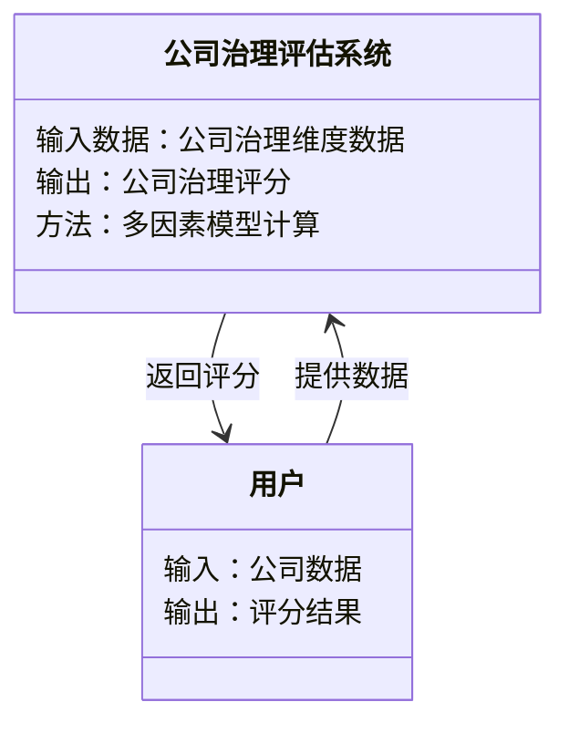
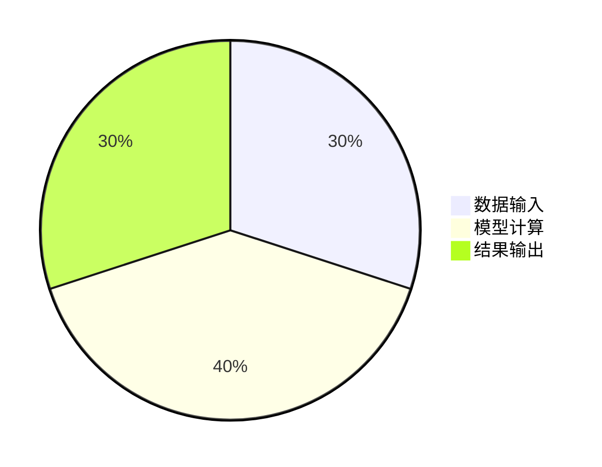
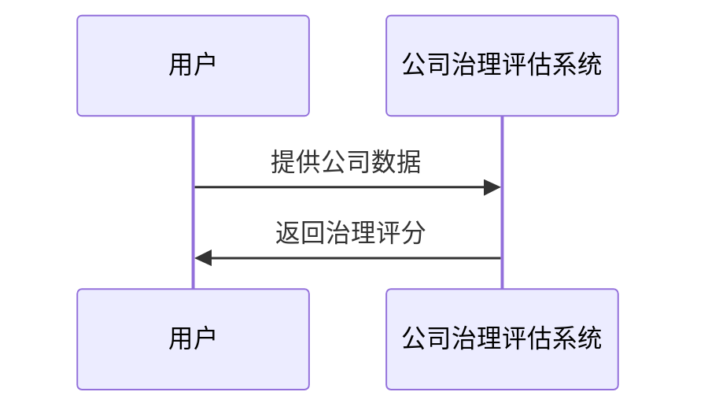

                 


---

# 马克·莫比乌斯的公司治理改善投资

## 关键词：公司治理、投资、改善、治理模型、投资策略、治理评分

## 摘要：本文详细探讨了公司治理改善投资的重要性和实施方法。通过分析公司治理的核心要素、评估指标以及数学模型，提出了一套基于多因素模型的公司治理评分方法，并给出了投资策略建议。文章结合实际案例，展示了如何通过改善公司治理来提升企业价值，为投资者提供了实用的指导。

---

# 第一部分: 公司治理改善投资的背景与核心概念

## 第1章: 公司治理改善投资概述

### 1.1 公司治理的定义与核心要素

#### 1.1.1 公司治理的定义
公司治理是指通过合理配置权力、责任和利益，确保公司有效运作和长期发展的管理过程。它涉及股东、董事会、管理层和利益相关者之间的关系。

#### 1.1.2 公司治理的核心要素
- **股权结构**：股东的权力分配和控制权。
- **董事会结构**：董事会的组成、职责和运作方式。
- **利益相关者管理**：与股东、员工、客户等的关系管理。
- **透明度与信息披露**：确保信息的公开透明。
- **风险管理**：识别和控制公司面临的风险。

#### 1.1.3 公司治理与企业价值的关系
良好的公司治理能够提高企业透明度、降低风险，从而提升企业价值和投资者信心。

### 1.2 投资视角下的公司治理改善

#### 1.2.1 投资与公司治理的关系
公司治理影响企业的长期表现和风险，进而影响投资回报。

#### 1.2.2 公司治理改善对投资者的影响
- 提高企业价值。
- 降低投资风险。
- 提升投资者信心。

#### 1.2.3 公司治理改善的驱动因素
- 投资者压力。
- 法律法规要求。
- 企业自身发展需要。

### 1.3 公司治理改善投资的背景与现状

#### 1.3.1 全球公司治理的发展历程
从股东至上到利益相关者治理的演变。

#### 1.3.2 中国公司治理的现状与挑战
- 股东结构集中。
- 董事会独立性不足。
- 信息披露不完善。

#### 1.3.3 公司治理改善投资的市场潜力
随着投资者对治理的关注增加，改善治理的投资需求上升。

### 1.4 本章小结
公司治理是影响企业价值的重要因素，投资者通过改善公司治理可以实现更高的投资回报。

---

# 第二部分: 公司治理改善投资的核心概念与联系

## 第2章: 公司治理的关键维度与评估指标

### 2.1 公司治理的多维模型

#### 2.1.1 股权结构与控制权
- 控制权集中可能导致代理问题。
- 分散股权可能增加治理难度。

#### 2.1.2 董事会结构与治理
- 董事会的独立性、专业性和多样性。
- 董事会的职责与运作效率。

#### 2.1.3 利益相关者关系管理
- 与股东、员工、客户等的关系管理。
- 利益相关者的诉求与公司治理的影响。

### 2.2 公司治理的评估指标体系

#### 2.2.1 财务透明度与信息披露
- 财务报表的准确性。
- 信息披露的及时性和完整性。

#### 2.2.2 治理效率与决策质量
- 决策的及时性和科学性。
- 治理结构的效率。

#### 2.2.3 风险管理与内部控制
- 风险识别、评估和控制。
- 内部控制的有效性。

### 2.3 公司治理与投资收益的关系

#### 2.3.1 公司治理对投资收益的影响
- 良好的治理提升企业价值，增加投资回报。
- 治理问题可能导致投资损失。

#### 2.3.2 公司治理风险与投资决策
- 风险评估与投资决策的关系。
- 如何通过改善治理降低投资风险。

#### 2.3.3 公司治理改善的长期收益
- 长期稳定发展带来的持续收益。
- 股东价值的长期增长。

### 2.4 本章小结
公司治理的多维模型和评估指标体系为投资者提供了全面的分析工具，帮助识别和改善治理问题。

---

# 第三部分: 公司治理改善投资的算法原理与数学模型

## 第3章: 公司治理评估的多因素模型

### 3.1 公司治理评估的多因素分析

#### 3.1.1 多因素模型的构建逻辑
- 结合多个治理维度，构建综合评分模型。
- 考虑各维度的权重，进行加权评分。

#### 3.1.2 公司治理各维度的权重分配
- 根据维度的重要性和影响程度确定权重。
- 例如：股权结构权重30%，董事会结构权重25%，利益相关者管理权重20%，透明度权重15%，风险管理权重10%。

#### 3.1.3 模型的适用性与局限性
- 适用于多维度评估。
- 局限性：权重可能因行业或公司而异。

### 3.2 公司治理评分的数学公式

#### 3.2.1 公司治理评分公式
$$
G = \sum_{i=1}^{n} w_i \cdot S_i
$$
其中：
- $G$ 是公司治理评分。
- $w_i$ 是第 $i$ 个维度的权重。
- $S_i$ 是第 $i$ 个维度的评分。

#### 3.2.2 评分范围
- $S_i$ 的范围为 0 到 10 分。
- 最终评分 $G$ 的范围为 0 到 100 分。

### 3.3 基于多因素模型的投资决策算法

#### 3.3.1 投资决策的逻辑流程
1. 收集公司治理数据。
2. 根据各维度评分公式计算 $S_i$。
3. 计算综合评分 $G$。
4. 根据评分制定投资策略。

#### 3.3.2 基于评分的筛选标准
- 高评分（80+）：值得投资。
- 中评分（60-79）：需进一步分析。
- 低评分（60以下）：风险较高，谨慎投资。

### 3.4 本章小结
多因素模型为公司治理评估提供了科学的方法，帮助投资者做出更明智的投资决策。

---

## 系统分析与架构设计方案

### 3.5 系统功能设计

#### 3.5.1 领域模型


### 3.6 系统架构设计

#### 3.6.1 系统架构图


### 3.7 系统接口设计

#### 3.7.1 接口设计
- 输入接口：接收公司治理数据。
- 输出接口：返回公司治理评分。

### 3.8 系统交互流程

#### 3.8.1 交互流程图


---

## 项目实战

### 3.9 项目环境安装

#### 3.9.1 安装Python
```bash
python --version
pip install --upgrade pip
```

#### 3.9.2 安装依赖库
```bash
pip install numpy pandas matplotlib
```

### 3.10 核心实现源代码

#### 3.10.1 Python代码实现
```python
import numpy as np
import pandas as pd

# 定义评分函数
def calculate_governance_score(factors, weights):
    return np.dot(factors, weights)

# 示例数据
data = {
    '股权结构': [8, 7, 9],
    '董事会结构': [6, 8, 7],
    '利益相关者管理': [7, 6, 8],
    '透明度': [6, 7, 9],
    '风险管理': [5, 6, 7]
}

weights = [0.3, 0.25, 0.2, 0.15, 0.1]

# 计算综合评分
factors_array = np.array(data.values.T)
governance_scores = calculate_governance_score(factors_array, weights)

print("公司治理评分:", governance_scores)
```

#### 3.10.2 代码解读
- 读取输入数据。
- 计算各维度的评分。
- 使用权重计算综合评分。
- 输出结果。

### 3.11 实际案例分析

#### 3.11.1 案例分析
分析某公司治理数据，计算其治理评分。

#### 3.11.2 应用解读
解释评分结果对企业价值和投资决策的影响。

### 3.12 本章小结
通过实际案例展示了如何应用多因素模型进行公司治理评估，为投资者提供决策支持。

---

## 最佳实践

### 3.13 投资策略 tips

#### 3.13.1 关键点总结
- 优先选择高治理评分的公司。
- 注意治理问题可能导致的投资风险。

#### 3.13.2 小结
公司治理改善是实现投资收益的重要途径。

#### 3.13.3 注意事项
- 定期更新治理数据。
- 结合其他因素进行综合分析。

#### 3.13.4 未来趋势
- 数字化治理评估。
- AI技术的应用。

### 3.14 作者信息
作者：AI天才研究院 & 禅与计算机程序设计艺术

---

感谢您的阅读！希望这篇文章能为您提供有价值的信息和启发，帮助您更好地理解和应用公司治理改善投资的策略与方法。

