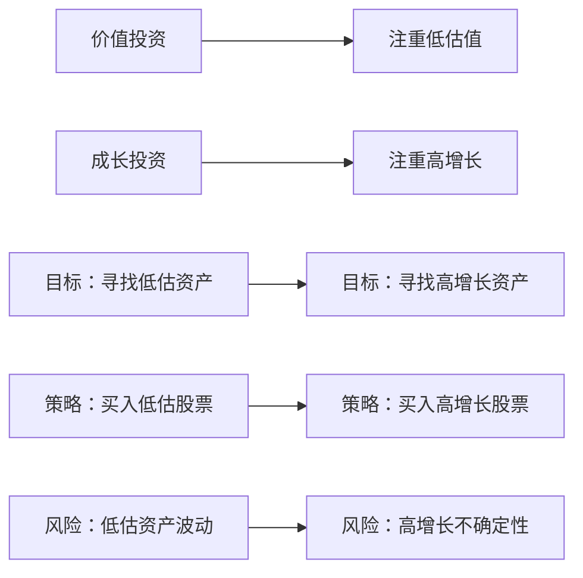
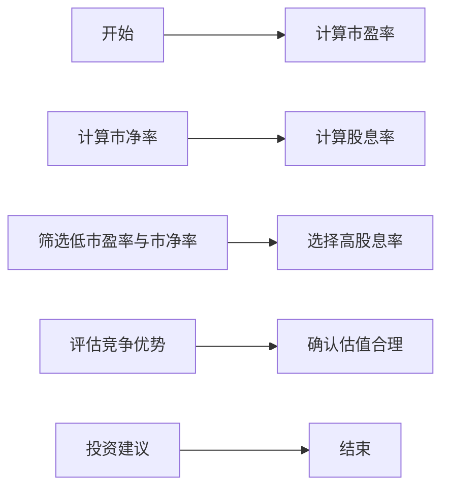
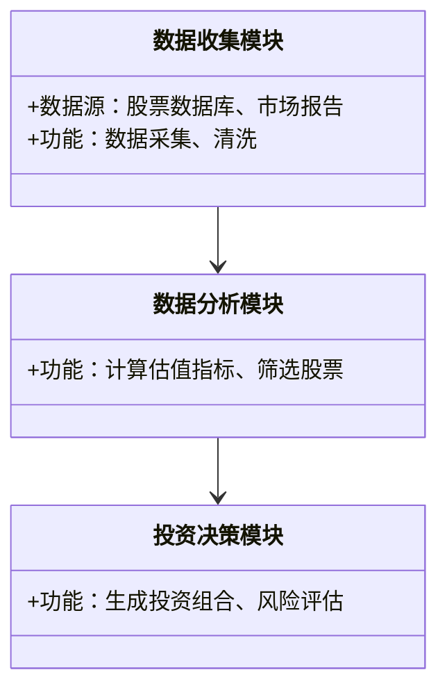
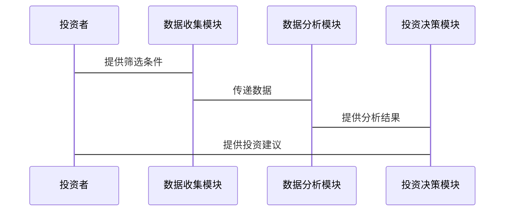

                 


# 马克·莫比乌斯的新兴市场价值投资策略

## 关键词：
- 新兴市场
- 价值投资
- 马克·莫比乌斯
- 股票估值
- 投资策略

## 摘要：
本文系统地阐述了马克·莫比乌斯在新兴市场中的价值投资策略。通过背景介绍、核心概念、算法原理、系统设计、项目实战等多维度分析，深入探讨了新兴市场的投资机会与挑战。结合量化分析与基本面研究，本文提供了从理论到实践的完整投资框架，帮助投资者在新兴市场中发现低估投资机会，实现长期稳健收益。

---

## 第一部分：引言

### 第1章：引言
#### 1.1 本书的目的与范围
本书旨在深入探讨马克·莫比乌斯的新兴市场价值投资策略，结合理论分析与实践案例，为投资者提供系统化的投资框架。内容涵盖新兴市场的特点、价值投资的核心理念、量化分析方法以及实际投资案例，帮助读者在复杂多变的市场环境中捕捉投资机会。

#### 1.2 作者背景与研究方法
作者马克·莫比乌斯作为新兴市场的权威专家，以其独特的投资策略闻名。本书基于其丰富的投资经验，结合定量分析与定性研究，系统性地阐述投资策略的构建与应用。

#### 1.3 新兴市场价值投资的重要性
新兴市场具有高增长潜力，但也伴随着较高的风险。通过价值投资策略，投资者可以在这些市场中发现低估资产，实现长期收益。本文将详细介绍莫比乌斯的策略，帮助投资者在新兴市场中找到优质投资标的。

---

## 第二部分：背景介绍

### 第2章：价值投资的基本概念
#### 2.1 价值投资的定义与核心理念
价值投资是一种以低于内在价值的价格买入优质资产的投资策略，强调安全边际和长期持有。其核心理念包括寻找市场先生的错误定价，关注企业的基本面，以及长期投资。

#### 2.2 新兴市场的特点与投资机会
新兴市场通常具有高增长潜力，但市场波动较大，信息不透明。这些市场的特点为投资者提供了发现低估资产的机会，但也带来了更高的风险和挑战。

#### 2.3 马克·莫比乌斯的新兴市场投资策略
莫比乌斯专注于新兴市场的价值投资，通过深入的基本面分析和量化筛选，寻找具有竞争优势且估值合理的公司。他强调长期投资和分散投资，以降低风险并捕捉结构性增长机会。

---

## 第三部分：核心概念与联系

### 第3章：价值投资的核心概念
#### 3.1 安全边际的定义与计算
安全边际是指买入价格与内在价值之间的差距，用于降低投资风险。计算公式为：安全边际 = 内在价值 - 市场价格。莫比乌斯强调通过安全边际来筛选投资标的，确保投资的安全性。

#### 3.2 内在价值的评估方法
内在价值是基于企业基本面的未来现金流折现值。常用模型包括股利折现模型（DDM）和贴现现金流模型（DCF）。莫比乌斯通过这些模型评估公司的内在价值，判断其是否被市场低估。

#### 3.3 价值投资与成长投资的对比分析
价值投资注重低估值，而成长投资关注高增长。两者在目标、策略和风险偏好上有显著差异。通过Mermaid流程图对比，可以清晰看出两者的异同。



---

## 第四部分：算法原理讲解

### 第4章：价值投资的量化分析
#### 4.1 市盈率与市净率的计算公式
市盈率（P/E）=股价/每股收益，市净率（P/B）=股价/每股净资产。莫比乌斯通过比较这些比率与行业或历史平均水平，识别低估公司。

#### 4.2 估值模型的构建与应用
使用股利折现模型（DDM）评估公司价值，公式为：内在价值 = 现金流/折现率。莫比乌斯结合多个模型进行交叉验证，提高估值准确性。

#### 4.3 价值投资的筛选指标与流程
通过多重指标筛选投资标的，包括低市盈率、低市净率、高股息率等。Mermaid流程图展示了筛选流程：



---

## 第五部分：系统分析与架构设计方案

### 第5章：投资决策系统的构建
#### 5.1 数据收集与处理模块
系统从多个来源收集市场数据，清洗和预处理后用于分析。类图展示数据模块与其他模块的交互。



#### 5.2 基本面分析与估值模块
模块包括对公司财务数据的分析和估值模型的计算，确保投资决策的准确性。

#### 5.3 投资组合管理模块
根据筛选结果构建投资组合，动态调整以应对市场变化。序列图展示模块交互。



---

## 第六部分：项目实战

### 第6章：新兴市场投资案例

#### 6.1 环境配置
使用Python和相关库（如pandas、numpy）进行数据处理和分析。

#### 6.2 数据收集与预处理
收集目标市场的股票数据，清洗和整理后用于分析。

#### 6.3 核心代码实现
以下为价值投资筛选模型的Python代码示例：

```python
import pandas as pd
import numpy as np

# 数据预处理
data = pd.read_csv('em_stocks.csv')
data['PE'] = data['Price'] / data['EPS']
data['PB'] = data['Price'] / data['Book Value']
data['Value Score'] = 0.4 * (data['PE'].rank(pct=True)) + 0.6 * (data['PB'].rank(pct=True))
data = data.sort_values('Value Score', ascending=False)
```

#### 6.4 投资组合构建与结果分析
通过代码筛选出低估股票，构建投资组合，并评估其表现。案例分析展示了莫比乌斯策略的有效性。

---

## 第七部分：风险管理

### 第7章：新兴市场投资中的风险管理
#### 7.1 风险识别
新兴市场面临政治风险、经济波动和流动性风险。莫比乌斯通过分散投资和风险评估降低风险。

#### 7.2 风险管理策略
制定止损机制、定期调整投资组合、监控市场变化，确保投资安全。

---

## 第八部分：未来展望

### 第8章：新兴市场的未来趋势
#### 8.1 新兴市场的长期潜力
随着经济全球化和技术进步，新兴市场将继续保持增长潜力，成为投资者的重要目标。

#### 8.2 价值投资策略的演变
技术进步和市场变化将推动价值投资策略的创新，莫比乌斯策略将不断优化以适应新环境。

---

## 结论

### 第9章：结论
本书全面介绍了马克·莫比乌斯的新兴市场价值投资策略，从理论到实践提供了系统的投资框架。通过量化分析和基本面研究，投资者可以在新兴市场中发现低估机会，实现长期稳健收益。莫比乌斯的策略不仅适用于新兴市场，也为全球投资提供了重要参考。

---

## 作者信息

作者：AI天才研究院 & 禅与计算机程序设计艺术

---

希望这篇博客文章能满足您的要求。如果需要进一步修改或补充，请随时告知！

