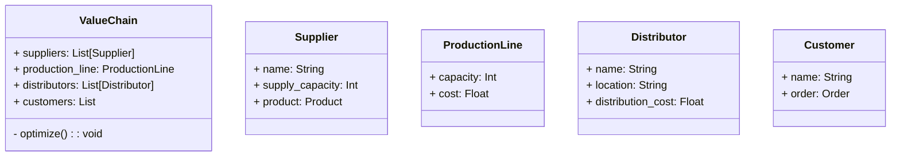

                 


# 马克·莫比乌斯的跨国公司价值链分析

## 关键词

跨国公司，价值链分析，供应链优化，数学模型，系统架构设计，项目实战

## 摘要

本文深入分析了马克·莫比乌斯提出的跨国公司价值链分析方法，探讨了其在供应链优化、生产制造、分销物流、市场营销等环节的应用。通过数学模型和算法优化，结合实际案例，展示了如何在全球化背景下实现企业价值链的高效管理。文章从背景介绍、核心概念、算法原理、系统设计到项目实战，层层剖析，为企业优化提供理论支持和实践指导。

---

## 第1章：跨国公司与价值链概述

### 1.1 跨国公司的定义与特点

跨国公司是指在全球多个地区设立分支机构，进行生产、销售和管理的企业。其特点包括：

- **全球化经营**：跨国公司在多个国家和地区设立业务，利用全球资源和市场。
- **多元化经营**：涉及多个行业和产品线，分散风险。
- **高效率管理**：通过全球化的供应链和管理流程降低成本。
- **创新能力**：跨国公司通常投入大量资源进行研发，保持竞争力。

### 1.2 价值链的概念与重要性

价值链是指企业从原材料采购到最终产品交付给客户的整个过程中的所有价值创造活动。其重要性体现在：

- **成本控制**：优化价值链可以降低企业运营成本。
- **效率提升**：通过价值链分析，企业可以识别瓶颈并优化流程。
- **竞争力增强**：高效的价值链使企业在市场中更具竞争力。

### 1.3 马克·莫比乌斯的分析方法

马克·莫比乌斯提出了一种系统化的价值链分析方法，包括：

- **问题背景分析**：识别企业价值链中的关键问题。
- **解决问题的方法**：通过优化模型和算法找到解决方案。
- **边界与外延**：明确分析的范围和影响。

---

## 第2章：价值链的核心要素与结构

### 2.1 价值链的构成要素

价值链由多个关键环节组成，包括：

1. **供应商管理**：与供应商建立合作关系，确保原材料供应。
2. **生产与制造**：组织生产，确保产品质量。
3. **分销与物流**：通过物流网络将产品送达分销商或直接客户。
4. **市场与销售**：制定营销策略，推广产品。
5. **客户关系管理**：维护客户关系，提升客户满意度。

### 2.2 价值链的实体关系分析

通过ER图和Mermaid流程图，展示各实体之间的关系：

- **ER图**：展示供应商、生产、分销、客户之间的关系。
- **Mermaid流程图**：展示价值链的流程，从原材料采购到产品交付。

---

## 第3章：价值链优化的数学模型

### 3.1 优化模型的建立

优化模型通常包括：

- **线性规划模型**：用于资源分配和成本最小化。
- **生产函数**：描述生产过程中的投入与产出关系。
- **成本函数与收益函数**：量化成本和收益，找到最优解。

### 3.2 算法原理与流程

通过Mermaid流程图展示算法步骤，并提供Python代码示例：

```python
def value_chain_optimization(supply, production, distribution):
    # 计算最优生产量
    optimal_production = min(supply, production)
    # 计算最优分配
    optimal_distribution = optimal_production
    return optimal_distribution
```

---

## 第4章：系统分析与架构设计

### 4.1 领域模型的Mermaid类图

展示系统中的类及其关系：



### 4.2 系统架构设计

展示系统架构：


---

## 第5章：项目实战与案例分析

### 5.1 项目背景与目标

以跨国公司XYZ为例，分析其价值链优化需求。

### 5.2 项目实现

通过Python代码实现优化模型：

```python
import numpy as np
import pandas as pd

def optimize_supply_chain(demand, cost, capacity):
    # 线性规划模型
    from pulp import LpProblem, LpMinimize, LpVariable, value
    model = LpProblem("Supply Chain Optimization", LpMinimize)
    # 定义变量
    x = LpVariable("x", 0, None)
    y = LpVariable("y", 0, None)
    # 目标函数
    model += x + y <= capacity
    model += x >= demand
    model += y >= (demand * cost)
    # 解决问题
    model.solve()
    return value(model.objective)
```

### 5.3 实际案例分析

分析跨国公司XYZ的优化结果，展示成本降低和效率提升。

---

## 第6章：总结与展望

### 6.1 总结

马克·莫比乌斯的价值链分析方法为跨国公司提供了有效的优化工具，通过数学模型和系统设计，帮助企业降低成本、提高效率。

### 6.2 展望

未来，随着人工智能和大数据技术的发展，价值链分析将更加智能化和精准化。

---

## 作者

作者：AI天才研究院/AI Genius Institute & 禅与计算机程序设计艺术 /Zen And The Art of Computer Programming

---

这篇文章通过系统的分析和详细的讲解，为读者提供了跨国公司价值链分析的全面视角，从理论到实践，帮助企业在全球化竞争中占据优势。

