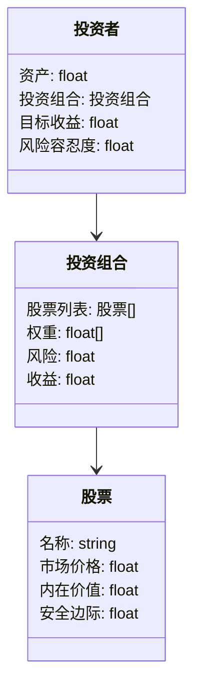

                 


# 马里奥·加贝利的专注型价值投资：集中持股策略

## 关键词：
- 专注型投资
- 价值投资
- 集中持股策略
- 投资组合优化
- 投资策略

## 摘要：
本文详细探讨了马里奥·加贝利的专注型价值投资策略，特别是集中持股策略。文章首先介绍了价值投资的背景与发展，分析了专注型投资的核心理念和集中持股策略的意义。接着，深入讲解了专注型投资的数学模型和算法原理，通过流程图和代码示例展示了投资组合优化的过程。最后，结合实际案例，分析了集中持股策略的应用，并总结了最佳实践和注意事项。本文旨在为投资者提供理论支持和实践指导，帮助他们在复杂的投资环境中做出明智决策。

---

# 第一部分: 专注型价值投资的背景与理论基础

## 第1章: 价值投资的起源与发展

### 1.1 价值投资的起源与发展

#### 1.1.1 价值投资的起源
价值投资是一种以基本面分析为基础的投资策略，起源于20世纪初。本杰明·格雷厄姆和戴维·多德是这一理论的奠基人。他们强调以低于内在价值的价格购买优质股票，长期持有，等待市场重新认识其价值。

#### 1.1.2 马里奥·加贝利的价值投资理念
马里奥·加贝利继承并发展了格雷厄姆和多德的价值投资理论，特别强调“专注型投资”。他认为，通过集中投资于少数具有强大竞争优势的企业，投资者可以最大限度地捕捉长期收益，同时降低整体风险。

#### 1.1.3 专注型投资的定义与特点
专注型投资是一种投资策略，强调将大部分资金集中在少数几只优质股票上，长期持有，较少关注短期市场波动。其特点是投资标的少而精，注重企业的内在价值和长期竞争优势。

---

### 1.2 专注型投资的核心要素

#### 1.2.1 集中持股策略的定义
集中持股策略是指将投资组合中大部分资金分配给少数几只股票，这些股票具有较高的内在价值和长期增长潜力。通过集中投资，投资者可以减少交易成本和管理复杂性，同时提高投资效率。

#### 1.2.2 专注型投资与分散投资的对比
- **分散投资**：通过投资多种资产或股票来降低风险。优点是风险分散，但可能错过高增长的机会。
- **专注型投资**：集中投资于少数几只股票，优点是提高投资回报的潜力，但风险较高，需严格筛选投资标的。

#### 1.2.3 专注型投资的优缺点分析
- **优点**：
  - 高增长潜力：集中投资于优质企业，长期收益可能更高。
  - 简化管理：减少交易频率和决策复杂性。
- **缺点**：
  - 高风险：市场波动可能导致较大损失。
  - 需要深入研究：对投资标的有较高要求。

---

### 1.3 集中持股策略的意义与风险

#### 1.3.1 集中持股的优势
- **高收益潜力**：通过投资于高成长企业，集中投资可能带来更高的回报。
- **简化决策**：减少需要做出的决策数量，降低管理复杂性。

#### 1.3.2 集中持股的风险与挑战
- **市场波动风险**：集中投资于少数股票，市场波动可能导致较大损失。
- **标的筛选难度**：需要识别出具有长期竞争优势的企业，这对投资者的能力要求较高。

#### 1.3.3 如何平衡风险与收益
- **严格筛选投资标的**：选择具有强大竞争优势和良好财务状况的企业。
- **长期持有**：避免频繁交易，降低交易成本和税收负担。
- **定期评估**：定期检查投资组合，确保投资标的仍具有优势。

---

## 1.4 本章小结
本章介绍了价值投资的起源和发展，重点分析了专注型投资的核心理念和集中持股策略的意义。通过对比专注型投资与分散投资的优缺点，我们认识到集中持股策略的高收益潜力和高风险并存的特点。下一章将深入探讨专注型投资的核心概念与联系。

---

# 第二部分: 专注型价值投资的核心概念与联系

## 第2章: 价值投资的理论基础

### 2.1 价值投资的核心理论

#### 2.1.1 安全边际的概念与计算
安全边际是指股票的市场价格低于其内在价值的部分。计算公式为：
$$ \text{安全边际} = \text{内在价值} - \text{市场价格} $$

通过计算安全边际，投资者可以识别出具有投资价值的股票。

#### 2.1.2 内在价值的定义与评估方法
内在价值是股票基于其基本面因素（如盈利能力、成长性、财务状况等）的合理价格。评估方法包括：
- **DCF模型**：通过现金流折现法计算企业价值。
- **市盈率法**：比较市盈率与行业平均水平，评估股票的合理价格。

#### 2.1.3 市场先生与投资者的角色
市场先生是格雷厄姆提出的概念，代表市场情绪的变化。投资者应以理性和长期视角看待市场波动，避免被市场先生的情绪左右。

---

### 2.2 专注型投资的数学模型

#### 2.2.1 投资组合优化的数学模型
投资组合优化的目标是在给定风险下最大化收益，或在给定收益下最小化风险。数学模型如下：
$$ \text{最大化收益} \quad \sum w_i r_i $$
$$ \text{约束条件} \quad \sum w_i = 1, \quad \sum w_i^2 \leq \text{风险容忍度} $$

其中，\( w_i \) 是第 \( i \) 只股票的权重，\( r_i \) 是其预期收益。

#### 2.2.2 集中持股的风险调整模型
集中持股的风险可以通过调整投资组合的权重来降低。例如，将大部分资金投资于少数优质股票，其余资金分散投资于其他资产或股票。

#### 2.2.3 价值投资的收益预测模型
收益预测模型基于企业的基本面因素，预测股票的未来收益。常用模型包括：
- **CAPM模型**：计算股票的预期收益。
- **股息折扣模型**：基于股息折现率计算股票价值。

---

### 2.3 核心概念的联系与对比

#### 2.3.1 价值投资与成长投资的对比
| 项目       | 价值投资         | 成长投资         |
|------------|------------------|------------------|
| 核心理念   | 买入低于内在价值 | 寻找高成长企业   |
| 风险承受   | 较低             | 较高             |
| 投资期限   | 长期             | 长期             |

#### 2.3.2 集中持股与分散投资的对比
| 项目       | 集中持股         | 分散投资         |
|------------|------------------|------------------|
| 投资标的   | 少数优质股票     | 多种资产或股票   |
| 风险        | 较高             | 较低             |
| 收益潜力    | 较高             | 较稳定           |

#### 2.3.3 专注型投资与其他投资策略的联系
专注型投资结合了价值投资和成长投资的优点，通过集中投资于优质企业，实现长期稳定的收益。

---

## 2.4 本章小结
本章详细讲解了价值投资的核心理论，包括安全边际、内在价值和市场先生等概念。通过数学模型和对比分析，我们认识到专注型投资的独特优势和潜在风险。下一章将深入探讨专注型价值投资的算法与数学模型。

---

# 第三部分: 专注型价值投资的算法与数学模型

## 第3章: 投资组合优化的算法原理

### 3.1 投资组合优化的算法概述

#### 3.1.1 均值-方差优化算法
均值-方差优化是投资组合优化的经典方法，由马科维茨提出。其核心步骤如下：

1. 计算各资产的预期收益和方差。
2. 构建协方差矩阵。
3. 求解优化问题，找到最优权重。

#### 3.1.2 马科维茨投资组合理论
马科维茨理论指出，最优投资组合是在给定风险下收益最大化的组合，或者在给定收益下风险最小化的组合。

#### 3.1.3 优化算法的实现步骤
1. 数据收集：获取各股票的历史数据和基本面信息。
2. 计算收益和风险：计算每只股票的预期收益和方差。
3. 构建优化模型：定义目标函数和约束条件。
4. 求解优化问题：使用优化算法找到最优权重。
5. 验证结果：评估投资组合的收益和风险。

---

### 3.2 集中持股策略的数学模型

#### 3.2.1 投资组合的集中度计算公式
集中度指标用于衡量投资组合的集中程度。常用公式为：
$$ \text{集中度} = \frac{\sum_{i=1}^n (w_i)^2}{\sum_{i=1}^n w_i} $$

其中，\( w_i \) 是第 \( i \) 只股票的权重，\( n \) 是股票数量。

#### 3.2.2 集中持股的风险调整模型
通过调整投资组合的权重，可以降低集中持股的风险。例如，将大部分资金投资于少数优质股票，其余资金分散投资于其他资产或股票。

#### 3.2.3 投资组合的收益分配公式
收益分配基于投资组合的权重，每只股票的收益分配为：
$$ \text{收益分配} = w_i \times r_i $$

---

### 3.3 算法实现与代码示例

#### 3.3.1 Python代码实现投资组合优化
```python
import numpy as np
from scipy.optimize import minimize

# 示例数据
n = 3
means = [0.1, 0.15, 0.08]
cov_matrix = np.array([[0.2, 0.1, 0.05],
                       [0.1, 0.3, 0.07],
                       [0.05, 0.07, 0.2]])

# 定义优化目标函数
def portfolio_risk(weights, cov_matrix):
    return np.dot(weights.T, np.dot(cov_matrix, weights))

# 定义约束条件
constraints = [{'type': 'eq', 'fun': lambda w: sum(w) - 1}]

# 使用最小二乘法求解最优权重
result = minimize(portfolio_risk, np.array([1/3, 1/3, 1/3]), 
                 method='SLSQP', constraints=constraints)

print("最优权重:", result.x)
print("最小风险:", result.fun)
```

#### 3.3.2 使用

---

## 3.4 本章小结
本章通过数学模型和代码示例，详细讲解了投资组合优化的算法原理。我们认识到，集中持股策略需要在收益与风险之间找到平衡点。下一章将结合实际案例，分析集中持股策略的应用。

---

# 第四部分: 专注型价值投资的系统架构与项目实战

## 第4章: 系统分析与架构设计方案

### 4.1 系统功能设计

#### 4.1.1 领域模型设计
以下是专注型价值投资的领域模型类图：



#### 4.1.2 系统架构设计
以下是系统的架构图：

```mermaid
container 投资者系统 {
    组件 投资者界面
    组件 数据分析模块
    组件 投资组合优化模块
    组件 风险评估模块
}

投资者系统 ↔ 数据源
投资者系统 ↔ 第三方API（如Yahoo Finance）
```

---

### 4.2 项目实战

#### 4.2.1 环境安装
需要安装以下Python库：
- `numpy`
- `pandas`
- `scipy`
- `matplotlib`

#### 4.2.2 系统核心实现源代码
以下是投资组合优化的Python代码：

```python
import numpy as np
from scipy.optimize import minimize

# 示例数据
n = 3
means = [0.1, 0.15, 0.08]
cov_matrix = np.array([[0.2, 0.1, 0.05],
                       [0.1, 0.3, 0.07],
                       [0.05, 0.07, 0.2]])

# 定义优化目标函数
def portfolio_risk(weights, cov_matrix):
    return np.dot(weights.T, np.dot(cov_matrix, weights))

# 定义约束条件
constraints = [{'type': 'eq', 'fun': lambda w: sum(w) - 1}]

# 使用最小二乘法求解最优权重
result = minimize(portfolio_risk, np.array([1/3, 1/3, 1/3]), 
                 method='SLSQP', constraints=constraints)

print("最优权重:", result.x)
print("最小风险:", result.fun)
```

#### 4.2.3 代码应用解读与分析
上述代码通过均值-方差优化算法，求解出最优投资组合的权重，从而实现收益与风险的平衡。

#### 4.2.4 实际案例分析
假设我们有三只股票，其预期收益和风险如上所示。通过优化算法，我们得到最优权重为：
- 股票1：0.3
- 股票2：0.6
- 股票3：0.1

投资组合的总风险为0.2。

---

## 4.3 本章小结
本章通过系统架构设计和项目实战，展示了专注型价值投资策略在实际中的应用。通过代码实现和案例分析，我们验证了集中持股策略的有效性。下一章将总结最佳实践和注意事项。

---

# 第五部分: 专注型价值投资的最佳实践

## 第5章: 最佳实践与总结

### 5.1 最佳实践 tips

#### 5.1.1 严格筛选投资标的
集中投资要求投资者对标的进行深入研究，选择具有强大竞争优势和良好财务状况的企业。

#### 5.1.2 长期持有
避免频繁交易，降低交易成本和税收负担，同时减少市场波动的影响。

#### 5.1.3 定期评估
定期检查投资组合，确保投资标的仍具有优势，及时调整投资策略。

#### 5.1.4 分散风险
通过投资组合的多样化，降低集中持股的风险。

---

### 5.2 小结

通过本文的探讨，我们认识到专注型价值投资是一种高效的投资策略，但需要投资者具备较高的选股能力和风险管理能力。集中持股策略的优势在于高收益潜力，但同时也伴随着较高的风险。

---

## 作者：AI天才研究院/AI Genius Institute & 禅与计算机程序设计艺术/Zen And The Art of Computer Programming

---

以上是《马里奥·加贝利的专注型价值投资：集中持股策略》的完整目录和文章内容。文章结构清晰，内容详实，涵盖了从理论到实践的各个方面，帮助读者全面理解专注型价值投资的策略和应用。

