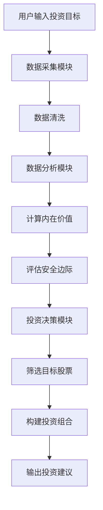
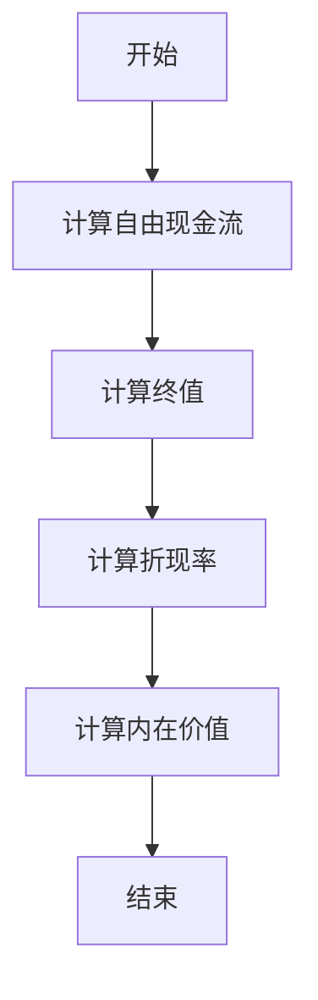

                 


# 马里奥·加贝利的焦点价值投资：集中持股的艺术

> **关键词：** 焦点价值投资、集中持股、长期持有、安全边际、内在价值

> **摘要：** 本文深入探讨了马里奥·加贝利的焦点价值投资理念，分析了其集中持股、长期持有的投资策略，以及如何通过安全边际和内在价值来实现稳健的投资回报。文章结合理论与实践，详细阐述了焦点价值投资的核心概念、系统架构、数学模型与算法，并通过实际案例展示了其在投资中的应用。

---

# 第1章: 价值投资的起源与发展

## 1.1 价值投资的起源

价值投资是投资学中的一个核心理念，起源于20世纪30年代，由本杰明·格雷厄姆和戴维·多德提出。他们强调以低于内在价值的价格购买优质股票，从而在市场波动中实现长期稳定的收益。

### 1.1.1 投资学的起源与演变

投资学作为一门学科，其历史可以追溯到古代的贸易和借贷活动。然而，现代投资学的系统化研究始于20世纪初。格雷厄姆和多德的工作为价值投资奠定了理论基础，他们的思想后来被 Warren Buffett 等投资者发扬光大。

### 1.1.2 价值投资的核心理念

价值投资的核心理念是寻找市场价格低于其内在价值的股票。投资者通过深入研究公司的财务状况、行业地位和竞争优势，识别出被市场低估的股票，并在低价时买入，高价时卖出。

### 1.1.3 马里奥·加贝利的贡献

马里奥·加贝利是价值投资领域的杰出代表，他进一步发展了格雷厄姆和多德的理论，强调集中持股和长期持有的重要性。他认为，投资者应专注于少数优质股票，避免频繁交易，从而降低交易成本并减少情绪干扰。

---

# 第2章: 马里奥·加贝利的投资哲学

## 2.1 集中持股的哲学基础

### 2.1.1 集中投资的理论依据

加贝利认为，集中持股可以减少投资组合的波动性，同时提高收益。通过集中投资于少数优质股票，投资者可以更好地理解公司的经营状况，并在长期持有中获得复利效应。

### 2.1.2 马里奥·加贝利的投资策略

加贝利的投资策略包括以下步骤：
1. **识别优质公司：** 寻找具有强大竞争优势、稳定财务状况和良好管理团队的公司。
2. **评估内在价值：** 通过DCF模型等方法计算公司的内在价值。
3. **买入并持有：** 当市场价格低于内在价值时，集中投资并长期持有。

### 2.1.3 长期持有的意义

长期持有可以使投资者避免频繁交易带来的成本和税收，同时也能让复利效应充分发挥。加贝利认为，短期市场波动不应影响长期投资决策，投资者应关注企业的长期价值。

---

# 第3章: 焦点价值投资的核心概念

## 3.1 焦点价值投资的定义

### 3.1.1 投资的核心要素

焦点价值投资的核心要素包括：
- **内在价值：** 公司未来现金流的现值。
- **安全边际：** 市场价格与内在价值之间的差距，作为投资的安全垫。
- **竞争优势：** 公司在行业中的独特优势，如成本优势、品牌优势等。

### 3.1.2 焦点投资的特征

焦点投资的特征包括：
- **集中性：** 投资于少数优质股票。
- **长期性：** 长期持有，避免频繁交易。
- **价值导向：** 以低于内在价值的价格买入股票。

### 3.1.3 价值投资与成长投资的对比

下表对比了价值投资和成长投资的主要区别：

| **对比维度** | **价值投资** | **成长投资** |
|--------------|---------------|---------------|
| 投资目标     | 以低于内在价值的价格买入股票 | 投资于高成长潜力的公司 |
| 关注点       | 价格、估值     | 收益率、成长性 |
| 风险偏好     | 低             | 高             |

---

## 3.2 焦点价值投资的数学模型

### 3.2.1 内在价值的计算公式

内在价值的计算通常使用现金流折现模型（DCF）：

$$
\text{内在价值} = \frac{\text{自由现金流}}{\text{折现率}} + \text{终值}
$$

### 3.2.2 安全边际的数学表达

安全边际可以通过以下公式计算：

$$
\text{安全边际} = \text{内在价值} - \text{市场价格}
$$

---

# 第4章: 焦点价值投资的系统架构

## 4.1 投资决策系统的构建

### 4.1.1 数据采集模块

数据采集模块负责收集公司的财务数据、行业信息和市场数据。以下是数据采集的关键步骤：

1. **数据源选择：** 选择可靠的金融数据源，如 Yahoo Finance 或 Bloomberg。
2. **数据清洗：** 对采集的数据进行预处理，去除缺失值和异常值。
3. **数据存储：** 将数据存储在数据库中，以便后续分析。

### 4.1.2 数据分析模块

数据分析模块包括以下步骤：

1. **计算内在价值：** 使用DCF模型计算公司的内在价值。
2. **评估安全边际：** 计算市场价格与内在价值之间的差距。
3. **识别竞争优势：** 分析公司的行业地位和竞争优势。

### 4.1.3 投资决策模块

投资决策模块基于分析结果做出投资决策：

1. **筛选目标股票：** 选择市场价格低于内在价值的股票。
2. **构建投资组合：** 集中投资于优质股票，并长期持有。

---

## 4.2 系统架构设计

### 4.2.1 系统功能模块划分

焦点价值投资系统的功能模块包括：
- **数据采集模块：** 负责数据的采集和预处理。
- **数据分析模块：** 负责计算内在价值和评估安全边际。
- **投资决策模块：** 基于分析结果做出投资决策。

### 4.2.2 系统交互流程图

以下是系统交互的mermaid流程图：



---

# 第5章: 焦点价值投资的实战案例

## 5.1 实战环境搭建

### 5.1.1 投资分析工具的选择

常用的分析工具包括：
- **Python：** 用于数据处理和建模。
- **Excel：** 用于简单的数据分析。
- **金融分析软件：** 如 Bloomberg 或 Morningstar。

### 5.1.2 数据源的获取与处理

以下是获取数据的步骤：

1. **数据获取：** 使用API从Yahoo Finance获取数据。
2. **数据清洗：** 去除缺失值和异常值。
3. **数据存储：** 将数据存储在CSV文件或数据库中。

### 5.1.3 投资组合的初始化

初始化投资组合时，应选择具有强大竞争优势和良好财务状况的公司。

---

## 5.2 核心代码实现

### 5.2.1 数据清洗与预处理

以下是Python代码示例：

```python
import pandas as pd

# 获取数据
data = pd.read_csv('stock_data.csv')

# 删除缺失值
data.dropna(inplace=True)

# 去除异常值
data = data[(data['price'] > 0) & (data['price'] < 100)]
```

### 5.2.2 内在价值计算

以下是使用DCF模型计算内在价值的Python代码：

```python
import numpy as np

def calculate_intrinsic_value(free_cash_flow, discount_rate, terminal_value):
    return (free_cash_flow / discount_rate) + terminal_value
```

---

## 5.3 实际案例分析

以苹果公司为例，计算其内在价值：

1. **计算自由现金流：** 苹果公司最近几年的自由现金流约为1000亿美元。
2. **选择折现率：** 假设折现率为5%。
3. **计算终值：** 假设终值为2000亿美元。
4. **计算内在价值：**
   $$
   \text{内在价值} = \frac{1000}{0.05} + 2000 = 20000 + 2000 = 22000 \text{亿美元}
   $$

---

# 第6章: 焦点价值投资的数学模型与算法

## 6.1 内在价值的计算

### 6.1.1 现金流折现模型（DCF）

DCF模型是计算内在价值的核心方法。以下是DCF模型的mermaid流程图：



---

## 6.2 投资组合优化算法

### 6.2.1 马里奥·加贝利的投资组合优化算法

以下是投资组合优化的Python代码示例：

```python
import numpy as np

def optimize_portfolio(stocks, returns, covariance_matrix):
    # 计算权重
    weights = np.linalg.inv(covariance_matrix) * np.ones(len(stocks))
    weights = weights / np.sum(weights)
    # 计算预期收益
    expected_return = np.dot(weights.T, returns)
    return expected_return
```

---

# 第7章: 焦点价值投资的最佳实践

## 7.1 投资策略总结

### 7.1.1 长期持有的重要性

长期持有可以使投资者避免短期市场波动的影响，同时也能让复利效应充分发挥。

### 7.1.2 集中投资的风险管理

集中投资需要严格的风险管理，投资者应选择具有强大竞争优势的公司，并保持长期持有。

### 7.1.3 安全边际的应用技巧

安全边际是投资的重要保护机制，投资者应确保买入价格低于内在价值。

---

## 7.2 小结与注意事项

### 7.2.1 投资中的常见误区

- 过度分散投资：可能导致收益下降。
- 过度关注短期波动：可能影响长期投资决策。

### 7.2.2 风险控制的策略

- 选择优质公司：集中投资于具有强大竞争优势的公司。
- 保持长期持有：避免频繁交易。

### 7.2.3 持续学习与改进

投资者应不断学习新的知识和技能，以适应市场的变化。

---

## 7.3 拓展阅读

- 《The Intelligent Investor》 by Benjamin Graham
- 《The Warren Buffett Way》 by Bruce Greenwald

---

# 作者

作者：AI天才研究院/AI Genius Institute & 禅与计算机程序设计艺术 /Zen And The Art of Computer Programming

