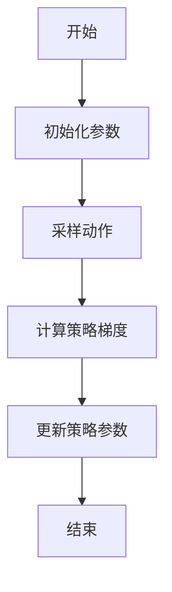
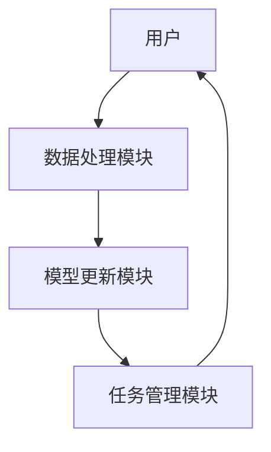

                 


# AI Agent 的持续学习：实现 LLM 的终身学习能力

**关键词**：AI Agent，持续学习，LLM，终身学习，自适应学习，在线学习，机器学习

**摘要**：  
随着人工智能技术的快速发展，AI Agent 的持续学习能力成为了实现其终身学习能力的关键。本文将深入探讨如何通过持续学习算法和系统架构设计，赋予大语言模型（LLM）持续学习的能力。文章从问题背景、核心概念、算法原理、系统架构到实际项目实现，层层递进，详细阐述了AI Agent 持续学习的实现方法。通过本文，读者可以全面理解AI Agent 持续学习的理论基础、技术实现和实际应用。

---

# 第一部分: AI Agent 持续学习的背景与核心概念

## 第1章: 持续学习的背景与问题背景

### 1.1 问题背景

#### 1.1.1 当前AI模型的局限性
- **静态性**：传统AI模型在训练完成后，无法根据新数据或新任务进行更新。
- **适应性不足**：面对动态变化的环境，AI模型难以实时调整和优化。
- **知识更新的挑战**：模型的知识库需要人工维护，难以实现自动化更新。

#### 1.1.2 持续学习的必要性
- **动态环境适应**：AI Agent需要在不断变化的环境中保持高性能。
- **任务多样性**：AI Agent需要处理多种任务，持续学习是其实现通用智能的核心。
- **实时更新**：实时数据流的处理需要模型具备持续学习的能力。

#### 1.1.3 LLM的终身学习能力的重要性
- **通用性增强**：通过持续学习，LLM能够处理更广泛的任务。
- **效率提升**：持续学习能够减少重复任务的训练时间。
- **用户体验优化**：用户可以通过与AI Agent的互动，实时看到模型能力的提升。

### 1.2 问题描述

#### 1.2.1 持续学习的核心问题
- **知识表示**：如何有效地表示和更新知识。
- **学习策略**：如何选择适合当前任务的学习策略。
- **模型更新**：如何在不遗忘旧知识的前提下更新模型。

#### 1.2.2 LLM在持续学习中的挑战
- **模型遗忘**：模型在学习新任务时容易遗忘旧知识。
- **计算资源限制**：持续学习需要大量的计算资源。
- **数据稀疏性**：新数据可能不足以覆盖所有任务。

#### 1.2.3 持续学习的边界与外延
- **边界**：持续学习的范围和限制。
- **外延**：持续学习与其他学习方法的结合。

### 1.3 问题解决

#### 1.3.1 持续学习的实现路径
- **在线学习**：实时更新模型。
- **离线学习**：定期更新模型。
- **混合学习**：结合在线和离线学习的优势。

#### 1.3.2 LLM的终身学习能力的构建方法
- **知识蒸馏**：通过教师模型指导学生模型学习。
- **参数优化**：通过优化算法保持模型的高效更新。
- **记忆机制**：通过记忆网络保存和更新知识。

#### 1.3.3 持续学习的评估与验证
- **性能评估**：通过任务性能评估模型的持续学习能力。
- **知识保持**：评估模型在学习新任务时是否保持旧知识。
- **效率评估**：评估模型的更新速度和资源消耗。

### 1.4 概念结构与核心要素

#### 1.4.1 持续学习的定义与核心要素
- **定义**：持续学习是指模型在不断变化的环境中，通过实时或周期性地更新知识和参数，以保持或提升其性能的过程。
- **核心要素**：
  - 知识表示。
  - 学习策略。
  - 模型更新机制。

#### 1.4.2 LLM的终身学习能力的构成
- **自适应性**：模型能够根据新数据调整自身。
- **泛化能力**：模型能够处理多种任务。
- **知识更新**：模型能够有效更新和扩展知识库。

#### 1.4.3 持续学习与传统机器学习的对比
- **传统机器学习**：
  - 离线学习。
  - 静态知识库。
  - 单任务优化。
- **持续学习**：
  - 在线学习。
  - 动态知识库。
  - 多任务优化。

---

## 第2章: 核心概念与联系

### 2.1 持续学习的原理

#### 2.1.1 自适应学习机制
- **自适应学习**：模型能够根据环境变化自动调整学习策略。
- **自适应参数更新**：通过优化算法动态调整模型参数。

#### 2.1.2 在线学习策略
- **实时更新**：模型在接收到新数据后立即更新。
- **增量学习**：逐步更新模型，避免一次性重新训练。

#### 2.1.3 知识表示与更新方法
- **知识表示**：使用向量、符号或图结构表示知识。
- **知识更新**：通过遗忘曲线等方式优化知识存储。

### 2.2 核心概念对比表

#### 表2-1: 持续学习与传统机器学习的对比

| 对比维度         | 传统机器学习                  | 持续学习                          |
|------------------|------------------------------|-----------------------------------|
| 数据处理方式     | 离线，一次性训练               | 在线，实时更新                    |
| 知识更新方式     | 静态知识库                   | 动态知识库                        |
| 适应性           | 低，难以适应变化              | 高，能够实时适应变化              |
| 任务处理能力     | 单任务优化                   | 多任务优化                        |

#### 表2-2: 不同持续学习方法的优缺点

| 方法名称         | 优点                            | 缺点                              |
|------------------|--------------------------------|-----------------------------------|
| 策略梯度法       | 能够直接优化目标函数          | 计算复杂度高                      |
| 在线学习         | 实时更新，适应性强             | 需要大量的计算资源                |
| 知识蒸馏         | 能够有效减少遗忘              | 需要教师模型                      |

### 2.3 ER实体关系图

#### 图2-1: 持续学习系统的实体关系图

```mermaid
er
  actor: 用户
  model: AI模型
  data: 数据
  task: 任务
  relation: 实体关系
  actor -|更新| model
  model -|处理| data
  data -|支持| task
```

---

## 第3章: 持续学习的算法原理

### 3.1 策略梯度方法

#### 3.1.1 策略梯度的基本原理
- **策略梯度**：通过优化策略函数来最大化目标函数。
- **算法步骤**：
  1. 初始化策略参数。
  2. 采样动作。
  3. 计算策略梯度。
  4. 更新策略参数。

#### 3.1.2 在持续学习中的应用
- **应用场景**：在线游戏、实时对话系统。
- **算法流程图**：



#### 3.1.3 算法实现
- **Python代码示例**：
  ```python
  import numpy as np

  def policy_gradient_update(parameters, actions, rewards, learning_rate):
      # 计算策略梯度
      gradients = np.mean(np.array(rewards) * np.log(parameters['policy'](actions)))
      # 更新参数
      parameters['policy'] += learning_rate * gradients
      return parameters
  ```

---

## 第4章: 系统分析与架构设计

### 4.1 系统架构设计

#### 4.1.1 系统功能设计
- **功能模块**：
  - 数据处理模块。
  - 模型更新模块。
  - 任务管理模块。

#### 4.1.2 系统架构图



---

## 第5章: 项目实战

### 5.1 环境安装
- **Python版本**：Python 3.8以上。
- **依赖库**：安装numpy、tensorflow、keras等。

### 5.2 核心实现

#### 5.2.1 模型定义
```python
import tensorflow as tf

class ContinualLearningModel:
    def __init__(self):
        self.model = tf.keras.Sequential([
            tf.keras.layers.Dense(64, activation='relu'),
            tf.keras.layers.Dense(1, activation='sigmoid')
        ])
```

#### 5.2.2 持续学习循环
```python
def train_model(model, x_train, y_train):
    model.compile(optimizer='adam', loss='binary_crossentropy')
    model.fit(x_train, y_train, epochs=10, batch_size=32)
```

### 5.3 案例分析
- **案例背景**：实时聊天机器人。
- **实现步骤**：
  1. 数据收集。
  2. 模型训练。
  3. 模型更新。

---

## 第6章: 最佳实践与小结

### 6.1 最佳实践

#### 6.1.1 知识蒸馏的使用
- **教师模型**：使用更大模型作为教师。
- **学生模型**：通过蒸馏技术学习教师的知识。

#### 6.1.2 参数优化的技巧
- **学习率调整**：动态调整学习率。
- **正则化**：防止过拟合。

### 6.2 小结

### 6.3 注意事项
- **计算资源**：持续学习需要大量的计算资源。
- **数据质量**：数据的质量直接影响模型的性能。
- **模型选择**：选择适合的模型架构和算法。

### 6.4 拓展阅读
- **推荐书籍**：《Deep Learning》。
- **推荐论文**：《Continual Learning through Neural Network Pruning》。

---

## 作者

**作者**：AI天才研究院/AI Genius Institute & 禅与计算机程序设计艺术 /Zen And The Art of Computer Programming

