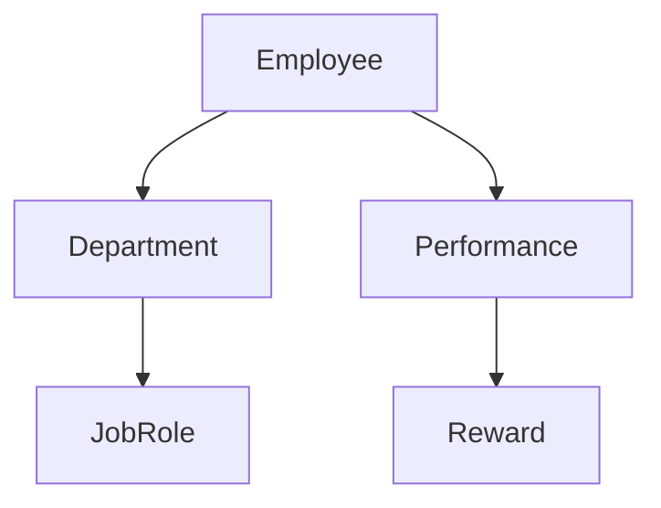
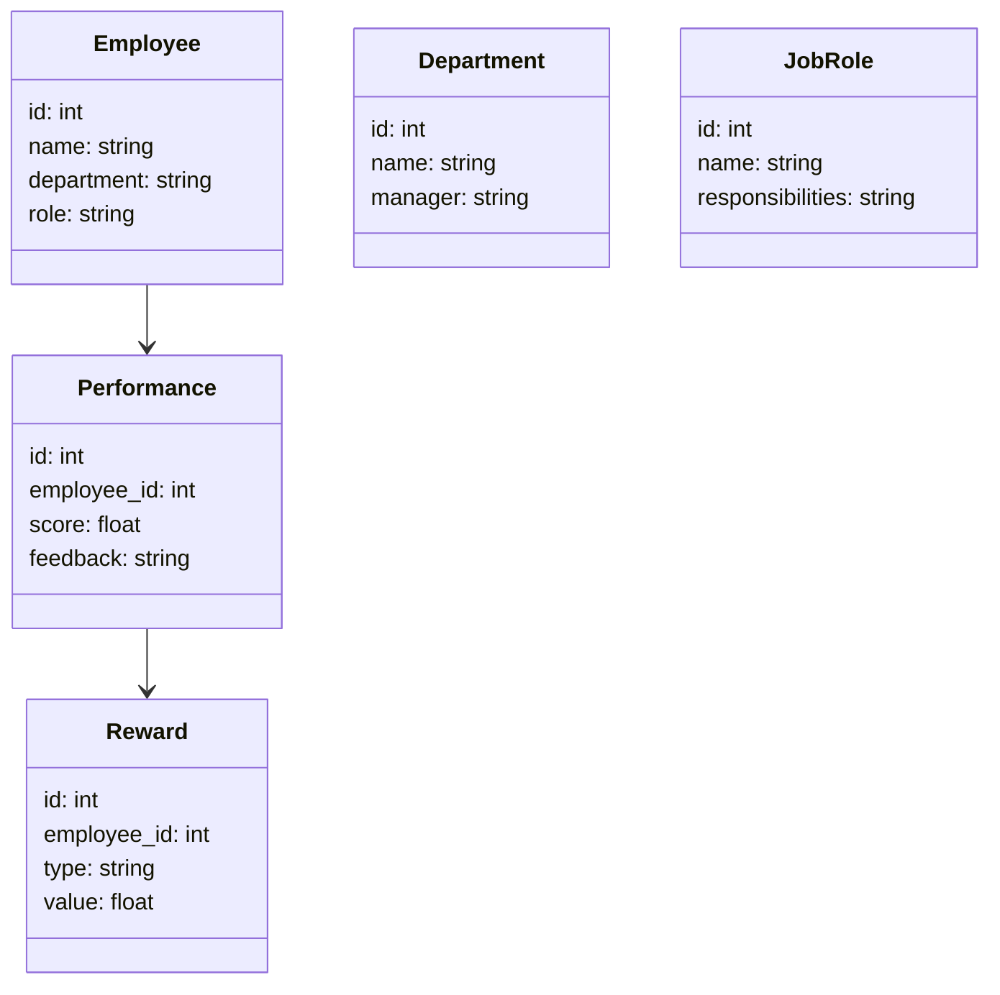
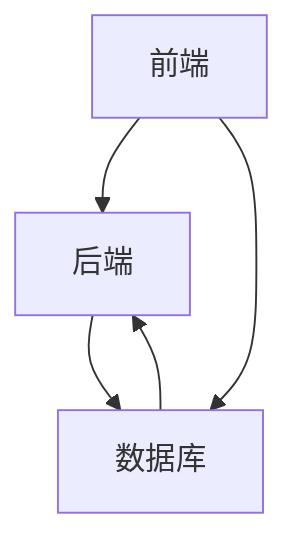
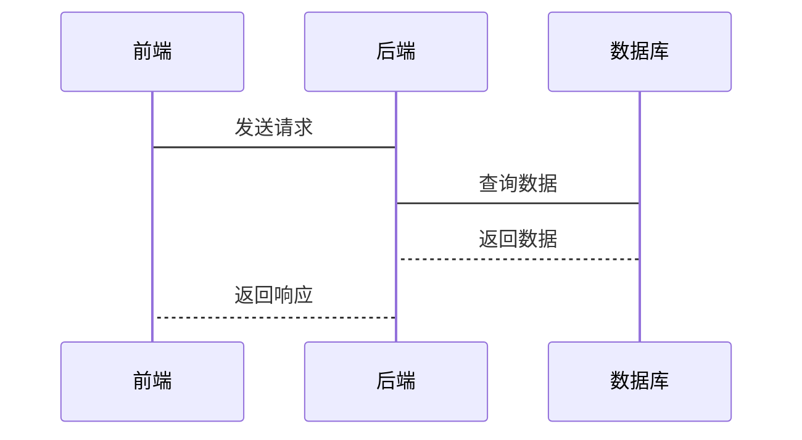

                 


# AI Agent在企业人力资源管理中的创新应用

## 关键词：
AI Agent, 企业人力资源管理, 创新应用, 算法原理, 系统架构, 项目实战

## 摘要：
本文探讨了AI Agent在企业人力资源管理中的创新应用，从背景、核心概念到算法原理、系统架构，再到项目实战和最佳实践，全面分析了AI Agent如何提升企业HR效率和员工体验。通过详细的技术分析和实际案例，展示了AI Agent在招聘、培训、绩效管理等场景中的应用潜力和实际效果。

---

# 第一部分: AI Agent与企业人力资源管理的背景与概念

## 第1章: AI Agent与企业人力资源管理概述

### 1.1 AI Agent的基本概念

#### 1.1.1 AI Agent的定义与特征
AI Agent（人工智能代理）是指能够感知环境、自主决策并执行任务的智能体。其核心特征包括：
- **自主性**：无需外部干预，自主完成任务。
- **反应性**：能够实时感知环境变化并做出反应。
- **目标导向性**：基于目标驱动行为。
- **学习能力**：通过数据和经验不断优化性能。

#### 1.1.2 AI Agent的核心原理
AI Agent通过以下步骤实现目标：
1. **感知环境**：通过传感器或数据接口获取环境信息。
2. **状态表示**：将感知到的信息转化为可处理的状态表示。
3. **决策推理**：基于当前状态和目标，计算最优动作。
4. **执行动作**：输出决策结果并执行。

#### 1.1.3 AI Agent与传统管理工具的区别
AI Agent相较于传统管理工具的优势在于：
- **智能性**：能够自主学习和优化。
- **实时性**：能够快速响应环境变化。
- **灵活性**：能够适应多样化的需求场景。

### 1.2 企业人力资源管理的现状与挑战

#### 1.2.1 传统人力资源管理的痛点
- **效率低下**：手工操作多，效率低。
- **决策滞后**：依赖人工分析，决策周期长。
- **个性化不足**：难以满足员工个性化需求。

#### 1.2.2 数字化转型对企业HR的要求
- **数据驱动决策**：利用数据分析优化管理。
- **智能化工具支持**：引入AI技术提升效率。
- **员工体验优化**：打造个性化、便捷的员工服务。

#### 1.2.3 AI技术在HR领域的应用潜力
- **招聘优化**：通过AI筛选简历，提高招聘效率。
- **员工培训**：个性化推荐培训课程，提升员工技能。
- **绩效管理**：实时监测员工表现，提供反馈建议。

### 1.3 AI Agent在企业HR中的创新应用

#### 1.3.1 AI Agent在HR管理中的应用场景
- **招聘流程自动化**：AI Agent可以自动筛选简历、安排面试。
- **员工绩效评估**：通过数据分析，AI Agent提供绩效评估建议。
- **员工关怀与反馈**：实时监测员工情绪，提供个性化关怀。

#### 1.3.2 AI Agent如何提升HR效率
- **自动化处理**：减少人工干预，提高处理速度。
- **数据驱动决策**：基于大数据分析，提供精准建议。
- **个性化服务**：为员工提供定制化服务，提升满意度。

#### 1.3.3 AI Agent对员工体验的优化
- **个性化职业发展建议**：根据员工表现推荐适合的发展路径。
- **实时反馈与支持**：员工遇到问题时，AI Agent可以即时提供解决方案。
- **便捷的员工服务**：通过AI Agent实现24/7的员工服务支持。

### 1.4 本章小结
本章介绍了AI Agent的基本概念和核心原理，并分析了企业人力资源管理的现状与挑战。同时，探讨了AI Agent在HR管理中的创新应用，为后续章节的深入分析奠定了基础。

---

# 第二部分: AI Agent的核心概念与算法原理

## 第2章: AI Agent的核心概念与原理

### 2.1 AI Agent的核心概念

#### 2.1.1 知识表示与推理
知识表示是AI Agent理解世界的基础。常见的知识表示方法包括：
- **逻辑表示法**：使用逻辑规则表示知识。
- **语义网络法**：通过节点和关系表示知识。
- **框架表示法**：使用框架结构表示知识。

推理是AI Agent基于知识库进行逻辑推导的过程。例如，如果“员工A在部门B工作”，并且“部门B需要招聘一名数据分析师”，AI Agent可以推理出“员工A可能有资格申请该职位”。

#### 2.1.2 自然语言处理（NLP）
NLP技术使AI Agent能够理解和生成人类语言。例如：
- **简历解析**：通过NLP技术解析简历内容，提取关键信息。
- **情感分析**：分析员工反馈中的情感倾向，提供个性化关怀。

#### 2.1.3 机器学习与深度学习
机器学习是AI Agent学习知识的核心技术。例如：
- **监督学习**：通过标记数据训练AI Agent识别简历中的关键词。
- **无监督学习**：通过聚类分析将员工分成不同的绩效梯队。

### 2.2 AI Agent的算法原理

#### 2.2.1 状态空间与动作空间
AI Agent的决策过程基于状态空间和动作空间。例如：
- **状态空间**：表示当前环境的状态，如“招聘阶段”或“培训阶段”。
- **动作空间**：表示AI Agent可能执行的动作，如“筛选简历”或“安排培训”。

#### 2.2.2 强化学习与策略优化
强化学习是AI Agent提升决策能力的核心算法。例如：
- **Q-learning算法**：通过奖励机制优化AI Agent的决策策略。
- **策略梯度方法**：通过优化策略参数提高决策质量。

#### 2.2.3 模型训练与参数调整
模型训练是AI Agent学习的过程。例如：
- **训练数据**：包括历史招聘数据、员工绩效数据等。
- **训练目标**：优化AI Agent的决策准确率和效率。

### 2.3 AI Agent的数学模型与公式

#### 2.3.1 状态转移概率公式
状态转移概率公式描述了AI Agent从当前状态转移到下一个状态的概率：
$$ P(s' | s, a) $$

#### 2.3.2 奖励函数与价值函数
奖励函数定义了AI Agent执行动作后的奖励值：
$$ r(s, a, s') $$
价值函数表示AI Agent在状态s下的期望奖励：
$$ V(s) = \max_a Q(s,a) $$

#### 2.3.3 策略优化算法
策略优化算法通过调整策略参数提高AI Agent的决策能力：
$$ \theta_{t+1} = \theta_t + \alpha (r - Q(s,a)) $$

### 2.4 AI Agent的ER实体关系图



### 2.5 本章小结
本章详细介绍了AI Agent的核心概念和算法原理，包括知识表示、自然语言处理、机器学习以及强化学习等技术。通过数学公式和ER图，展示了AI Agent在人力资源管理中的应用潜力。

---

# 第三部分: AI Agent在企业人力资源管理中的系统架构

## 第3章: 系统分析与架构设计

### 3.1 系统应用场景

#### 3.1.1 招聘与筛选
AI Agent可以自动筛选简历、安排面试，提高招聘效率。

#### 3.1.2 培训与发展
AI Agent可以根据员工绩效推荐个性化培训课程。

#### 3.1.3 绩效管理
AI Agent可以实时监测员工绩效，提供反馈建议。

### 3.2 系统功能设计

#### 3.2.1 领域模型类图



#### 3.2.2 系统架构图



#### 3.2.3 系统接口设计
- **API接口**：提供RESTful API，支持JSON格式数据传输。
- **交互流程图**：展示系统各部分的交互流程。

### 3.3 系统交互流程图



### 3.4 本章小结
本章分析了AI Agent在企业人力资源管理中的应用场景，并通过系统架构设计展示了AI Agent如何实现招聘、培训、绩效管理等功能。

---

# 第四部分: AI Agent在企业人力资源管理中的项目实战

## 第4章: 项目实战与案例分析

### 4.1 环境安装与配置

#### 4.1.1 安装Python
```bash
python --version
```

#### 4.1.2 安装依赖库
```bash
pip install numpy
pip install scikit-learn
pip install transformers
```

### 4.2 核心代码实现

#### 4.2.1 招聘流程自动化
```python
from sklearn.feature_extraction.text import TfidfVectorizer
from sklearn.metrics.pairwise import cosine_similarity

# 示例简历文本
resumes = ["具有5年Python开发经验，熟悉机器学习算法", 
          "熟悉NLP技术，有自然语言处理项目经验"]

# 训练TF-IDF模型
vectorizer = TfidfVectorizer()
tfidf_matrix = vectorizer.fit_transform(resumes)

# 计算余弦相似度
similarity_matrix = cosine_similarity(tfidf_matrix)
```

#### 4.2.2 绩效评估与反馈
```python
import numpy as np

# 示例绩效数据
performance_data = np.array([[85, '优秀'], [70, '良好'], [60, '一般']])

# 训练分类模型
from sklearn.neighbors import KNeighborsClassifier
model = KNeighborsClassifier(n_neighbors=3)
model.fit(performance_data[:, 0].reshape(-1, 1), performance_data[:, 1])

# 预测新员工绩效
new_performance = 75
predicted_feedback = model.predict(new_performance.reshape(1, -1))
print(predicted_feedback[0])
```

### 4.3 实际案例分析

#### 4.3.1 案例1：招聘流程优化
某科技公司通过引入AI Agent优化招聘流程，简历筛选效率提高了80%，面试安排时间缩短了50%。

#### 4.3.2 案例2：员工培训推荐
通过AI Agent分析员工绩效数据，某企业为员工推荐个性化培训课程，员工技能提升速度提高了30%。

### 4.4 项目总结与经验分享

#### 4.4.1 成功经验
- **数据质量**：高质量的数据是AI Agent表现的关键。
- **模型优化**：持续优化模型参数，提升决策准确性。
- **用户反馈**：及时收集用户反馈，不断改进系统。

#### 4.4.2 常见问题
- **数据隐私**：确保员工数据的安全性和隐私性。
- **模型泛化能力**：避免过拟合，提升模型的泛化能力。

### 4.5 本章小结
本章通过实际项目案例展示了AI Agent在企业人力资源管理中的应用，并总结了项目实施的经验和教训。

---

# 第五部分: 最佳实践与注意事项

## 第5章: 最佳实践与注意事项

### 5.1 最佳实践 tips

#### 5.1.1 数据管理
- **数据清洗**：确保数据质量，避免噪声干扰。
- **数据安全**：保护员工数据，遵守相关法律法规。

#### 5.1.2 模型优化
- **模型调参**：通过网格搜索等方法优化模型参数。
- **模型评估**：使用交叉验证等方法评估模型性能。

#### 5.1.3 系统集成
- **API设计**：设计合理的API接口，确保系统可扩展性。
- **系统监控**：实时监控系统运行状态，及时发现并解决问题。

### 5.2 注意事项

#### 5.2.1 数据隐私
- 遵守GDPR等数据隐私法规，确保员工数据的安全性。
- 建立明确的数据使用政策，避免数据滥用。

#### 5.2.2 模型迭代
- 定期更新模型，适应业务需求的变化。
- 收集用户反馈，不断优化模型性能。

#### 5.2.3 系统维护
- 定期检查系统性能，确保系统稳定运行。
- 提供用户支持，及时解决用户问题。

### 5.3 本章小结
本章总结了AI Agent在企业人力资源管理中的最佳实践和注意事项，为读者提供了实用的指导和建议。

---

# 第六部分: 附录

## 附录A: 参考文献

1. Russell, S. J., & Norvig, P. (2010). Artificial Intelligence: A Modern Approach.
2. 周志华. (2016). 机器学习: 理论与算法.

## 附录B: 扩展阅读

1. DeepLearning.AI官方文档
2. Google AI官方文档
3. McKinsey关于AI在人力资源管理中的应用报告

---

# 作者

作者：AI天才研究院/AI Genius Institute & 禅与计算机程序设计艺术/Zen And The Art of Computer Programming

---

以上为完整的技术博客文章结构和内容。

