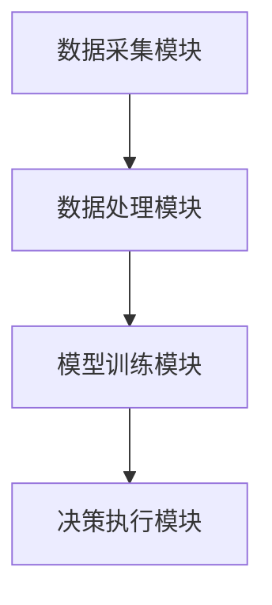
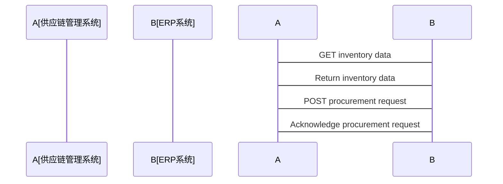

                 


# AI Agent在企业供应链管理中的应用

> 关键词：AI Agent，供应链管理，人工智能，企业应用，物流优化

> 摘要：随着人工智能技术的快速发展，AI Agent（人工智能代理）在企业供应链管理中的应用日益广泛。本文将深入探讨AI Agent在供应链管理中的核心原理、应用场景、系统设计与实现，以及实际项目中的应用案例。通过分析AI Agent如何优化供应链的各个环节，本文旨在为企业提供一种高效、智能的供应链管理解决方案，从而提升企业的竞争力和运营效率。

---

# 第一部分: AI Agent与企业供应链管理概述

## 第1章: AI Agent与供应链管理的结合

### 1.1 AI Agent的基本概念

#### 1.1.1 AI Agent的定义与特点
AI Agent（人工智能代理）是指具有智能决策能力和自主执行任务的计算机系统。它能够通过感知环境、分析问题、制定策略并执行操作来实现特定目标。AI Agent的特点包括：

1. **自主性**：能够自主决策，无需人工干预。
2. **反应性**：能够实时感知环境变化并做出反应。
3. **学习性**：通过数据和经验不断优化自身行为。
4. **协作性**：能够与其他系统或人类进行协作。

#### 1.1.2 AI Agent的核心原理
AI Agent的核心原理包括知识表示、推理、计划与调度、以及自适应学习。知识表示是将问题领域的知识转化为计算机可理解的形式，如知识图谱。推理是基于知识库进行逻辑推理，以得出结论。计划与调度是根据推理结果制定行动方案，自适应学习则是通过机器学习算法不断优化自身行为。

#### 1.1.3 AI Agent与传统供应链管理的区别
传统供应链管理依赖于人工决策和固定规则，而AI Agent能够通过实时数据和机器学习模型动态优化决策。AI Agent能够处理复杂场景下的不确定性，而传统供应链管理在面对突发事件时往往显得被动。

---

### 1.2 供应链管理的现状与挑战

#### 1.2.1 传统供应链管理的痛点
传统供应链管理存在以下痛点：
1. **信息孤岛**：各部门之间数据不共享，导致决策延迟。
2. **效率低下**：人工操作繁琐，容易出错。
3. **缺乏预见性**：无法有效预测市场波动和供应链风险。

#### 1.2.2 数字化与智能化转型的需求
随着市场竞争加剧和客户需求多样化，企业对供应链管理的数字化和智能化需求日益迫切。通过引入AI Agent，企业可以实现供应链的实时监控、智能预测和动态优化。

#### 1.2.3 AI Agent在供应链管理中的潜力
AI Agent在供应链管理中的潜力体现在以下几个方面：
1. **提高决策效率**：通过实时数据分析快速制定决策。
2. **降低运营成本**：通过优化库存管理和物流路径减少浪费。
3. **增强供应链弹性**：通过智能预测和风险预警应对突发事件。

---

### 1.3 AI Agent在供应链管理中的应用价值

#### 1.3.1 提高供应链效率
AI Agent可以通过智能调度和优化算法，显著提高供应链的运营效率。例如，在物流管理中，AI Agent可以实时优化运输路径，减少运输时间和成本。

#### 1.3.2 优化决策过程
通过分析历史数据和市场趋势，AI Agent能够帮助企业在采购、生产和库存管理中做出更科学的决策。

#### 1.3.3 提升供应链的弹性与韧性
AI Agent可以通过实时监控和预测，帮助企业快速响应市场变化和供应链中断，从而增强供应链的弹性。

---

## 第2章: AI Agent的核心原理与技术基础

### 2.1 AI Agent的核心原理

#### 2.1.1 知识表示与推理
知识表示是AI Agent的核心技术之一，常用的表示方法包括：
- **规则表示**：通过逻辑规则定义知识，例如“如果库存低于阈值，则触发补货”。
- **语义网络**：通过节点和边表示概念及其关系。
- **知识图谱**：通过结构化数据表示实体及其属性和关系。

推理是基于知识表示进行逻辑推理的过程，常用的推理方法包括：
- **演绎推理**：从一般到特殊的推理。
- **归纳推理**：从特殊到一般的推理。
- ** abduction推理**：基于现有证据进行最可能的假设推理。

#### 2.1.2 计划与调度
计划与调度是AI Agent的重要功能，涉及资源分配和时间安排。常用的调度算法包括：
- **贪心算法**：基于局部最优选择全局最优。
- **动态规划**：通过分解问题规模逐步求解。
- **强化学习**：通过试错优化调度策略。

#### 2.1.3 学习与自适应
AI Agent的学习能力使其能够通过数据和经验不断优化自身行为。常用的机器学习算法包括：
- **监督学习**：基于标注数据进行模型训练。
- **无监督学习**：基于非标注数据发现数据规律。
- **强化学习**：通过试错优化决策策略。

---

### 2.2 AI Agent的关键技术

#### 2.2.1 自然语言处理（NLP）
NLP技术用于处理供应链中的非结构化数据，例如客户反馈和市场报告。通过NLP，AI Agent可以提取关键信息并生成结构化数据。

#### 2.2.2 机器学习（ML）
机器学习是AI Agent的核心技术之一，用于预测和优化。常用的机器学习算法包括线性回归、支持向量机（SVM）、随机森林和神经网络。

#### 2.2.3 知识图谱构建
知识图谱用于表示供应链中的实体及其关系，例如供应商、产品和客户需求。知识图谱的构建需要通过数据抽取、清洗和关联挖掘。

---

### 2.3 AI Agent的算法原理

#### 2.3.1 基于规则的推理算法
基于规则的推理算法通过预定义的逻辑规则进行推理。例如，在库存管理中，规则可以定义为“如果库存低于最低水平，则触发补货”。

#### 2.3.2 基于机器学习的预测算法
基于机器学习的预测算法通过历史数据训练模型，预测未来的需求和供应情况。例如，使用ARIMA模型预测销售量。

#### 2.3.3 基于强化学习的决策算法
基于强化学习的决策算法通过试错优化决策策略。例如，在物流调度中，AI Agent可以通过强化学习优化运输路径。

---

### 2.4 本章小结

---

## 第3章: 供应链管理的核心概念与流程

### 3.1 供应链管理的定义与范围

#### 3.1.1 供应链管理的定义
供应链管理是指对供应链中的物资、信息和资金进行计划、组织、协调和控制的过程。供应链管理的目标是提高效率、降低成本和增强竞争力。

#### 3.1.2 供应链管理的范围与边界
供应链管理的范围包括从原材料采购到产品交付的全过程，涉及供应商、制造商、分销商和客户。

#### 3.1.3 供应链管理的核心要素
供应链管理的核心要素包括：
1. **供应商管理**：选择和评估供应商，确保原材料供应稳定。
2. **生产管理**：优化生产计划和资源分配。
3. **库存管理**：控制库存水平，避免积压和缺货。
4. **物流管理**：优化运输路径和配送时间。
5. **客户管理**：满足客户需求，提升客户满意度。

---

### 3.2 供应链管理的主要流程

#### 3.2.1 采购与供应商管理
采购与供应商管理是供应链管理的重要环节，涉及供应商选择、采购计划和库存管理。

#### 3.2.2 生产与库存管理
生产与库存管理涉及生产计划的制定和库存的监控与优化。

#### 3.2.3 分配与物流管理
分配与物流管理涉及产品的运输和配送，确保产品按时到达客户手中。

---

### 3.3 供应链管理的优化目标

#### 3.3.1 成本最小化
通过优化采购、生产和物流成本，实现成本最小化。

#### 3.3.2 时间最短化
通过优化生产计划和物流路径，实现交货时间最短化。

#### 3.3.3 资源最大化利用
通过合理分配资源，提高资源利用率。

---

### 3.4 本章小结

---

## 第4章: AI Agent在供应链管理中的核心应用

### 4.1 采购与供应商管理中的AI Agent应用

#### 4.1.1 自动化采购需求预测
通过机器学习模型预测采购需求，避免库存积压和缺货。

#### 4.1.2 智能供应商选择与评估
通过分析供应商的历史表现和市场数据，优化供应商选择和评估。

#### 4.1.3 供应链风险预警
通过实时监控供应链中的风险因素，提前预警并制定应对策略。

---

### 4.2 生产与库存管理中的AI Agent应用

#### 4.2.1 生产计划优化
通过强化学习优化生产计划，提高生产效率。

#### 4.2.2 库存监控与预测
通过时间序列分析预测库存需求，优化库存管理。

---

### 4.3 分配与物流管理中的AI Agent应用

#### 4.3.1 智能物流调度
通过AI Agent实时优化运输路径，减少物流成本。

#### 4.3.2 自动化配送管理
通过AI Agent实现无人配送，提升配送效率。

---

## 4.4 本章小结

---

## 第5章: 系统架构与设计方案

### 5.1 系统架构设计

#### 5.1.1 系统功能模块
AI Agent驱动的供应链管理系统主要包括：
1. **数据采集模块**：采集供应链中的实时数据。
2. **数据处理模块**：对数据进行清洗和转换。
3. **模型训练模块**：训练机器学习模型。
4. **决策执行模块**：根据模型预测结果制定决策并执行。

#### 5.1.2 系统架构图


---

### 5.2 系统接口设计

#### 5.2.1 API接口设计
供应链管理系统需要与企业内部系统（如ERP、CRM）进行数据交互，常用的API接口包括：
1. **GET /inventory**: 获取库存数据。
2. **POST /procurement**: 提交采购需求。

#### 5.2.2 接口交互流程图


---

### 5.3 本章小结

---

## 第6章: 项目实战与最佳实践

### 6.1 项目实战

#### 6.1.1 环境安装
安装所需的开发工具和依赖库，例如Python、TensorFlow和Flask。

#### 6.1.2 系统核心实现源代码
以下是一个简单的AI Agent采购需求预测的Python代码示例：
```python
import pandas as pd
from sklearn.linear_model import LinearRegression

# 读取数据
data = pd.read_csv('procurement.csv')

# 训练模型
model = LinearRegression()
model.fit(data[['demand', 'lead_time']], data['quantity'])

# 预测采购需求
predicted_quantity = model.predict([[100, 5]])
print(predicted_quantity)
```

---

### 6.2 最佳实践

#### 6.2.1 数据质量管理
确保数据的准确性和完整性，避免因数据问题导致模型预测错误。

#### 6.2.2 模型优化
通过交叉验证和超参数调优，优化模型性能。

#### 6.2.3 系统监控
实时监控系统运行状态，及时发现和解决故障。

---

### 6.3 小结

---

## 第7章: 总结与展望

### 7.1 总结
本文详细探讨了AI Agent在企业供应链管理中的应用，包括AI Agent的核心原理、供应链管理的核心概念、AI Agent在供应链管理中的应用场景，以及系统设计与实现。

### 7.2 展望
未来，随着人工智能技术的不断发展，AI Agent在供应链管理中的应用将更加广泛和深入。例如，通过区块链技术实现供应链的透明化管理，通过边缘计算实现供应链的实时优化。

---

## 作者信息

作者：AI天才研究院/AI Genius Institute & 禅与计算机程序设计艺术 /Zen And The Art of Computer Programming

---

**感谢您的阅读！**

