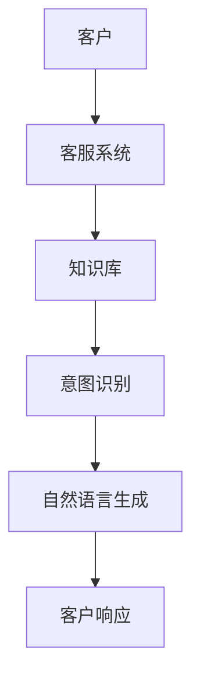
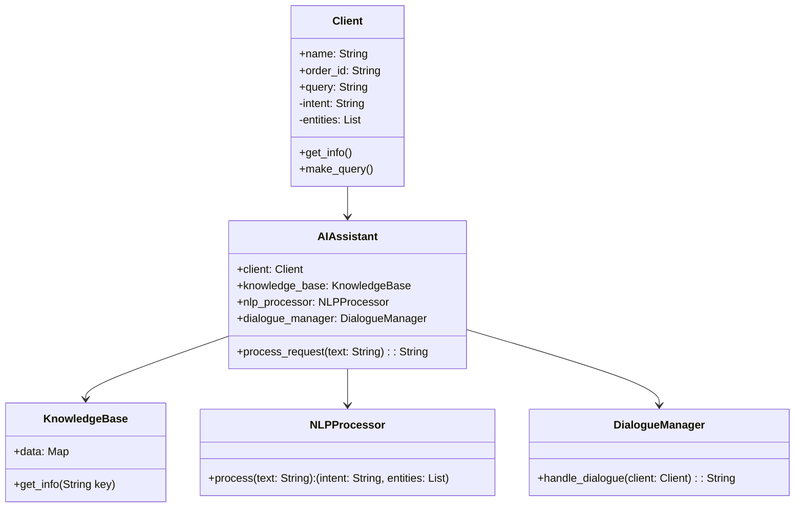
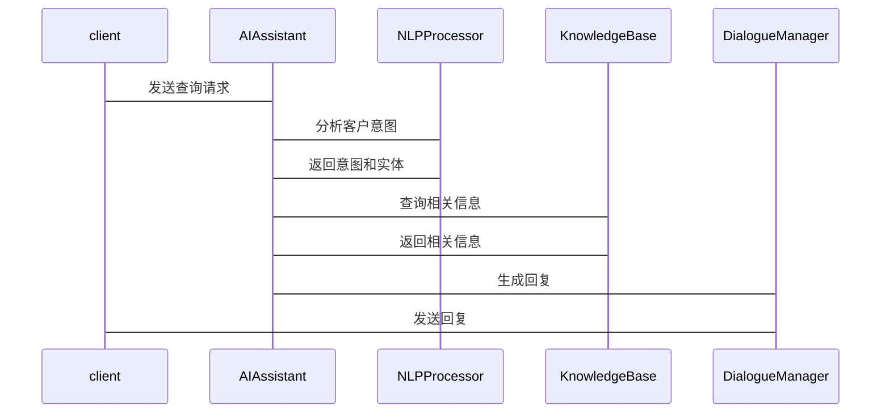

                 


# AI Agent在企业客户服务中的应用：提升效率与满意度

> 关键词：AI Agent，企业客户服务，自然语言处理，机器学习，知识图谱，对话管理，客户服务效率，客户满意度

> 摘要：本文深入探讨了AI Agent在企业客户服务中的应用，分析了其核心原理和技术基础，详细讲解了系统架构与实现，并通过实际案例展示了AI Agent如何提升客户服务的效率与满意度。文章从背景介绍、核心原理、系统设计到项目实战，全面解析了AI Agent在企业客户服务中的价值与应用。

---

# 第一部分: AI Agent在企业客户服务中的背景与基础

## 第1章: AI Agent与企业客户服务概述

### 1.1 AI Agent的基本概念

#### 1.1.1 什么是AI Agent
AI Agent（人工智能代理）是一种能够感知环境并采取行动以实现目标的智能系统。在企业客户服务中，AI Agent通常以虚拟客服助手的形式出现，能够通过自然语言处理技术与客户进行交互，解决客户的问题并提供服务。

#### 1.1.2 AI Agent的核心特征
- **智能化**：能够理解客户的问题并生成自然语言回复。
- **自主性**：能够在没有人工干预的情况下独立完成任务。
- **适应性**：能够根据对话的上下文动态调整响应策略。
- **学习能力**：通过机器学习技术不断优化自身的性能。

#### 1.1.3 AI Agent与传统客服的区别
- **效率**：AI Agent能够快速响应客户的问题，减少客户等待时间。
- **准确性**：基于机器学习和知识库，AI Agent能够提供更准确的信息。
- **可扩展性**：AI Agent可以同时处理大量客户请求，而传统客服受限于人力。

### 1.2 企业客户服务中的问题与挑战

#### 1.2.1 客户服务的主要问题
- **响应时间长**：客户在联系客服时通常需要等待较长时间。
- **服务质量不稳定**：人工客服可能存在情绪波动或知识不足的问题。
- **成本高**：传统客户服务依赖大量人力，导致成本较高。

#### 1.2.2 传统客服的局限性
- **效率低下**：人工客服无法同时处理多个请求。
- **知识有限**：客服人员的知识储备可能不足以回答所有问题。
- **缺乏个性化**：难以根据客户的具体情况提供个性化的服务。

#### 1.2.3 提升效率与满意度的重要性
- **客户满意度**：高效的响应和准确的信息能够提升客户的满意度。
- **成本控制**：通过自动化处理减少人力成本。
- **竞争优势**：提供更优质的服务能够增强企业的竞争力。

### 1.3 AI Agent在企业客户服务中的应用前景

#### 1.3.1 AI Agent的应用场景
- **智能客服**：通过AI Agent为客户提供自动化的咨询和问题解决。
- **客户支持系统**：集成AI Agent到现有的客户支持系统中，提升效率。
- **24/7服务**：AI Agent可以提供全天候的服务，满足客户的随时需求。

#### 1.3.2 AI Agent的优势与价值
- **提升效率**：AI Agent能够快速响应客户，减少等待时间。
- **降低成本**：自动化处理降低了人力成本。
- **提高准确性**：基于知识库和机器学习，AI Agent能够提供准确的信息。

#### 1.3.3 企业采用AI Agent的挑战与机遇
- **挑战**：技术实现复杂，需要投入大量的资源；数据隐私和安全问题。
- **机遇**：提升客户满意度，增强品牌竞争力，降低运营成本。

## 第2章: AI Agent的核心原理与技术基础

### 2.1 自然语言处理（NLP）

#### 2.1.1 NLP的基本概念
自然语言处理（NLP）是研究如何让计算机理解和生成人类语言的学科。在AI Agent中，NLP主要用于理解客户的问题并生成自然语言的回复。

#### 2.1.2 常见的NLP技术
- **分词**：将文本分割成词语或短语。
- **词性标注**：确定每个词语的词性（名词、动词、形容词等）。
- **句法分析**：分析句子的语法结构。
- **情感分析**：识别文本中的情感倾向。
- **意图识别**：识别客户的主要意图。

#### 2.1.3 NLP在AI Agent中的应用
- **意图识别**：通过分析客户的文本，识别客户的主要意图，例如“查询订单状态”或“投诉产品问题”。
- **实体识别**：从客户的文本中提取关键信息，例如订单号、产品名称等。

### 2.2 机器学习与深度学习

#### 2.2.1 机器学习的基本原理
机器学习是一种通过数据训练模型，使其能够从数据中学习并做出预测或决策的技术。在AI Agent中，机器学习主要用于训练模型，使其能够准确地理解和生成文本。

#### 2.2.2 深度学习的核心技术
深度学习是一种基于人工神经网络的机器学习技术，能够处理复杂的非线性数据。在AI Agent中，深度学习常用于自然语言处理任务，如文本生成和情感分析。

#### 2.2.3 机器学习在AI Agent中的应用
- **文本生成**：使用生成模型（如GPT）生成自然语言的回复。
- **情感分析**：通过训练模型识别客户文本中的情感倾向。
- **对话管理**：通过强化学习优化对话策略。

### 2.3 知识图谱与对话管理

#### 2.3.1 知识图谱的构建与应用
知识图谱是一种结构化的知识表示方式，能够将实体及其关系表示为图结构。在AI Agent中，知识图谱用于存储和管理企业的知识库，如产品信息、常见问题解答等。

#### 2.3.2 对话管理的原理与方法
对话管理是AI Agent的核心技术之一，负责根据对话的上下文和客户的意图生成合适的回复。对话管理通常包括以下步骤：
1. 理解客户的问题。
2. 确定客户的意图。
3. 查找相关知识库中的信息。
4. 生成自然语言的回复。

#### 2.3.3 知识图谱与对话管理的结合
通过结合知识图谱和对话管理，AI Agent能够根据客户的意图快速找到相关信息，并生成自然语言的回复。例如，当客户询问“如何取消订单？”时，AI Agent可以通过知识图谱找到相关的信息，并生成回复：“您可以登录我们的网站，进入订单管理页面，点击取消订单按钮进行操作。”

---

## 第3章: AI Agent的核心概念与联系

### 3.1 核心概念原理

#### 3.1.1 自然语言理解（NLU）
自然语言理解（NLU）是NLP的一个分支，专注于理解人类语言的含义。在AI Agent中，NLU用于将客户的文本转换为计算机可以理解的结构化信息。

#### 3.1.2 自然语言生成（NLG）
自然语言生成（NLG）是NLP的另一个分支，专注于生成自然语言文本。在AI Agent中，NLG用于根据结构化信息生成自然语言的回复。

#### 3.1.3 对话状态跟踪（DST）
对话状态跟踪（DST）是对话管理中的一个重要环节，负责跟踪对话的当前状态，包括客户意图、已提供的信息等。DST通过维护一个状态表示，帮助AI Agent理解对话的上下文。

### 3.2 核心概念属性特征对比表格

| 概念       | 输入         | 输出         |
|------------|--------------|--------------|
| NLU        | 客户文本      | 客户意图      |
| DST        | 对话历史      | 对话状态      |
| NLG        | 结构化信息    | 自然语言文本  |

### 3.3 ER实体关系图架构（Mermaid流程图）



---

## 第4章: AI Agent在企业客户服务中的系统架构与实现

### 4.1 系统功能设计

#### 4.1.1 领域模型（Mermaid类图）



### 4.2 系统架构设计

#### 4.2.1 系统架构图（Mermaid架构图）


#### 4.2.2 系统接口设计
- **客户接口**：客户通过文本输入与AI Agent交互。
- **知识库接口**：AI Agent通过知识库接口查询相关信息。
- **NLP接口**：AI Agent通过NLP接口进行意图识别和实体提取。
- **对话管理接口**：AI Agent通过对话管理接口生成回复。

#### 4.2.3 系统交互流程图（Mermaid序列图）



---

## 第5章: AI Agent在企业客户服务中的项目实战

### 5.1 环境安装与配置

#### 5.1.1 安装Python和必要的库
```bash
pip install python
pip install numpy
pip install scikit-learn
pip install transformers
pip install spacy
```

#### 5.1.2 安装和配置NLP工具
```bash
pip install spaCy
python -m spacy download en_core_web_sm
pip install pytorch-lightning
pip install sentence-transformers
```

### 5.2 系统核心实现源代码

#### 5.2.1 NLP处理代码
```python
import spacy

nlp = spacy.load("en_core_web_sm")

def process_text(text):
    doc = nlp(text)
    intent = "unknown"
    entities = []
    for token in doc:
        if token.pos_ in ["NOUN", "PROPN"]:
            entities.append(token.text)
        if token.text.lower() in ["help", "support"]:
            intent = "support_request"
    return intent, entities
```

#### 5.2.2 对话管理代码
```python
from transformers import AutoTokenizer, AutoModelForSeq2Seq

tokenizer = AutoTokenizer.from_pretrained("facebook/bart-large")
model = AutoModelForSeq2Seq.from_pretrained("facebook/bart-large")

def generate_response(input_text):
    inputs = tokenizer.encode(input_text, return_tensors="pt")
    outputs = model.generate(inputs, max_length=100)
    response = tokenizer.decode(outputs[0], skip_special_tokens=True)
    return response
```

### 5.3 代码应用解读与分析

#### 5.3.1 NLP处理代码解读
- 使用spaCy进行文本分词和实体识别。
- 根据文本中的关键词（如“help”）确定意图。
- 返回客户的意图和提取的实体。

#### 5.3.2 对话管理代码解读
- 使用预训练的Bart模型生成自然语言回复。
- 输入文本经过编码后，通过模型生成回复文本。
- 返回生成的回复。

### 5.4 实际案例分析

#### 5.4.1 案例1：客户查询订单状态
- **输入**：客户输入“我的订单号是12345，现在状态如何？”
- **处理**：NLP模块识别意图是“查询订单状态”，提取实体“订单号12345”。
- **响应**：AI Agent查询知识库，返回“您的订单已经发货，预计明天送达。”

#### 5.4.2 案例2：客户投诉产品问题
- **输入**：客户输入“我收到的产品有破损，怎么办？”
- **处理**：NLP模块识别意图是“投诉产品问题”，提取实体“破损”。
- **响应**：AI Agent查询知识库，返回“我们非常抱歉，您可以联系我们的客服进行退货或更换。”

### 5.5 项目小结

通过以上代码实现，我们可以看到AI Agent在企业客户服务中的强大能力。通过NLP技术和机器学习模型，AI Agent能够准确理解客户的问题并生成自然语言的回复，大大提升了客户服务的效率和满意度。

---

## 第6章: 最佳实践与未来展望

### 6.1 最佳实践

#### 6.1.1 数据质量
- 确保知识库的数据准确性和完整性。
- 定期更新知识库，以适应业务的变化。

#### 6.1.2 对话管理
- 设计合理的对话流程，确保对话的流畅性。
- 提供多种对话策略，以应对不同的客户需求。

#### 6.1.3 用户反馈
- 收集客户的反馈，不断优化AI Agent的性能。
- 根据客户反馈调整知识库和对话策略。

### 6.2 小结

AI Agent通过自然语言处理和机器学习技术，能够有效地提升企业客户服务的效率和满意度。通过自动化处理客户请求，AI Agent不仅节省了企业的人力成本，还能够提供更优质的服务。

### 6.3 注意事项

- **数据隐私**：在处理客户数据时，需要注意数据的隐私和安全。
- **系统稳定性**：确保AI Agent系统的稳定性，避免因系统故障影响客户服务。
- **用户教育**：向客户普及AI Agent的功能和使用方法，减少客户的误解。

### 6.4 拓展阅读

- **书籍**：《自然语言处理实战：基于Python的机器学习和深度学习》
- **论文**：《A Survey on Dialogue Systems: From Rule-based to End-to-end》
- **在线资源**：Hugging Face的Transformers库文档和教程

---

## 第7章: 总结

通过本文的详细讲解，我们了解了AI Agent在企业客户服务中的应用价值和技术实现。从核心原理到系统架构，再到项目实战，我们全面解析了AI Agent如何提升客户服务的效率与满意度。未来，随着自然语言处理和机器学习技术的不断进步，AI Agent在企业客户服务中的应用将更加广泛和深入。

作者：AI天才研究院/AI Genius Institute & 禅与计算机程序设计艺术 /Zen And The Art of Computer Programming

