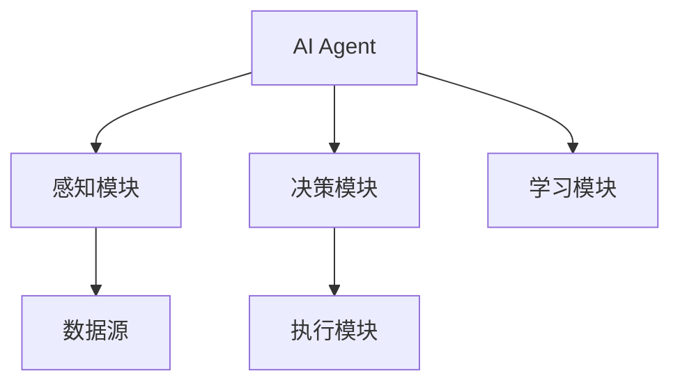
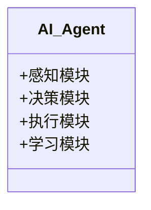
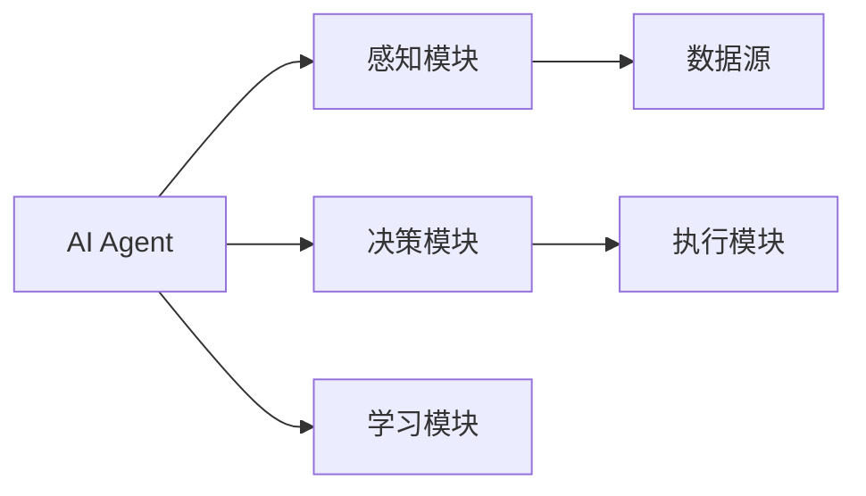
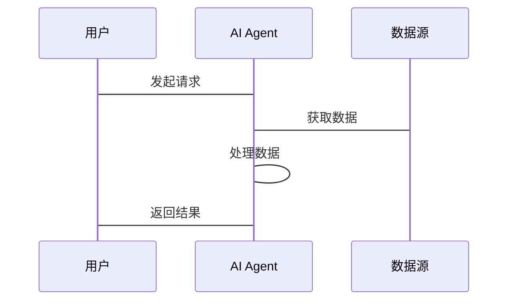

                 


# AI Agent在企业数字化转型中的核心驱动作用

> 关键词：AI Agent, 企业数字化转型, 智能决策支持, 自动化流程优化, 数据驱动创新

> 摘要：  
本文详细探讨了AI Agent在企业数字化转型中的核心作用，从基本概念到算法原理，从系统架构到实际应用，系统地分析了AI Agent如何驱动企业数字化转型。通过丰富的案例分析和详细的代码实现，本文为读者提供了全面的理论和实践指导。

---

## 第1章: AI Agent的基本概念与背景介绍

### 1.1 AI Agent的定义与核心概念

#### 1.1.1 AI Agent的基本定义  
AI Agent（人工智能代理）是指能够感知环境、自主决策并执行任务的智能实体。它是企业数字化转型的核心驱动力，能够通过数据驱动的方式优化企业运营效率。

#### 1.1.2 问题背景与问题描述  
在企业数字化转型过程中，传统的人工操作效率低下、决策滞后、数据孤岛等问题严重制约了企业的竞争力。AI Agent通过自动化和智能化的方式，能够有效解决这些问题。

#### 1.1.3 AI Agent的核心要素与组成  
AI Agent主要由感知模块、决策模块、执行模块和学习模块组成，能够实现从数据采集、分析、决策到执行的全生命周期管理。

#### 1.1.4 AI Agent的边界与外延  
AI Agent的应用范围涵盖企业内外部的各个场景，但其核心边界在于通过数据和模型驱动的智能决策能力。

### 1.2 AI Agent的核心概念与联系

#### 1.2.1 AI Agent的属性特征对比表  
| 属性 | 描述 |
|------|------|
| 感知能力 | 数据采集与分析能力 |
| 决策能力 | 基于数据的智能决策能力 |
| 执行能力 | 自动化执行任务的能力 |
| 学习能力 | 模型优化与迭代能力 |

#### 1.2.2 ER实体关系图（Mermaid流程图）  


---

## 第2章: AI Agent的算法原理与数学模型

### 2.1 AI Agent的核心算法原理

#### 2.1.1 感知算法原理  
感知算法主要通过数据采集和特征提取来实现环境的感知。常用的算法包括监督学习、无监督学习和强化学习。

#### 2.1.2 决策算法原理  
决策算法基于感知到的数据，通过构建决策树、随机森林等模型进行预测和选择最优方案。

#### 2.1.3 学习算法原理  
学习算法通过模型训练和优化，提升AI Agent的智能水平。常用的算法包括支持向量机（SVM）、神经网络等。

### 2.2 数学模型与公式

#### 2.2.1 感知模型的数学公式  
感知模型通常基于线性回归，公式如下：  
$$ y = \theta_0 + \theta_1x + \epsilon $$

#### 2.2.2 决策模型的数学公式  
决策树模型的决策规则可以表示为：  
$$ f(x) = \text{argmax}_c \{ P(y=c|x) \} $$

#### 2.2.3 学习算法的数学公式  
强化学习中的Q-learning算法公式为：  
$$ Q(s, a) = r + \gamma \cdot \max Q(s', a') $$

---

## 第3章: AI Agent的系统分析与架构设计

### 3.1 系统分析

#### 3.1.1 问题场景介绍  
在企业数字化转型中，AI Agent需要处理复杂的业务流程优化问题。

#### 3.1.2 项目介绍  
本项目旨在通过AI Agent实现企业流程的智能化优化。

### 3.2 系统功能设计

#### 3.2.1 领域模型（Mermaid类图）  


### 3.3 系统架构设计

#### 3.3.1 系统架构图（Mermaid架构图）  


### 3.4 系统接口设计与交互流程

#### 3.4.1 系统接口设计  
系统接口主要包含数据输入接口、决策接口和执行接口。

#### 3.4.2 系统交互流程（Mermaid序列图）  


---

## 第4章: AI Agent在企业数字化转型中的应用

### 4.1 企业数字化转型的核心问题

#### 4.1.1 数字化转型的定义与目标  
数字化转型是指通过技术手段优化企业业务流程、提升效率和竞争力。

#### 4.1.2 数字化转型中的关键问题  
关键问题包括数据孤岛、流程复杂、决策滞后等。

### 4.2 AI Agent在数字化转型中的应用场景

#### 4.2.1 智能决策支持  
AI Agent通过实时数据分析提供决策支持。

#### 4.2.2 自动化流程优化  
AI Agent能够自动化处理业务流程，提升效率。

#### 4.2.3 数据驱动的业务创新  
AI Agent通过数据分析驱动业务模式创新。

---

## 第5章: AI Agent的项目实战

### 5.1 环境安装与配置

#### 5.1.1 开发环境搭建  
推荐使用Python 3.8及以上版本，安装Jupyter Notebook和相关库。

#### 5.1.2 依赖库安装  
安装numpy、pandas、scikit-learn等库。

### 5.2 系统核心实现

#### 5.2.1 感知模块实现  
```python
import numpy as np
import pandas as pd

def感知模块(data):
    return data.describe()
```

#### 5.2.2 决策模块实现  
```python
from sklearn.tree import DecisionTreeClassifier

def决策模块(data, target):
    model = DecisionTreeClassifier()
    model.fit(data, target)
    return model
```

#### 5.2.3 学习模块实现  
```python
from sklearn.svm import SVC

def学习模块(data, target):
    model = SVC()
    model.fit(data, target)
    return model
```

### 5.3 代码应用解读与分析

#### 5.3.1 核心代码解读  
感知模块用于数据分析，决策模块用于模型训练，学习模块用于模型优化。

#### 5.3.2 代码功能分析  
通过代码实现AI Agent的核心功能，包括数据处理、模型训练和优化。

### 5.4 实际案例分析

#### 5.4.1 案例背景介绍  
以某企业的业务流程优化为例，介绍AI Agent的应用场景。

#### 5.4.2 案例分析与实现  
通过具体案例展示AI Agent在实际业务中的应用效果。

### 5.5 项目小结  
通过项目实战，验证了AI Agent在企业数字化转型中的有效性。

---

## 第6章: 总结与展望

### 6.1 总结  
AI Agent在企业数字化转型中的核心作用不可忽视，能够有效提升企业效率和竞争力。

### 6.2 展望  
未来，AI Agent将在更多领域发挥重要作用，推动企业数字化转型的深入发展。

---

## 第7章: 最佳实践与注意事项

### 7.1 最佳实践 tips  
- 确保数据质量和完整性
- 定期优化模型
- 与业务流程无缝集成

### 7.2 小结  
AI Agent是企业数字化转型的核心驱动力。

### 7.3 注意事项  
- 数据隐私保护
- 模型的可解释性
- 业务与技术的结合

---

## 第8章: 拓展阅读

### 8.1 推荐书籍  
- 《AI Agent: Principles and Applications》
- 《企业数字化转型的实践与创新》

### 8.2 推荐博客  
- [AI Agent的博客文章](https://example.com)

---

## 作者：AI天才研究院/AI Genius Institute & 禅与计算机程序设计艺术 /Zen And The Art of Computer Programming

---

**本文总结了AI Agent在企业数字化转型中的核心作用，通过理论分析和实际案例，为读者提供了全面的指导。**

