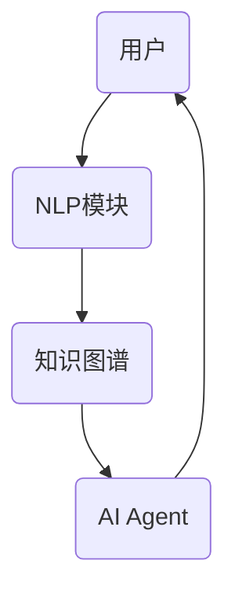
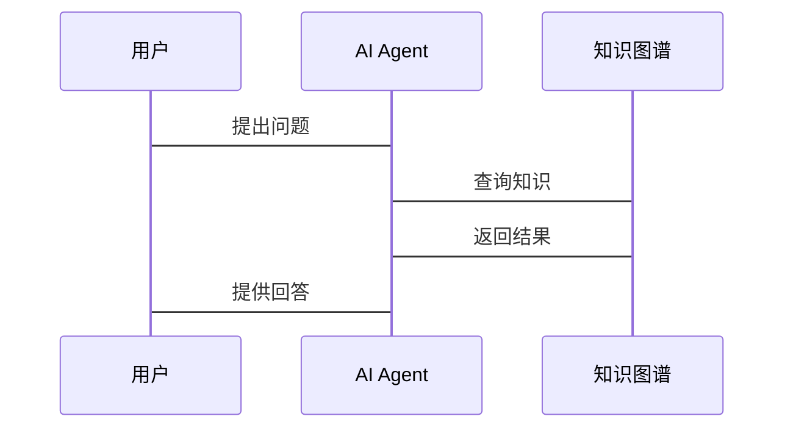

                 


# AI Agent在企业文化建设与内部沟通中的应用

> 关键词：AI Agent，企业文化，内部沟通，自然语言处理，知识图谱，系统架构

> 摘要：本文探讨了AI Agent在企业文化建设与内部沟通中的应用，分析了其技术基础、实现原理、应用场景以及系统架构。通过具体案例分析和系统设计，展示了AI Agent如何助力企业实现高效、智能化的内部沟通和文化建设。文章还提供了项目实战指导，帮助读者理解如何在实际中应用AI Agent技术。

---

## 第1章 AI Agent的核心概念与企业应用背景

### 1.1 AI Agent的基本概念
AI Agent（人工智能代理）是一种能够感知环境、自主决策并执行任务的智能系统。它通过自然语言处理（NLP）、知识图谱和机器学习等技术，能够理解人类语言、分析数据并提供智能化的解决方案。

#### 1.1.1 AI Agent的定义与特征
- **定义**：AI Agent是具有感知、推理和执行能力的智能体，能够与人类进行自然交互。
- **特征**：
  - 智能性：能够理解上下文和意图。
  - 自主性：无需人工干预，自主完成任务。
  - 适应性：能够根据反馈优化自身行为。

#### 1.1.2 AI Agent在企业中的应用场景
- **内部沟通**：通过聊天机器人辅助员工沟通，提升信息传递效率。
- **企业文化传播**：通过AI Agent传播企业价值观和文化理念。
- **员工培训**：通过智能化的培训系统提升员工技能。

#### 1.1.3 企业文化建设与内部沟通的核心问题
- **信息孤岛**：内部信息分散，难以有效传播。
- **沟通效率低**：传统沟通方式效率低下，难以满足现代企业需求。
- **文化认同感弱**：员工对企业文化的认知不足，认同感不强。

---

### 1.2 企业文化的定义与重要性
企业文化是企业在长期发展过程中形成的独特价值观、行为规范和企业精神的总和。

#### 1.2.1 企业文化的内涵与外延
- **内涵**：企业文化是企业的灵魂，包括企业愿景、使命、价值观等。
- **外延**：企业文化通过制度、行为规范等方式影响企业的日常运营。

#### 1.2.2 企业文化对企业管理的影响
- 提升员工凝聚力和归属感。
- 优化企业决策，降低管理成本。
- 提高企业的市场竞争力。

#### 1.2.3 内部沟通在企业文化中的作用
- 内部沟通是企业文化传播的重要渠道。
- 有效的内部沟通能够增强员工对企业文化的认同感。

---

### 1.3 AI Agent与企业文化建设的结合点
AI Agent通过智能化技术，能够解决企业内部沟通和文化建设中的诸多问题。

#### 1.3.1 AI Agent在内部沟通中的潜在价值
- 提供24/7的在线沟通支持。
- 智能化信息筛选，提升沟通效率。
- 提供个性化的沟通体验。

#### 1.3.2 AI Agent如何促进企业文化传播
- 通过知识图谱构建企业文化知识库。
- 利用自然语言处理技术理解员工需求。
- 提供互动式的文化学习体验。

#### 1.3.3 AI Agent在企业价值观塑造中的作用
- 通过数据分析识别员工需求，优化企业价值观。
- 提供实时反馈，帮助企业快速调整文化策略。

---

## 第2章 AI Agent的技术基础

### 2.1 自然语言处理技术
NLP是AI Agent实现智能化沟通的核心技术。

#### 2.1.1 NLP的核心技术与应用
- **分词**：将文本分割成词语或短语。
- **实体识别**：识别文本中的命名实体。
- **情感分析**：分析文本中的情感倾向。

#### 2.1.2 常见的NLP模型与工具
- **工具**：spaCy、jieba。
- **模型**：BERT、GPT。

#### 2.1.3 NLP在内部沟通中的应用案例
- **场景**：员工咨询企业文化。
- **实现**：通过NLP技术理解员工的查询内容，提供个性化的解答。

---

### 2.2 知识图谱与语义理解
知识图谱是AI Agent实现语义理解的重要工具。

#### 2.2.1 知识图谱的构建与应用
- **构建**：通过数据抽取、关联规则构建知识图谱。
- **应用**：用于企业文化知识的组织与传播。

#### 2.2.2 语义理解技术的原理
- **基于规则的语义理解**：通过预定义规则进行语义分析。
- **基于深度学习的语义理解**：通过神经网络模型学习语义。

#### 2.2.3 知识图谱在企业文化中的应用
- **场景**：企业文化知识的组织与传播。
- **实现**：通过知识图谱构建企业文化知识库，支持AI Agent的回答。

---

### 2.3 AI Agent的算法基础
AI Agent的算法实现是其智能化的核心。

#### 2.3.1 基于规则的AI Agent
- **实现**：通过预定义的规则进行决策。
- **优点**：简单易懂，适用于规则明确的场景。

#### 2.3.2 基于深度学习的AI Agent
- **实现**：通过神经网络模型进行学习和推理。
- **优点**：能够处理复杂场景，具有更强的适应性。

#### 2.3.3 常见算法对比与选择
| 技术 | 基于规则 | 基于深度学习 |
|------|----------|-------------|
| 优点 | 易实现，规则明确 | 强大的语义理解能力 |
| 缺点 | 适应性差 | 需大量数据支持 |

---

## 第3章 AI Agent的算法原理与实现

### 3.1 基于规则的AI Agent实现
基于规则的AI Agent通过预定义的规则进行决策。

#### 3.1.1 规则引擎的原理
- **输入**：用户输入的文本。
- **处理**：通过规则匹配，找到对应的处理逻辑。
- **输出**：生成相应的响应。

#### 3.1.2 规则的定义与管理
- **定义**：通过正则表达式或关键词匹配规则。
- **管理**：通过规则管理系统进行规则的添加、修改和删除。

#### 3.1.3 规则驱动的内部沟通场景
- **场景**：员工咨询企业文化。
- **实现**：通过规则匹配员工的查询内容，生成相应的回答。

---

### 3.2 基于深度学习的AI Agent实现
基于深度学习的AI Agent通过神经网络模型进行学习和推理。

#### 3.2.1 深度学习模型的选择
- **模型选择**：根据任务需求选择合适的模型，如BERT、GPT。
- **模型训练**：通过大量数据进行模型训练。

#### 3.2.2 模型的训练与优化
- **训练**：使用标注数据进行模型训练。
- **优化**：通过调整超参数和优化算法提升模型性能。

#### 3.2.3 模型在内部沟通中的应用
- **场景**：员工咨询企业文化。
- **实现**：通过深度学习模型理解员工的查询内容，生成个性化的回答。

---

### 3.3 混合式AI Agent实现
混合式AI Agent结合了基于规则和基于深度学习的优势。

#### 3.3.1 规则与深度学习的结合
- **实现**：在深度学习模型的基础上，通过规则进行结果的优化和调整。

#### 3.3.2 混合式AI Agent的优势
- **优点**：兼具规则的准确性和深度学习的灵活性。

#### 3.3.3 混合式AI Agent的实现案例
- **场景**：员工咨询企业文化。
- **实现**：通过深度学习模型理解员工的查询内容，结合规则进行结果的优化。

---

## 第4章 AI Agent在企业文化建设中的应用案例

### 4.1 企业文化传播
#### 4.1.1 案例背景
- **目标**：通过AI Agent传播企业文化知识。
- **实现**：通过知识图谱构建企业文化知识库，支持AI Agent的回答。

#### 4.1.2 系统设计
- **模块**：知识图谱构建模块、自然语言处理模块。
- **流程**：员工输入查询内容，AI Agent通过知识图谱和NLP技术生成回答。

#### 4.1.3 案例分析
- **分析**：通过知识图谱构建企业文化知识库，支持AI Agent的回答。
- **效果**：提高了企业文化传播的效率和效果。

---

### 4.2 内部沟通优化
#### 4.2.1 案例背景
- **目标**：优化企业内部沟通效率。
- **实现**：通过AI Agent提供智能化的沟通支持。

#### 4.2.2 系统设计
- **模块**：自然语言处理模块、知识图谱构建模块。
- **流程**：员工通过AI Agent进行内部沟通，AI Agent通过NLP技术和知识图谱提供支持。

#### 4.2.3 案例分析
- **分析**：通过AI Agent优化了内部沟通效率。
- **效果**：提高了内部沟通的效率和准确性。

---

### 4.3 员工培训与学习
#### 4.3.1 案例背景
- **目标**：通过AI Agent辅助员工培训。
- **实现**：通过AI Agent提供个性化的培训内容。

#### 4.3.2 系统设计
- **模块**：自然语言处理模块、知识图谱构建模块。
- **流程**：员工通过AI Agent进行培训，AI Agent通过NLP技术和知识图谱提供支持。

#### 4.3.3 案例分析
- **分析**：通过AI Agent辅助员工培训，提高了培训的效果。
- **效果**：增强了员工对企业文化的认同感。

---

## 第5章 系统架构设计与实现

### 5.1 系统架构设计
#### 5.1.1 系统功能设计
- **功能模块**：
  - 自然语言处理模块：负责文本的分词、实体识别、情感分析等。
  - 知识图谱构建模块：负责企业文化知识的组织与存储。
  - AI Agent交互模块：负责与用户的交互和响应生成。

#### 5.1.2 系统架构图


---

### 5.2 系统接口设计
#### 5.2.1 接口描述
- **输入接口**：用户输入的文本。
- **输出接口**：AI Agent生成的响应。

#### 5.2.2 接口实现
- **实现**：通过API接口实现用户与AI Agent之间的交互。

---

### 5.3 系统交互流程
#### 5.3.1 交互流程图


---

## 第6章 项目实战：AI Agent在企业文化建设中的应用

### 6.1 环境搭建
#### 6.1.1 开发环境
- **编程语言**：Python
- **框架**：Flask、Django
- **NLP库**：spaCy、jieba
- **知识图谱库**：networkx

---

### 6.2 核心代码实现
#### 6.2.1 自然语言处理模块
```python
import spacy

nlp = spacy.load("en_core_web_sm")

def process_text(text):
    doc = nlp(text)
    return [token.text for token in doc]
```

#### 6.2.2 知识图谱构建模块
```python
import networkx as nx

def build_knowledge_graph(concepts):
    G = nx.Graph()
    for concept in concepts:
        G.add_node(concept)
        for related in concepts[concept]:
            G.add_edge(concept, related)
    return G
```

---

### 6.3 测试与优化
#### 6.3.1 测试
- **功能测试**：测试AI Agent的交互功能。
- **性能测试**：测试AI Agent的响应速度和准确性。

#### 6.3.2 优化
- **优化方向**：优化NLP模型，增加训练数据。
- **优化方法**：通过调整模型参数和算法优化响应速度和准确性。

---

### 6.4 项目总结
- **总结**：通过AI Agent技术，能够有效提升企业文化传播和内部沟通效率。
- **经验**：在实际应用中，需要结合企业的实际情况进行定制化开发。

---

## 第7章 未来展望与最佳实践

### 7.1 未来发展趋势
#### 7.1.1 多模态交互
- **发展趋势**：AI Agent将支持更多的交互方式，如语音、图像等。

#### 7.1.2 自适应学习
- **发展趋势**：AI Agent将具备更强的自适应学习能力，能够根据反馈优化自身行为。

---

### 7.2 最佳实践 tips
- **选择合适的AI Agent技术**：根据企业需求选择合适的技术方案。
- **注重数据隐私**：在实际应用中，需要注意数据隐私和安全。
- **结合企业实际情况**：在实际应用中，需要结合企业的实际情况进行定制化开发。

---

## 结语

AI Agent在企业文化建设与内部沟通中的应用前景广阔。通过智能化技术，能够有效提升企业文化传播和内部沟通效率。未来，随着技术的不断发展，AI Agent将在企业文化建设中发挥更大的作用。

---

## 作者

作者：AI天才研究院/AI Genius Institute & 禅与计算机程序设计艺术 /Zen And The Art of Computer Programming

