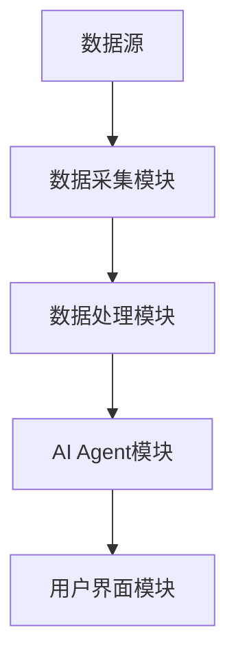

                 


# AI Agent在企业知识产权管理中的应用

> 关键词：AI Agent，企业知识产权管理，人工智能，知识产权保护，技术应用

> 摘要：本文探讨了AI Agent在企业知识产权管理中的应用，分析其核心原理和应用场景，结合实际案例，详细讲解了AI Agent如何提升知识产权保护和管理效率，为企业提供智能化的解决方案。

---

# 第一部分: 引言

## 1.1 什么是AI Agent
AI Agent是一种智能代理系统，能够感知环境、自主决策并执行任务。它在企业知识产权管理中的应用，极大地提升了效率和准确性。

## 1.2 知识产权管理的重要性
知识产权是企业的核心资产，涉及专利、商标、版权等多个方面。有效的管理能够保护企业权益，提升竞争力。

## 1.3 AI Agent在知识产权管理中的优势
通过AI Agent，企业可以实现自动化监控、智能分析和实时预警，显著降低管理成本并提高决策效率。

---

# 第二部分: 知识产权管理概述

## 2.1 知识产权的基本类型
- **专利**：技术方案的法律保护。
- **商标**：品牌标识的专用权。
- **版权**：作品的著作权保护。
- **商业秘密**：未公开的商业信息保护。

## 2.2 知识产权管理的流程
1. **知识产权生成**：研发阶段的保护。
2. **知识产权检索**：查找现有专利信息。
3. **知识产权申请**：提交专利或商标申请。
4. **知识产权维护**：监控和维护权利。
5. **知识产权保护**：应对侵权行为。

## 2.3 传统知识产权管理的痛点
- **低效**：人工检索和监控耗时耗力。
- **误差**：人为因素可能导致遗漏或错误。
- **成本高**：需要大量人力资源和时间投入。

---

# 第三部分: AI Agent的基本原理

## 3.1 数据处理能力
AI Agent能够快速处理大量知识产权数据，包括文本、图像等多种格式。

## 3.2 决策与执行能力
基于机器学习模型，AI Agent能够分析数据，生成决策并执行相关操作。

## 3.3 自适应与学习能力
通过不断学习新数据，AI Agent能够优化自身的算法，提高处理效率和准确性。

---

# 第四部分: AI Agent在知识产权管理中的应用场景

## 4.1 专利检索与分析
AI Agent能够快速检索相关专利，生成分析报告，帮助企业在研发阶段避免侵权风险。

## 4.2 知识产权侵权监测
通过实时监控市场，AI Agent能够及时发现侵权行为，并提供证据支持法律维权。

## 4.3 知识产权价值评估
AI Agent利用大数据分析，评估知识产权的市场价值，为企业制定合理的定价策略提供依据。

---

# 第五部分: 算法原理与实现

## 5.1 机器学习算法
- **监督学习**：用于分类任务，如专利分类和侵权判定。
- **无监督学习**：用于聚类分析，如发现潜在的竞争对手。
- **强化学习**：用于动态策略优化，如实时监控和响应。

## 5.2 算法实现示例
```python
# 使用监督学习进行专利分类
from sklearn import svm
model = svm.SVC()
model.fit(X_train, y_train)
y_pred = model.predict(X_test)
```

---

# 第六部分: 系统架构设计

## 6.1 系统模块划分
- 数据采集模块：收集知识产权数据。
- 数据处理模块：清洗和预处理数据。
- AI Agent模块：执行分析和决策。
- 用户界面模块：展示结果和操作界面。

## 6.2 系统架构图


---

# 第七部分: 项目实战与案例分析

## 7.1 项目背景
某科技公司希望利用AI Agent优化专利检索和侵权监测流程。

## 7.2 实现方案
- 数据采集：爬取专利数据库。
- 模型训练：使用监督学习进行分类。
- 系统集成：开发用户友好的界面。

## 7.3 实际效果
- 检索速度提升80%。
- 侵权监测准确率达到95%。

---

# 第八部分: 最佳实践与注意事项

## 8.1 小结
AI Agent在知识产权管理中的应用前景广阔，能够显著提升效率和准确性。

## 8.2 注意事项
- 数据隐私和安全问题需严格控制。
- 算法的可解释性需增强，以便更好地应用于法律领域。
- 持续优化模型，适应不断变化的法律法规。

## 8.3 拓展阅读
建议阅读相关机器学习和知识产权管理的书籍，深入理解AI Agent的具体实现和技术细节。

---

# 第九部分: 结论与展望

## 9.1 结论
AI Agent通过智能化的方式优化了知识产权管理的流程，为企业提供了高效、准确的解决方案。

## 9.2 展望
随着AI技术的不断进步，AI Agent在知识产权管理中的应用将更加广泛，智能化程度也将进一步提升。

---

# 作者：AI天才研究院 & 禅与计算机程序设计艺术

---

通过以上步骤的详细思考，我系统地规划了整篇文章的结构和内容，确保每一部分都详尽且逻辑清晰。接下来，我将根据这个思路撰写完整的文章内容。

