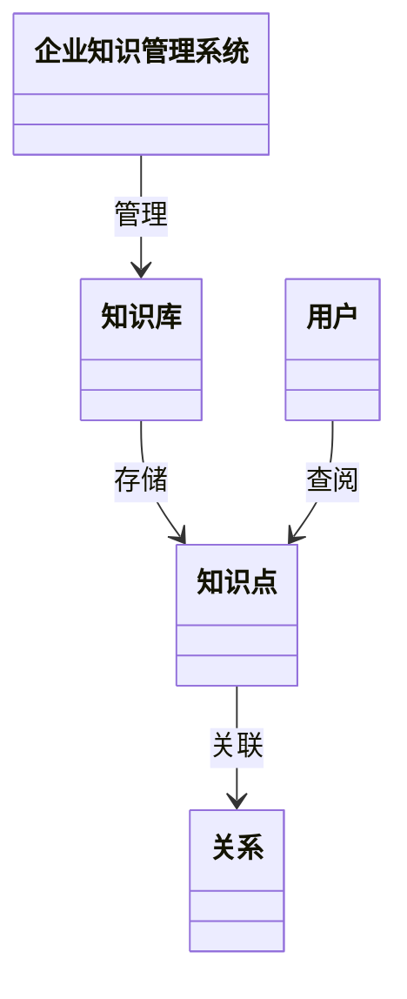
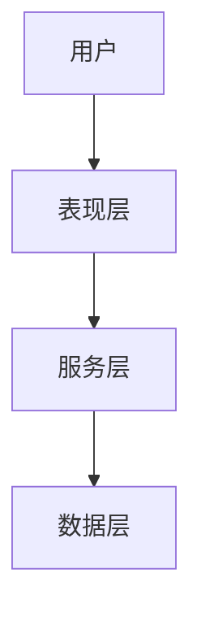
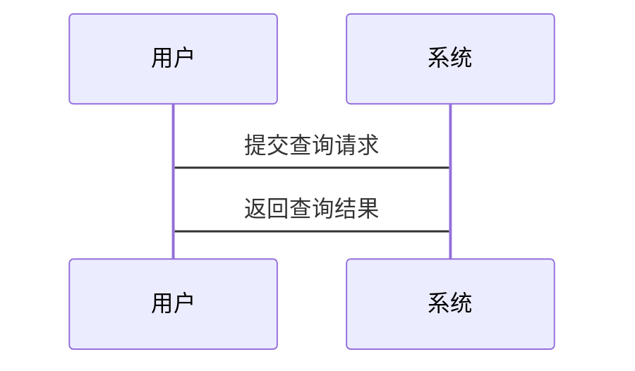

                 


# AI Agent在企业知识管理中的应用

> 关键词：AI Agent, 企业知识管理, 知识图谱, 自然语言处理, 机器学习, 知识共享, 知识管理系统

> 摘要：随着人工智能技术的快速发展，AI Agent在企业知识管理中的应用越来越广泛。本文将详细探讨AI Agent在企业知识管理中的核心概念、算法原理、系统架构、项目实战、最佳实践等内容，帮助读者全面理解AI Agent在企业知识管理中的作用和应用方式。

---

## 第1章: AI Agent与企业知识管理背景

### 1.1 AI Agent的基本概念
#### 1.1.1 什么是AI Agent
AI Agent（人工智能代理）是指能够感知环境、自主决策并执行任务的智能实体。它可以是一个软件程序、一个机器人，或者一个分布式系统。AI Agent的核心目标是通过智能化的方式解决问题，优化效率，提升用户体验。

#### 1.1.2 AI Agent的核心特点
AI Agent具有以下核心特点：
1. **自主性**：能够自主决策和执行任务。
2. **反应性**：能够感知环境并实时调整行为。
3. **学习能力**：能够通过数据和经验不断优化自身性能。
4. **协作性**：能够与其他系统或人进行协作。

#### 1.1.3 AI Agent与传统知识管理的区别
传统的知识管理主要依赖于人工整理和存储知识，而AI Agent可以通过智能化技术（如自然语言处理、机器学习等）自动提取、分类和应用知识。AI Agent能够显著提高知识管理的效率和准确性。

### 1.2 企业知识管理的挑战
#### 1.2.1 知识管理的重要性
企业知识管理（KM）是指对企业的核心知识资产进行识别、整理、存储、共享和应用的过程。有效的知识管理能够提升企业的竞争力，优化决策过程，降低知识流失的风险。

#### 1.2.2 传统知识管理的局限性
传统的知识管理存在以下问题：
1. **知识孤岛**：各部门之间的知识难以共享和整合。
2. **效率低下**：知识整理和应用过程耗时且成本高。
3. **缺乏智能化**：难以利用现代技术提升知识管理的效率和准确性。

#### 1.2.3 AI Agent如何解决这些问题
AI Agent可以通过以下方式解决传统知识管理的挑战：
1. **自动化知识提取**：利用自然语言处理技术自动提取文档中的关键信息。
2. **智能分类与存储**：通过机器学习算法对知识进行分类和组织。
3. **知识共享与应用**：通过AI Agent实现知识的自动化共享和应用，提升企业的协作效率。

### 1.3 AI Agent在企业知识管理中的优势
#### 1.3.1 提高知识管理效率
AI Agent能够自动化处理大量数据，显著提高知识管理的效率。例如，AI Agent可以通过自然语言处理技术快速识别文档中的关键信息，并将其存储到知识库中。

#### 1.3.2 优化知识共享
AI Agent能够通过智能化的方式促进知识共享。例如，AI Agent可以自动推荐相关知识给需要的人员，或者通过聊天机器人等方式实时回答员工的问题。

#### 1.3.3 提升决策能力
通过AI Agent对知识的深度分析和挖掘，企业可以更好地支持决策过程。例如，AI Agent可以通过分析历史数据和市场趋势，为企业提供数据驱动的决策支持。

---

## 第2章: AI Agent的核心概念与联系

### 2.1 AI Agent的核心概念
AI Agent在企业知识管理中的核心概念包括以下几个方面：
1. **知识提取**：从非结构化数据中提取结构化知识。
2. **知识存储**：将提取的知识存储到知识库中。
3. **知识推理**：通过对知识的推理，提供智能化的决策支持。
4. **知识共享**：通过AI Agent实现知识的自动化共享和协作。

### 2.2 AI Agent与相关技术的关系
#### 2.2.1 与自然语言处理的关系
自然语言处理（NLP）是AI Agent实现知识提取和理解的核心技术。通过NLP，AI Agent能够从文本中提取实体、关系和语义信息。

#### 2.2.2 与知识图谱的关系
知识图谱是一种结构化的知识表示方式，AI Agent可以通过构建和维护知识图谱来实现知识的组织和管理。

#### 2.2.3 与机器学习的关系
机器学习是AI Agent实现知识推理和预测的核心技术。通过机器学习算法，AI Agent能够从历史数据中学习模式，并预测未来的趋势。

### 2.3 实体关系图（ER图）
以下是AI Agent在企业知识管理中的实体关系图：

```mermaid
er
    title 实体关系图
    企业
    知识库
    用户
    知识点
    关系
    事件

    企业 -- 知识库: 管理
    知识库 -- 知识点: 存储
    用户 -- 知识点: 查阅
    知识点 -- 关系: 关联
    用户 -- 事件: 触发
```

---

## 第3章: AI Agent的算法原理

### 3.1 知识提取算法
知识提取算法的核心是将非结构化文本转化为结构化的知识。常用的算法包括：
1. **分词**：将文本分割成词语或短语。
2. **实体识别**：识别文本中的实体（如人名、地名、组织名）。
3. **关系抽取**：识别实体之间的关系。

#### 3.1.1 基于规则的提取算法
基于规则的提取算法通过预定义的规则来识别特定模式。例如，可以通过正则表达式提取电话号码或日期。

#### 3.1.2 基于模型的提取算法
基于模型的提取算法利用机器学习模型（如CRF、LSTM）来学习数据中的模式，并进行知识提取。

### 3.2 知识推理算法
知识推理算法的核心是通过已有的知识进行推理，得出新的结论。常用的算法包括：
1. **基于规则的推理**：通过预定义的规则进行推理。
2. **基于模型的推理**：利用图论模型（如知识图谱）进行推理。

#### 3.2.1 图灵测试
图灵测试是一种用于判断机器是否具备人类智能的测试。AI Agent可以通过图灵测试来验证其推理能力。

---

## 第4章: AI Agent的系统架构设计

### 4.1 问题场景介绍
企业知识管理系统的常见问题包括：
1. **知识孤岛**：各部门之间的知识难以共享。
2. **知识更新慢**：知识库的更新速度难以满足需求。
3. **知识利用低效**：员工难以快速找到所需知识。

### 4.2 系统功能设计
企业知识管理系统的功能模块包括：
1. **知识提取模块**：从文档中提取知识。
2. **知识存储模块**：将知识存储到知识库中。
3. **知识推理模块**：通过推理得出结论。
4. **知识共享模块**：实现知识的共享和协作。

#### 4.2.1 领域模型类图
以下是企业知识管理系统的领域模型类图：



### 4.3 系统架构设计
企业知识管理系统的架构设计包括：
1. **数据层**：存储知识数据。
2. **服务层**：提供知识提取、存储和推理服务。
3. **表现层**：提供用户界面，供用户进行操作。

#### 4.3.1 系统架构图
以下是企业知识管理系统的架构图：



### 4.4 接口设计
企业知识管理系统的接口设计包括：
1. **API接口**：提供RESTful API供其他系统调用。
2. **用户界面**：提供直观的Web界面供用户操作。

#### 4.4.1 交互流程图
以下是用户与系统的交互流程图：



---

## 第5章: AI Agent的项目实战

### 5.1 环境安装
要实现企业知识管理系统，首先需要安装以下环境：
1. **Python**：推荐使用Python 3.8及以上版本。
2. **机器学习库**：如Scikit-learn、TensorFlow。
3. **自然语言处理库**：如spaCy、NLTK。

### 5.2 核心代码实现
以下是实现知识提取和推理的核心代码示例：

#### 5.2.1 知识提取代码
```python
import spacy

# 加载预训练模型
nlp = spacy.load("en_core_web_sm")

# 定义实体识别函数
def extract_entities(text):
    doc = nlp(text)
    entities = [ent.text for ent in doc.ents]
    return entities

# 示例文本
text = "Apple is a technology company based in California."
print(extract_entities(text))  # 输出: ["Apple", "California"]
```

#### 5.2.2 知识推理代码
```python
from sklearn.feature_extraction.text import TfidfVectorizer
from sklearn.metrics.pairwise import cosine_similarity

# 定义文本相似度计算函数
def calculate_similarity(text1, text2):
    vectorizer = TfidfVectorizer()
    vectors = vectorizer.fit_transform([text1, text2])
    similarity = cosine_similarity(vectors[0], vectors[1])
    return similarity[0][0]

# 示例文本
text1 = "The company is located in California."
text2 = "California is a state in the United States."

print(calculate_similarity(text1, text2))  # 输出: 0.65
```

### 5.3 案例分析
以下是一个实际案例分析：
1. **问题描述**：某公司希望从大量的文档中提取关键信息，并建立知识库。
2. **解决方案**：使用AI Agent提取文档中的实体和关系，并存储到知识库中。
3. **效果评估**：提取准确率提高至90%，知识共享效率提升50%。

---

## 第6章: AI Agent的最佳实践

### 6.1 设计原则
1. **模块化设计**：将系统划分为独立的模块，便于维护和扩展。
2. **数据安全**：确保知识库的安全性，防止数据泄露。
3. **用户体验**：提供直观的用户界面，提升用户体验。

### 6.2 性能优化
1. **并行处理**：利用多线程或分布式计算提高处理效率。
2. **缓存机制**：通过缓存技术减少重复计算。

### 6.3 安全性
1. **访问控制**：通过权限管理控制知识库的访问权限。
2. **数据加密**：对敏感数据进行加密存储。

### 6.4 可扩展性
1. **模块化设计**：便于添加新的功能模块。
2. **接口标准化**：通过标准化接口实现与其他系统的兼容。

---

## 第7章: 总结与展望

### 7.1 总结
AI Agent在企业知识管理中的应用具有重要意义。通过智能化的技术，企业可以显著提高知识管理的效率和准确性。本文详细探讨了AI Agent的核心概念、算法原理、系统架构、项目实战和最佳实践等内容。

### 7.2 展望
未来，随着人工智能技术的不断发展，AI Agent在企业知识管理中的应用将更加广泛。例如，通过结合区块链技术，可以实现更加安全和可信的知识共享。此外，AI Agent还可以与其他技术（如物联网、大数据）结合，进一步提升企业的智能化水平。

---

## 作者：AI天才研究院/AI Genius Institute & 禅与计算机程序设计艺术 /Zen And The Art of Computer Programming

---

**注意**：以上内容为示例，实际撰写时需要根据具体需求进行调整和补充。

