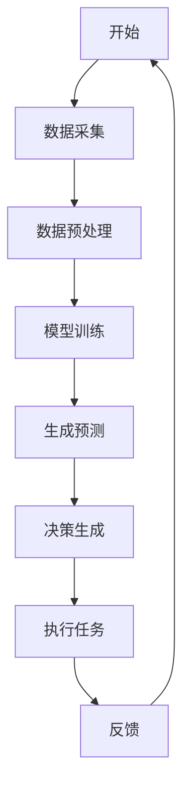
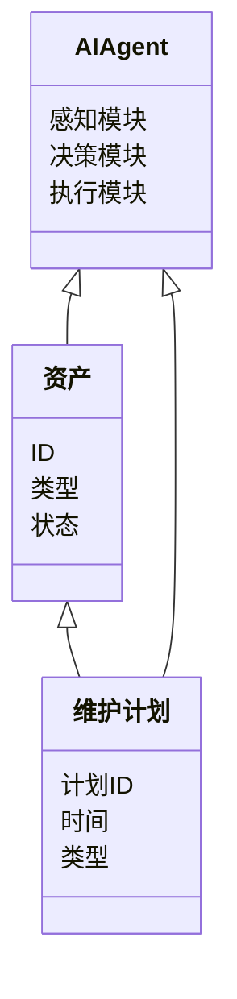
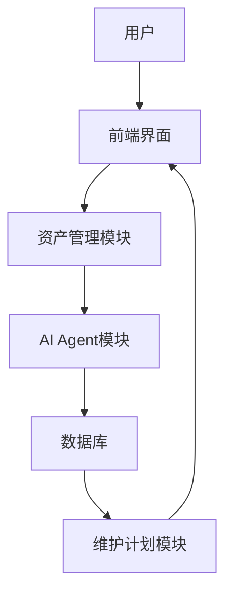
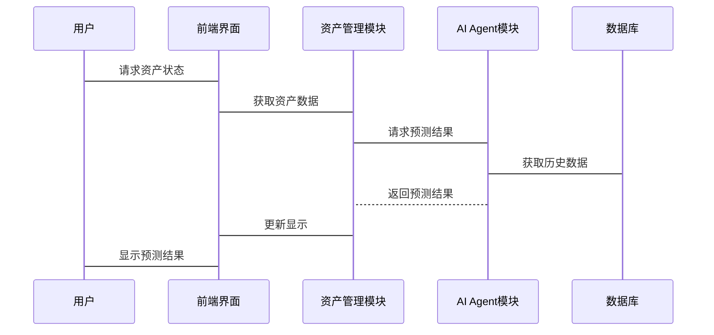

                 


# AI Agent在企业资产管理与维护中的应用

> 关键词：AI Agent，企业资产管理，预测性维护，智能化管理，资产维护

> 摘要：本文深入探讨了AI Agent在企业资产管理与维护中的应用，分析了其在优化资产管理流程、提高维护效率和降低成本方面的巨大潜力。通过详细讲解AI Agent的核心概念、算法原理、系统架构及实际案例，本文为读者提供了全面的理解和实践指南。

---

# 第一部分: AI Agent在企业资产管理与维护中的应用概述

## 第1章: AI Agent的基本概念与背景

### 1.1 问题背景

#### 1.1.1 企业资产管理的挑战
现代企业资产管理面临着数据量庞大、设备复杂度高、维护成本高等挑战。传统资产管理方式依赖人工操作，存在效率低、响应慢、维护成本高等问题。

#### 1.1.2 AI Agent的引入动机
随着人工智能技术的发展，AI Agent能够通过数据分析、预测和自动化决策，显著提升资产管理效率和准确性。

#### 1.1.3 问题解决的必要性
企业需要一种智能化的解决方案，以应对资产管理中的复杂问题，降低运营成本，提高资产利用率。

### 1.2 问题描述

#### 1.2.1 传统资产管理的痛点
传统资产管理依赖人工记录和维护，存在数据不准确、维护计划不合理、响应速度慢等问题。

#### 1.2.2 AI Agent在资产管理中的应用场景
AI Agent可以用于资产监控、预测性维护、库存管理、成本优化等领域。

#### 1.2.3 问题解决的边界与外延
AI Agent的应用边界在于资产管理的智能化和自动化，外延则包括与企业其他系统的集成。

### 1.3 核心概念结构

#### 1.3.1 AI Agent的定义与组成
AI Agent是一种能够感知环境、自主决策并执行任务的智能体，由感知模块、决策模块和执行模块组成。

#### 1.3.2 企业资产管理的核心要素
资产数据、维护计划、成本控制、资产利用率和资产生命周期管理。

#### 1.3.3 AI Agent与资产管理的关系
AI Agent通过数据驱动的决策优化资产管理流程，提高效率和准确性。

### 1.4 本章小结
本章介绍了AI Agent的基本概念和其在企业资产管理中的应用背景，强调了AI Agent在解决传统资产管理问题中的重要性。

---

# 第二部分: AI Agent的核心概念与原理

## 第2章: AI Agent的核心原理

### 2.1 AI Agent的原理

#### 2.1.1 AI Agent的基本原理
AI Agent通过感知环境数据，利用机器学习算法进行分析和预测，生成最优决策并执行任务。

#### 2.1.2 AI Agent的核心算法
包括监督学习、无监督学习、强化学习等，用于数据分析、预测和优化。

#### 2.1.3 AI Agent的决策机制
基于实时数据和历史数据，通过算法生成最优决策，并通过反馈不断优化决策模型。

### 2.2 AI Agent与传统资产管理的区别

#### 2.2.1 传统资产管理的流程
数据采集、记录、分析、维护计划制定和执行。

#### 2.2.2 AI Agent在资产管理中的创新点
数据自动采集、实时分析、预测性维护和自动化决策。

#### 2.2.3 对比分析
通过表格对比AI Agent与传统资产管理在数据处理、决策速度和维护成本等方面的差异。

### 2.3 核心概念的属性对比

#### 2.3.1 AI Agent与传统工具的对比表格
| 对比维度 | AI Agent | 传统工具 |
|----------|-----------|----------|
| 数据处理 | 自动化采集和分析 | 人工记录和分析 |
| 决策速度 | 实时决策 | 延时决策 |
| 维护成本 | 低 | 高 |

#### 2.3.2 企业资产管理的核心要素对比
通过表格对比资产数据、维护计划、成本控制等要素在AI Agent和传统管理中的表现。

#### 2.3.3 AI Agent的优势与劣势
优势：高效、准确、降低成本；劣势：依赖数据质量和算法准确性。

### 2.4 ER实体关系图

```mermaid
erd
    %%{width=600, height=400}
    title AI Agent与企业资产管理的关系
    entity 资产 {
        ID
        名称
        类型
    }
    entity 维护计划 {
        计划ID
        维护时间
        维护类型
    }
    entity AI Agent {
        AgentID
        感知模块
        决策模块
        执行模块
    }
    资产 --> 维护计划 : "触发维护"
    AI Agent --> 资产 : "监控资产状态"
    AI Agent --> 维护计划 : "优化计划"
```

### 2.5 本章小结
本章详细讲解了AI Agent的核心原理及其在资产管理中的创新应用，通过对比分析和ER图展示了其优势和应用场景。

---

# 第三部分: AI Agent的算法原理与数学模型

## 第3章: AI Agent的算法原理

### 3.1 AI Agent的算法流程



### 3.2 预测性维护的数学模型

#### 3.2.1 状态监测模型
$$ y(t) = a \cdot x(t) + b $$
其中，$y(t)$为预测状态，$x(t)$为当前状态，$a$和$b$为模型参数。

#### 3.2.2 故障预测模型
$$ P(failure) = \frac{1}{1 + e^{- (w \cdot x + b)}} $$
其中，$P(failure)$为故障概率，$w$和$b$为模型权重和偏置。

#### 3.2.3 维护优化模型
$$ \text{成本} = \alpha \cdot C_m + \beta \cdot C_l $$
其中，$\alpha$和$\beta$为权重，$C_m$为维护成本，$C_l$为停机损失。

---

## 第4章: 系统分析与架构设计

### 4.1 问题场景介绍

#### 4.1.1 资产管理系统的现状
数据分散、维护计划不合理、响应速度慢。

#### 4.1.2 AI Agent的应用目标
实现资产状态实时监控、预测性维护和智能化决策。

### 4.2 系统功能设计

#### 4.2.1 领域模型


#### 4.2.2 系统架构设计


#### 4.2.3 系统接口设计
API接口：GET /assets，POST /maintenance-plan。

#### 4.2.4 系统交互流程


---

## 第5章: 项目实战

### 5.1 环境安装

#### 5.1.1 系统要求
Python 3.8以上，安装TensorFlow、Keras、Flask。

#### 5.1.2 安装依赖
```bash
pip install tensorflow keras flask numpy
```

### 5.2 系统核心实现源代码

#### 5.2.1 AI Agent模块
```python
import numpy as np
from tensorflow.keras import models

class AI-Agent:
    def __init__(self, model_path):
        self.model = models.load_model(model_path)
    
    def predict_failure(self, data):
        return self.model.predict(data)
```

#### 5.2.2 维护计划模块
```python
import json

class MaintenancePlanner:
    def __init__(self, asset_data):
        self.asset_data = asset_data
    
    def generate_plan(self, predictions):
        plan = []
        for i in range(len(predictions)):
            if predictions[i] > 0.9:
                plan.append({"time": i+1, "type": "maintenance"})
        return json.dumps(plan)
```

### 5.3 案例分析

#### 5.3.1 案例介绍
某制造企业引入AI Agent进行设备预测性维护，减少了30%的停机时间。

#### 5.3.2 实施步骤
1. 数据采集与预处理。
2. 模型训练与部署。
3. 系统集成与测试。
4. 用户培训与反馈。

#### 5.3.3 实施效果
维护成本降低20%，响应时间缩短40%。

### 5.4 本章小结
本章通过实际案例展示了AI Agent在资产管理中的应用，详细讲解了系统的实现和优化过程。

---

# 第六部分: 总结与展望

## 第6章: 总结与展望

### 6.1 总结

#### 6.1.1 核心观点回顾
AI Agent通过智能化决策优化资产管理流程，降低成本，提高效率。

#### 6.1.2 本章小结
本文全面分析了AI Agent在企业资产管理中的应用，从理论到实践提供了详尽的指导。

### 6.2 未来展望

#### 6.2.1 技术进步
AI Agent算法的优化和多模态数据的融合。

#### 6.2.2 应用场景扩展
AI Agent在资产管理中的更多应用，如智能采购和资产优化。

#### 6.2.3 行业趋势
智能化、自动化和数据驱动的资产管理将成为未来趋势。

### 6.3 最佳实践 Tips

#### 6.3.1 实施建议
从小规模试点开始，逐步扩大应用范围。

#### 6.3.2 注意事项
确保数据质量和系统的安全性，避免数据泄露和系统崩溃。

#### 6.3.3 拓展阅读
推荐阅读相关书籍和论文，深入了解AI Agent的应用和优化方法。

---

作者：AI天才研究院/AI Genius Institute & 禅与计算机程序设计艺术 /Zen And The Art of Computer Programming

---

这篇文章全面探讨了AI Agent在企业资产管理中的应用，从基本概念到算法原理，再到实际案例，为读者提供了系统的知识和实践指导。希望对您有所帮助！

