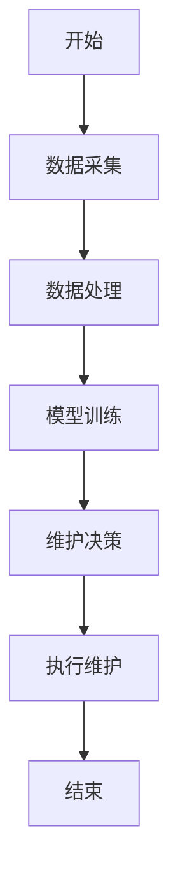
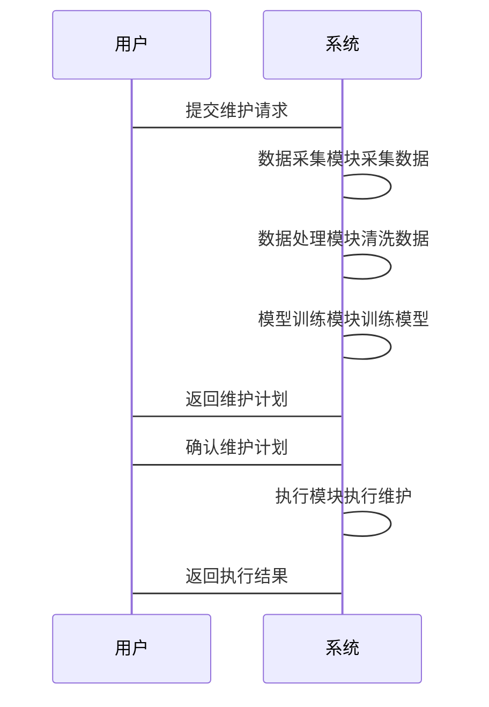

                 

# AI Agent在企业资产管理与预测性维护中的应用

> 关键词：AI Agent，企业资产管理，预测性维护，机器学习，系统架构

> 摘要：本文探讨了AI Agent在企业资产管理中的应用，特别是预测性维护领域。通过分析AI Agent的基本概念、预测性维护的核心原理、AI Agent的感知与决策机制，以及系统架构设计，展示了如何利用AI技术提升企业资产管理效率和设备可靠性。文章结合实际案例，详细讲解了算法原理、系统设计和项目实战，为读者提供了一套完整的解决方案。

---

# 第1章: AI Agent的基本概念与应用背景

## 1.1 AI Agent的定义与核心概念

### 1.1.1 AI Agent的基本定义

AI Agent（人工智能代理）是一种能够感知环境、自主决策并执行任务的智能实体。它可以是一个软件程序，也可以是一个物理设备，通过传感器和执行器与环境交互。AI Agent的核心目标是通过智能算法优化任务执行效率，提高决策的准确性。

$$
\text{AI Agent} = \{\text{感知} \rightarrow \text{决策} \rightarrow \text{执行}\}
$$

### 1.1.2 AI Agent的核心属性

| 属性         | 描述                                         |
|--------------|----------------------------------------------|
| 感知能力     | 能够采集和理解环境数据                       |
| 决策能力     | 基于数据做出最优决策                         |
| 执行能力     | 执行决策并输出结果                           |
| 学习能力     | 通过反馈不断优化模型                         |

### 1.1.3 AI Agent与传统软件的区别

| 特性         | 传统软件                                   | AI Agent                              |
|--------------|--------------------------------------------|----------------------------------------|
| 决策方式     | 预定义规则                                 | 自主学习与优化                         |
| 反应速度     | 延迟较高                                   | 实时响应                               |
| 环境适应性   | 固定功能                                   | 高度灵活，适应复杂环境                 |

## 1.2 企业资产管理的挑战与需求

### 1.2.1 企业资产管理的定义

企业资产管理（Enterprise Asset Management，EAM）是指通过系统化的方法，对企业的资产进行全生命周期管理，包括规划、采购、使用、维护和报废等阶段。

### 1.2.2 传统资产管理的痛点

| 问题         | 描述                                         |
|--------------|----------------------------------------------|
| 数据孤岛     | 各部门数据分散，难以整合                     |
| 维护成本高   | 人工维护效率低，成本高                       |
| 预测性差     | 无法准确预测设备故障，导致突发性停机         |

### 1.2.3 预测性维护的重要性

预测性维护（Predictive Maintenance）是通过实时监测设备状态，利用数据分析和机器学习模型预测设备故障，提前安排维护，避免设备停机和生产损失。

## 1.3 AI Agent在企业资产管理中的作用

### 1.3.1 提高资产管理效率

AI Agent能够实时监控设备状态，快速识别潜在问题，减少人工干预，提高管理效率。

### 1.3.2 降低运营成本

通过预测性维护，减少非计划性停机，降低维修成本和资源浪费。

### 1.3.3 提升设备可靠性

AI Agent能够优化维护策略，延长设备使用寿命，提高设备可靠性。

## 1.4 本章小结

本章介绍了AI Agent的基本概念和核心属性，分析了企业资产管理的挑战与需求，重点探讨了预测性维护的重要性，并总结了AI Agent在企业资产管理中的作用。

---

# 第2章: 预测性维护的核心原理

## 2.1 预测性维护的基本概念

### 2.1.1 预测性维护的定义

预测性维护是一种基于设备状态监测和数据分析的维护策略，旨在通过预测设备故障时间，提前安排维护工作。

### 2.1.2 预测性维护的分类

| 类型         | 描述                                         |
|--------------|----------------------------------------------|
| 基于时间的维护 | 定期维护设备，不考虑设备状态                 |
| 基于条件的维护 | 根据设备状态动态调整维护计划                 |
| 预测性维护   | 基于机器学习模型预测设备故障时间             |

### 2.1.3 预测性维护的优势

| 优势         | 描述                                         |
|--------------|----------------------------------------------|
| 减少停机时间   | 提前发现故障，避免非计划性停机               |
| 降低维护成本   | 减少不必要的维护操作，节省成本               |
| 延长设备寿命   | 通过优化维护策略，延长设备使用寿命           |

## 2.2 AI Agent在预测性维护中的应用

### 2.2.1 数据采集与分析

AI Agent通过传感器采集设备运行数据，包括温度、振动、压力等参数，并对数据进行清洗和预处理。

### 2.2.2 故障预测模型

基于机器学习算法，构建故障预测模型，如支持向量机（SVM）和长短期记忆网络（LSTM）。

### 2.2.3 维护决策优化

根据预测结果，优化维护计划，合理分配维护资源，降低维护成本。

## 2.3 预测性维护的数学模型

### 2.3.1 时间序列分析模型

时间序列分析模型用于预测设备的运行状态，常见的模型包括ARIMA和Prophet。

$$
\text{ARIMA模型} = \text{AutoRegressive Integrated Moving Average}
$$

### 2.3.2 基于机器学习的预测模型

基于机器学习的预测模型能够捕捉复杂的设备状态特征，如支持向量机和随机森林。

$$
\text{SVM模型} = \max_{\alpha} \sum_{i=1}^{n} \alpha_i - \frac{1}{2} \sum_{i,j} \alpha_i \alpha_j y_i y_j K(x_i, x_j)
$$

### 2.3.3 模型评估与优化

通过交叉验证和网格搜索优化模型参数，选择最优模型。

## 2.4 本章小结

本章介绍了预测性维护的基本概念和分类，分析了AI Agent在预测性维护中的应用，详细讲解了预测性维护的数学模型和优化方法。

---

# 第3章: AI Agent的感知与决策机制

## 3.1 AI Agent的感知能力

### 3.1.1 数据采集与处理

AI Agent通过传感器采集设备数据，并进行数据清洗和特征提取。

### 3.1.2 感知模型的构建

基于深度学习构建感知模型，如卷积神经网络（CNN）和循环神经网络（RNN）。

### 3.1.3 感知数据的特征提取

通过主成分分析（PCA）提取特征，降低数据维度，提高模型效率。

## 3.2 AI Agent的决策机制

### 3.2.1 决策树模型

决策树是一种常用的分类和回归模型，能够帮助AI Agent做出最优决策。

$$
\text{决策树} = \text{ID3/C4.5/C5.0算法构建树结构}
$$

### 3.2.2 基于规则的决策

通过专家经验或数据挖掘生成决策规则，如If-Else条件语句。

### 3.2.3 基于强化学习的决策

通过强化学习优化决策策略，如Q-learning算法。

## 3.3 AI Agent的执行机制

### 3.3.1 执行策略的制定

根据决策结果制定执行策略，如启动维护任务。

### 3.3.2 执行过程的监控

实时监控执行过程，确保任务按计划进行。

### 3.3.3 执行结果的反馈

将执行结果反馈到系统，优化未来决策。

## 3.4 本章小结

本章详细讲解了AI Agent的感知能力、决策机制和执行机制，分析了不同算法在各个阶段的应用。

---

# 第4章: 预测性维护的算法原理

## 4.1 常见预测算法介绍

### 4.1.1 线性回归

线性回归用于预测设备的运行状态，适用于线性关系的数据。

$$
\text{线性回归} = y = \beta_0 + \beta_1 x + \epsilon
$$

### 4.1.2 支持向量机

支持向量机（SVM）用于分类和回归，适用于非线性数据。

### 4.1.3 随机森林

随机森林是一种基于树的集成学习方法，适用于高维数据。

## 4.2 时间序列预测模型

### 4.2.1 ARIMA模型

ARIMA模型用于时间序列预测，适用于具有趋势和周期性的数据。

$$
\text{ARIMA模型} = \text{差分方程模型}
$$

### 4.2.2 LSTM网络

LSTM网络是一种基于循环神经网络的模型，适用于时间序列预测。

$$
\text{LSTM网络} = \text{门控机制：遗忘门、输入门、输出门}
$$

### 4.2.3 Prophet模型

Prophet模型是一种基于时间序列分解的模型，适用于业务预测。

## 4.3 基于机器学习的故障预测

### 4.3.1 数据预处理

包括数据清洗、特征工程和数据分割。

### 4.3.2 模型训练

使用训练数据训练模型，调整超参数优化性能。

### 4.3.3 模型评估

通过准确率、召回率和F1分数评估模型性能。

## 4.4 本章小结

本章详细介绍了预测性维护中常用的算法，包括线性回归、SVM、随机森林、ARIMA、LSTM和Prophet模型，并分析了它们的应用场景和优缺点。

---

# 第5章: 系统架构设计与实现

## 5.1 系统功能设计

### 5.1.1 系统模块划分

| 模块         | 功能描述                                   |
|--------------|--------------------------------------------|
| 数据采集模块 | 采集设备数据                               |
| 数据处理模块 | 清洗和预处理数据                           |
| 模型训练模块 | 训练预测模型                               |
| 维护决策模块 | 基于模型结果制定维护计划                   |
| 执行模块     | 执行维护任务                               |

### 5.1.2 系统功能流程

使用Mermaid绘制系统功能流程图：

## 5.2 系统架构设计

### 5.2.1 系统架构图

使用Mermaid绘制系统架构图：

### 5.2.2 系统接口设计

| 接口         | 描述                                         |
|--------------|----------------------------------------------|
| 数据采集接口 | 采集设备数据，格式为JSON或CSV                 |
| 模型训练接口 | 接收数据，训练模型，返回模型参数             |
| 决策接口     | 根据模型预测结果，生成维护计划               |
| 执行接口     | 执行维护任务，返回执行结果                   |

### 5.2.3 系统交互流程

使用Mermaid绘制系统交互流程图：

## 5.3 本章小结

本章详细讲解了系统功能设计、架构设计和接口设计，为后续的项目实战奠定了基础。

---

# 第6章: 项目实战与优化

## 6.1 环境安装与配置

### 6.1.1 安装Python环境

使用Anaconda安装Python 3.8及以上版本。

### 6.1.2 安装依赖库

安装numpy、pandas、scikit-learn、xgboost等依赖库。

## 6.2 数据处理与模型训练

### 6.2.1 数据采集

从数据库或传感器设备中采集设备运行数据。

### 6.2.2 数据清洗

使用pandas进行数据清洗，处理缺失值和异常值。

### 6.2.3 模型训练

选择最优模型进行训练，调整超参数优化性能。

## 6.3 维护决策与执行

### 6.3.1 决策规则制定

基于模型预测结果，制定维护计划。

### 6.3.2 系统执行

通过API调用执行维护任务，记录执行结果。

## 6.4 项目优化与扩展

### 6.4.1 模型优化

使用网格搜索和交叉验证优化模型性能。

### 6.4.2 系统扩展

通过分布式架构扩展系统，提高处理能力。

## 6.5 本章小结

本章通过实际案例展示了AI Agent在预测性维护中的应用，详细讲解了项目实战的每一步，并给出了优化建议。

---

# 第7章: 总结与展望

## 7.1 本章总结

本文详细探讨了AI Agent在企业资产管理中的应用，特别是预测性维护领域。通过分析AI Agent的基本概念、算法原理和系统架构，展示了如何利用AI技术提升企业资产管理效率和设备可靠性。

## 7.2 未来展望

随着AI技术的不断发展，预测性维护将更加智能化和自动化。未来的研究方向包括更高效的算法、更智能的决策系统和更完善的生态系统。

---

# 作者：AI天才研究院/AI Genius Institute & 禅与计算机程序设计艺术 /Zen And The Art of Computer Programming

---

以上是《AI Agent在企业资产管理与预测性维护中的应用》的技术博客文章的完整目录大纲和内容概要。如果需要进一步展开某一章节的内容或添加更多细节，请随时告知！

