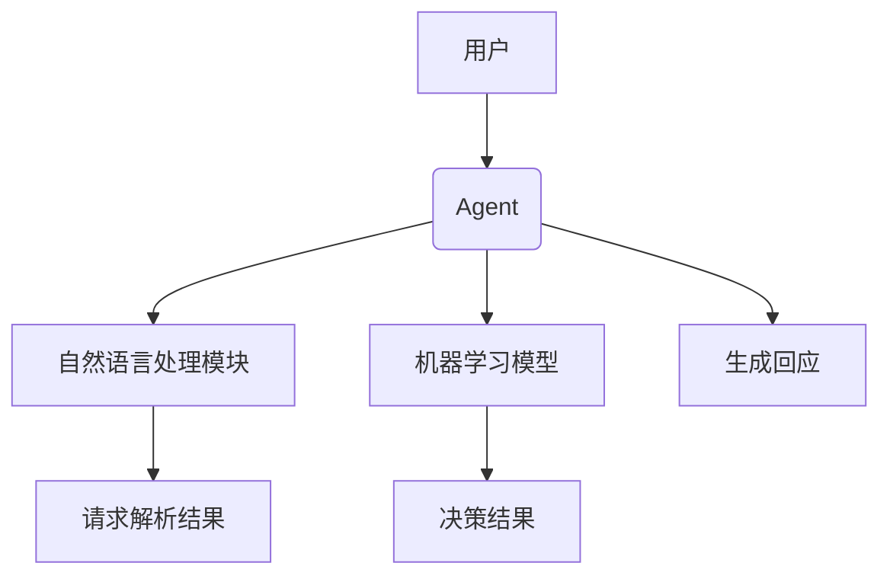

                 


# AI Agent在客户服务领域的应用实践

**关键词**：AI Agent，客户服务，自然语言处理，机器学习，系统架构，项目实战

**摘要**：本文深入探讨了AI Agent在客户服务领域的应用实践。首先介绍了AI Agent的基本概念及其在客户服务中的应用现状，分析了其核心算法和数学模型，设计了系统架构并提供了项目实战案例，最后总结了最佳实践和未来展望。通过详细的技术分析和实际案例，展示了AI Agent如何提升客户服务的效率和体验。

---

## 第1章: AI Agent的背景与概念

### 1.1 AI Agent的基本概念

#### 1.1.1 什么是AI Agent
AI Agent（人工智能代理）是指能够感知环境并采取行动以实现目标的智能实体。在客户服务领域，AI Agent通常以虚拟助手或聊天机器人的形式出现，能够理解和处理客户的请求，提供相应的服务。

#### 1.1.2 AI Agent的核心特征
AI Agent的核心特征包括：
1. **自主性**：能够在没有人工干预的情况下独立运作。
2. **反应性**：能够实时感知环境并做出反应。
3. **学习能力**：通过机器学习不断优化自身的行为和决策能力。
4. **交互性**：能够通过自然语言处理与用户进行有效沟通。

#### 1.1.3 AI Agent与传统客服的区别
传统的客服主要依赖人工操作，响应速度较慢且可能存在情绪波动。而AI Agent能够24/7全天候工作，响应速度快且情绪稳定，能够处理大量的重复性任务，极大地提升了客户体验。

### 1.2 AI Agent在客户服务中的应用现状

#### 1.2.1 客户服务领域的痛点
传统的客户服务存在以下痛点：
- 响应时间长：人工客服需要时间处理请求，导致客户等待时间长。
- 服务质量不稳定：客服人员情绪波动可能影响服务质量。
- 成本高：人工客服需要支付薪资和培训费用。

#### 1.2.2 AI Agent如何解决这些问题
AI Agent通过自动化处理客户请求，显著缩短了响应时间，提高了服务稳定性，并降低了成本。

#### 1.2.3 当前市场上的AI Agent产品
目前市场上有许多AI Agent产品，如亚马逊的Alexa、苹果的Siri、微软的Cortana等，它们在客户服务领域都有广泛应用。

---

## 第2章: AI Agent的核心概念与联系

### 2.1 AI Agent的核心原理

#### 2.1.1 自然语言处理（NLP）在AI Agent中的应用
自然语言处理（NLP）是AI Agent实现人机交互的核心技术。NLP通过理解和生成人类语言，使得AI Agent能够与用户进行有效的沟通。

#### 2.1.2 机器学习在AI Agent中的应用
机器学习（ML）用于训练AI Agent，使其能够根据历史数据和用户行为模式，预测和理解用户的需求。

#### 2.1.3 强化学习在AI Agent中的应用
强化学习（Reinforcement Learning）用于优化AI Agent的行为策略，使其在与用户的交互中不断改进服务质量。

### 2.2 AI Agent与相关技术的关系

#### 2.2.1 AI Agent与NLP的关系
NLP是AI Agent实现自然语言理解的核心技术，AI Agent通过NLP技术理解用户的请求并生成相应的回应。

#### 2.2.2 AI Agent与机器学习的关系
机器学习为AI Agent提供了决策和预测的能力，使其能够根据用户的行为和历史数据优化服务策略。

#### 2.2.3 AI Agent与RPA（机器人流程自动化）的关系
RPA用于自动化处理重复性任务，AI Agent可以与RPA结合，实现更加复杂的客户服务流程自动化。

---

## 第3章: AI Agent在客户服务中的核心算法

### 3.1 自然语言处理算法

#### 3.1.1 基于Transformer的NLP模型
基于Transformer的NLP模型（如BERT）在自然语言理解任务中表现出色，广泛应用于AI Agent的对话理解和生成。

#### 3.1.2 NLP模型的工作流程
NLP模型的工作流程包括以下步骤：
1. **分词**：将输入文本分割成词语或短语。
2. **嵌入层**：将词语映射到向量空间。
3. **编码层**：通过自注意力机制捕获词语之间的关系。
4. **解码层**：生成目标语言的序列。

---

## 第4章: AI Agent的数学模型与公式

### 4.1 AI Agent的决策模型

#### 4.1.1 基于概率的决策模型
基于概率的决策模型通过计算不同选项的概率，选择概率最高的行动。

$$ P(a) = \frac{\text{count}(a)}{\sum_{a'} \text{count}(a')} $$

#### 4.1.2 基于优化的决策模型
基于优化的决策模型通过数学优化方法，找到最优的行动方案。

$$ \argmax_a \text{score}(a) $$

---

## 第5章: 系统分析与架构设计

### 5.1 系统功能设计

#### 5.1.1 系统功能模型
系统功能模型包括以下核心功能：
- 用户请求接收
- 请求理解和解析
- 生成回应
- 回应发送

### 5.2 系统架构设计

#### 5.2.1 系统架构图
以下是系统架构图的Mermaid表示：



---

## 第6章: 项目实战

### 6.1 环境安装

#### 6.1.1 安装Python
安装Python和相关库（如TensorFlow、Keras、NLTK等）。

#### 6.1.2 安装必要的库
```bash
pip install numpy
pip install tensorflow
pip install nltk
```

### 6.2 核心代码实现

#### 6.2.1 NLP模型实现
以下是基于Transformer的NLP模型实现的Python代码示例：

```python
import numpy as np

def attention(q, k, v):
    # 计算注意力权重
    dk = k.shape[-1]
    attention_scores = (q @ k.T) / np.sqrt(dk)
    attention_weights = np.exp(-np.expm1(-attention_scores))
    return (v @ attention_weights.T)

def transformer_encoder(inputs):
    # 前向传播
    q = inputs
    k = inputs
    v = inputs
    out = attention(q, k, v)
    return out
```

#### 6.2.2 机器学习模型实现
以下是机器学习模型实现的Python代码示例：

```python
import tensorflow as tf
from tensorflow import keras

model = keras.Sequential([
    keras.layers.Dense(64, activation='relu'),
    keras.layers.Dense(10, activation='softmax')
])
model.compile(optimizer='adam', loss='sparse_categorical_crossentropy', metrics=['accuracy'])
model.fit(x_train, y_train, epochs=10, batch_size=32)
```

### 6.3 实际案例分析

#### 6.3.1 案例背景
假设我们有一个在线零售店，每天需要处理大量的客户咨询和订单查询。我们希望通过AI Agent来自动化处理这些请求。

#### 6.3.2 案例分析
通过AI Agent，客户可以随时在线咨询商品信息、查询订单状态、处理退换货等。AI Agent能够快速响应客户请求，提供准确的信息，极大地提升了客户满意度和效率。

---

## 第7章: 总结与展望

### 7.1 总结
本文深入探讨了AI Agent在客户服务领域的应用实践，从背景、核心算法到系统设计和项目实战，全面分析了AI Agent的优势和实现方法。

### 7.2 展望
未来，随着AI技术的不断进步，AI Agent在客户服务中的应用将更加广泛和深入。通过结合更多的创新技术，AI Agent将能够提供更加智能化、个性化的服务，进一步提升客户体验和企业效率。

---

**作者：AI天才研究院/AI Genius Institute & 禅与计算机程序设计艺术 /Zen And The Art of Computer Programming**

