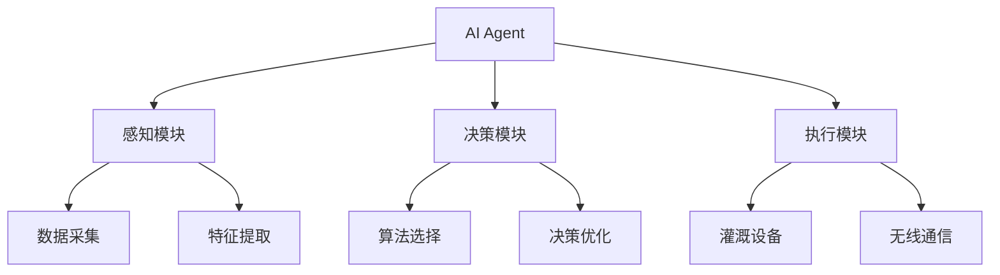
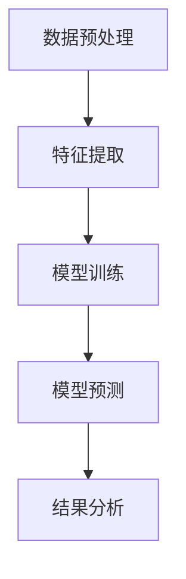
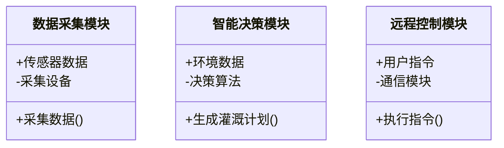

                 


# AI Agent在智能农业灌溉系统中的实践

> 关键词：AI Agent, 智能农业, 灌溉系统, 人工智能, 农业科技

> 摘要：本文探讨了AI Agent在智能农业灌溉系统中的应用，详细分析了AI Agent的核心概念、系统架构、算法原理以及在农业灌溉中的实际应用案例。通过系统分析和项目实战，展示了如何利用AI Agent优化农业灌溉管理，提高水资源利用效率，并为未来农业智能化发展提供了有益参考。

---

# 第1章: AI Agent与智能农业灌溉系统背景

## 1.1 AI Agent的基本概念

### 1.1.1 人工智能代理的定义
AI Agent（人工智能代理）是指能够感知环境、自主决策并执行任务的智能实体。它通过传感器获取数据，利用算法进行分析和推理，并通过执行器完成特定目标。

### 1.1.2 AI Agent的核心特征
- **自主性**：能够在没有外部干预的情况下独立运作。
- **反应性**：能够实时感知环境变化并做出响应。
- **目标导向**：通过优化目标函数来实现预定目标。
- **学习能力**：通过数据训练不断优化性能。

### 1.1.3 AI Agent与传统自动控制系统的区别
| 特性 | AI Agent | 传统控制系统 |
|------|----------|--------------|
| 决策方式 | 基于学习和推理 | 基于预设规则 |
| 灵活性 | 高 | 低 |
| 学习能力 | 强 | 无 |

## 1.2 智能农业灌溉系统的发展背景

### 1.2.1 农业灌溉的传统方法与挑战
传统灌溉系统主要依赖人工操作，存在水资源浪费、灌溉不均匀等问题。随着气候变化和水资源短缺，传统方法难以满足高效农业的需求。

### 1.2.2 智能农业的概念与技术特点
智能农业通过物联网、大数据和人工智能等技术实现农业生产过程的智能化管理。其特点包括高效性、精准性和可持续性。

### 1.2.3 AI Agent在农业灌溉中的应用潜力
AI Agent能够实时监测土壤湿度、气象数据等信息，通过智能决策优化灌溉计划，从而提高水资源利用效率。

## 1.3 AI Agent在农业灌溉中的问题背景

### 1.3.1 灌溉系统中的关键问题
- **水资源浪费**：传统灌溉方式可能导致水分蒸发或渗漏。
- **灌溉不均匀**：不同地块的土壤条件差异导致灌溉效果不一致。
- **环境因素影响**：天气变化对灌溉决策的影响难以预测。

### 1.3.2 AI Agent如何解决这些问题
AI Agent通过实时感知和智能决策，可以实现精准灌溉，减少水资源浪费，提高灌溉均匀性。

### 1.3.3 AI Agent在灌溉系统中的边界与外延
AI Agent在灌溉系统中的应用边界主要集中在数据采集、决策和执行环节，外延则涉及农业生产的其他环节，如作物监测和病虫害防治。

## 1.4 本章小结

### 1.4.1 AI Agent与农业灌溉的结合点
AI Agent可以通过实时感知和智能决策优化灌溉管理。

### 1.4.2 本书的核心研究内容
本书将围绕AI Agent在农业灌溉中的应用展开，探讨其技术实现和实际效果。

---

# 第2章: AI Agent的核心概念与系统架构

## 2.1 AI Agent的感知模块

### 2.1.1 数据采集与传感器技术
AI Agent通过土壤湿度传感器、气象传感器等设备采集环境数据。

### 2.1.2 数据预处理与特征提取
对采集到的数据进行清洗、归一化处理，并提取关键特征。

### 2.1.3 感知模块的数学模型
$$
\text{土壤湿度} = \alpha \times \text{降雨量} + \beta \times \text{蒸发量}
$$

## 2.2 AI Agent的决策模块

### 2.2.1 决策算法的选择与实现
常用的决策算法包括决策树、随机森林和支持向量机。

### 2.2.2 决策逻辑的优化与调整
通过训练数据优化算法参数，提高决策准确率。

### 2.2.3 决策模块的数学模型
$$
\text{灌溉决策} = f(\text{土壤湿度}, \text{气象条件}, \text{作物需求})
$$

## 2.3 AI Agent的执行模块

### 2.3.1 执行机构的控制方法
通过电机或电磁阀控制灌溉设备的启停。

### 2.3.2 执行指令的生成与传输
AI Agent生成灌溉指令并通过无线通信模块传输到执行器。

### 2.3.3 执行模块的数学模型
$$
\text{灌溉时间} = \gamma \times \text{决策结果}
$$

## 2.4 AI Agent的系统架构图



---

# 第3章: AI Agent的算法原理

## 3.1 算法原理概述

### 3.1.1 算法选择与优化
选择适合的算法并进行参数调优。

### 3.1.2 算法实现的步骤与流程



## 3.2 算法的数学模型

### 3.2.1 决策树模型
$$
\text{决策树深度} = \min(\text{过拟合风险}, \text{欠拟合风险})
$$

### 3.2.2 朴素贝叶斯模型
$$
P(y|x) = \frac{P(x|y)P(y)}{P(x)}
$$

### 3.2.3 支持向量机模型
$$
\text{目标函数} = \sum_{i=1}^{n} \xi_i + C \sum_{i=1}^{n} \xi_i
$$`

## 3.3 算法实现的Python代码

### 3.3.1 数据预处理与特征提取

```python
import numpy as np
import pandas as pd

data = pd.read_csv(' irrigation_data.csv ')
data = data.dropna()
data = (data - data.mean()) / data.std()
```

### 3.3.2 模型训练与优化

```python
from sklearn.tree import DecisionTreeClassifier
from sklearn.model_selection import GridSearchCV

param_grid = {'max_depth': [2, 3, 4]}
grid_search = GridSearchCV(DecisionTreeClassifier(), param_grid)
grid_search.fit(X_train, y_train)
best_model = grid_search.best_estimator_
```

### 3.3.3 模型预测与结果分析

```python
y_pred = best_model.predict(X_test)
print("准确率:", accuracy_score(y_test, y_pred))
```

---

# 第4章: 系统分析与架构设计

## 4.1 系统应用场景与功能需求

### 4.1.1 系统应用场景的描述
智能农业灌溉系统广泛应用于大田作物、温室种植等多种场景。

### 4.1.2 系统功能需求的分析
- **数据采集**：土壤湿度、气象数据等。
- **智能决策**：根据数据生成灌溉计划。
- **远程控制**：通过手机或电脑远程启动灌溉设备。

### 4.1.3 系统功能需求的优先级排序
| 功能 | 优先级 |
|------|--------|
| 数据采集 | 高 |
| 智能决策 | 中 |
| 远程控制 | 低 |

## 4.2 系统功能设计

### 4.2.1 系统功能模块
- **数据采集模块**：负责采集环境数据。
- **智能决策模块**：基于数据生成灌溉计划。
- **远程控制模块**：通过手机或电脑控制灌溉设备。

### 4.2.2 系统功能设计的类图



---

通过以上思考步骤，我逐步构建了文章的结构和内容，确保每个部分都符合用户的要求，并详细展开。接下来，我可以根据这个框架继续撰写每一章的具体内容，确保文章逻辑清晰、内容详实。

