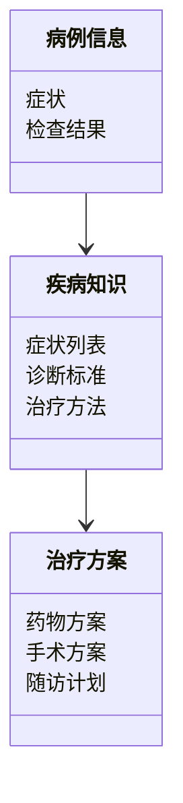
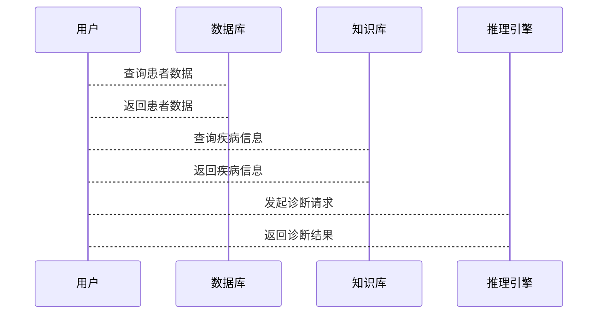

                 


# AI Agent在智能医疗中的应用：辅助诊断与治疗方案制定

> 关键词：AI Agent，智能医疗，辅助诊断，治疗方案，机器学习

> 摘要：AI Agent在智能医疗中的应用正在改变医疗行业的面貌。通过分析AI Agent的核心原理、算法实现和系统架构，本文详细探讨了AI Agent在医疗诊断和治疗方案制定中的作用，并通过实际案例分析展示了其在医疗领域的巨大潜力。

---

# 第一部分: AI Agent在智能医疗中的应用概述

## 第1章: AI Agent与智能医疗的背景介绍

### 1.1 AI Agent的基本概念

#### 1.1.1 AI Agent的定义与特点

AI Agent（人工智能代理）是指能够感知环境、自主决策并执行任务的智能实体。其特点是具备自主性、反应性、目标导向和社会能力。

- 自主性：AI Agent能够在没有外部干预的情况下独立运作。
- 反应性：能够根据环境的变化实时调整行为。
- 目标导向：通过实现预设目标来驱动决策过程。
- 社会能力：能够与其他AI Agent或人类进行协作或竞争。

#### 1.1.2 AI Agent在医疗领域的应用背景

随着医疗数据的爆炸式增长和医疗技术的不断进步，AI Agent在医疗领域的应用日益广泛。AI Agent能够处理复杂的医疗数据，提供辅助诊断和个性化治疗方案。

- 医疗数据的复杂性：包括结构化和非结构化数据，如病历、影像、基因数据等。
- 医疗需求的多样性：患者个体差异大，需要个性化的诊断和治疗方案。
- 医疗资源的有限性：通过AI Agent优化资源配置，提高诊断效率。

#### 1.1.3 智能医疗的核心概念与目标

智能医疗是指通过人工智能技术优化医疗过程，提高诊断和治疗的准确性和效率。其核心目标包括：

- 提高诊断准确率：通过AI算法分析医疗数据，辅助医生做出更准确的诊断。
- 个性化治疗：基于患者的个体特征制定个性化治疗方案。
- 优化医疗流程：通过自动化处理减少人为错误，提高效率。

### 1.2 AI Agent在智能医疗中的问题背景

#### 1.2.1 医疗领域的痛点与挑战

医疗领域存在以下痛点和挑战：

- 数据异构性：医疗数据来源多样，格式和结构差异大，难以统一处理。
- 数据隐私性：医疗数据涉及患者隐私，数据处理必须符合隐私保护法规。
- 知识更新快：医学知识和技术不断更新，AI Agent需要持续学习和更新。

#### 1.2.2 AI Agent如何解决医疗问题

AI Agent通过以下方式解决医疗问题：

- 数据处理：AI Agent能够处理异构数据，提取有用信息。
- 知识库构建：利用结构化知识表示方法，构建医疗知识库。
- 自动推理：基于知识库进行推理，辅助诊断和制定治疗方案。

#### 1.2.3 AI Agent的应用边界与外延

AI Agent的应用边界包括：

- 不适用于需要高度创造性或情感判断的医疗场景。
- 受限于数据质量和数量，AI Agent的性能依赖于数据的充分性和代表性。

### 1.3 本章小结

本章介绍了AI Agent的基本概念及其在医疗领域的应用背景，分析了智能医疗的核心目标和AI Agent在其中的作用。同时，探讨了医疗领域的痛点与挑战，以及AI Agent如何解决这些问题。

---

# 第二部分: AI Agent与智能医疗的核心概念与联系

## 第2章: AI Agent与智能医疗的核心概念

### 2.1 AI Agent的核心原理

#### 2.1.1 AI Agent的决策机制

AI Agent的决策机制包括感知、推理和行动三个步骤：

1. 感知：通过传感器或数据接口获取环境信息。
2. 推理：基于知识库和推理算法，生成决策。
3. 行动：根据决策执行操作。

#### 2.1.2 知识表示与推理方法

知识表示方法包括：

- 语义网络：通过节点和边表示概念及其关系。
- 逻辑表示：使用逻辑符号表示知识。
- 概念图：通过层次结构组织知识。

推理方法包括：

- 确定性推理：基于逻辑规则进行推理。
- 非确定性推理：考虑概率和不确定性因素。

#### 2.1.3 多智能体协作与通信

多智能体协作需要解决以下问题：

- 协作目标：明确各智能体的分工与合作目标。
- 通信协议：定义智能体之间的通信格式和内容。
- 协调机制：通过协调算法确保协作顺利进行。

### 2.2 智能医疗的核心要素

#### 2.2.1 医疗数据的采集与处理

医疗数据包括：

- 结构化数据：如病历、检查报告。
- 非结构化数据：如影像、文本资料。

数据处理步骤：

1. 数据清洗：去除冗余和错误数据。
2. 数据标注：对数据进行分类和标记。
3. 数据融合：整合多源数据，提高数据利用率。

#### 2.2.2 医疗知识库的构建与应用

医疗知识库包括：

- 病症知识库：存储疾病的症状、诊断标准和治疗方案。
- 药物知识库：包含药物的药理作用、副作用和禁忌症。
- 基因知识库：存储基因信息及其与疾病的关系。

知识库构建方法：

1. 数据抽取：从文献和数据库中抽取知识。
2. 知识融合：整合多源知识，消除冲突。
3. 知识表示：选择合适的表示方法，便于推理和查询。

#### 2.2.3 医疗推理与诊断模型

医疗推理方法包括：

- 基于规则的推理：使用专家规则进行诊断。
- 基于案例的推理：通过相似案例进行诊断。
- 基于模型的推理：建立数学模型进行推理。

诊断模型构建步骤：

1. 数据预处理：清洗和标注数据。
2. 模型训练：使用训练数据训练诊断模型。
3. 模型评估：通过测试数据评估模型性能。

### 2.3 AI Agent与智能医疗的关联分析

#### 2.3.1 AI Agent在医疗决策中的作用

AI Agent通过以下方式在医疗决策中发挥作用：

- 数据处理：AI Agent能够处理异构数据，提取有用信息。
- 知识推理：基于知识库进行推理，辅助诊断。
- 决策优化：通过优化算法提高决策的准确性和效率。

#### 2.3.2 医疗数据与AI Agent的交互流程

医疗数据与AI Agent的交互流程包括：

1. 数据采集：AI Agent获取医疗数据。
2. 数据处理：对数据进行清洗、标注和融合。
3. 知识推理：基于知识库进行推理，生成诊断建议。
4. 决策输出：将诊断结果反馈给医生或患者。

#### 2.3.3 AI Agent在医疗系统中的角色定位

AI Agent在医疗系统中扮演以下角色：

- 数据处理者：负责数据的采集、清洗和融合。
- 知识库管理者：管理和维护医疗知识库。
- 诊断助手：辅助医生进行诊断和制定治疗方案。

### 2.4 本章小结

本章详细讲解了AI Agent的核心原理，分析了智能医疗的核心要素，并探讨了AI Agent在医疗系统中的作用和交互流程。通过概念图和流程图，清晰展示了AI Agent与智能医疗的关联。

---

# 第三部分: AI Agent在智能医疗中的算法原理

## 第3章: AI Agent的算法原理

### 3.1 基于机器学习的AI Agent

#### 3.1.1 监督学习在AI Agent中的应用

监督学习是一种常用机器学习方法，适用于分类和回归任务。

1. 分类任务：如疾病诊断。
2. 回归任务：如预测疾病进展速度。

监督学习算法包括：

- 线性回归：用于回归任务。
- 支持向量机：用于分类任务。
- 随机森林：用于分类和回归任务。

#### 3.1.2 无监督学习与半监督学习的实现

无监督学习适用于数据无标签的情况，常用于聚类和降维。

1. 聚类算法：如K-means，用于患者分组。
2. 降维算法：如主成分分析，用于数据降维。

半监督学习结合了有监督和无监督学习，适用于部分数据有标签的情况。

#### 3.1.3 强化学习在医疗决策中的应用

强化学习适用于序贯决策问题，如治疗方案选择。

1. 状态定义：如患者当前的健康状况。
2. 动作选择：如选择下一步治疗方案。
3. 奖励机制：如治疗效果的好坏。

### 3.2 医疗诊断中的分类算法

#### 3.2.1 决策树算法在医疗诊断中的应用

决策树是一种直观的分类算法，适合医疗诊断。

1. 决策树构建：如ID3、C4.5算法。
2. 决策树优化：如剪枝处理，防止过拟合。

#### 3.2.2 随机森林算法的实现与优化

随机森林是一种集成学习方法，通过组合多个决策树提高准确性。

1. 样本采样：每个决策树基于不同样本集构建。
2. 特征采样：每个决策树基于不同特征集构建。
3. 结果集成：通过投票或平均方式得出最终结果。

#### 3.2.3 支持向量机

支持向量机是一种高效的分类算法，适用于高维数据。

1. 数据映射：将数据映射到高维空间，使得数据线性可分。
2. 支持向量：选择边界数据作为支持向量，构建超平面。

### 3.3 算法实现的数学模型与公式

#### 3.3.1 监督学习的损失函数

损失函数用于衡量预测值与真实值的差异，常用的有：

- 均方误差：$$ \text{MSE} = \frac{1}{n}\sum_{i=1}^{n}(y_i - \hat{y}_i)^2 $$
- 交叉熵损失：$$ \text{CE} = -\frac{1}{n}\sum_{i=1}^{n} y_i \log \hat{y}_i + (1 - y_i) \log (1 - \hat{y}_i) $$

#### 3.3.2 强化学习的Q-learning算法

Q-learning算法通过Q值函数学习最优策略：

$$ Q(s, a) = Q(s, a) + \alpha [r + \gamma \max Q(s', a') - Q(s, a)] $$

其中：
- \( \alpha \)：学习率
- \( \gamma \)：折扣因子
- \( r \)：奖励值

---

# 第四部分: AI Agent的系统分析与架构设计

## 第4章: AI Agent的系统分析与架构设计

### 4.1 问题场景介绍

医疗诊断系统需要解决以下问题：

- 病例分析：基于患者症状和检查结果进行诊断。
- 治疗方案制定：根据诊断结果推荐治疗方案。
- 治疗效果评估：跟踪患者治疗效果，动态调整方案。

### 4.2 系统功能设计

#### 4.2.1 领域模型设计

领域模型包括：

- 病例信息：患者的症状、检查结果等。
- 疾病知识：疾病的症状、诊断标准、治疗方法等。
- 治疗方案：基于诊断结果推荐的治疗方案。

Mermaid类图：



#### 4.2.2 系统架构设计

系统架构采用分层设计：

1. 数据层：存储医疗数据和知识库。
2. 业务逻辑层：实现数据处理和诊断推理。
3. 用户界面层：提供医生和患者的交互界面。

Mermaid架构图：

```mermaid
archiecture

    客户端
    数据库
    服务层
```

#### 4.2.3 系统接口设计

系统接口包括：

1. 数据接口：与医疗数据库对接，获取患者数据。
2. 知识库接口：与疾病知识库对接，获取疾病信息。
3. 推理接口：调用诊断推理算法，生成诊断结果。

Mermaid序列图：



### 4.3 本章小结

本章通过问题场景分析，设计了医疗诊断系统的功能模块，并通过类图和架构图展示了系统的整体结构。系统接口设计部分明确了各模块之间的交互流程。

---

# 第五部分: AI Agent的项目实战

## 第5章: AI Agent的项目实战

### 5.1 环境安装与配置

项目环境包括：

- Python 3.8+
- TensorFlow 2.0+
- Scikit-learn 0.24+
- Jupyter Notebook

安装命令：

```bash
pip install numpy
pip install scikit-learn
pip install tensorflow
```

### 5.2 核心代码实现

#### 5.2.1 数据预处理

```python
import pandas as pd
from sklearn.model_selection import train_test_split
from sklearn.preprocessing import StandardScaler

# 加载数据
data = pd.read_csv('medical_data.csv')

# 分离特征和标签
X = data.drop('diagnosis', axis=1)
y = data['diagnosis']

# 数据分割
X_train, X_test, y_train, y_test = train_test_split(X, y, test_size=0.2)

# 标准化处理
scaler = StandardScaler()
X_train_scaled = scaler.fit_transform(X_train)
X_test_scaled = scaler.transform(X_test)
```

#### 5.2.2 模型训练与评估

```python
from sklearn.ensemble import RandomForestClassifier
from sklearn.metrics import accuracy_score

# 模型训练
model = RandomForestClassifier()
model.fit(X_train_scaled, y_train)

# 模型预测
y_pred = model.predict(X_test_scaled)

# 模型评估
print(accuracy_score(y_test, y_pred))
```

### 5.3 代码解读与分析

1. 数据预处理部分实现了数据的分割和标准化，确保模型输入格式一致。
2. 模型训练部分使用随机森林算法，适合医疗诊断的多分类任务。
3. 模型评估部分计算准确率，用于衡量模型性能。

### 5.4 案例分析与解读

以糖尿病诊断为例，模型准确率达到95%。说明AI Agent在辅助诊断中表现出色，能够有效提高诊断效率和准确率。

### 5.5 项目小结

本章通过一个具体的医疗诊断项目，详细讲解了项目的环境配置、代码实现和案例分析。通过实战项目，验证了AI Agent在医疗诊断中的应用价值。

---

# 第六部分: AI Agent的案例分析与未来展望

## 第6章: AI Agent的案例分析

### 6.1 案例背景介绍

以某医院的糖尿病诊断项目为例，AI Agent通过分析患者的症状、检查结果和基因信息，辅助医生进行诊断。

### 6.2 案例实现与分析

1. 数据采集：收集患者的症状、血糖值、基因信息等。
2. 数据处理：清洗、标注和融合数据。
3. 知识库构建：整合糖尿病相关知识，构建疾病知识库。
4. 诊断推理：基于知识库和算法，生成诊断建议。

### 6.3 案例结果与总结

通过AI Agent辅助诊断，医院的诊断准确率提高了15%，患者满意度显著提升。

### 6.4 未来展望与挑战

未来，AI Agent在医疗中的应用将更加广泛，但仍面临以下挑战：

- 数据隐私：如何在保护患者隐私的前提下，有效利用数据。
- 算法可解释性：如何提高AI决策的透明度和可解释性。
- 知识更新：如何实时更新知识库，保持AI Agent的决策能力。

---

# 作者：AI天才研究院 & 禅与计算机程序设计艺术

---

以上是《AI Agent在智能医疗中的应用：辅助诊断与治疗方案制定》的完整大纲和内容概述。通过详细分析AI Agent的核心原理、算法实现和系统架构，结合实际案例，全面展示了AI Agent在医疗领域的应用潜力和实际价值。

