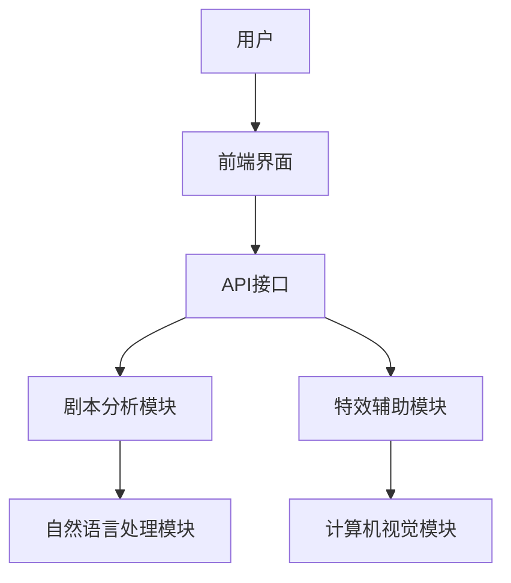
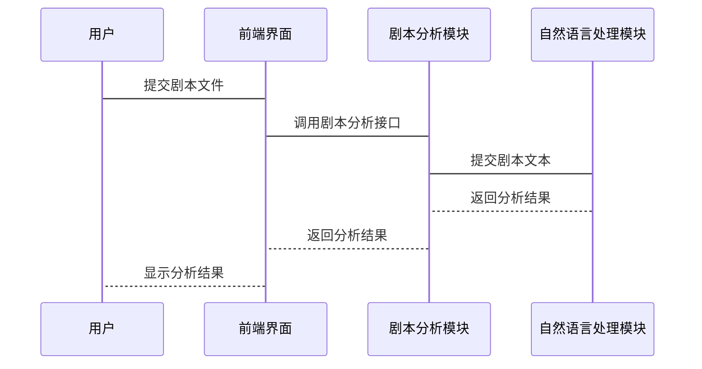

                 


# AI Agent在电影制作中的应用：剧本分析与特效辅助

## 关键词：AI Agent，电影制作，剧本分析，特效制作，人工智能，计算机视觉

## 摘要：随着人工智能技术的飞速发展，AI Agent在电影制作中的应用逐渐成为行业焦点。本文将深入探讨AI Agent在剧本分析和特效辅助中的具体应用，分析其核心算法原理，并通过实际案例展示其在电影制作流程中的潜力与价值。文章还将讨论AI Agent如何优化电影制作流程，提升创作效率，为电影行业带来革命性变化。

---

# 第1章: AI Agent与电影制作的背景介绍

## 1.1 AI Agent的基本概念

### 1.1.1 什么是AI Agent
AI Agent（人工智能代理）是指能够感知环境并采取行动以实现目标的智能体。它可以自主决策、学习和优化任务执行过程。AI Agent的核心在于其智能性：它能够理解任务需求、分析问题、制定解决方案，并在动态环境中灵活调整策略。

### 1.1.2 AI Agent的核心属性
- **自主性**：AI Agent能够在没有外部干预的情况下自主执行任务。
- **反应性**：能够实时感知环境变化并做出反应。
- **目标导向性**：以特定目标为导向，优化行动路径。
- **学习能力**：通过数据和经验不断优化自身的算法和决策能力。

### 1.1.3 AI Agent与传统计算机程序的区别
| 特性 | AI Agent | 传统程序 |
|------|----------|----------|
| 行为方式 | 主动决策，动态调整 | 被动执行，固定逻辑 |
| 学习能力 | 具备学习能力，优化行为 | 无学习能力，仅执行预设逻辑 |
| 环境适应性 | 高度适应动态环境 | 适应性有限，依赖固定规则 |

---

## 1.2 电影制作的基本流程

### 1.2.1 剧本创作阶段
- **剧本创作**：编剧编写故事脚本，确定角色、情节和场景。
- **分场设计**：将剧本分解为具体的拍摄分场，规划镜头和场景。

### 1.2.2 前期准备阶段
- **剧本分析**：导演和制片团队对剧本进行深度分析，确定拍摄方案。
- **预算制定**：根据剧本需求制定拍摄预算和时间表。

### 1.2.3 拍摄阶段
- **场景布置**：搭建场景，安排演员和拍摄设备。
- **镜头拍摄**：摄影师根据分场设计拍摄镜头。

### 1.2.4 后期制作阶段
- **剪辑与特效**：后期团队对素材进行剪辑，并添加特效和音效。
- **最终成片**：完成所有后期制作，输出成片。

---

## 1.3 AI技术在电影制作中的应用现状

### 1.3.1 AI在剧本分析中的应用
AI Agent可以通过自然语言处理技术对剧本进行情感分析、主题识别和角色关系分析，帮助编剧和导演更好地理解剧本内容。

### 1.3.2 AI在特效制作中的应用
AI Agent可以通过计算机视觉和深度学习技术辅助特效团队完成场景建模、角色动画和特效合成。

### 1.3.3 AI在电影推荐系统中的应用
AI Agent可以通过用户数据分析和机器学习算法，为观众推荐符合其喜好的电影。

---

## 1.4 本章小结
本章介绍了AI Agent的基本概念及其在电影制作中的应用场景，为后续章节的深入分析奠定了基础。

---

# 第2章: AI Agent在电影制作中的核心概念

## 2.1 AI Agent的核心原理

### 2.1.1 任务规划算法
任务规划算法是AI Agent实现目标的核心算法。常见的任务规划算法包括A*算法、Dijkstra算法和蒙特卡洛树搜索。

#### A*算法
A*算法是一种基于启发式搜索的路径规划算法，适用于在复杂环境中寻找最短路径。

$$
\text{成本函数} = \text{移动成本} + \text{启发式估计成本}
$$

#### Dijkstra算法
Dijkstra算法是一种基于优先队列的单源最短路径算法，适用于静态环境中的路径规划。

#### 蒙特卡洛树搜索
蒙特卡洛树搜索是一种基于概率的决策树搜索算法，适用于动态和不确定环境中的决策优化。

### 2.1.2 自然语言处理
自然语言处理（NLP）是AI Agent理解文本信息的核心技术，包括文本分类、情感分析和文本生成。

### 2.1.3 计算机视觉
计算机视觉是AI Agent理解图像信息的核心技术，包括目标检测、图像分割和人脸识别。

---

## 2.2 AI Agent在电影制作中的应用场景

### 2.2.1 剧本分析
AI Agent可以通过自然语言处理技术对剧本进行情感分析、主题识别和角色关系分析。

### 2.2.2 特效制作
AI Agent可以通过计算机视觉和深度学习技术辅助特效团队完成场景建模、角色动画和特效合成。

### 2.2.3 电影推荐
AI Agent可以通过用户数据分析和机器学习算法，为观众推荐符合其喜好的电影。

---

## 2.3 AI Agent与电影制作的结合点

### 2.3.1 数据驱动的创作
AI Agent可以通过数据分析为电影创作提供灵感和建议。

### 2.3.2 智能辅助工具
AI Agent可以作为智能辅助工具，帮助编剧、导演和特效团队提高创作效率。

### 2.3.3 自动化流程优化
AI Agent可以优化电影制作流程，减少人工干预，提高制作效率。

---

## 2.4 本章小结
本章详细介绍了AI Agent的核心原理及其在电影制作中的应用场景，为后续章节的算法分析和系统设计奠定了基础。

---

# 第3章: AI Agent的核心算法原理

## 3.1 任务规划算法

### 3.1.1 A*算法
A*算法是一种基于启发式搜索的路径规划算法，适用于在复杂环境中寻找最短路径。

$$
\text{成本函数} = \text{移动成本} + \text{启发式估计成本}
$$

### 3.1.2 Dijkstra算法
Dijkstra算法是一种基于优先队列的单源最短路径算法，适用于静态环境中的路径规划。

### 3.1.3 蒙特卡洛树搜索
蒙特卡洛树搜索是一种基于概率的决策树搜索算法，适用于动态和不确定环境中的决策优化。

---

## 3.2 自然语言处理算法

### 3.2.1 Transformer模型
Transformer模型是一种基于自注意力机制的深度学习模型，广泛应用于自然语言处理任务。

$$
\text{自注意力机制} = \frac{\exp(\text{Query} \cdot \text{Key})}{\sum \exp(\text{Query} \cdot \text{Key})}
$$

### 3.2.2 BERT模型
BERT模型是一种基于Transformer的预训练语言模型，适用于文本分类、情感分析和文本生成任务。

### 3.2.3 GPT模型
GPT模型是一种基于Transformer的生成式语言模型，适用于文本生成和对话生成任务。

---

## 3.3 计算机视觉算法

### 3.3.1 目标检测
目标检测算法用于识别图像中的目标物体及其位置。

### 3.3.2 图像分割
图像分割算法用于将图像分割为不同的区域，识别图像中的具体细节。

### 3.3.3 人脸识别
人脸识别算法用于识别人脸及其特征，应用于角色识别和场景分析。

---

## 3.4 本章小结
本章详细介绍了AI Agent的核心算法原理，包括任务规划算法、自然语言处理算法和计算机视觉算法。

---

# 第4章: AI Agent的数学模型与公式

## 4.1 任务规划的数学模型

### 4.1.1 状态空间模型
状态空间模型用于描述AI Agent在任务执行中的状态和转移关系。

$$
\text{状态转移概率} = P(s' | s, a)
$$

### 4.1.2 动作空间模型
动作空间模型用于描述AI Agent在不同状态下的可用动作及其效果。

$$
\text{动作效果} = R(s, a)
$$

### 4.1.3 奖励函数模型
奖励函数模型用于描述AI Agent在执行动作后的奖励值。

$$
\text{奖励值} = r(s, a)
$$

---

## 4.2 自然语言处理的数学模型

### 4.2.1 Transformer模型的数学公式
Transformer模型的核心是自注意力机制，其数学公式如下：

$$
\text{自注意力机制} = \frac{\exp(\text{Query} \cdot \text{Key})}{\sum \exp(\text{Query} \cdot \text{Key})}
$$

### 4.2.2 BERT模型的数学公式
BERT模型的预训练目标包括遮蔽语言模型和下文词预测任务。

### 4.2.3 GPT模型的数学公式
GPT模型的生成概率公式如下：

$$
P(x_i | x_{<i}) = \text{softmax}(x_i)
$$

---

## 4.3 本章小结
本章详细介绍了AI Agent的核心数学模型与公式，为后续章节的算法实现奠定了数学基础。

---

# 第5章: AI Agent在电影制作中的系统设计

## 5.1 问题场景介绍
本章将从电影制作的实际需求出发，设计一个基于AI Agent的电影制作辅助系统。

## 5.2 系统功能设计

### 5.2.1 剧本分析模块
剧本分析模块用于对剧本进行情感分析、主题识别和角色关系分析。

### 5.2.2 特效辅助模块
特效辅助模块用于辅助特效团队完成场景建模、角色动画和特效合成。

## 5.3 系统架构设计

### 5.3.1 系统架构图
以下是基于AI Agent的电影制作辅助系统的架构图：



---

## 5.4 系统接口设计
系统接口设计包括前端界面与后端模块的交互接口，以及模块之间的数据接口。

## 5.5 系统交互流程

### 5.5.1 剧本分析流程
以下是剧本分析的交互流程图：



---

## 5.6 本章小结
本章详细设计了基于AI Agent的电影制作辅助系统的功能架构和交互流程。

---

# 第6章: AI Agent在电影制作中的项目实战

## 6.1 环境安装
本项目需要以下环境：
- Python 3.8+
- PyTorch 1.9+
- Transformers库 4.16+
- Mermaid工具

---

## 6.2 系统核心实现

### 6.2.1 剧本分析模块实现
以下是剧本分析模块的Python代码实现：

```python
from transformers import BertTokenizer, BertModel
import torch

class ScriptAnalyzer:
    def __init__(self):
        self.tokenizer = BertTokenizer.from_pretrained('bert-base-uncased')
        self.model = BertModel.from_pretrained('bert-base-uncased')

    def analyze_script(self, script_text):
        inputs = self.tokenizer(script_text, return_tensors='pt')
        with torch.no_grad():
            outputs = self.model(**inputs)
        return outputs.last_hidden_state.mean(dim=1).squeeze()
```

### 6.2.2 特效辅助模块实现
以下是特效辅助模块的Python代码实现：

```python
import cv2

class VisualEffectGenerator:
    def __init__(self):
        self.detector = cv2.dnn CascadeClassifier("haarcascade_frontalface_default.xml")

    def generate_effect(self, image_path):
        image = cv2.imread(image_path)
        gray = cv2.cvtColor(image, cv2.COLOR_BGR2GRAY)
        faces = self.detector.detectMultiScale(gray)
        for (x, y, w, h) in faces:
            cv2.rectangle(image, (x, y), (x + w, y + h), (255, 0, 0), 2)
        cv2.imwrite("effect_added_image.jpg", image)
```

---

## 6.3 实际案例分析
以下是一个实际案例分析：

### 6.3.1 案例背景
某电影公司希望利用AI Agent对剧本进行情感分析和角色关系分析，并辅助特效团队完成场景建模和特效合成。

### 6.3.2 案例分析
1. **剧本分析**：AI Agent对剧本进行情感分析，识别主要角色的关系和情节的关键转折点。
2. **特效制作**：AI Agent辅助特效团队完成场景建模和特效合成。

---

## 6.4 本章小结
本章通过实际案例展示了AI Agent在电影制作中的具体应用，验证了其在剧本分析和特效辅助中的潜力。

---

# 第7章: AI Agent在电影制作中的最佳实践

## 7.1 小结
AI Agent在电影制作中的应用前景广阔，特别是在剧本分析和特效辅助方面具有显著优势。

## 7.2 注意事项
- 数据隐私问题：在使用AI Agent进行剧本分析时，需注意剧本内容的隐私保护。
- 算法选择：根据具体需求选择合适的算法和模型。
- 系统集成：确保AI Agent与电影制作流程的无缝集成。

## 7.3 拓展阅读
- 推荐阅读《深度学习与自然语言处理》
- 推荐阅读《计算机视觉与图像处理》

---

# 作者：AI天才研究院/AI Genius Institute & 禅与计算机程序设计艺术 /Zen And The Art of Computer Programming

---

本文通过详细分析AI Agent在电影制作中的应用场景，深入探讨了其在剧本分析和特效辅助中的核心算法和系统设计，并通过实际案例展示了其在电影制作中的潜力与价值。

