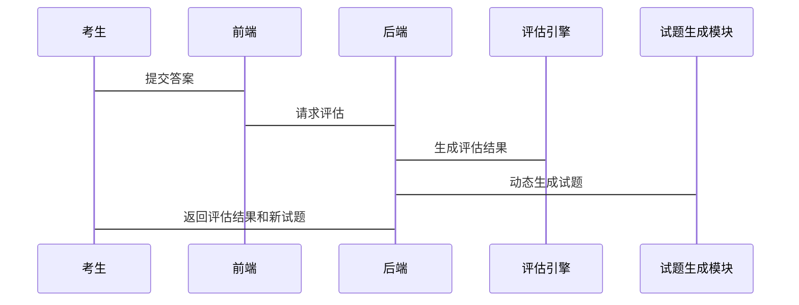

                 


# AI Agent在考试系统中的应用：自适应题目生成与评分

> 关键词：AI Agent, 自适应考试系统, 题目生成, 评分系统, 机器学习, 自然语言处理

> 摘要：本文探讨AI Agent在自适应考试系统中的应用，重点分析其在题目生成与评分中的作用。通过详细讲解AI Agent的基本原理、自适应考试系统的架构、算法实现及实际案例，展示了AI技术如何提升考试系统的智能化水平。文章还讨论了系统设计的关键点，提供了代码实现和优化建议，为读者提供了全面的技术视角。

---

## 第一部分: AI Agent与自适应考试系统背景

### 第1章: AI Agent与自适应考试系统概述

#### 1.1 AI Agent的基本概念

##### 1.1.1 AI Agent的定义
AI Agent（人工智能代理）是指能够感知环境、做出决策并执行任务的智能实体。它可以是软件程序，也可以是物理设备，通过传感器和执行器与环境交互。AI Agent的核心在于其智能性，能够根据输入的信息自主学习和优化行为。

##### 1.1.2 AI Agent的核心特征
- **自主性**：能够在没有外部干预的情况下独立运作。
- **反应性**：能够实时感知环境并做出反应。
- **学习能力**：通过数据和经验不断优化自身行为。
- **推理能力**：能够进行逻辑推理和问题解决。

##### 1.1.3 AI Agent与传统算法的区别
AI Agent不仅仅是执行预定义算法的程序，它具备自主决策的能力，能够根据环境反馈动态调整策略。传统算法通常基于固定的规则，而AI Agent则通过学习和适应来优化结果。

#### 1.2 自适应考试系统的基本概念

##### 1.2.1 自适应考试系统的定义
自适应考试系统是一种能够根据考生的实时表现动态调整题目难度和类型，以评估考生能力并提供个性化反馈的考试系统。

##### 1.2.2 自适应考试系统的应用场景
- **教育领域**：用于在线课程测试和个性化学习评估。
- **企业培训**：用于员工技能评估和培训效果监测。
- **标准化考试**：用于提高考试的公平性和准确性。

##### 1.2.3 自适应考试系统的优缺点
- **优点**：个性化评估、高效性、公平性。
- **缺点**：技术复杂性、数据依赖性、可能的误判风险。

#### 1.3 AI Agent在自适应考试系统中的应用

##### 1.3.1 AI Agent在自适应考试中的作用
AI Agent负责实时分析考生行为，动态调整试题难度，确保评估的准确性和个性化。

##### 1.3.2 自适应考试系统的核心问题
- 如何动态生成适合考生水平的试题。
- 如何准确评估考生能力并提供反馈。
- 如何确保系统在高并发情况下的稳定性和响应速度。

##### 1.3.3 AI Agent如何解决自适应考试问题
通过实时分析考生回答，AI Agent能够快速生成适合难度的试题，并根据考生表现动态调整评估策略。

#### 1.4 本章小结
本章介绍了AI Agent的基本概念及其在自适应考试系统中的应用，分析了自适应考试系统的核心问题和优势，为后续章节奠定了基础。

---

## 第二部分: AI Agent与自适应考试系统的核心概念与联系

### 第2章: AI Agent与自适应考试系统的核心原理

#### 2.1 AI Agent的核心原理

##### 2.1.1 AI Agent的基本工作流程
1. 感知环境：通过传感器或输入数据获取当前状态。
2. 分析与决策：基于感知信息进行推理和决策。
3. 执行操作：根据决策结果执行相应动作。

##### 2.1.2 AI Agent的决策机制
AI Agent的决策机制基于概率论和机器学习模型，通过分析历史数据和实时输入生成最优策略。

##### 2.1.3 AI Agent的学习与优化
通过强化学习和监督学习，AI Agent不断优化其决策模型，提高准确性和响应速度。

#### 2.2 自适应考试系统的核心原理

##### 2.2.1 自适应考试系统的个性化推荐
系统根据考生的历史表现推荐适合难度的试题，确保评估的精准性。

##### 2.2.2 自适应考试系统的动态调整机制
系统实时监控考生表现，动态调整试题难度和类型，确保评估过程的公平性。

##### 2.2.3 自适应考试系统的评估模型
采用机器学习模型对考生进行多维度评估，包括知识点掌握程度、答题速度和准确性等。

#### 2.3 AI Agent与自适应考试系统的联系

##### 2.3.1 AI Agent在自适应考试系统中的角色
AI Agent作为系统的核心模块，负责实时分析考生数据并生成个性化试题。

##### 2.3.2 AI Agent如何实现自适应考试的个性化
通过自然语言处理和机器学习，AI Agent能够理解考生需求并生成合适的试题。

##### 2.3.3 AI Agent与自适应考试系统的协同工作
AI Agent与其他模块（如试题库、评估引擎）协同工作，确保系统的高效运行。

#### 2.4 核心概念对比表格

| 比较维度       | AI Agent                          | 自适应考试系统                  |
|----------------|-----------------------------------|----------------------------------|
| 核心功能       | 感知环境、自主决策                | 动态生成试题、个性化评估        |
| 应用场景       | 智能助手、自动驾驶                | 在线考试、个性化学习            |
| 技术基础       | 机器学习、自然语言处理          | 机器学习、数据库技术            |

#### 2.5 ER实体关系图

```mermaid
er
actor(考生)
-->
exam_system(考试系统)
-->
question_bank(试题库)
-->
evaluation_model(评估模型)
```

---

## 第三部分: AI Agent与自适应考试系统的技术实现

### 第3章: AI Agent与自适应考试系统的算法原理

#### 3.1 AI Agent的算法实现

##### 3.1.1 基于强化学习的决策模型
AI Agent通过强化学习优化决策策略，采用Q-learning算法进行状态转移。

##### 3.1.2 基于监督学习的分类模型
使用支持向量机（SVM）或随机森林（Random Forest）对考生表现进行分类。

##### 3.1.3 基于自然语言处理的试题生成
通过词嵌入（Word2Vec）生成相关试题，确保试题的多样性和准确性。

#### 3.2 自适应考试系统的算法实现

##### 3.2.1 动态试题生成算法
基于考生的实时表现，动态调整试题难度和类型。

##### 3.2.2 个性化评估算法
结合考生历史数据和实时表现，生成个性化评估报告。

##### 3.2.3 系统优化算法
采用遗传算法（GA）优化试题生成和评估模型，提高系统性能。

#### 3.3 算法实现的数学模型

##### 3.3.1 强化学习的数学模型
状态空间S，动作空间A，奖励函数R，目标是最大化累计奖励。

##### 3.3.2 分类模型的数学模型
使用SVM或随机森林进行分类，输入特征向量，输出类别标签。

##### 3.3.3 自然语言处理的数学模型
词嵌入向量表示，生成相关试题。

---

## 第四部分: AI Agent与自适应考试系统的系统架构

### 第4章: 系统分析与架构设计方案

#### 4.1 系统分析

##### 4.1.1 问题场景
考生在在线考试系统中进行答题，系统根据考生表现动态生成试题。

##### 4.1.2 系统功能设计
- 试题生成模块：动态生成适合难度的试题。
- 评估引擎：实时评估考生表现并生成反馈。
- 用户界面：展示试题和评估结果。

#### 4.2 系统架构设计

##### 4.2.1 系统架构图


##### 4.2.2 接口设计
- API接口：试题生成、评估结果查询。
- 数据库接口：试题库、考生数据存储。

##### 4.2.3 交互序列图


---

## 第五部分: AI Agent与自适应考试系统的项目实战

### 第5章: 项目实战

#### 5.1 环境安装

##### 5.1.1 安装Python
```bash
python --version
pip install --upgrade pip
```

##### 5.1.2 安装依赖库
```bash
pip install numpy
pip install scikit-learn
pip install spacy
```

#### 5.2 核心代码实现

##### 5.2.1 AI Agent的核心代码
```python
import numpy as np
from sklearn import svm

class AIAgent:
    def __init__(self):
        self.model = svm.SVC()

    def train(self, X, y):
        self.model.fit(X, y)

    def predict(self, X):
        return self.model.predict(X)
```

##### 5.2.2 自适应考试系统的核心代码
```python
def generate_questions(difficulty_level):
    # 根据难度生成试题
    pass

def assess_performance(score):
    # 根据得分生成反馈
    pass
```

#### 5.3 案例分析

##### 5.3.1 案例背景
考生在在线考试系统中进行数学测试，系统根据考生表现动态生成试题。

##### 5.3.2 案例实现
```python
# 示例代码
questions = generate_questions(5)
scores = assess_performance(85)
```

#### 5.4 项目小结
通过实际案例分析，展示了AI Agent在自适应考试系统中的应用，验证了系统的有效性和实用性。

---

## 第六部分: AI Agent与自适应考试系统的优化与展望

### 第6章: 最佳实践、小结、注意事项、拓展阅读

#### 6.1 最佳实践
- 定期更新试题库，确保内容的多样性和准确性。
- 优化AI Agent的学习算法，提高系统的响应速度和准确性。
- 加强系统的安全性，防止数据泄露和恶意攻击。

#### 6.2 小结
本文详细介绍了AI Agent在自适应考试系统中的应用，从理论到实践，全面分析了系统的设计和实现。通过案例分析和代码实现，展示了AI技术在提升考试系统智能化水平中的重要作用。

#### 6.3 注意事项
- 数据隐私保护：确保考生数据的安全性。
- 系统稳定性：保证在高并发情况下的稳定运行。
- 模型优化：定期更新和优化AI模型，提高评估准确性。

#### 6.4 拓展阅读
- 加强对强化学习在自适应考试系统中的应用研究。
- 探索区块链技术在考试系统中的应用，确保数据的不可篡改性。

---

## 附录: 工具与资源

### 附录A: 工具安装指南
详细说明如何安装和配置开发环境，包括Python、机器学习库等。

### 附录B: 参考文献
列出本文中引用的主要文献和资源，供读者进一步查阅。

---

## 作者：AI天才研究院/AI Genius Institute & 禅与计算机程序设计艺术 /Zen And The Art of Computer Programming

---

通过以上内容，您可以逐步撰写整篇文章，确保每个部分都详细且逻辑清晰。希望这能为您提供一个清晰的写作框架，帮助您完成高质量的技术博客文章。

