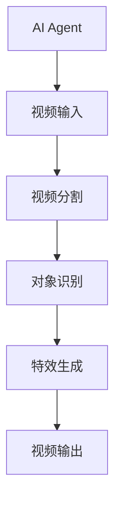
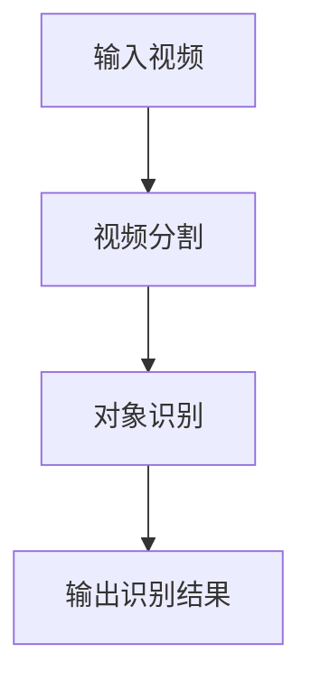
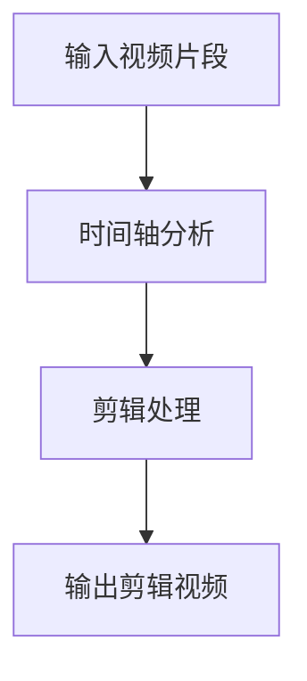
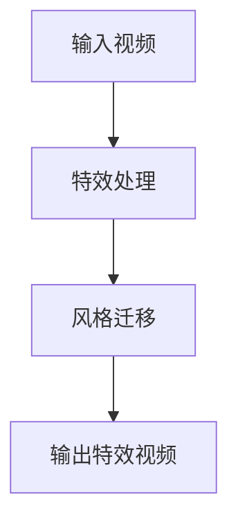
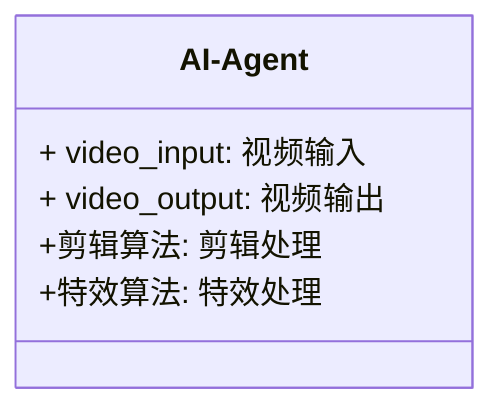
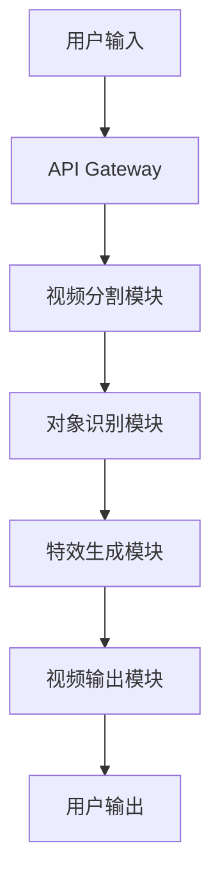
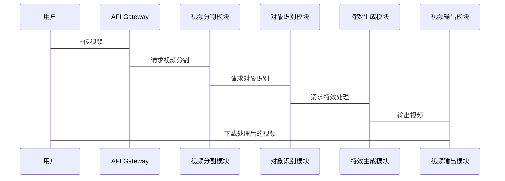

                 


# AI Agent在视频编辑中的应用：自动剪辑与特效添加

> 关键词：AI Agent, 视频编辑, 自动剪辑, 特效添加, 深度学习, 人工智能

> 摘要：本文探讨AI Agent在视频编辑中的应用，重点分析其在自动剪辑和特效添加方面的原理与实现。通过背景介绍、核心概念、算法原理、系统设计和项目实战，深入解析AI Agent如何提升视频编辑效率和效果。

---

## 第一部分：AI Agent在视频编辑中的应用概述

### 第1章：AI Agent与视频编辑的背景介绍

#### 1.1 AI Agent的基本概念
- **AI Agent的定义**：AI Agent（人工智能代理）是指能够感知环境、自主决策并执行任务的智能实体。
- **视频编辑的基本概念**：视频编辑是对视频内容进行剪辑、调整和添加特效的过程。
- **AI在视频编辑中的应用背景**：传统视频编辑依赖人工操作，耗时且效率低。AI Agent的引入极大地提升了编辑效率和效果。

#### 1.2 AI Agent在视频编辑中的问题背景
- **传统视频编辑的痛点**：人工操作耗时长，效率低，且需要专业技能。
- **AI Agent如何解决这些问题**：通过自动化处理，AI Agent能够快速完成剪辑和特效添加，降低门槛。
- **视频编辑的边界与外延**：视频编辑不仅包括剪辑，还包括特效、格式转换等多个方面。

#### 1.3 AI Agent的核心概念与联系
- **AI Agent的核心要素组成**：感知、决策、执行。
- **视频编辑中的关键环节**：视频分割、剪辑、特效生成。
- **AI Agent与视频编辑的关系**：AI Agent通过自动化处理提升视频编辑的效率和质量。

---

### 第2章：AI Agent的核心概念与原理

#### 2.1 AI Agent的基本原理
- **感知阶段**：AI Agent通过摄像头或传感器获取环境信息。
- **决策阶段**：基于感知信息，AI Agent利用算法做出决策。
- **执行阶段**：根据决策结果，AI Agent执行相应的操作。

#### 2.2 视频编辑中的AI Agent核心概念
- **视频分割与对象识别**：AI Agent能够识别视频中的对象并进行分割。
- **视频剪辑与时间轴调整**：AI Agent能够自动调整视频的时间轴并进行剪辑。
- **特效生成与风格迁移**：AI Agent能够生成特效并进行风格迁移。

#### 2.3 AI Agent与视频编辑的核心联系
- **应用流程**：输入视频→视频分割→对象识别→特效生成→视频输出。
- **实体关系图**：


---

## 第二部分：AI Agent的算法原理

### 第3章：AI Agent在视频编辑中的算法原理

#### 3.1 视频分割与对象识别的算法原理
- **基于深度学习的视频分割算法**：如U-Net和Mask R-CNN。
- **对象识别的主流算法**：如YOLO和Faster R-CNN。
- **算法流程图**：


#### 3.2 视频剪辑与时间轴调整的算法实现
- **基于AI的剪辑算法**：如基于Transformer的模型。
- **时间轴调整的数学模型**：使用插值和优化算法。
- **剪辑算法流程图**：


#### 3.3 特效生成的算法实现
- **基于GAN的特效生成**：如使用CycleGAN进行风格迁移。
- **特效生成的数学模型**：如图像生成网络（GAN）。
- **特效生成流程图**：


---

## 第三部分：系统分析与架构设计

### 第4章：系统分析与架构设计

#### 4.1 项目介绍
- **项目名称**：AI Agent视频编辑系统。
- **项目目标**：实现自动剪辑和特效添加功能。

#### 4.2 系统功能设计
- **领域模型**：


- **系统架构设计**：


#### 4.3 系统接口设计
- **输入接口**：视频文件上传接口。
- **输出接口**：处理后的视频下载接口。

#### 4.4 系统交互流程
- **交互流程图**：


---

## 第四部分：项目实战

### 第5章：项目实战

#### 5.1 环境搭建
- **安装Python**：Python 3.8以上版本。
- **安装依赖**：如TensorFlow、OpenCV、Keras等。

#### 5.2 核心实现
- **视频分割代码示例**：
```python
import tensorflow as tf
from tensorflow.keras import layers

model = tf.keras.Sequential([
    layers.Conv2D(32, (3,3), activation='relu'),
    layers.MaxPooling2D((2,2)),
    layers.Conv2D(64, (3,3), activation='relu'),
    layers.MaxPooling2D((2,2)),
    layers.Flatten(),
    layers.Dense(128, activation='relu'),
    layers.Dense(10, activation='softmax')
])
```

- **对象识别代码示例**：
```python
import cv2

def detect_objects(image):
    # 使用预训练模型进行对象识别
    pass
```

#### 5.3 项目小结
- **实际案例分析**：如自动剪辑用户上传的视频并添加特效。
- **经验总结**：AI Agent在视频编辑中的应用前景广阔，但仍需解决实时性和准确率的问题。

---

## 第五部分：最佳实践

### 第6章：最佳实践

#### 6.1 关键点总结
- **数据质量**：高质量的训练数据是模型准确的关键。
- **模型调优**：通过调整超参数和优化算法提升性能。
- **安全与伦理**：确保AI Agent的安全性，避免滥用。

#### 6.2 注意事项
- **性能优化**：合理优化算法，提升处理速度。
- **用户体验**：设计友好的用户界面，方便用户操作。

#### 6.3 拓展阅读
- **推荐书籍**：《Deep Learning》、《Hands-On Machine Learning with Scikit-Learn, Keras, and TensorFlow》。
- **推荐博客**：相关AI和视频编辑技术博客。

---

## 作者：AI天才研究院/AI Genius Institute & 禅与计算机程序设计艺术/Zen And The Art of Computer Programming

---

本文详细探讨了AI Agent在视频编辑中的应用，从背景介绍到算法实现，再到系统设计和项目实战，为读者提供了全面的视角。希望本文能为相关领域的研究和实践提供有价值的参考。

