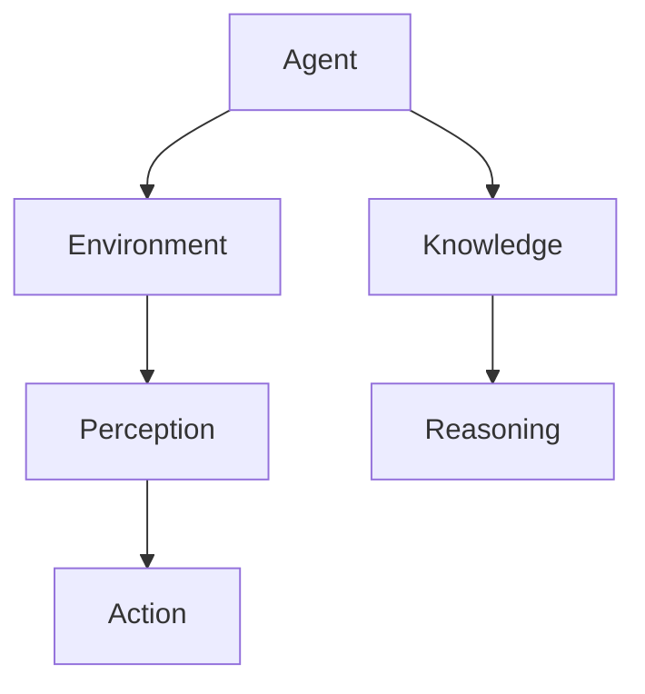
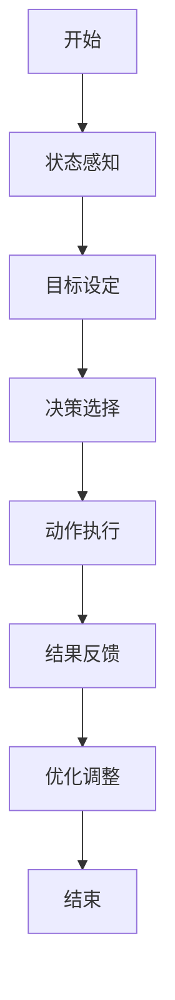
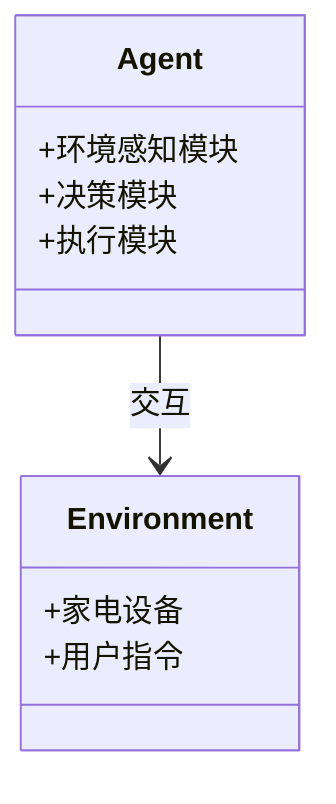
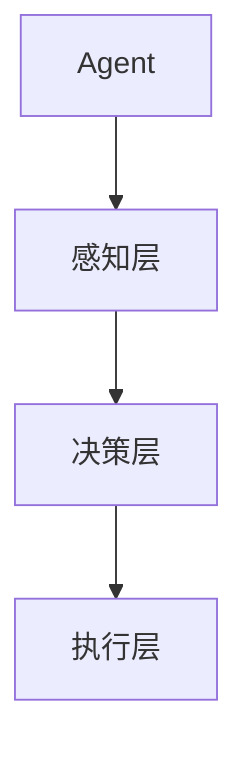
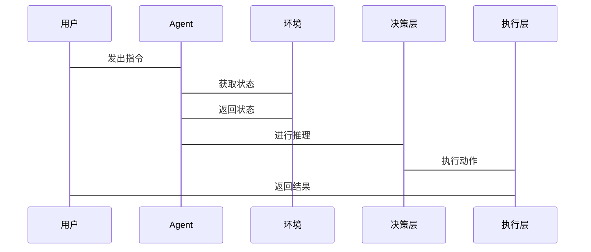

                 


# AI Agent架构设计：从概念到实现

**关键词**：AI Agent，架构设计，多智能体系统，强化学习，知识表示，系统架构

**摘要**：AI Agent是一种能够感知环境、自主决策并执行任务的智能实体。本文将从AI Agent的基本概念出发，逐步深入探讨其核心原理、算法实现、系统架构设计以及实际应用案例，帮助读者全面理解AI Agent的构建与实现过程。

---

# 第1章: AI Agent概述

## 1.1 AI Agent的基本概念

### 1.1.1 智能体（Agent）的定义
智能体（Agent）是指能够感知环境、自主决策并采取行动以实现目标的实体。AI Agent作为智能体的一种，具备学习、推理和自适应能力。

### 1.1.2 AI Agent的核心特征
- **自主性**：能够在无外部干预的情况下独立运行。
- **反应性**：能够实时感知环境并做出反应。
- **目标导向性**：通过目标驱动进行决策和行动。
- **社会性**：能够与其他智能体或人类进行协作或竞争。

### 1.1.3 AI Agent与传统程序的区别
AI Agent的核心区别在于其具备自主决策能力和对环境的适应性，而传统程序通常按照预设规则执行任务。

---

## 1.2 AI Agent的分类

### 1.2.1 按智能水平分类
- **反应式Agent**：基于当前感知做出反应，不依赖历史信息。
- **认知式Agent**：具备复杂推理和知识表示能力，能够处理复杂任务。
- **混合式Agent**：结合反应式和认知式的特点，适用于复杂场景。

### 1.2.2 按应用场景分类
- **服务机器人**：用于家庭服务、医疗护理等场景。
- **自动驾驶**：应用于智能驾驶系统。
- **虚拟助手**：如 Siri、Alexa 等。

### 1.2.3 按功能模块分类
- **感知层**：负责环境数据的采集与处理。
- **决策层**：进行推理和决策。
- **执行层**：负责具体动作的执行。

---

## 1.3 AI Agent的发展背景

### 1.3.1 人工智能技术的演进
从早期的专家系统到现代的深度学习，人工智能技术的不断进步推动了AI Agent的发展。

### 1.3.2 多智能体系统的兴起
随着分布式系统的需求增加，多智能体协作成为研究热点。

### 1.3.3 当前AI Agent的应用趋势
AI Agent在智能家居、智能制造、智慧城市等领域得到了广泛应用。

---

## 1.4 本章小结
本章介绍了AI Agent的基本概念、分类及其发展背景，为后续章节的理解奠定了基础。

---

# 第2章: AI Agent的核心概念与联系

## 2.1 AI Agent的核心原理

### 2.1.1 知识表示与推理
知识表示是AI Agent理解环境的关键，常用的表示方法包括逻辑推理和概率模型。

### 2.1.2 行为决策机制
决策过程通常包括目标设定、状态感知、动作选择和结果反馈。

### 2.1.3 人机交互模型
人机交互是AI Agent与用户或环境进行信息交换的桥梁。

---

## 2.2 核心概念对比分析

### 2.2.1 Agent与传统AI程序的对比
| 特性 | Agent | 传统程序 |
|------|--------|-----------|
| 自主性 | 高     | 低        |
| 环境适应性 | 高    | 低        |
| 决策能力 | 高    | 低        |

### 2.2.2 单智能体与多智能体的对比
| 特性 | 单智能体 | 多智能体 |
|------|-----------|-----------|
| 复杂性 | 低       | 高        |
| 协作性 | 无       | 有        |
| 通信需求 | 无       | 有        |

### 2.2.3 强化学习与监督学习的对比
| 特性 | 强化学习 | 监督学习 |
|------|-----------|-----------|
| 数据需求 | 少       | 多        |
| 行为反馈 | 立即     | 延迟       |
| 应用场景 | 自主决策 | 分类/回归 |

---

## 2.3 实体关系架构图



---

## 2.4 本章小结
本章通过对比分析和实体关系图，揭示了AI Agent的核心概念及其内在联系。

---

# 第3章: AI Agent的算法原理

## 3.1 多智能体协作算法

### 3.1.1 分布式强化学习
分布式强化学习通过多个智能体协作完成复杂任务，常用算法包括Distributed DQN和Distributed PPO。

### 3.1.2 联合推理与决策
联合推理通过多智能体之间的信息共享，提高决策的准确性。

### 3.1.3 跨 Agent 通信协议
智能体之间的通信需要定义明确的协议，如基于消息队列的通信机制。

---

## 3.2 强化学习算法

### 3.2.1 Q-learning算法
Q-learning是一种经典的强化学习算法，通过Q值表记录状态-动作对的最优价值。

### 3.2.2 Deep Q-Network (DQN)
DQN通过深度神经网络近似Q值函数，解决高维状态空间的问题。

### 3.2.3 Policy Gradient方法
Policy Gradient方法直接优化策略，通过梯度上升更新参数。

---

## 3.3 决策树与规则引擎

### 3.3.1 决策树构建原理
决策树通过递归划分特征，构建树状结构用于分类或回归任务。

### 3.3.2 规则引擎的工作流程
规则引擎通过预定义的规则集，对输入数据进行匹配和处理。

### 3.3.3 算法选择策略
根据任务需求选择合适的算法，如复杂任务优先选择强化学习。

---

## 3.4 算法流程图



---

## 3.5 本章小结
本章详细介绍了AI Agent中常用的算法及其工作原理，为后续实现提供了理论基础。

---

# 第4章: AI Agent的数学模型与公式

## 4.1 知识表示模型

### 4.1.1 逻辑推理公式
$$ \text{如果 } P \text{ 则 } Q $$

### 4.1.2 概率论模型
$$ P(A|B) = \frac{P(B|A)P(A)}{P(B)} $$

### 4.1.3 贝叶斯网络表示
贝叶斯网络通过节点和边表示变量之间的条件概率关系。

---

## 4.2 决策模型

### 4.2.1 Q-learning公式
$$ Q(s,a) = r + \gamma \max Q(s',a') $$

### 4.2.2 Policy Gradient公式
目标函数为：
$$ \theta = \theta + \alpha \nabla J(\theta) $$

---

## 4.3 本章小结
本章通过数学公式和模型，详细讲解了AI Agent的知识表示和决策机制。

---

# 第5章: AI Agent的系统架构设计

## 5.1 问题场景介绍
以智能家居中的AI Agent为例，设计一个多智能体协作系统，实现家电控制和能源优化。

## 5.2 系统功能设计

### 5.2.1 领域模型


### 5.2.2 系统架构


### 5.2.3 系统接口
智能体与环境之间的接口设计，包括输入输出协议和数据格式。

## 5.3 系统交互流程

### 5.3.1 序列图


---

## 5.4 本章小结
本章通过系统架构设计，展示了AI Agent在实际场景中的应用。

---

# 第6章: AI Agent的项目实战

## 6.1 环境安装
安装Python、TensorFlow、Keras等开发环境。

## 6.2 核心代码实现

### 6.2.1 知识表示模块
```python
class KnowledgeBase:
    def __init__(self):
        self.rules = {}

    def add_rule(self, condition, action):
        self.rules[condition] = action
```

### 6.2.2 决策模块
```python
class DecisionModule:
    def decide(self, state, knowledge):
        for condition, action in knowledge.rules.items():
            if condition(state):
                return action
        return default_action
```

### 6.2.3 执行模块
```python
class ExecutionModule:
    def execute(self, action):
        # 执行具体动作
        pass
```

## 6.3 代码应用解读与分析
通过实际代码展示AI Agent各模块的协作过程。

## 6.4 实际案例分析
以智能家居为例，分析AI Agent在家电控制中的应用。

---

## 6.5 本章小结
本章通过项目实战，帮助读者理解AI Agent的实现过程。

---

# 第7章: 总结与展望

## 7.1 核心内容回顾
总结AI Agent的核心概念、算法原理和系统架构设计。

## 7.2 未来的发展方向
探讨AI Agent在分布式系统、边缘计算和人机协作中的潜在应用。

## 7.3 最佳实践 tips
- 系统设计要注重模块化和可扩展性。
- 算法选择要结合具体任务需求。
- 代码实现要注意健壮性和可维护性。

## 7.4 小结
AI Agent作为人工智能的重要组成部分，未来将在更多领域发挥重要作用。

---

# 作者：AI天才研究院/AI Genius Institute & 禅与计算机程序设计艺术 /Zen And The Art of Computer Programming

