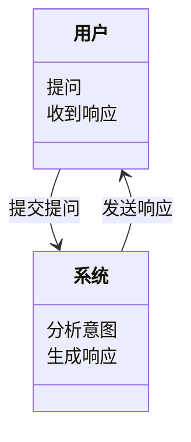
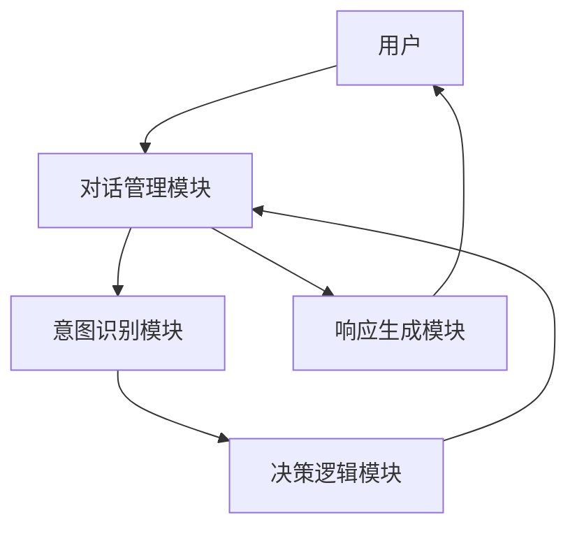
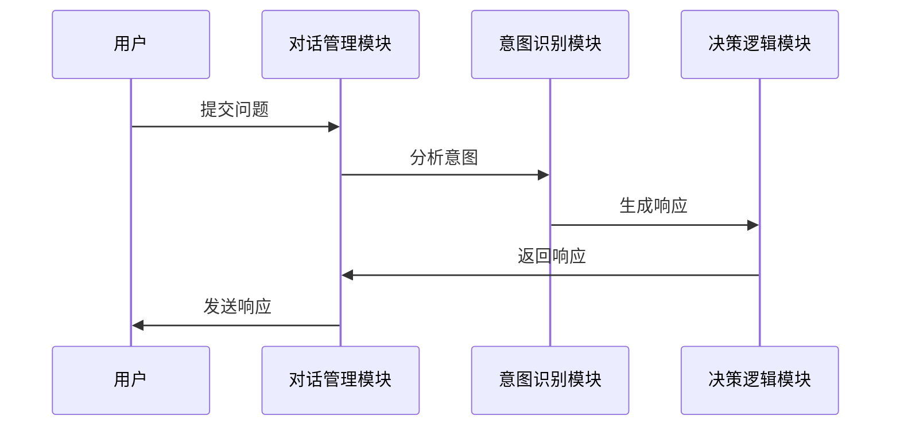

                 


# AI Agent的可解释性设计

## 关键词：AI Agent，可解释性，算法原理，系统架构，项目实战，最佳实践

## 摘要：  
本文深入探讨了AI Agent的可解释性设计，从基础概念到实际应用，详细分析了可解释性设计的核心要素、算法实现和系统架构。通过具体案例和代码实现，帮助读者理解如何在实际项目中实现AI Agent的可解释性设计。本文旨在为AI Agent的设计者和开发者提供一份全面的指导，帮助他们在复杂场景中构建透明、可追溯的AI Agent系统。

---

# 第一部分: AI Agent的可解释性设计基础

## 第1章: AI Agent的基本概念与背景

### 1.1 AI Agent的定义与特点
- **1.1.1 AI Agent的定义**  
  AI Agent（人工智能代理）是指能够感知环境、自主决策并采取行动的智能实体。它具备主动性、反应性、目标导向性和社会性等核心特点。

- **1.1.2 AI Agent的核心特点**  
  - **主动性**：AI Agent能够主动采取行动，而非被动响应。  
  - **反应性**：能够实时感知环境变化并调整行为。  
  - **目标导向性**：基于目标进行决策和行动。  
  - **社会性**：能够与其他Agent或人类进行交互协作。

- **1.1.3 AI Agent与传统AI的区别**  
  AI Agent不仅依赖预设规则，还能通过环境反馈不断优化行为，具备更强的适应性和自主性。

### 1.2 AI Agent的类型与应用场景
- **1.2.1 简单反射型AI Agent**  
  基于简单的规则直接映射输入到输出，适用于环境变化较小的场景。

- **1.2.2 基于模型的AI Agent**  
  使用内部模型表示环境状态，能够进行复杂推理和规划，适用于动态变化的场景。

- **1.2.3 基于效用的AI Agent**  
  通过最大化效用函数来优化决策，适用于多目标权衡的场景。

- **1.2.4 学习型AI Agent**  
  基于机器学习算法不断优化决策策略，适用于数据驱动的场景。

### 1.3 可解释性的重要性
- **1.3.1 AI Agent决策的可解释性需求**  
  用户需要了解AI Agent的决策逻辑，以便信任和使用。

- **1.3.2 可解释性在实际应用中的意义**  
  - 提高系统的透明性和可信度。  
  - 便于调试和优化系统。  
  - 符合法规和伦理要求。

- **1.3.3 可解释性与用户信任的关系**  
  可解释性是用户信任AI Agent的基础，缺乏可解释性的AI Agent难以在实际应用中被广泛接受。

### 1.4 本章小结  
本章介绍了AI Agent的基本概念、类型和应用场景，并强调了可解释性在AI Agent设计中的重要性。

---

## 第2章: AI Agent的可解释性设计背景

### 2.1 当前AI Agent技术的发展现状
- **2.1.1 AI Agent技术的演进历程**  
  从基于规则的简单代理到学习型代理的演变。

- **2.1.2 当前主流AI Agent框架**  
  - **Rasa**：基于自然语言处理的对话代理框架。  
  - **OpenAI Gym**：强化学习环境框架。  
  - **aiduX**：企业级AI Agent平台。

- **2.1.3 AI Agent在各领域的应用现状**  
  - 金融：智能投顾、风险管理。  
  - 医疗：辅助诊断、个性化治疗。  
  - 智能家居：设备协同控制。

### 2.2 可解释性设计的挑战与机遇
- **2.2.1 AI Agent决策过程中的不透明性**  
  复杂算法（如深度神经网络）的黑箱特性导致决策过程难以解释。

- **2.2.2 可解释性设计的技术挑战**  
  - 平衡模型复杂性和可解释性的难度。  
  - 高维数据的降维与特征提取的挑战。

- **2.2.3 可解释性设计带来的商业价值**  
  - 提高产品的市场竞争力。  
  - 增强用户信任，提升用户体验。

### 2.3 本章小结  
本章分析了当前AI Agent技术的发展现状，探讨了可解释性设计面临的挑战和机遇。

---

## 第3章: AI Agent的可解释性核心概念

### 3.1 可解释性设计的核心要素
- **3.1.1 决策过程的透明性**  
  用户能够理解AI Agent的决策逻辑和依据。

- **3.1.2 决策结果的可追溯性**  
  能够追踪决策过程中的关键步骤和数据。

- **3.1.3 决策逻辑的可理解性**  
  决策逻辑以用户能够理解的方式呈现，避免复杂的数学表达。

### 3.2 可解释性与相关概念的对比
- **3.2.1 可解释性与可预测性的区别**  
  可预测性关注结果的准确性，可解释性关注决策过程的透明性。

- **3.2.2 可解释性与可验证性的联系**  
  可解释性为可验证性提供基础，通过可解释性可以验证决策的合理性。

- **3.2.3 可解释性与可扩展性**  
  在保证可解释性的前提下，扩展系统功能和性能。

### 3.3 可解释性设计的核心要素对比表  
| **要素**         | **特点**                                                                 |
|-------------------|--------------------------------------------------------------------------|
| 决策过程透明性     | 用户能够理解决策逻辑和依据。                                             |
| 决策结果可追溯性   | 可以追踪决策过程中的关键步骤和数据。                                     |
| 决策逻辑可理解性   | 决策逻辑以用户能够理解的方式呈现。                                         |

### 3.4 本章小结  
本章详细阐述了AI Agent可解释性设计的核心要素，并通过对比分析加深了对可解释性的理解。

---

## 第4章: AI Agent可解释性设计的核心算法原理

### 4.1 可解释性算法的核心原理
- **4.1.1 决策树算法**  
  通过树状结构展示决策过程，具有良好的可解释性。

- **4.1.2 线性回归模型**  
  通过线性关系描述变量之间的关系，具有较高的可解释性。

- **4.1.3 规则模型**  
  基于简单的规则进行决策，易于理解和解释。

### 4.2 可解释性算法的优缺点对比
| **算法**       | **优点**                                | **缺点**                              |
|-----------------|---------------------------------------|---------------------------------------|
| 决策树           | 结果直观，易于解释。                  | 对噪声数据敏感，可能存在过拟合。      |
| 线性回归模型     | 计算简单，可解释性强。                | 适用于线性关系，非线性关系表现较差。    |
| 规则模型         | 规则清晰，易于解释。                  | 规则过于简化，可能无法捕捉复杂模式。    |

### 4.3 本章小结  
本章介绍了几种常用的可解释性算法，并通过对比分析了它们的优缺点。

---

## 第5章: AI Agent可解释性设计的系统架构

### 5.1 系统分析与架构设计
- **5.1.1 问题场景介绍**  
  以智能客服对话系统为例，分析AI Agent的可解释性需求。

- **5.1.2 系统功能设计**  
  - 用户需求分析：识别用户意图。  
  - 决策逻辑展示：解释系统决策过程。  
  - 系统反馈：提供可理解的响应。

### 5.2 系统架构设计
- **5.2.1 领域模型设计**  
  使用Mermaid类图展示系统核心组件及其关系。



- **5.2.2 系统架构设计**  
  使用Mermaid架构图展示系统整体架构。



### 5.3 系统接口设计
- **5.3.1 用户接口设计**  
  提供直观的交互界面，展示决策过程和结果。

- **5.3.2 系统接口设计**  
  提供API接口，方便与其他系统集成。

### 5.4 系统交互设计
- **5.4.1 交互流程设计**  
  使用Mermaid序列图展示系统交互流程。



### 5.5 本章小结  
本章通过系统分析和架构设计，展示了如何在实际项目中实现AI Agent的可解释性设计。

---

## 第6章: AI Agent可解释性设计的项目实战

### 6.1 环境安装与配置
- **6.1.1 安装Python环境**  
  使用Anaconda或虚拟环境管理Python版本。

- **6.1.2 安装依赖库**  
  - `pip install numpy`  
  - `pip install scikit-learn`  
  - `pip install matplotlib`  

### 6.2 系统核心代码实现
- **6.2.1 决策树模型实现**  
  使用Scikit-learn库实现决策树算法。

```python
from sklearn.tree import DecisionTreeClassifier
from sklearn import datasets

# 加载数据集
iris = datasets.load_iris()
X = iris.data[:, :2]  # 只取前两维特征
y = iris.target

# 创建决策树模型
clf = DecisionTreeClassifier()
clf.fit(X, y)

# 预测新样本
X_new = [[5.0, 3.0]]
y_new = clf.predict(X_new)
print("预测结果:", y_new)
```

- **6.2.2 可视化决策树**  
  使用`graphviz`库可视化决策树结构。

```python
from sklearn.tree import export_graphviz
import graphviz

export_graphviz(clf, out_file='tree.dot', feature_names=iris.feature_names[:2])
with open('tree.dot', 'r') as f:
    dot_data = f.read()
graph = graphviz.Source(dot_data)
graph.render('tree')
```

### 6.3 项目实现与案例分析
- **6.3.1 项目实现**  
  实现一个简单的智能客服对话系统，展示决策过程和结果。

- **6.3.2 案例分析**  
  分析系统的可解释性设计在实际应用中的表现。

### 6.4 项目总结
- **6.4.1 项目成果**  
  成功实现了一个具有可解释性的AI Agent系统。

- **6.4.2 经验总结**  
  - 选择合适的算法和工具是关键。  
  - 可视化技术能够有效提升系统的可解释性。

### 6.5 本章小结  
本章通过实际项目实战，展示了如何在实际应用中实现AI Agent的可解释性设计。

---

## 第7章: AI Agent可解释性设计的最佳实践

### 7.1 最佳实践Tips
- **选择合适的算法和工具**  
  根据具体场景选择具有可解释性的算法。

- **可视化技术的应用**  
  使用图表和流程图直观展示决策过程。

- **用户反馈的收集与分析**  
  通过用户反馈不断优化系统的可解释性。

### 7.2 本章小结  
本章总结了AI Agent可解释性设计的最佳实践，为读者提供了宝贵的参考。

---

## 第8章: 总结与展望

### 8.1 总结
本文从AI Agent的基本概念出发，详细探讨了可解释性设计的核心要素、算法实现和系统架构。通过实际案例和代码实现，帮助读者理解如何在实际项目中实现可解释性设计。

### 8.2 展望
随着AI技术的不断发展，可解释性设计将成为AI Agent技术的重要研究方向。未来，我们需要在算法优化、系统架构和用户体验等方面进一步探索和创新。

### 8.3 本章小结  
本文总结了AI Agent可解释性设计的核心内容，并展望了未来的研究方向。

---

## 作者：AI天才研究院/AI Genius Institute & 禅与计算机程序设计艺术 /Zen And The Art of Computer Programming

---

以上是《AI Agent的可解释性设计》的技术博客文章的完整目录大纲和具体内容。希望对您有所帮助！

