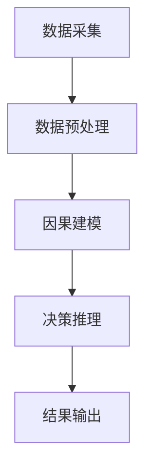

                 


# AI Agent的因果推理：增强决策的逻辑性

> 关键词：AI Agent，因果推理，决策逻辑，增强决策，算法原理，系统设计

> 摘要：本文深入探讨了AI Agent中的因果推理技术，分析其在增强决策逻辑中的应用。通过理论与实践结合，详细阐述了因果推理的原理、算法、系统架构设计及项目实战，旨在帮助读者掌握AI Agent因果推理的核心概念与实践技巧。

---

## 第1章: 背景介绍与核心概念

### 1.1 问题背景

AI Agent（人工智能代理）是一种能够感知环境、自主决策并执行任务的智能实体。在复杂多变的环境中，AI Agent需要做出合理决策以实现目标。然而，传统基于统计关联的方法在面对因果关系时存在局限性，容易陷入“相关即因果”的误区，导致决策错误。因果推理通过分析变量间的因果关系，帮助AI Agent做出更合理的决策，从而在医疗、金融、自动驾驶等领域发挥重要作用。

### 1.2 核心概念与联系

因果推理的核心在于识别因果关系，而非简单的相关关系。以下是因果推理的关键概念及其联系：

1. **因果关系**：变量间的因果关系，即一个变量的变化是否由另一个变量的变化引起。
2. **潜在结果框架**：通过假设每个变量可能的取值，推断因果效应。
3. **结构学习**：从数据中学习因果关系的结构，构建因果图模型。
4. **干预分析**：在因果图中，评估干预措施的效果。

因果推理通过分析这些概念，帮助AI Agent理解变量间的内在联系，从而做出更合理的决策。

---

## 第2章: 因果推理的算法原理

### 2.1 潜在结果框架

潜在结果框架是因果推理的基础，它假设每个变量在不同处理下的潜在结果，并通过观察数据估计这些潜在结果的差异。

#### 2.1.1 潜在结果的定义

对于变量 \( X \) 和 \( Y \)，因果效应 \( \text{CATE} \) 表示 \( X \) 对 \( Y \) 的平均处理效应：

$$ \text{CATE} = E[Y | X=1] - E[Y | X=0] $$

#### 2.1.2 潜在结果的计算流程

1. 计算每个处理组的平均结果。
2. 计算因果效应的平均值。
3. 使用机器学习模型估计潜在结果。

#### 2.1.3 潜在结果的数学模型

潜在结果模型可以通过以下步骤推导：

1. 定义潜在结果 \( Y(x) \)。
2. 假设 \( Y(x) \) 的可识别性。
3. 使用观察数据估计 \( E[Y(x)] \)。

### 2.2 结构学习方法

结构学习通过从数据中学习因果关系的结构，构建因果图模型。

#### 2.2.1 结构学习的定义

结构学习是指从数据中推断出变量之间的因果关系结构，构建因果图模型。

#### 2.2.2 结构学习的实现流程

1. 选择合适的结构学习算法。
2. 从数据中学习因果图的结构。
3. 验证并优化因果图。

#### 2.2.3 结构学习的数学公式

使用最大似然估计或贝叶斯准则，结构学习的目标是找到最符合数据的因果图：

$$ \text{argmax}_{G} P(D | G) $$

---

## 第3章: 系统分析与架构设计

### 3.1 问题场景介绍

设计一个AI Agent系统，用于医疗诊断中的因果推理。系统需要分析症状与疾病之间的因果关系，辅助医生做出诊断。

### 3.2 系统功能设计

1. **数据采集**：收集患者的症状和诊断数据。
2. **因果建模**：构建症状与疾病的因果关系模型。
3. **决策推理**：基于因果模型，推断可能的疾病。

### 3.3 系统架构设计

以下是系统的架构设计：



---

## 第4章: 项目实战

### 4.1 环境安装

1. 安装Python和必要的库（如因果推理库 `doWhy`）。
2. 准备医疗诊断数据集。

### 4.2 核心代码实现

以下是使用 `doWhy` 库的代码示例：

```python
from doWhy import do
import pandas as pd

# 加载数据
data = pd.read_csv('medical_data.csv')

# 定义变量
treatment = 'symptom'
outcome = 'disease'

# 执行因果推理
causal_model = do(data, treatment, outcome)
effect = causal_model.estimate()

print(f"因果效应：{effect}")
```

### 4.3 项目小结

通过本项目，我们展示了如何在医疗诊断中应用因果推理，帮助AI Agent做出更准确的诊断决策。

---

## 第5章: 最佳实践与总结

### 5.1 最佳实践 tips

1. 在因果推理中，确保数据的质量和代表性。
2. 结合领域知识优化因果图模型。
3. 使用多种方法验证因果关系的可靠性。

### 5.2 项目总结

因果推理为AI Agent提供了更强大的决策能力，通过分析变量间的因果关系，帮助系统在复杂环境中做出合理决策。

### 5.3 拓展阅读

1. 《Causal Inference in Statistics: A Simple Explanation》
2. 《Python Causal Inference Tutorial》

---

## 作者

作者：AI天才研究院 & 禅与计算机程序设计艺术

