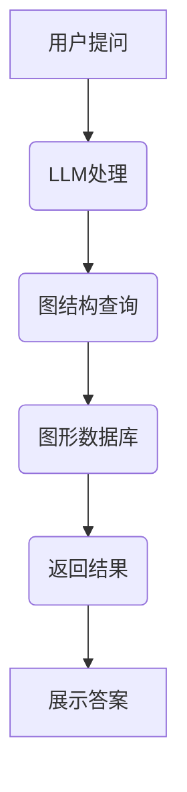

                 

# AI Agent的图结构问答：结合LLM与图形数据库

> 关键词：AI Agent，图结构问答，LLM，图形数据库，自然语言处理，知识图谱

> 摘要：本文深入探讨AI Agent如何通过图结构进行问答，结合大语言模型（LLM）和图形数据库，分析其核心原理、系统架构、算法实现及实际应用。通过案例分析和代码实现，展示AI Agent在问答系统中的潜力。

---

## 第一部分: AI Agent的图结构问答基础

### 第1章: 问题背景与核心概念

#### 1.1 问题背景介绍

##### 1.1.1 传统问答系统的局限性
传统问答系统依赖关键词匹配和规则库，难以处理复杂语义和上下文关联，导致准确率低，难以扩展。

##### 1.1.2 图结构在问答中的优势
图结构通过节点和边表示实体及其关系，能够捕捉语义关联，适合处理复杂问题，提供更准确答案。

##### 1.1.3 LLM与图形数据库的结合需求
结合LLM的自然语言处理能力和图形数据库的高效查询能力，构建智能问答系统的需求日益增长。

#### 1.2 核心概念与问题描述

##### 1.2.1 AI Agent的定义与特点
AI Agent是具有感知环境、执行任务和自适应能力的智能体，能够理解用户需求并提供解决方案。

##### 1.2.2 图结构问答的定义与目标
图结构问答基于图模型，通过LLM生成自然语言答案，目标是提供准确、相关的回答。

##### 1.2.3 LLM与图形数据库的结合方式
LLM负责语义理解，图形数据库存储和查询知识图谱，两者协同实现高效问答。

#### 1.3 问题解决与边界外延

##### 1.3.1 图结构问答的解决方案
构建知识图谱，利用LLM生成查询，图形数据库进行高效检索，返回结果并生成自然语言答案。

##### 1.3.2 问题边界与适用场景
适用于复杂知识查询、多跳推理，但不适用于实时数据和需要频繁更新的场景。

##### 1.3.3 相关技术的外延与限制
涉及自然语言处理、知识图谱、图数据库等，限制包括构建复杂性和实时性。

---

### 第2章: 核心概念与原理

#### 2.1 AI Agent与图结构的关系

##### 2.1.1 AI Agent的图结构模型
AI Agent通过图结构模型理解问题，生成查询，从图形数据库中检索答案。

##### 2.1.2 图结构中的节点与边
节点代表实体，边表示关系，构建知识图谱。

##### 2.1.3 LLM在图结构中的作用
LLM用于生成查询和自然语言答案，增强用户体验。

#### 2.2 图结构与问答系统的联系

##### 2.2.1 图结构问答的核心原理
基于图的最短路径或语义相似性进行推理，生成答案。

##### 2.2.2 LLM在图结构中的应用
LLM生成查询，图形数据库执行高效查询。

##### 2.2.3 图形数据库的优势
高效存储和查询复杂关系，支持多跳推理。

---

## 第二部分: 算法原理与数学模型

### 第3章: 算法原理与数学模型

#### 3.1 算法原理讲解

##### 3.1.1 图结构问答的算法流程
用户提问 → LLM生成查询 → 图形数据库检索 → 返回结果 → LLM生成答案。

##### 3.1.2 LLM与图形数据库的协同工作
LLM生成自然语言查询，图形数据库执行高效检索。

##### 3.1.3 图结构优化算法
通过优化图遍历算法，提高查询效率。

#### 3.2 数学模型与公式

##### 3.2.1 图结构的数学表示
图G = (V, E)，其中V是节点，E是边。

##### 3.2.2 LLM的概率计算公式
概率模型P(word|context)。

##### 3.2.3 图结构问答的评价指标
准确率、召回率、F1值。

---

## 第三部分: 系统架构与设计

### 第4章: 系统架构与设计

#### 4.1 系统架构设计

##### 4.1.1 系统功能模块划分
用户界面、LLM接口、图形数据库接口、结果生成模块。

##### 4.1.2 系统架构图展示
展示模块交互关系。

##### 4.1.3 模块间的交互关系
用户提问 → LLM处理 → 图形数据库查询 → 返回结果。

#### 4.2 系统接口与交互设计

##### 4.2.1 API接口定义
RESTful API接口。

##### 4.2.2 用户与系统交互流程
用户提问 → 系统处理 → 返回答案。

##### 4.2.3 系统日志与监控
记录查询日志，监控系统性能。

---

## 第四部分: 项目实战与实现

### 第5章: 项目实战与实现

#### 5.1 环境安装与配置

##### 5.1.1 开发环境搭建
安装Python、Jupyter Notebook、虚拟环境。

##### 5.1.2 相关工具安装
安装LLM框架（如Hugging Face）、图形数据库（如Neo4j）。

##### 5.1.3 数据库配置
连接图形数据库，配置API密钥。

#### 5.2 核心代码实现

##### 5.2.1 图结构构建代码
使用Python和Neo4j构建知识图谱。

##### 5.2.2 LLM集成代码
集成LLM进行自然语言处理。

##### 5.2.3 问答系统实现
实现用户提问到答案生成的完整流程。

### 第6章: 实际案例分析

#### 6.1 案例背景与数据准备

##### 6.1.1 案例应用场景
医疗知识问答系统。

##### 6.1.2 数据收集与处理
收集医疗数据，构建知识图谱。

##### 6.1.3 数据建模与分析
分析数据，构建图结构。

#### 6.2 案例实现与结果展示

##### 6.2.1 代码运行与结果输出
运行代码，展示查询结果。

##### 6.2.2 系统性能测试
测试系统响应时间和准确性。

##### 6.2.3 结果分析与优化
分析结果，优化算法和系统性能。

### 第7章: 最佳实践与总结

#### 7.1 实践经验总结

##### 7.1.1 开发过程中的注意事项
数据质量、模型调优、系统性能优化。

##### 7.1.2 常见问题与解决方案
处理长尾问题、提升准确率。

##### 7.1.3 优化建议与未来方向
优化算法、扩展应用领域。

#### 7.2 项目小结与展望

##### 7.2.1 项目成果与意义
成功构建AI Agent问答系统，提升问答准确性。

##### 7.2.2 未来研究方向
研究更复杂的图结构，结合多模态数据。

##### 7.2.3 对读者的建议与鼓励
鼓励读者探索AI Agent和图结构的结合，推动技术进步。

---

## 附录: 图结构问答的Mermaid流程图

---

## 作者：AI天才研究院/AI Genius Institute & 禅与计算机程序设计艺术 /Zen And The Art of Computer Programming

---

**本文为原创内容，转载请注明出处。**

