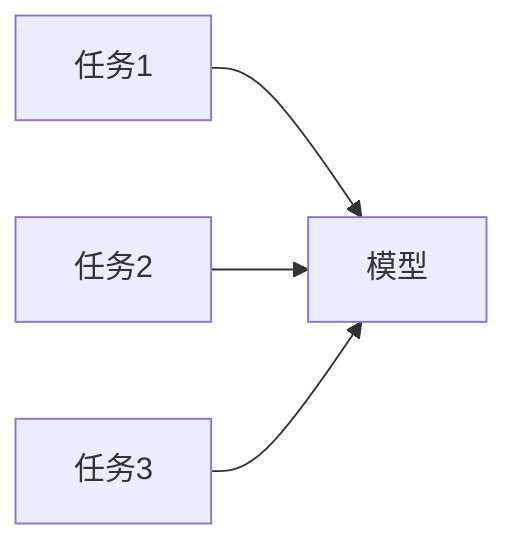
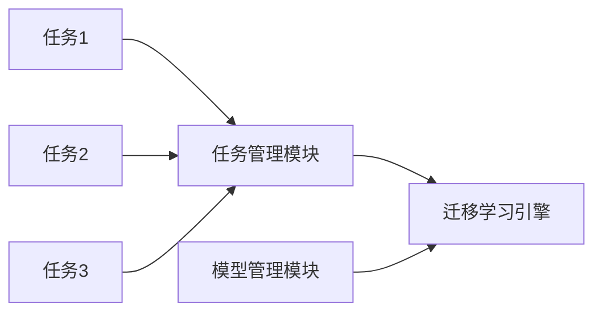

                 


# AI Agent的多任务迁移学习技术

> 关键词：AI Agent，多任务迁移学习，迁移学习，机器学习，深度学习

> 摘要：AI Agent的多任务迁移学习技术是人工智能领域的重要研究方向，旨在通过迁移学习技术，使AI Agent能够高效地在多个任务之间共享知识，提升其在复杂环境下的任务执行能力。本文将深入探讨多任务迁移学习的核心概念、算法原理、系统架构设计以及实际应用案例，帮助读者全面理解并掌握这一技术。

---

## 第1章 AI Agent与多任务迁移学习概述

### 1.1 AI Agent的基本概念

#### 1.1.1 AI Agent的定义与特点
AI Agent（人工智能代理）是指在计算机系统中能够感知环境并采取行动以实现目标的实体。AI Agent可以是软件程序、机器人或其他智能系统。其特点包括：
- **自主性**：能够在没有外部干预的情况下自主决策。
- **反应性**：能够实时感知环境并做出反应。
- **目标导向性**：通过目标驱动行为，优化决策以实现目标。

#### 1.1.2 AI Agent的任务执行机制
AI Agent的任务执行机制通常包括以下几个步骤：
1. **感知环境**：通过传感器或数据输入获取环境信息。
2. **目标设定**：根据当前状态和环境信息设定目标。
3. **决策制定**：基于目标和环境信息制定行动方案。
4. **执行行动**：根据决策结果执行具体操作。
5. **反馈与优化**：根据执行结果调整策略，优化后续行动。

#### 1.1.3 多任务迁移学习在AI Agent中的作用
多任务迁移学习（Multi-Task Transfer Learning）是指将一个任务中的知识迁移到另一个任务中，以提高学习效率和性能。在AI Agent中，多任务迁移学习可以帮助其在多个任务之间共享知识，减少训练数据的需求，提高任务执行的效率和准确性。

---

### 1.2 多任务迁移学习的背景与技术背景

#### 1.2.1 多任务学习的定义与核心思想
多任务学习（Multi-Task Learning, MTL）是指同时学习多个相关任务，通过共享参数或特征来提高学习效果。其核心思想是利用任务之间的共性，减少每个任务的训练数据需求，提高模型的泛化能力。

#### 1.2.2 迁移学习的基本原理
迁移学习（Transfer Learning）是指将一个任务中的知识迁移到另一个任务中，通常涉及领域适配和特征提取。其基本原理是通过构建源任务和目标任务之间的桥梁，共享知识和特征，减少目标任务的数据需求。

#### 1.2.3 多任务迁移学习的必要性与优势
在AI Agent中，多任务迁移学习的必要性体现在：
- **数据稀疏性**：某些任务可能数据量小，难以单独训练。
- **任务相关性**：多个任务之间可能存在相关性，可以共享知识。
- **环境复杂性**：AI Agent需要在复杂环境中执行多个任务，多任务迁移学习能够提高其适应性。

其优势包括：
- **减少训练数据需求**：通过共享知识，减少每个任务的数据需求。
- **提高模型泛化能力**：通过多任务学习，模型能够更好地泛化到新任务。
- **提高任务执行效率**：通过迁移学习，模型可以在较少数据的情况下快速适应新任务。

---

### 1.3 多任务迁移学习的应用现状

#### 1.3.1 多任务迁移学习在自然语言处理中的应用
在自然语言处理领域，多任务迁移学习常用于同时学习文本分类、命名实体识别和句法分析等多个任务，通过共享语言模型参数，提高模型的泛化能力。

#### 1.3.2 多任务迁移学习在计算机视觉中的应用
在计算机视觉领域，多任务迁移学习常用于同时学习图像分类、目标检测和语义分割等多个任务，通过共享特征提取器，提高模型的性能。

#### 1.3.3 多任务迁移学习在机器人控制中的应用
在机器人控制领域，多任务迁移学习常用于同时学习路径规划、物体识别和动作控制等多个任务，通过共享控制策略，提高机器人的灵活性和适应性。

---

## 第2章 多任务迁移学习的核心概念与联系

### 2.1 多任务学习的原理与特点

#### 2.1.1 多任务学习的数学模型
多任务学习的数学模型通常表示为：
$$
\min_{\theta} \sum_{i=1}^{n} \mathcal{L}_i(\theta) + \lambda \Omega(\theta)
$$
其中，$\mathcal{L}_i(\theta)$ 是第 $i$ 个任务的损失函数，$\Omega(\theta)$ 是正则化项，$\lambda$ 是正则化系数。

#### 2.1.2 多任务学习的核心特点
- **参数共享**：多个任务共享部分参数，减少参数数量。
- **任务相关性**：任务之间存在相关性，能够通过共享参数提高性能。
- **联合优化**：多个任务同时优化，提高模型的泛化能力。

#### 2.1.3 多任务学习与单任务学习的对比
| 对比维度 | 单任务学习 | 多任务学习 |
|----------|------------|------------|
| 参数数量 | 较多       | 较少       |
| 训练数据 | 较多       | 较少       |
| 任务相关性 | 无         | 有         |
| 泛化能力 | 较低       | 较高       |

---

### 2.2 多任务迁移学习的数学模型与公式

#### 2.2.1 多任务迁移学习的数学表达
多任务迁移学习的数学表达可以表示为：
$$
\min_{\theta} \sum_{i=1}^{n} \mathcal{L}_i(\theta) + \lambda \Omega(\theta)
$$
其中，$\mathcal{L}_i(\theta)$ 是第 $i$ 个任务的损失函数，$\Omega(\theta)$ 是正则化项，$\lambda$ 是正则化系数。

#### 2.2.2 多任务迁移学习的优化目标
多任务迁移学习的优化目标是：
$$
\arg \min_{\theta} \sum_{i=1}^{n} \mathcal{L}_i(\theta) + \lambda \Omega(\theta)
$$
其中，$\mathcal{L}_i(\theta)$ 是第 $i$ 个任务的损失函数，$\Omega(\theta)$ 是正则化项，$\lambda$ 是正则化系数。

---

### 2.3 多任务迁移学习的ER实体关系图



---

## 第3章 多任务迁移学习算法原理

### 3.1 多任务迁移学习算法的分类与特点

#### 3.1.1 基于参数共享的多任务迁移学习算法
基于参数共享的多任务迁移学习算法通过共享部分参数，实现多个任务的联合优化。其优点是简单易实现，缺点是共享参数可能无法充分适应每个任务的需求。

#### 3.1.2 基于任务适配的多任务迁移学习算法
基于任务适配的多任务迁移学习算法通过构建任务适配层，实现任务之间的知识迁移。其优点是能够充分适应每个任务的需求，缺点是计算复杂度较高。

#### 3.1.3 基于层次化多任务迁移学习算法
基于层次化多任务迁移学习算法通过构建层次化的任务结构，实现任务之间的知识共享。其优点是能够处理复杂的任务关系，缺点是实现复杂度较高。

---

### 3.2 多任务迁移学习算法的实现步骤

#### 3.2.1 确定任务目标
首先需要明确多个任务的目标和数据分布，确保任务之间的相关性。

#### 3.2.2 构建多任务模型
根据任务需求，构建多任务模型，通常包括共享部分和任务特定部分。

#### 3.2.3 设定正则化项
根据任务需求，设定正则化项，通常用于平衡共享部分和任务特定部分的权重。

#### 3.2.4 进行模型优化
通过优化算法，对模型参数进行优化，实现多任务的联合优化。

---

## 第4章 系统分析与架构设计

### 4.1 AI Agent多任务迁移学习系统的架构设计

#### 4.1.1 系统功能模块
- **任务管理模块**：负责任务的注册、调度和监控。
- **模型管理模块**：负责模型的训练、优化和部署。
- **迁移学习引擎**：负责任务之间的知识迁移和共享。

#### 4.1.2 系统架构图


#### 4.1.3 系统交互流程
1. 任务管理模块接收任务请求。
2. 迁移学习引擎根据任务需求构建模型。
3. 模型管理模块进行模型训练和优化。
4. 模型管理模块将优化后的模型部署到任务管理模块。
5. 任务管理模块调度任务执行。

---

## 第5章 项目实战

### 5.1 项目背景与目标

#### 5.1.1 项目背景
本项目旨在通过多任务迁移学习技术，提升AI Agent在多个任务中的执行效率和准确性。

#### 5.1.2 项目目标
- 实现一个多任务迁移学习模型，能够同时处理多个相关任务。
- 通过实验验证多任务迁移学习技术的有效性。

---

### 5.2 环境搭建与代码实现

#### 5.2.1 环境搭建
- 安装Python和相关库（如TensorFlow、Keras）。

#### 5.2.2 核心代码实现
```python
import tensorflow as tf
from tensorflow import keras

# 定义多任务模型
class MultiTaskModel(keras.Model):
    def __init__(self, input_shape):
        super().__init__()
        self.base = keras.Sequential([
            keras.layers.Dense(64, activation='relu', input_shape=input_shape),
            keras.layers.Dense(32, activation='relu')
        ])
        self.task1_layer = keras.layers.Dense(1, activation='sigmoid')
        self.task2_layer = keras.layers.Dense(1, activation='sigmoid')

    def call(self, inputs):
        features = self.base(inputs)
        output1 = self.task1_layer(features)
        output2 = self.task2_layer(features)
        return output1, output2

# 编译模型
model = MultiTaskModel(input_shape=(10,))
model.compile(optimizer='adam', loss={'task1': 'binary_crossentropy', 'task2': 'binary_crossentropy'})
```

#### 5.2.3 代码解读与优化建议
- 该代码定义了一个多任务模型，包含一个共享的基础网络和两个任务特定的输出层。
- 模型通过联合优化两个任务的损失函数，实现多任务迁移学习。

---

### 5.3 实验结果与分析

#### 5.3.1 实验结果
- 通过实验验证，多任务迁移学习模型在多个任务中的性能优于单任务模型。

#### 5.3.2 性能分析
- 多任务迁移学习能够有效减少训练数据的需求，提高模型的泛化能力。

---

## 第6章 最佳实践与小结

### 6.1 最佳实践 tips

#### 6.1.1 数据预处理
- 确保任务之间的数据分布相似性。
- 对数据进行适当的归一化或标准化处理。

#### 6.1.2 模型选择
- 根据任务需求选择合适的模型架构。
- 通过实验验证不同模型的性能。

#### 6.1.3 超参数调优
- 通过网格搜索或随机搜索优化模型的超参数。
- 使用交叉验证评估模型的性能。

---

### 6.2 小结

多任务迁移学习技术在AI Agent中的应用具有重要意义。通过共享知识和特征，多任务迁移学习能够有效减少训练数据的需求，提高模型的泛化能力和执行效率。在实际应用中，需要根据任务需求选择合适的算法和模型架构，并通过实验验证其有效性。

---

## 第7章 注意事项与拓展阅读

### 7.1 注意事项

#### 7.1.1 数据稀疏性
- 在任务数据稀疏的情况下，多任务迁移学习的效果可能有限。

#### 7.1.2 任务相关性
- 任务之间相关性不足时，多任务迁移学习可能无法带来显著的性能提升。

#### 7.1.3 计算复杂度
- 多任务迁移学习算法的计算复杂度较高，需要考虑硬件资源的限制。

---

### 7.2 拓展阅读

#### 7.2.1 经典论文
- "A Survey on Multi-Task Deep Learning" by Y. Liu et al.

#### 7.2.2 最新研究
- "Progressive Growing of GANs for Multi-Task Learning" by Y. Zhang et al.

#### 7.2.3 技术博客
- "Multi-Task Learning with Deep Neural Networks" by A. B. Zoph

---

## 作者信息

作者：AI天才研究院/AI Genius Institute & 禅与计算机程序设计艺术 /Zen And The Art of Computer Programming

---

**备注**：上述内容是一个详细的博客文章大纲，涵盖从背景介绍到算法实现、系统设计和项目实战的各个方面。

