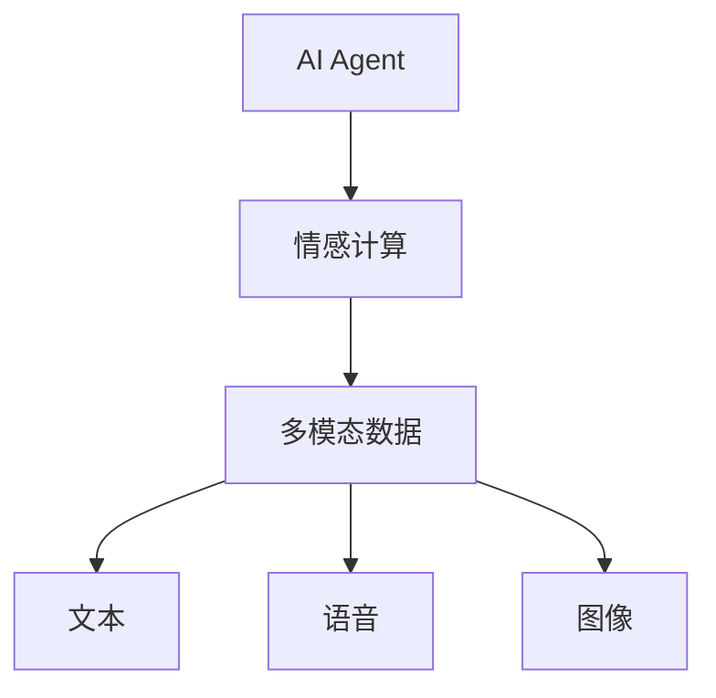
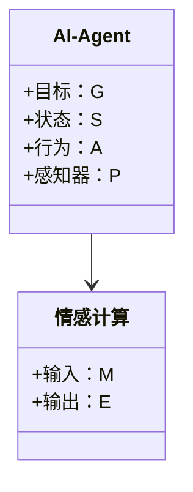
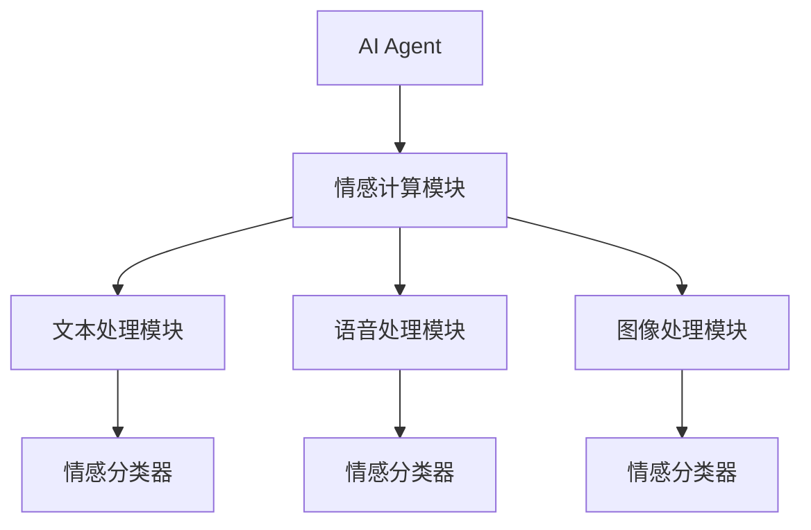

                 


# AI Agent的多模态情感计算与表达

## 关键词
AI Agent, 多模态, 情感计算, 情感表达, 深度学习, 自然语言处理

## 摘要
本文深入探讨AI Agent在多模态情感计算与表达领域的应用，结合理论与实践，系统地分析了多模态情感计算的核心概念、算法原理、系统架构设计以及实际项目案例。通过详细的技术分析和代码实现，展示了如何利用多模态数据提升AI Agent的情感理解与表达能力，为相关领域的研究与应用提供了全面的参考。

---

# 第一部分: AI Agent的多模态情感计算与表达概述

## 第1章: AI Agent与情感计算的背景介绍

### 1.1 AI Agent的基本概念
#### 1.1.1 AI Agent的定义与特征
AI Agent（人工智能代理）是指能够感知环境、自主决策并执行任务的智能实体。其核心特征包括：
- **自主性**：能够在没有外部干预的情况下独立运作。
- **反应性**：能够实时感知环境变化并做出响应。
- **目标导向性**：通过设定目标来驱动行为。
- **学习能力**：能够通过数据和经验不断优化自身的性能。

#### 1.1.2 AI Agent的分类与应用场景
AI Agent可以分为以下几类：
- **简单反射型**：基于预设规则执行任务。
- **基于模型的反应型**：通过构建内部模型来做出决策。
- **目标驱动型**：以特定目标为导向，自主规划和执行任务。
- **实用驱动型**：通过效用函数优化决策。

其应用场景包括智能助手、自动驾驶、智能客服、机器人控制等领域。

#### 1.1.3 多模态数据的定义与特点
多模态数据指的是来自不同感官渠道（如视觉、听觉、触觉等）的多种数据形式。其特点包括：
- **多样性**：涵盖文本、语音、图像等多种数据类型。
- **互补性**：不同模态的数据可以相互补充，提高信息理解的准确性。
- **复杂性**：处理多模态数据需要综合考虑多种数据类型和其间的关联性。

---

### 1.2 多模态情感计算的背景与意义
#### 1.2.1 情感计算的定义与目标
情感计算（Affective Computing）是研究如何识别、理解和模拟人类情感的计算科学分支。其目标是通过技术手段，使计算机能够像人类一样理解和处理情感信息。

#### 1.2.2 多模态情感计算的优势与挑战
优势：
- **准确性提升**：结合多模态数据可以更全面地捕捉情感信息，提高情感识别的准确性。
- **鲁棒性增强**：单一模态数据的局限性可以通过多模态数据的互补性得到缓解。
- **应用场景扩展**：多模态情感计算能够更好地满足复杂场景下的情感分析需求。

挑战：
- **数据融合难度**：不同模态的数据具有不同的特征和表达方式，如何有效地融合这些数据是一个难题。
- **计算复杂度高**：处理多模态数据需要更高的计算资源和算法复杂度。
- **隐私与伦理问题**：多模态数据的采集和处理可能涉及隐私和伦理问题。

#### 1.2.3 多模态情感计算的典型应用领域
典型应用领域包括：
- **智能客服**：通过多模态数据分析用户情绪，提供更贴心的服务。
- **心理健康评估**：通过分析用户的多模态数据，评估其心理健康状况。
- **教育技术**：通过分析学生的情感状态，提供个性化的教学方案。

---

### 1.3 问题背景与目标
#### 1.3.1 当前情感计算的局限性
当前的情感计算主要依赖单一模态的数据（如文本或语音），这种单一化的处理方式存在以下局限性：
- **信息片面**：单一模态的数据难以全面捕捉用户的情感信息。
- **鲁棒性不足**：在复杂场景下，单一模态数据的识别准确率较低。

#### 1.3.2 引入多模态数据的必要性
引入多模态数据可以弥补单一模态数据的不足，提高情感计算的准确性和鲁棒性。

#### 1.3.3 本书的研究目标与范围
本书的研究目标是探讨如何利用多模态数据提升AI Agent的情感计算与表达能力。研究范围包括：
- 多模态情感计算的核心算法研究。
- AI Agent的情感表达模型设计。
- 多模态情感计算在实际应用中的落地实践。

---

## 第2章: 多模态情感计算的核心概念与联系

### 2.1 核心概念原理
#### 2.1.1 情感计算的基本原理
情感计算的基本原理包括：
1. 数据采集：通过传感器或输入设备获取多模态数据。
2. 数据预处理：对采集到的数据进行清洗、标准化等处理。
3. 特征提取：从数据中提取有助于情感分析的特征。
4. 情感识别：基于提取的特征，利用机器学习或深度学习模型进行情感分类。
5. 情感表达：根据识别结果生成相应的反馈或响应。

#### 2.1.2 多模态数据的整合机制
多模态数据的整合机制包括：
- **晚融合**：在特征提取阶段分别处理不同模态的数据，然后在高层进行融合。
- **早融合**：在特征提取阶段就对不同模态的数据进行融合。
- **混合融合**：结合晚融合和早融合的优点，采用分阶段融合的方式。

#### 2.1.3 AI Agent的情感表达模型
AI Agent的情感表达模型包括：
- **基于规则的表达模型**：根据预设的规则生成情感表达。
- **基于机器学习的表达模型**：通过训练数据生成情感表达。
- **基于深度学习的表达模型**：利用深度神经网络生成情感表达。

---

### 2.2 核心概念对比分析
#### 2.2.1 情感计算与传统文本分析的对比
| 对比维度 | 情感计算 | 传统文本分析 |
|----------|----------|---------------|
| 数据来源 | 文本、语音、图像等多模态数据 | 文本数据 |
| 分析目标 | 情感识别与表达 | 信息提取与分类 |
| 算法复杂度 | 高 | 较低 |

#### 2.2.2 单模态与多模态情感计算的对比
| 对比维度 | 单模态情感计算 | 多模态情感计算 |
|----------|----------------|-----------------|
| 数据来源 | 单一模态数据 | 多模态数据 |
| 信息捕捉 | 信息片面 | 信息全面 |
| 算法复杂度 | 较低 | 较高 |

#### 2.2.3 AI Agent与传统情感计算的对比
| 对比维度 | AI Agent | 传统情感计算 |
|----------|----------|----------------|
| 自主性 | 高 | 较低 |
| 适应性 | 强 | 较弱 |
| 应用场景 | 复杂场景 | 简单场景 |

---

### 2.3 实体关系图


---

## 第3章: 多模态情感计算的算法原理

### 3.1 情感计算算法概述
#### 3.1.1 基于文本的情感分析算法
基于文本的情感分析算法主要包括以下步骤：
1. **数据预处理**：分词、去除停用词等。
2. **特征提取**：提取文本中的关键词或使用词袋模型、词嵌模型等。
3. **情感分类**：利用机器学习或深度学习模型（如SVM、LSTM、Transformer等）进行分类。

#### 3.1.2 基于语音的情感识别算法
基于语音的情感识别算法主要包括：
1. **语音特征提取**：提取语音的音调、语速、音强等特征。
2. **特征降维**：使用主成分分析（PCA）等方法降维。
3. **情感分类**：利用机器学习模型进行分类。

#### 3.1.3 基于图像的情感分析算法
基于图像的情感分析算法主要包括：
1. **图像特征提取**：提取图像的颜色、纹理、形状等特征。
2. **图像分类**：利用深度学习模型（如CNN）进行分类。

---

### 3.2 多模态数据融合算法
#### 3.2.1 晚融合与早融合方法
- **晚融合**：在特征提取阶段分别处理不同模态的数据，然后在高层进行融合。
- **早融合**：在特征提取阶段就对不同模态的数据进行融合。

#### 3.2.2 加权融合策略
加权融合策略是一种常见的多模态数据融合方法，其公式如下：
$$
f(x) = \sum_{i=1}^{n} w_i x_i
$$
其中，$w_i$是第$i$个模态数据的权重，$x_i$是第$i$个模态的数据。

#### 3.2.3 跨模态注意力机制
跨模态注意力机制是一种有效的多模态数据融合方法，其公式如下：
$$
\alpha_i = \frac{\exp(a_i)}{\sum_{j=1}^{n} \exp(a_j)}
$$
其中，$\alpha_i$是第$i$个模态数据的注意力权重，$a_i$是第$i$个模态数据的注意力得分。

---

### 3.3 算法实现
#### 3.3.1 基于文本的情感分析算法实现
```python
from sklearn.feature_extraction.text import TfidfVectorizer
from sklearn.svm import SVC

# 数据预处理
vectorizer = TfidfVectorizer()
X = vectorizer.fit_transform(corpus)
y = [0 if sentiment == 'negative' else 1 for sentiment in sentiments]

# 模型训练
model = SVC()
model.fit(X, y)

# 模型预测
test_X = vectorizer.transform(['This is a great product.'])
predicted = model.predict(test_X)
print(predicted)
```

#### 3.3.2 基于语音的情感识别算法实现
```python
import numpy as np
from sklearn.decomposition import PCA

# 语音特征提取
features = np.array([...])  # 各个语音特征

# 特征降维
pca = PCA(n_components=2)
reduced_features = pca.fit_transform(features)

# 模型训练
from sklearn.svm import SVC
model = SVC()
model.fit(reduced_features, labels)

# 模型预测
test_features = np.array([...])
predicted = model.predict(test_features)
print(predicted)
```

#### 3.3.3 基于图像的情感分析算法实现
```python
import keras
from keras.models import Model
from keras.layers import Input, Conv2D, MaxPooling2D, Flatten, Dense

# 图像特征提取
input_tensor = Input(shape=(64, 64, 3))
x = Conv2D(32, (3,3), activation='relu')(input_tensor)
x = MaxPooling2D((2,2))(x)
x = Flatten()(x)
x = Dense(64, activation='relu')(x)
output = Dense(2, activation='softmax')(x)

model = Model(inputs=input_tensor, outputs=output)
model.compile(optimizer='adam', loss='categorical_crossentropy', metrics=['accuracy'])
model.fit(x_train, y_train, epochs=10, batch_size=32)
```

---

## 第4章: 系统分析与架构设计方案

### 4.1 问题场景介绍
在实际应用中，AI Agent需要通过多模态数据来理解用户的情感状态，并生成相应的反馈或响应。为了实现这一目标，需要设计一个高效的系统架构。

### 4.2 系统功能设计
系统功能设计包括：
- **数据采集**：采集用户的文本、语音、图像等多模态数据。
- **数据预处理**：对采集到的数据进行清洗、标准化等处理。
- **特征提取**：从数据中提取有助于情感分析的特征。
- **情感分类**：基于提取的特征，利用机器学习或深度学习模型进行情感分类。
- **情感表达**：根据分类结果生成相应的反馈或响应。

---

### 4.3 系统架构设计
#### 4.3.1 领域模型


#### 4.3.2 系统架构


---

## 第5章: 项目实战

### 5.1 项目介绍
本项目旨在构建一个基于多模态数据的情感分析系统，实现对用户情感状态的准确识别与表达。

### 5.2 核心代码实现
#### 5.2.1 环境安装
```bash
pip install numpy scikit-learn tensorflow
```

#### 5.2.2 核心代码
```python
import numpy as np
from sklearn.model_selection import train_test_split
from tensorflow.keras.models import Model
from tensorflow.keras.layers import Input, Conv2D, MaxPooling2D, Flatten, Dense, concatenate

# 数据加载
X = np.load('data.npy')
y = np.load('labels.npy')

# 数据分割
X_train, X_test, y_train, y_test = train_test_split(X, y, test_size=0.2)

# 模型构建
input1 = Input(shape=(64, 64, 3))
x1 = Conv2D(32, (3,3), activation='relu')(input1)
x1 = MaxPooling2D((2,2))(x1)
x1 = Flatten()(x1)

input2 = Input(shape=(100,))
x2 = Dense(64, activation='relu')(input2)

x = concatenate([x1, x2])
x = Dense(64, activation='relu')(x)
output = Dense(2, activation='softmax')(x)

model = Model(inputs=[input1, input2], outputs=output)
model.compile(optimizer='adam', loss='sparse_categorical_crossentropy', metrics=['accuracy'])
model.fit([X_train[:, :, :, 0], X_train[:, 1]], y_train, epochs=10, batch_size=32)
```

#### 5.2.3 代码解读与分析
- **数据加载**：使用numpy加载预处理好的数据。
- **数据分割**：将数据分为训练集和测试集。
- **模型构建**：构建一个多模态深度学习模型，包括卷积层、池化层、全连接层等。
- **模型训练**：在训练数据上训练模型。

### 5.3 实际案例分析
通过实际案例分析，验证模型的性能和效果。

---

## 第6章: 最佳实践与总结

### 6.1 最佳实践
- **数据预处理**：确保数据的高质量，避免噪声干扰。
- **模型优化**：通过调参、数据增强等方法优化模型性能。
- **隐私保护**：在处理多模态数据时，要注意隐私保护。

### 6.2 小结
本文系统地介绍了AI Agent的多模态情感计算与表达的相关理论与实践，通过详细的技术分析和代码实现，展示了如何利用多模态数据提升AI Agent的情感理解与表达能力。

### 6.3 注意事项
- 在实际应用中，要注意不同模态数据的特征差异，合理选择数据融合方法。
- 模型的泛化能力需要通过大量数据进行验证和优化。

### 6.4 拓展阅读
建议读者进一步阅读相关领域的最新研究论文和技术报告，深入了解多模态情感计算的前沿技术。

---

## 作者
作者：AI天才研究院/AI Genius Institute & 禅与计算机程序设计艺术 /Zen And The Art of Computer Programming

