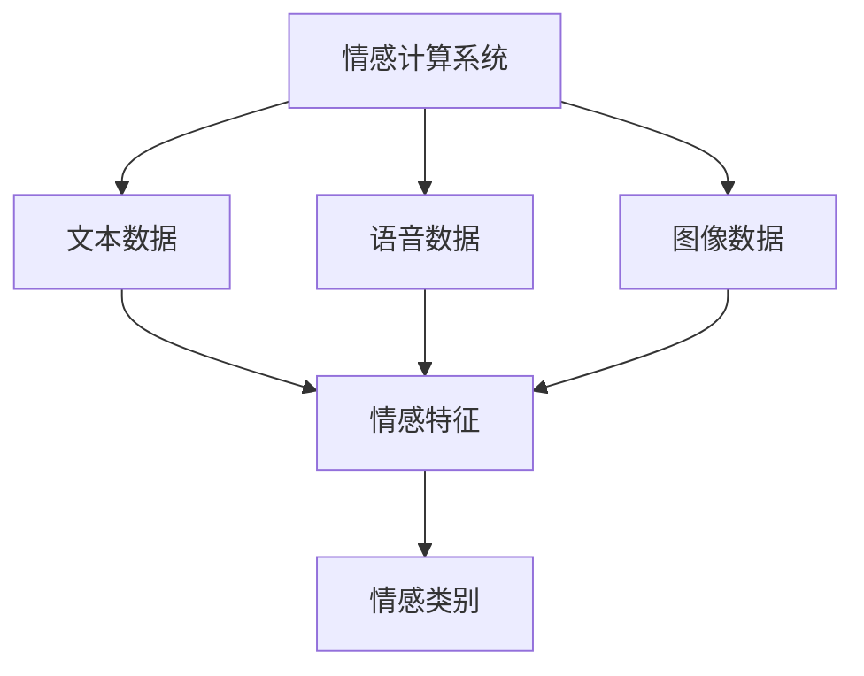
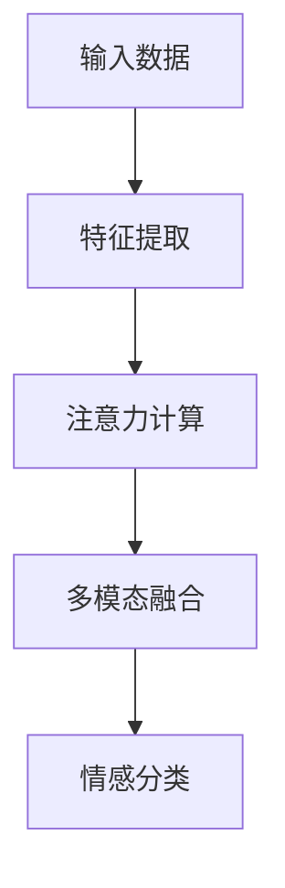
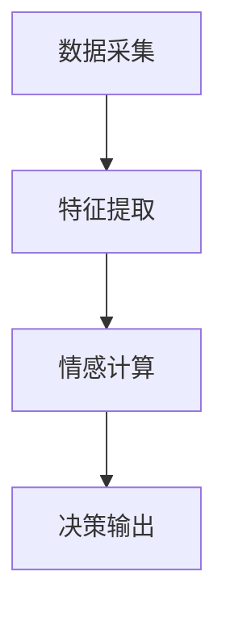
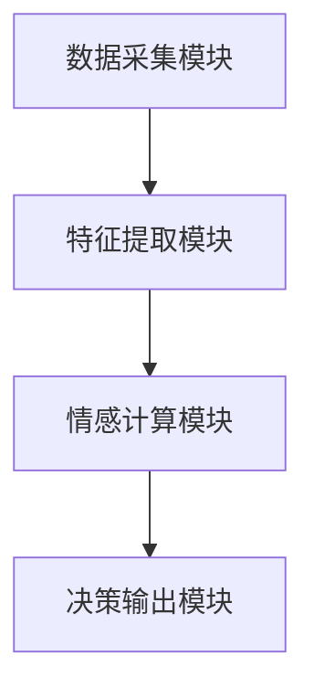
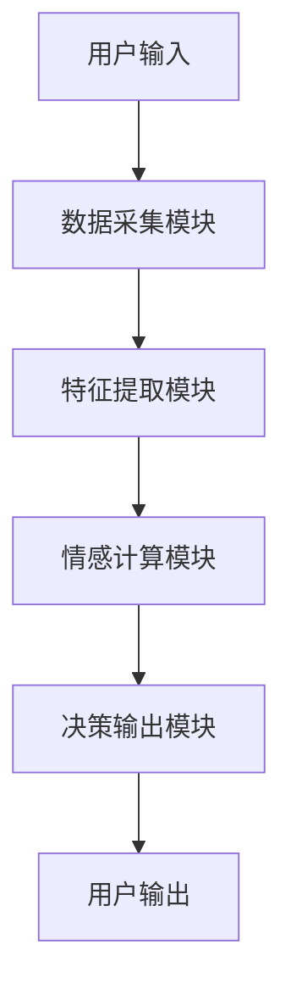

                 


# AI Agent的多模态情感计算技术

> 关键词：AI Agent, 多模态情感计算, 情感分析, 深度学习, 多模态数据融合

> 摘要：本文详细探讨了AI Agent在多模态情感计算技术中的应用，从背景介绍、核心概念到算法原理、系统架构，再到项目实战和最佳实践，全面分析了多模态情感计算的理论与实践。通过具体的项目案例和系统设计，展示了如何利用深度学习和多模态数据融合技术来提升AI Agent的情感认知能力。

---

# 第一章: AI Agent与多模态情感计算的背景介绍

## 1.1 问题背景与定义

### 1.1.1 情感计算的定义与目标
情感计算（Affective Computing）是人工智能领域的一个重要分支，旨在通过计算机技术识别、理解、分析和模拟人类情感。情感计算的目标是让计算机能够像人类一样感知和处理情感信息，从而实现更自然的人机交互。

### 1.1.2 多模态数据的定义与特点
多模态数据是指来自不同感官渠道（如视觉、听觉、文本等）的数据。与单一模态数据相比，多模态数据能够提供更丰富的信息，帮助计算机更准确地理解和分析情感。

### 1.1.3 AI Agent的核心概念与作用
AI Agent（智能体）是一种能够感知环境、自主决策并执行任务的智能系统。在情感计算中，AI Agent通过多模态情感计算技术，能够理解用户的情感状态，并根据情感信息做出更智能的决策。

## 1.2 技术演进与应用领域

### 1.2.1 情感计算技术的历史发展
情感计算经历了从基于规则的方法到基于深度学习的方法的演变。早期的情感计算主要依赖于人工制定的规则，而现代的情感计算则利用深度学习模型（如神经网络）来自动学习情感特征。

### 1.2.2 多模态数据处理的技术演进
多模态数据处理技术从单一模态的独立处理发展到多模态数据的融合处理。近年来，基于注意力机制的多模态融合方法逐渐成为研究的热点。

### 1.2.3 AI Agent在情感计算中的应用领域
AI Agent在情感计算中的应用领域包括智能客服、情感社交机器人、情感教育助手等。通过多模态情感计算技术，AI Agent能够更准确地理解用户情感，提供更个性化的服务。

## 1.3 问题解决与边界

### 1.3.1 情感计算的核心问题
情感计算的核心问题包括情感特征的提取、情感分类、情感推理等。多模态情感计算则进一步关注如何有效地融合多模态数据来提升情感计算的准确性。

### 1.3.2 多模态数据处理的边界与外延
多模态数据处理的边界包括数据采集、数据预处理、特征提取和融合等。外延则涉及数据安全、隐私保护等问题。

### 1.3.3 AI Agent在情感计算中的能力与限制
AI Agent在情感计算中的能力包括情感识别、情感推理和情感生成等。然而，目前的情感计算技术仍面临情感理解的深度不足、多模态数据融合的挑战等问题。

## 1.4 核心概念结构与要素

### 1.4.1 情感计算的系统架构
情感计算的系统架构通常包括数据采集、特征提取、情感计算和决策输出四个模块。AI Agent通过这些模块实现情感信息的感知和处理。

### 1.4.2 多模态数据的特征提取与表示
多模态数据的特征提取与表示需要考虑不同模态数据的特点，如文本的词向量、语音的时频特征等。通过有效的特征提取，可以提升情感计算的性能。

### 1.4.3 AI Agent的情感决策机制
AI Agent的情感决策机制需要结合情感计算结果和任务目标，做出最优决策。例如，在智能客服场景中，AI Agent可以根据用户的情感状态调整回答的语气和内容。

## 1.5 本章小结
本章通过背景介绍、技术演进和问题分析，全面阐述了AI Agent在多模态情感计算技术中的地位和作用。接下来的章节将深入探讨多模态情感计算的核心原理和算法实现。

---

# 第二章: 多模态情感计算的核心概念与联系

## 2.1 情感计算的核心原理

### 2.1.1 基于规则的情感分析
基于规则的情感分析通过预定义的情感词典和规则来判断文本的情感倾向。然而，这种方法在处理复杂情感信息时往往表现不佳。

### 2.1.2 基于深度学习的情感计算
基于深度学习的情感计算利用神经网络模型（如LSTM、Transformer）自动学习情感特征。这种方法能够处理复杂的情感信息，但需要大量的标注数据。

### 2.1.3 情感计算的数学模型
情感计算的数学模型可以表示为一个分类问题，目标是将输入的情感数据映射到特定的情感类别（如正面、负面、中性）。

## 2.2 多模态数据处理的核心原理

### 2.2.1 多模态数据融合方法
多模态数据融合方法包括模态权重、注意力机制和多任务学习等。其中，注意力机制能够有效捕捉不同模态数据的重要性。

### 2.2.2 基于注意力机制的多模态融合
基于注意力机制的多模态融合方法通过为每个模态分配注意力权重，实现多模态数据的有效融合。例如，在情感计算中，可以将文本、语音和图像的注意力权重进行融合，提升情感计算的准确性。

### 2.2.3 多模态数据的特征提取与表示
多模态数据的特征提取与表示需要考虑不同模态数据的特点。例如，文本可以使用词嵌入（如Word2Vec、BERT）进行表示，语音可以使用MFCC特征，图像可以使用CNN提取特征。

## 2.3 AI Agent与多模态情感计算的联系

### 2.3.1 AI Agent的情感认知能力
AI Agent通过多模态情感计算技术，能够感知和理解用户的情感状态，从而做出更智能的决策。

### 2.3.2 多模态数据在AI Agent中的应用
多模态数据在AI Agent中的应用包括情感识别、情感推理和情感生成。通过多模态数据的融合，AI Agent能够更准确地理解用户的情感需求。

### 2.3.3 情感计算对AI Agent决策的影响
情感计算结果直接影响AI Agent的决策过程。例如，在智能客服场景中，AI Agent可以根据用户的情感状态调整回答的语气和内容，提供更个性化的服务。

## 2.4 核心概念对比与ER实体关系图

### 2.4.1 情感计算与传统文本分析的对比
情感计算与传统文本分析的主要区别在于，情感计算关注情感信息的分析，而传统文本分析关注文本内容的理解。

### 2.4.2 多模态数据处理与单一模态数据处理的对比
多模态数据处理能够利用多种模态的信息，提升情感计算的准确性，而单一模态数据处理由于信息量的不足，往往效果有限。

### 2.4.3 ER实体关系图展示



---

# 第三章: 多模态情感计算的算法原理

## 3.1 基于深度学习的情感计算模型

### 3.1.1 模型输入与预处理
情感计算模型的输入可以是文本、语音或图像数据。预处理步骤包括数据清洗、标准化和特征提取。

### 3.1.2 模型结构与训练
基于深度学习的情感计算模型通常包括编码层、注意力层和分类层。训练过程使用标注数据，通过反向传播算法优化模型参数。

### 3.1.3 情感计算的数学模型
情感计算的数学模型可以表示为一个分类问题，目标是将输入的情感数据映射到特定的情感类别。常用的损失函数包括交叉熵损失函数。

$$ \text{损失函数} = -\sum_{i=1}^{n} y_i \log(p_i) + (1 - y_i) \log(1 - p_i) $$

其中，$y_i$ 是真实标签，$p_i$ 是模型预测的概率。

### 3.1.4 模型评估与优化
模型评估通常使用准确率、召回率和F1值等指标。优化方法包括调整学习率、增加数据增强和使用更复杂的模型结构。

## 3.2 多模态数据融合算法

### 3.2.1 多模态数据融合方法
多模态数据融合方法包括模态权重、注意力机制和多任务学习等。注意力机制是一种有效的多模态数据融合方法，能够捕捉不同模态数据的重要性。

### 3.2.2 基于注意力机制的多模态融合
基于注意力机制的多模态融合方法通过为每个模态分配注意力权重，实现多模态数据的有效融合。例如，在情感计算中，可以将文本、语音和图像的注意力权重进行融合，提升情感计算的准确性。

### 3.2.3 多模态情感计算的算法流程



---

# 第四章: 系统分析与架构设计

## 4.1 系统功能设计

### 4.1.1 系统功能模块
系统功能模块包括数据采集、特征提取、情感计算和决策输出四个模块。AI Agent通过这些模块实现情感信息的感知和处理。

### 4.1.2 系统功能流程



## 4.2 系统架构设计

### 4.2.1 系统架构图



### 4.2.2 系统接口设计
系统接口设计包括数据接口和模型接口。数据接口用于接收多模态数据，模型接口用于调用情感计算模型进行情感分类。

### 4.2.3 系统交互流程



---

# 第五章: 项目实战

## 5.1 项目介绍

### 5.1.1 项目背景
本项目旨在通过多模态情感计算技术，实现一个智能客服系统，能够根据用户的情感状态调整回答的语气和内容。

### 5.1.2 项目目标
项目目标包括数据采集、特征提取、模型训练和系统集成。通过实现智能客服系统，验证多模态情感计算技术的有效性。

## 5.2 环境安装

### 5.2.1 安装Python
安装Python 3.8及以上版本。

### 5.2.2 安装依赖库
安装依赖库包括numpy、pandas、tensorflow和sklearn。

## 5.3 核心实现

### 5.3.1 数据预处理
数据预处理包括文本清洗、语音特征提取和图像预处理。文本清洗步骤包括去除停用词和分词。

### 5.3.2 特征工程
特征工程包括文本特征提取、语音特征提取和图像特征提取。文本特征提取使用Word2Vec模型，语音特征提取使用MFCC特征，图像特征提取使用ResNet模型。

### 5.3.3 模型训练
模型训练包括数据分割、模型构建和模型训练。模型构建使用Keras框架，模型训练使用GPU加速。

## 5.4 代码实现

### 5.4.1 数据预处理代码

```python
import pandas as pd
import numpy as np

# 加载数据
data = pd.read_csv('data.csv')

# 文本清洗
def text_cleaning(text):
    # 去除停用词
    stop_words = set(stopwords.words('english'))
    words = word_tokenize(text.lower())
    filtered_words = [word for word in words if word not in stop_words]
    return ' '.join(filtered_words)

# 语音特征提取
from scipy.io import librosa

def extract_speech_features(audio_path):
    audio_data, sr = librosa.load(audio_path, sr=None)
    mfccs = librosa.feature.mfcc(y=audio_data, sr=sr, n_mfcc=20)
    return mfccs

# 图像预处理
import cv2

def preprocess_image(image_path):
    img = cv2.imread(image_path)
    img = cv2.resize(img, (224, 224))
    img = img / 255.0
    return img
```

### 5.4.2 模型训练代码

```python
import tensorflow as tf
from tensorflow.keras import layers

# 构建模型
def build_model(input_shape):
    inputs = layers.Input(shape=input_shape)
    x = layers.Conv2D(32, (3,3), activation='relu')(inputs)
    x = layers.MaxPooling2D((2,2))(x)
    x = layers.Flatten()(x)
    x = layers.Dense(128, activation='relu')(x)
    outputs = layers.Dense(3, activation='softmax')(x)  # 情感类别：0-负面，1-中性，2-正面
    return tf.keras.Model(inputs=inputs, outputs=outputs)

# 训练模型
model = build_model((224, 224, 3))
model.compile(optimizer='adam', loss='sparse_categorical_crossentropy', metrics=['accuracy'])
model.fit(x_train, y_train, epochs=10, batch_size=32, validation_data=(x_test, y_test))
```

## 5.5 项目小结
本项目通过多模态情感计算技术，实现了智能客服系统的构建。通过实验验证，多模态数据融合能够显著提升情感计算的准确性。

---

# 第六章: 最佳实践

## 6.1 小结
本文详细探讨了AI Agent在多模态情感计算技术中的应用，从背景介绍、核心概念到算法原理、系统架构，再到项目实战和最佳实践，全面分析了多模态情感计算的理论与实践。

## 6.2 注意事项
在实际应用中，需要注意数据隐私保护、模型可解释性和多模态数据的融合效果。此外，还需要根据具体场景调整模型参数和系统架构。

## 6.3 拓展阅读
推荐读者阅读相关领域的最新论文和技术报告，了解多模态情感计算的最新进展。例如，阅读《A Survey on Multimodal Affective Computing》和《Deep Learning for Multimodal Sentiment Analysis》等论文。

---

# 作者：AI天才研究院/AI Genius Institute & 禅与计算机程序设计艺术 /Zen And The Art of Computer Programming

