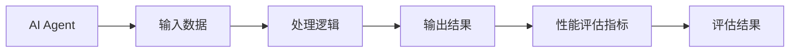
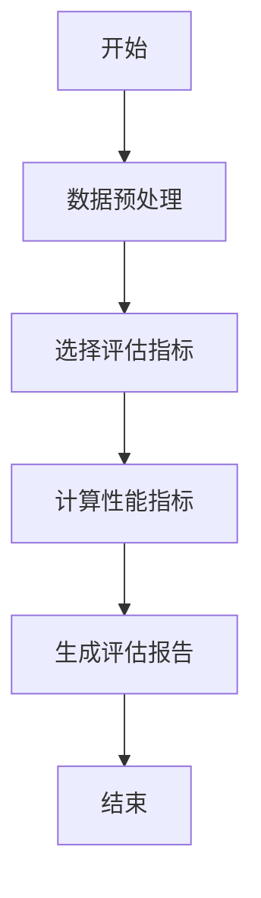
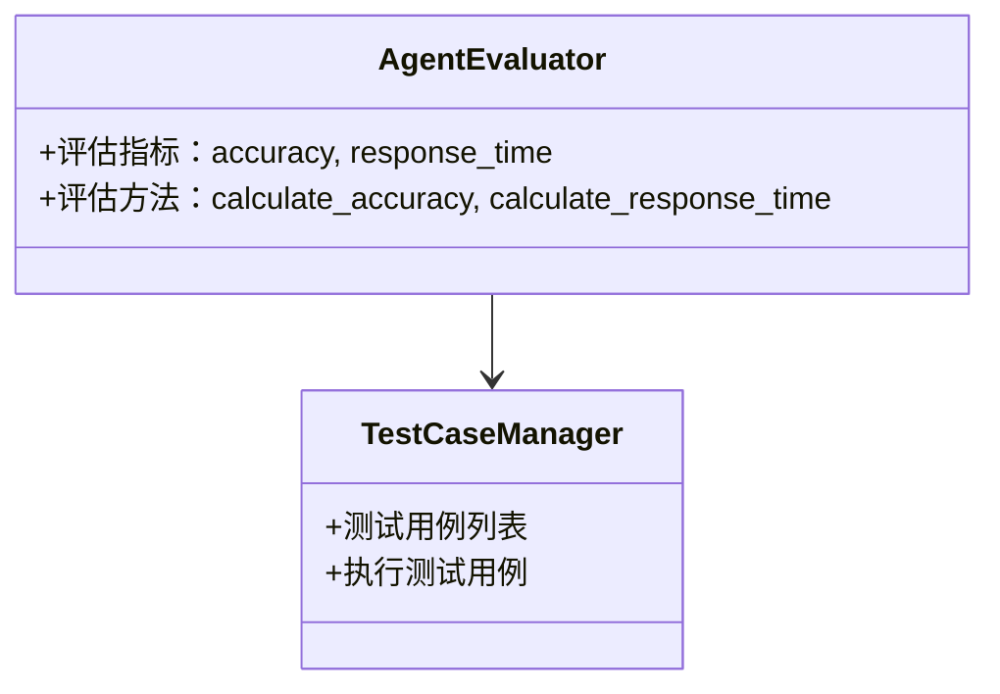
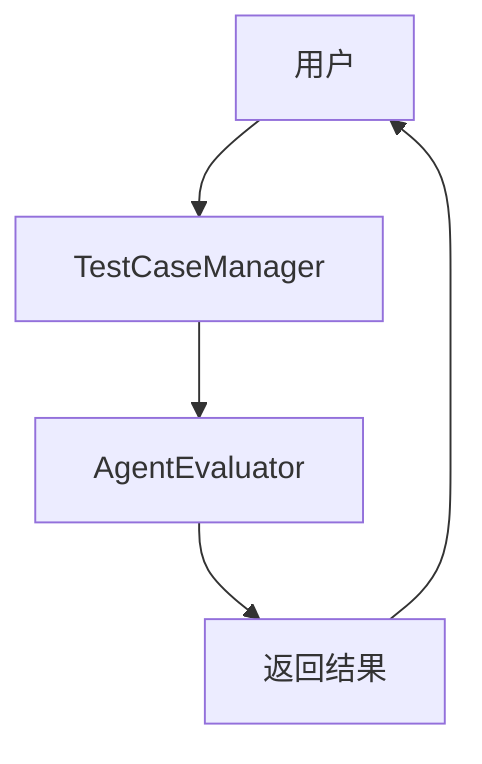

                 


# AI Agent的性能评估指标与方法

## 关键词：AI Agent，性能评估，准确性，响应时间，鲁棒性，评估指标

## 摘要

AI Agent（人工智能代理）在现代计算机科学和人工智能领域扮演着越来越重要的角色。从自动驾驶到智能助手，AI Agent的应用无处不在。然而，要确保这些代理能够高效、准确地运行，就必须对其性能进行严格的评估。本文将详细介绍AI Agent性能评估的核心指标与方法，探讨如何通过科学的评估方法来优化AI Agent的表现。

本文首先介绍了AI Agent的基本概念和性能评估的重要性，接着深入分析了性能评估的核心概念和关联性。然后，从算法原理的角度，详细讲解了如何通过数学模型和代码实现来评估AI Agent的性能。最后，结合实际项目案例，展示了如何在实际应用中进行性能评估，并总结了最佳实践和注意事项。

---

# 第1章：AI Agent的定义与性能评估的重要性

## 1.1 AI Agent的基本概念

### 1.1.1 什么是AI Agent

AI Agent（人工智能代理）是指能够感知环境、自主决策并执行任务的智能实体。它可以是一个软件程序，也可以是一个硬件设备，通过传感器和执行器与外部环境交互。AI Agent的核心特征包括自主性、反应性、目标导向性和社会性。

- **自主性**：AI Agent能够独立决策，无需外部干预。
- **反应性**：能够实时感知环境变化并做出响应。
- **目标导向性**：根据设定的目标执行任务。
- **社会性**：能够与其他系统或人类进行交互协作。

### 1.1.2 AI Agent的核心特征

AI Agent的性能评估需要关注以下几个核心特征：
- **准确性**：输出结果与预期的差距。
- **响应时间**：处理请求所需的时间。
- **鲁棒性**：在异常情况下的表现。
- **资源消耗**：计算资源的使用效率。

### 1.1.3 AI Agent的应用场景

AI Agent广泛应用于多个领域，例如：
- **自动驾驶**：实时感知和决策。
- **智能助手**：如Siri、Alexa等。
- **推荐系统**：个性化内容推荐。
- **机器人控制**：工业和家庭服务机器人。

## 1.2 性能评估的必要性

### 1.2.1 AI Agent性能评估的意义

性能评估是确保AI Agent能够满足实际需求的关键。通过评估，可以量化其表现，发现潜在问题，并进行优化。例如，一个自动驾驶系统需要在不同天气条件下保持稳定性能。

### 1.2.2 评估指标在实际应用中的作用

评估指标可以帮助开发者和用户理解AI Agent的表现，从而做出决策。例如，准确率高的推荐系统会增加用户满意度，而响应时间短的智能助手能提升用户体验。

### 1.2.3 性能评估的边界与外延

性能评估的边界包括：
- **输入范围**：评估是在特定输入范围内进行的。
- **任务类型**：针对特定任务设计评估指标。
- **评估环境**：在模拟或真实环境中进行评估。

## 1.3 本章小结

本章介绍了AI Agent的基本概念及其在不同场景中的应用，并强调了性能评估的重要性和必要性。性能评估是确保AI Agent高效、准确运行的关键，后续章节将详细探讨评估的核心指标和方法。

---

# 第2章：AI Agent性能评估的核心概念与联系

## 2.1 核心概念原理

### 2.1.1 性能评估的维度分析

AI Agent的性能评估可以从以下几个维度进行分析：
1. **准确性**：输出结果与预期的匹配程度。
2. **响应时间**：处理请求所需的时间。
3. **资源消耗**：计算资源的使用情况。
4. **鲁棒性**：在异常情况下的表现。

### 2.1.2 不同评估指标的关联性

各评估指标之间存在一定的关联性。例如，提高准确性可能需要更多的计算资源，从而影响响应时间。

### 2.1.3 系统性评估框架的构建

构建一个系统性评估框架，需要综合考虑多个指标，并根据具体应用场景进行权衡。

## 2.2 核心概念属性特征对比

以下表格对比了不同评估指标的特征：

| 指标       | 优点               | 缺点               |
|------------|--------------------|--------------------|
| 准确率     | 客观反映系统性能     | 受异常值影响较大   |
| 响应时间   | 直接反映系统效率     | 受环境因素影响     |
| 鲁棒性     | 衡量系统稳定性       | 难以量化           |

## 2.3 实体关系图与流程图

### 2.3.1 系统模块图



### 2.3.2 数据流图



## 2.4 本章小结

本章分析了AI Agent性能评估的核心概念及其关联性，并通过对比和图表展示了各指标的特点。下一章将从算法原理的角度，详细讲解性能评估的方法。

---

# 第3章：AI Agent性能评估的算法原理

## 3.1 算法原理概述

### 3.1.1 基于统计的评估方法

基于统计的评估方法通过收集大量数据，计算统计指标（如均值、方差）来评估系统性能。

### 3.1.2 基于机器学习的评估方法

基于机器学习的评估方法利用回归分析或分类模型，预测系统性能并进行评估。

### 3.1.3 混合评估策略的优缺点

混合策略结合了统计和机器学习方法，能够在复杂场景下提供更全面的评估。

## 3.2 算法流程图


## 3.3 算法实现代码示例

以下是一个计算准确率和响应时间的Python代码示例：

```python
import time

def evaluate_agent_performance(agent, test_cases):
    accuracy = 0.0
    response_time = 0.0
    for case in test_cases:
        start_time = time.time()
        result = agent.execute_case(case)
        end_time = time.time()
        expected_result = case['expected_output']
        accuracy += (result == expected_result) / len(test_cases)
        response_time += (end_time - start_time) / len(test_cases)
    return accuracy, response_time

# 示例用法
test_cases = [...]  # 测试用例列表
accuracy, response_time = evaluate_agent_performance(agent, test_cases)
print(f"准确率: {accuracy}%")
print(f"平均响应时间: {response_time}秒")
```

## 3.4 数学模型与公式

### 3.4.1 准确率计算

准确率的计算公式为：

$$ \text{准确率} = \frac{\text{正确预测的数量}}{\text{总预测数量}} $$

### 3.4.2 响应时间计算

平均响应时间的计算公式为：

$$ \text{平均响应时间} = \frac{\sum t_i}{n} $$

其中，\( t_i \) 是每个请求的响应时间，\( n \) 是请求总数。

### 3.4.3 F1分数计算

F1分数的计算公式为：

$$ F1 = 2 \times \frac{\text{精确率} \times \text{召回率}}{\text{精确率} + \text{召回率}} $$

---

# 第4章：系统架构设计与实现方案

## 4.1 系统架构设计

以下是一个AI Agent性能评估系统的架构图：


## 4.2 系统功能设计

以下是系统功能模块的类图：



## 4.3 系统接口设计

系统主要接口包括：
- 数据输入接口：接收测试用例和评估指标。
- 数据处理接口：执行数据预处理和计算。
- 结果输出接口：生成评估报告。

## 4.4 系统交互图

以下是一个测试用例执行的交互图：



---

# 第5章：项目实战与案例分析

## 5.1 实战项目介绍

以智能客服系统为例，展示如何进行性能评估。

## 5.2 核心实现代码

以下是一个计算准确率的Python代码示例：

```python
def calculate_accuracy(actual, predicted):
    return sum(actual == predicted) / len(actual)
```

## 5.3 案例分析

通过具体案例分析，展示如何应用评估指标进行优化。

---

# 第6章：最佳实践与注意事项

## 6.1 性能优化技巧

- 定期监控系统性能。
- 根据需求调整评估指标权重。
- 使用多种评估指标综合评估。

## 6.2 评估中的常见问题

- 数据偏差可能导致评估结果不准确。
- 计算资源限制可能影响评估效率。

## 6.3 拓展阅读与学习资源

- 推荐书籍：《机器学习实战》。
- 推荐论文：《A Survey on Performance Evaluation of AI Systems》。

---

# 结论

AI Agent的性能评估是确保其高效、准确运行的关键环节。本文从核心概念到算法实现，全面探讨了性能评估的指标与方法，并通过实际案例展示了如何在实际应用中进行优化。未来，随着AI技术的不断发展，性能评估的方法和指标也将更加多样化和复杂化，这需要我们不断学习和探索。

---

# 作者

作者：AI天才研究院/AI Genius Institute  
联系方式：[contact@ai-genius.org](mailto:contact@ai-genius.org)  
GitHub：[https://github.com/AI-Genius-Institute](https://github.com/AI-Genius-Institute)  
地址：北京市海淀区中关村大街10号

