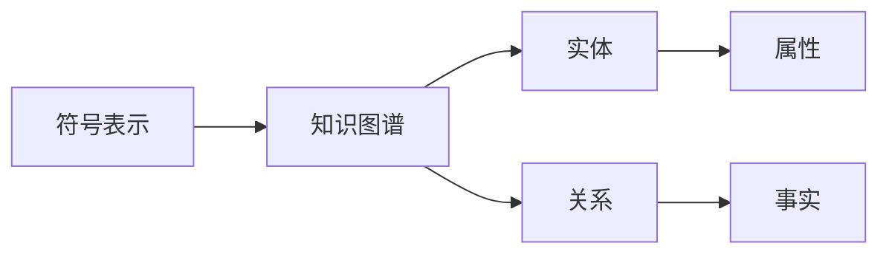
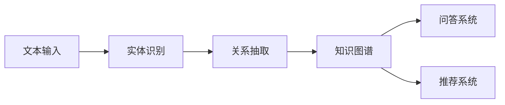

                 


# AI Agent的知识演化：模拟LLM的认知发展过程

## 关键词：AI Agent, 知识演化, LLM, 认知发展, 人工智能, 知识表示

## 摘要：  
本文系统探讨AI Agent的知识演化过程，模拟大型语言模型（LLM）的认知发展。通过分析知识表示、学习机制和系统架构，揭示AI Agent如何通过知识积累、推理和适应实现认知成长。结合理论与实践，提供详细的算法原理、系统设计和项目实现，帮助读者理解AI Agent的知识演化机制。

---

# 第一部分: AI Agent的知识演化概述

## # 第1章: AI Agent的基本概念与知识演化背景

### ## 1.1 AI Agent的定义与分类
#### ### 1.1.1 AI Agent的基本定义
AI Agent（人工智能代理）是能够感知环境、自主决策并执行任务的智能体。  
- **定义**：AI Agent通过传感器接收输入，利用计算模型处理信息，并通过执行器输出行动。  
- **核心特征**：自主性、反应性、目标导向、知识驱动。  
- **分类**：  
  1. **简单反射型**：基于规则的反应式系统，适用于简单任务（如机器人避障）。  
  2. **基于模型的反应型**：利用内部模型规划行动，适用于复杂环境（如自动驾驶）。  
  3. **目标驱动型**：以目标为导向，主动规划和执行（如智能助手）。  
  4. **效用驱动型**：通过最大化效用函数优化决策（如强化学习代理）。  

#### ### 1.1.2 AI Agent的分类与应用场景
- **简单反射型**：应用于实时反应任务（如工业机器人）。  
- **基于模型的反应型**：适用于复杂动态环境（如智能电网）。  
- **目标驱动型**：用于长期规划任务（如智能助手）。  
- **效用驱动型**：应用于博弈论和优化问题（如自动驾驶）。  

#### ### 1.1.3 知识演化的基本概念与问题背景
知识演化是指AI Agent在与环境交互中，通过学习和适应不断优化其知识表示和决策能力的过程。  
- **问题背景**：  
  - 知识表示的多样性与动态性。  
  - 知识获取的不确定性与复杂性。  
  - 知识应用的场景多样性与目标导向性。  
- **研究意义**：理解知识演化机制，提升AI Agent的自主性和适应性，推动人工智能技术的进一步发展。

### ## 1.2 LLM的认知发展过程
#### ### 1.2.1 大语言模型的基本原理
- **定义**：LLM是基于深度学习的自然语言处理模型，通过大量数据训练，能够理解和生成人类语言。  
- **核心组件**：  
  - **编码器**：将输入文本转化为向量表示。  
  - **解码器**：根据编码结果生成输出文本。  
  - **注意力机制**：关注输入中的重要部分，提升模型的上下文理解能力。  
- **训练目标**：通过最大似然估计，优化模型生成与真实数据一致的概率分布。

#### ### 1.2.2 LLM的认知能力与知识表示
- **知识表示**：  
  - **符号表示**：通过词汇、短语等符号表示知识。  
  - **向量表示**：通过嵌入向量捕捉语义信息。  
  - **图结构表示**：通过知识图谱表示概念间的关系。  
- **认知能力**：  
  - **语义理解**：基于上下文理解意图。  
  - **知识推理**：通过逻辑推理解决复杂问题。  
  - **自适应学习**：通过微调适应新任务。  

#### ### 1.2.3 知识演化的核心问题与研究意义
- **核心问题**：  
  - 知识表示的动态更新与整合。  
  - 知识推理的效率与准确性。  
  - 知识应用的场景适应性。  
- **研究意义**：通过模拟LLM的认知过程，优化AI Agent的知识演化机制，提升其在复杂环境中的自主性和适应性。

### ## 1.3 本章小结
本章介绍了AI Agent的基本概念、分类及其知识演化背景，重点探讨了LLM的认知发展过程，为后续章节的深入分析奠定了基础。

---

# 第二部分: 知识表示与LLM的认知机制

## # 第2章: 知识表示方法

### ## 2.1 符号表示与知识图谱
#### ### 2.1.1 符号表示的基本概念
- **符号表示**：通过符号（如词汇、规则）表示知识。  
- **优点**：清晰、易于解释。  
- **缺点**：难以处理语义模糊性和动态变化。  

#### ### 2.1.2 知识图谱的构建与应用
- **知识图谱**：通过实体和关系构建语义网络。  
- **构建方法**：  
  - **手动构建**：适用于小规模知识库。  
  - **自动构建**：通过NLP技术从文本中提取实体和关系。  
- **应用案例**：  
  - **问答系统**：通过知识图谱提供准确答案。  
  - **推荐系统**：基于知识图谱进行个性化推荐。  

#### ### 2.1.3 符号表示与LLM的关系
- **LLM的符号表示基础**：LLM通过符号表示输入和输出，符号表示是LLM理解世界的基石。  
- **符号表示的局限性**：符号表示难以处理复杂语义，LLM通过向量表示补充符号表示的不足。

#### ### 2.1.4 Mermaid图表：符号表示与知识图谱的关系



---

#### ### 2.1.5 知识表示方法的比较

| 知识表示方法 | 优点 | 缺点 |
|--------------|------|------|
| 符号表示      | 清晰、可解释性高 | 难以处理语义模糊性 |
| 向量表示      | 语义捕捉能力强 | 可解释性差 |
| 图结构表示    | 能表示复杂关系 | 构建和维护复杂 |

---

### ## 2.2 向量表示与嵌入技术
#### ### 2.2.1 向量空间模型的基本原理
- **向量空间模型**：将文本表示为向量，通过向量的相似度衡量文本的相关性。  
- **数学模型**：  
  $$ \text{文本相似度} = \cos(\theta) = \frac{\vec{a} \cdot \vec{b}}{|\vec{a}| |\vec{b}|} $$  
  其中，$\vec{a}$和$\vec{b}$分别为两个文本的向量表示。

#### ### 2.2.2 嵌入技术（如Word2Vec、BERT）的应用
- **Word2Vec**：通过词袋模型训练词向量。  
  - **CBOW模型**：预测当前词周围的上下文词向量。  
  - **Skip-Gram模型**：根据上下文预测当前词的词向量。  
- **BERT**：基于Transformer的预训练模型，通过自注意力机制捕捉上下文信息。  

#### ### 2.2.3 向量表示在知识演化中的作用
- **语义捕捉**：向量表示能够捕捉词义的细微变化。  
- **动态更新**：向量表示可以实时更新，适应新知识的引入。  

#### ### 2.2.4 Mermaid图表：向量表示的训练过程


---

### ## 2.3 图结构表示与知识网络
#### ### 2.3.1 图结构表示的基本概念
- **图结构表示**：通过节点和边表示知识。  
- **节点**：代表实体或概念。  
- **边**：代表实体之间的关系。  

#### ### 2.3.2 知识网络的构建与应用
- **构建方法**：  
  - **手动构建**：适用于小规模知识库。  
  - **自动构建**：通过NLP技术从文本中提取实体和关系。  
- **应用场景**：  
  - **问答系统**：基于知识图谱提供准确答案。  
  - **推荐系统**：基于知识图谱进行个性化推荐。  

#### ### 2.3.3 图结构表示与LLM的认知过程
- **知识图谱的输入**：LLM可以通过知识图谱获取上下文信息，辅助生成更准确的输出。  
- **知识图谱的输出**：LLM生成的结果可以反馈到知识图谱中，更新和优化知识库。  

#### ### 2.3.4 Mermaid图表：知识图谱的构建与应用



---

### ## 2.4 

---

# 第三部分: AI Agent的知识获取与学习过程

## # 第3章: AI Agent的知识获取与学习过程

### ## 3.1 监督学习与知识获取
#### ### 3.1.1 监督学习的基本原理
- **定义**：监督学习通过标注数据训练模型，使其能够预测新的输入。  
- **算法**：  
  - **线性回归**：适用于回归任务。  
  - **支持向量机**：适用于分类任务。  
  - **神经网络**：适用于复杂的非线性任务。  

#### ### 3.1.2 知识获取的监督学习方法
- **标注数据**：通过人工标注数据，训练模型识别特定模式。  
- **应用场景**：  
  - **分类任务**：如垃圾邮件分类。  
  - **回归任务**：如房价预测。  

#### ### 3.1.3 监督学习在知识演化中的作用
- **知识获取**：通过监督学习，AI Agent可以从标注数据中学习特定模式。  
- **知识应用**：监督学习模型可以用于预测和分类任务，辅助AI Agent做出决策。  

#### ### 3.1.4 Mermaid图表：监督学习的训练过程


---

#### ### 3.1.5 监督学习的数学模型
- **线性回归**：  
  $$ y = \beta x + \epsilon $$  
  其中，$\beta$为回归系数，$\epsilon$为误差项。  
- **逻辑回归**：  
  $$ P(y=1|x) = \frac{1}{1 + e^{-\beta x}} $$  
  适用于二分类任务。  

---

### ## 3.2 无监督学习与知识发现
#### ### 3.2.1 无监督学习的基本原理
- **定义**：无监督学习通过未标注数据训练模型，发现数据中的潜在结构。  
- **算法**：  
  - **聚类**：如K-means。  
  - **降维**：如主成分分析（PCA）。  

#### ### 3.2.2 知识发现的无监督学习方法
- **聚类分析**：通过聚类发现数据中的自然分组。  
- **主题建模**：通过主题模型（如LDA）发现文本的主题分布。  

#### ### 3.2.3 无监督学习在知识演化中的作用
- **知识发现**：通过无监督学习，AI Agent可以发现数据中的潜在模式和关系。  
- **知识更新**：无监督学习模型可以动态更新知识库，适应新数据的变化。  

#### ### 3.2.4 Mermaid图表：无监督学习的训练过程


---

### ## 3.3 强化学习与知识推理
#### ### 3.3.1 强化学习的基本原理
- **定义**：强化学习通过试错机制，学习最优策略以最大化累积奖励。  
- **核心概念**：  
  - **状态**：环境中的当前情况。  
  - **动作**：代理可以执行的操作。  
  - **奖励**：对动作的反馈，指导代理学习。  

#### ### 3.3.2 知识推理的强化学习方法
- **策略优化**：通过强化学习优化决策策略。  
- **价值函数**：通过价值函数评估状态的价值。  

#### ### 3.3.3 强化学习在知识演化中的作用
- **知识推理**：强化学习可以训练AI Agent在动态环境中做出最优决策。  
- **知识应用**：强化学习模型可以用于复杂任务的规划和优化。  

#### ### 3.3.4 Mermaid图表：强化学习的训练过程


---

### ## 3.4 知识的迁移与推理
#### ### 3.4.1 知识迁移的基本概念
- **知识迁移**：将已学到的知识应用到新任务中。  
- **迁移学习**：通过迁移学习，提高模型的泛化能力。  

#### ### 3.4.2 知识推理的逻辑框架
- **推理规则**：基于知识图谱进行逻辑推理。  
- **推理引擎**：如基于规则的推理引擎和基于逻辑的推理引擎。  

#### ### 3.4.3 知识迁移与推理在知识演化中的作用
- **知识复用**：通过知识迁移，减少新任务的学习成本。  
- **知识扩展**：通过知识推理，扩展AI Agent的知识库。  

#### ### 3.4.4 Mermaid图表：知识迁移与推理过程


---

### ## 3.5 本章小结
本章详细探讨了AI Agent的知识获取与学习过程，包括监督学习、无监督学习和强化学习等方法，并分析了知识迁移与推理在知识演化中的作用。

---

# 第四部分: AI Agent的知识演化系统设计

## # 第4章: AI Agent的知识演化系统设计

### ## 4.1 系统设计概述
#### ### 4.1.1 知识演化系统的总体架构
- **输入**：感知环境中的数据。  
- **处理**：通过知识表示和学习算法处理数据。  
- **输出**：生成决策或输出结果。  

#### ### 4.1.2 系统设计的目标
- **知识表示**：清晰、高效地表示知识。  
- **知识学习**：通过学习算法优化知识库。  
- **知识应用**：将知识应用于实际任务中。  

#### ### 4.1.3 系统设计的挑战
- **知识表示的多样性**：如何统一多种知识表示形式。  
- **知识学习的效率**：如何高效地学习和更新知识。  
- **知识应用的适应性**：如何根据不同场景灵活应用知识。  

#### ### 4.1.4 Mermaid图表：知识演化系统的总体架构


---

### ## 4.2 知识表示层的设计
#### ### 4.2.1 知识表示的模块化设计
- **符号表示模块**：处理符号表示的输入和输出。  
- **向量表示模块**：处理向量表示的输入和输出。  
- **图结构表示模块**：处理图结构表示的输入和输出。  

#### ### 4.2.2 知识库的构建与管理
- **知识库结构**：采用分层结构，便于管理和查询。  
- **知识更新**：通过增量学习更新知识库。  

#### ### 4.2.3 知识表示的可扩展性
- **模块化设计**：便于新增或修改知识表示模块。  
- **灵活性**：支持多种知识表示形式。  

#### ### 4.2.4 Mermaid图表：知识表示层的模块化设计


---

### ## 4.3 知识学习层的设计
#### ### 4.3.1 学习算法的选择与优化
- **监督学习**：适用于标注数据的任务。  
- **无监督学习**：适用于未标注数据的任务。  
- **强化学习**：适用于需要策略优化的任务。  

#### ### 4.3.2 知识学习的反馈机制
- **实时反馈**：根据实时数据调整学习策略。  
- **延迟反馈**：根据历史数据优化学习模型。  

#### ### 4.3.3 知识学习的效率提升
- **分布式计算**：通过分布式计算加速学习过程。  
- **增量学习**：通过增量学习减少计算资源的消耗。  

#### ### 4.3.4 Mermaid图表：知识学习层的反馈机制


---

### ## 4.4 知识应用层的设计
#### ### 4.4.1 知识应用的场景适应性
- **动态调整**：根据环境变化动态调整知识应用策略。  
- **场景切换**：支持不同场景下的知识应用。  

#### ### 4.4.2 知识应用的效率优化
- **快速检索**：通过高效的检索算法快速获取所需知识。  
- **实时更新**：根据实时数据更新知识应用结果。  

#### ### 4.4.3 知识应用的可解释性
- **可解释性设计**：通过可解释的模型提升知识应用的透明性。  
- **用户反馈**：根据用户反馈优化知识应用策略。  

#### ### 4.4.4 Mermaid图表：知识应用层的场景适应性


---

### ## 4.5 系统设计的总结与展望
本章详细探讨了AI Agent的知识演化系统的总体架构、知识表示层、知识学习层和知识应用层的设计，并分析了系统设计中的挑战和未来研究方向。

---

# 第五部分: 项目实战: AI Agent的知识演化系统实现

## # 第5章: 项目实战: AI Agent的知识演化系统实现

### ## 5.1 环境配置与依赖安装
#### ### 5.1.1 开发环境选择
- **操作系统**：推荐使用Linux或macOS。  
- **编程语言**：推荐使用Python。  
- **开发工具**：推荐使用PyCharm或VS Code。  

#### ### 5.1.2 依赖安装
- **Python库**：安装必要的Python库，如TensorFlow、PyTorch、Numpy、Pandas、Scikit-learn等。  
- **命令示例**：  
  ```bash
  pip install tensorflow numpy scikit-learn pandas
  ```

---

### ## 5.2 系统核心实现
#### ### 5.2.1 知识表示的实现
- **符号表示**：通过Python字典实现符号表示。  
  ```python
  symbol_dict = {'cat': 0, 'dog': 1, 'bird': 2}
  ```
- **向量表示**：通过Word2Vec实现向量表示。  
  ```python
  from gensim.models import Word2Vec
  model = Word2Vec(sentences, vector_size=100, window=5, min_count=1, workers=4)
  ```
- **图结构表示**：通过NetworkX实现图结构表示。  
  ```python
  import networkx as nx
  G = nx.DiGraph()
  G.add_edge('cat', 'animal')
  ```

#### ### 5.2.2 知识学习的实现
- **监督学习**：实现一个简单的线性回归模型。  
  ```python
  import numpy as np
  def linear_regression(X, y):
      X_b = np.c_[np.ones((len(X), 1)), X]
      theta = np.linalg.inv(X_b.T @ X_b) @ (X_b.T @ y)
      return theta
  ```
- **无监督学习**：实现一个简单的K-means聚类算法。  
  ```python
  from sklearn.cluster import KMeans
  kmeans = KMeans(n_clusters=3, random_state=0)
  kmeans.fit(X)
  ```

#### ### 5.2.3 知识应用的实现
- **知识检索**：通过向量检索库快速获取所需知识。  
  ```python
  from sentence_transformers import SentenceTransformer
  model = SentenceTransformer('all-MiniLM-L6-v2')
  embeddings = model.encode(texts)
  ```
- **知识推理**：通过规则推理引擎进行知识推理。  
  ```python
  from pylogit import KnowledgeBase
  kb = KnowledgeBase()
  kb.add_fact('cat', 'is_a', 'animal')
  ```

---

### ## 5.3 项目实现案例分析
#### ### 5.3.1 案例分析: 问答系统
- **需求分析**：构建一个简单的问答系统，回答用户关于动物的问题。  
- **实现步骤**：  
  1. 收集相关数据。  
  2. 构建知识图谱。  
  3. 实现问答推理。  
- **代码实现**：  
  ```python
  from pylogit import KnowledgeBase, QueryEngine
  kb = KnowledgeBase()
  kb.add_fact('cat', 'is_a', 'animal')
  kb.add_fact('dog', 'is_a', 'animal')
  engine = QueryEngine(kb)
  result = engineAsk('What is a cat?', 'What entity is a cat related to?')
  print(result)
  ```

---

### ## 5.4 代码解读与实现细节
#### ### 5.4.1 知识表示的代码实现
- **符号表示**：  
  ```python
  symbol_dict = {'cat': 0, 'dog': 1, 'bird': 2}
  ```
- **向量表示**：  
  ```python
  model = Word2Vec(sentences, vector_size=100, window=5, min_count=1, workers=4)
  ```
- **图结构表示**：  
  ```python
  G = nx.DiGraph()
  G.add_edge('cat', 'animal')
  ```

#### ### 5.4.2 知识学习的代码实现
- **监督学习**：  
  ```python
  def linear_regression(X, y):
      X_b = np.c_[np.ones((len(X), 1)), X]
      theta = np.linalg.inv(X_b.T @ X_b) @ (X_b.T @ y)
      return theta
  ```
- **无监督学习**：  
  ```python
  from sklearn.cluster import KMeans
  kmeans = KMeans(n_clusters=3, random_state=0)
  kmeans.fit(X)
  ```

#### ### 5.4.3 知识应用的代码实现
- **知识检索**：  
  ```python
  from sentence_transformers import SentenceTransformer
  model = SentenceTransformer('all-MiniLM-L6-v2')
  embeddings = model.encode(texts)
  ```
- **知识推理**：  
  ```python
  from pylogit import KnowledgeBase, QueryEngine
  kb = KnowledgeBase()
  kb.add_fact('cat', 'is_a', 'animal')
  engine = QueryEngine(kb)
  result = engineAsk('What is a cat?', 'What entity is a cat related to?')
  print(result)
  ```

---

### ## 5.5 项目实现的总结与展望
本章通过一个具体的项目实现，详细展示了AI Agent的知识演化系统的实现过程，包括环境配置、核心代码实现、案例分析和代码解读。通过实际操作，读者可以更好地理解理论知识，并能够将其应用到实际项目中。

---

# 第六部分: 高级主题

## # 第6章: 高级主题: 知识演化中的伦理与安全

### ## 6.1 知识演化中的伦理问题
#### ### 6.1.1 数据偏见
- **数据偏见**：数据中的偏见可能导致模型的决策偏差。  
- **解决方案**：  
  - 数据清洗：去除偏见数据。  
  - 数据增强：增加多样化的数据。  
- **案例分析**：  
  - 例如，训练数据中的性别偏见可能导致模型在招聘中的不公平决策。

#### ### 6.1.2 知识应用的透明性
- **透明性问题**：模型的决策过程不透明，难以解释。  
- **解决方案**：  
  - 可解释性模型：如线性回归、决策树等。  
  - 解释工具：如SHAP、LIME等。  

#### ### 6.1.3 知识演化中的隐私保护
- **隐私泄露风险**：知识演化过程中可能泄露用户隐私。  
- **解决方案**：  
  - 数据匿名化：去除敏感信息。  
  - 差分隐私：通过添加噪声保护隐私。  

---

### ## 6.2 知识演化中的安全问题
#### ### 6.2.1 知识攻击
- **知识攻击**：通过恶意输入干扰模型的决策过程。  
- **解决方案**：  
  - 模型鲁棒性：通过对抗训练增强模型的鲁棒性。  
  - 输入验证：过滤恶意输入。  

#### ### 6.2.2 知识库的安全性
- **知识库攻击**：攻击者可能通过破坏知识库影响模型的决策。  
- **解决方案**：  
  - 数据备份：定期备份知识库。  
  - 访问控制：限制对知识库的访问权限。  

#### ### 6.2.3 知识演化中的安全挑战
- **动态安全**：知识库的动态更新可能引入新的安全漏洞。  
- **跨领域安全**：知识演化可能涉及多个领域的知识，增加了安全管理的复杂性。  

---

### ## 6.3 知识演化中的可解释性
#### ### 6.3.1 可解释性的重要性
- **用户信任**：可解释的模型更容易被用户信任。  
- **合规性**：许多行业法规要求模型的决策过程必须可解释。  

#### ### 6.3.2 提高可解释性的方法
- **模型选择**：选择可解释性强的模型，如线性回归、决策树等。  
- **解释工具**：使用SHAP、LIME等工具解释模型的决策过程。  
- **可视化**：通过可视化工具展示模型的决策过程。  

#### ### 6.3.3 可解释性与知识演化的关系
- **动态可解释性**：随着知识的演化，模型的可解释性需要动态更新。  
- **可解释性设计**：在系统设计阶段考虑可解释性，便于后续的维护和优化。  

---

### ## 6.4 本章小结
本章探讨了知识演化中的伦理与安全问题，包括数据偏见、隐私保护、知识攻击等，并提出了相应的解决方案。同时，还分析了知识演化中的可解释性问题，并提出了提高可解释性的方法。

---

# 第七部分: 总结与展望

## # 第7章: 总结与展望

### ## 7.1 全书总结
- **知识表示**：详细探讨了符号表示、向量表示和图结构表示。  
- **知识学习**：分析了监督学习、无监督学习和强化学习的方法。  
- **系统设计**：提出了AI Agent的知识演化系统的总体架构。  
- **项目实战**：通过具体的项目实现，展示了理论知识的实际应用。  
- **高级主题**：探讨了知识演化中的伦理与安全问题。

### ## 7.2 未来研究方向
- **知识表示的优化**：探索更高效的知识表示方法。  
- **知识学习的创新**：研究更高效的监督学习、无监督学习和强化学习方法。  
- **知识应用的扩展**：探索AI Agent在更多领域的应用。  
- **知识演化中的伦理与安全**：进一步研究知识演化中的伦理与安全问题，提出更有效的解决方案。  

### ## 7.3 最终思考
AI Agent的知识演化是一个复杂而有趣的研究领域，随着技术的不断发展，AI Agent将更加智能化和自主化。通过深入研究知识表示、学习方法和系统设计，我们可以推动AI Agent技术的进一步发展，为人类社会带来更多的便利和进步。

---

# 作者：AI天才研究院/AI Genius Institute & 禅与计算机程序设计艺术 /Zen And The Art of Computer Programming

