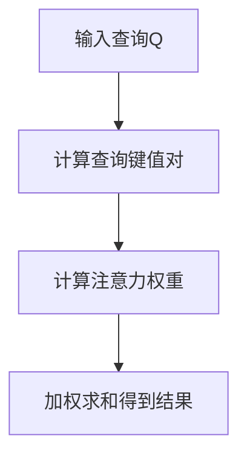
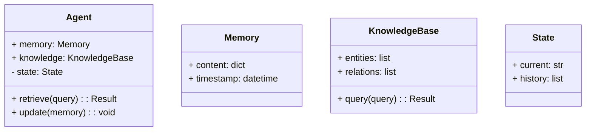

                 


# AI Agent的记忆机制：设计与实现

> 关键词：AI Agent, 记忆机制, 神经网络, 知识图谱, 图结构

> 摘要：AI Agent的记忆机制是实现智能化决策和行为的核心技术。本文从AI Agent的基本概念出发，系统地探讨了记忆机制的设计原理、实现技术及其在实际应用中的表现。通过分析记忆机制的数学模型、算法流程和系统架构，本文为读者提供了从理论到实践的全面指导，帮助理解如何设计和实现高效的AI Agent记忆机制。

---

## 第1章: AI Agent与记忆机制概述

### 1.1 AI Agent的基本概念

#### 1.1.1 AI Agent的定义与分类
AI Agent（人工智能代理）是指能够感知环境、自主决策并执行任务的智能实体。根据功能和复杂度，AI Agent可以分为以下几类：
- **简单反射型Agent**：基于当前输入做出反应，不具备复杂记忆能力。
- **基于模型的反射型Agent**：维护对环境的内部模型，并基于模型进行决策。
- **目标驱动型Agent**：根据预设目标进行规划和行动。
- **效用驱动型Agent**：通过最大化效用函数来优化决策。

#### 1.1.2 AI Agent的核心功能与特点
AI Agent的核心功能包括感知、决策、规划和执行。其特点包括：
- **自主性**：能够在没有外部干预的情况下独立运作。
- **反应性**：能够实时感知环境变化并做出响应。
- **目标导向性**：基于目标进行决策和行动。
- **学习能力**：通过经验改进性能。

#### 1.1.3 记忆机制在AI Agent中的作用与意义
记忆机制是AI Agent实现自主性和智能性的关键。它允许Agent存储过去的信息，以便在未来做出更明智的决策。记忆机制的意义包括：
- **信息持久化**：防止信息丢失。
- **经验复用**：利用过去的经验提高效率。
- **情境理解**：通过历史信息更好地理解当前情境。

### 1.2 AI Agent记忆机制的背景与问题背景

#### 1.2.1 AI Agent面临的挑战
AI Agent在实现复杂任务时面临以下挑战：
- **动态环境适应**：环境的不确定性要求Agent能够快速适应变化。
- **信息过载**：处理大量信息可能导致性能下降。
- **决策优化**：在复杂环境中做出最优决策需要高效的计算和记忆能力。

#### 1.2.2 记忆机制的必要性与重要性
记忆机制的必要性体现在：
- **避免重复计算**：通过存储已处理的信息减少重复计算。
- **提高决策质量**：利用历史信息做出更准确的判断。
- **支持长期任务**：在长周期任务中保持信息的连续性。

记忆机制的重要性体现在：
- **提升效率**：通过存储和快速检索信息，提高处理效率。
- **增强智能性**：记忆能力是实现高级智能的基础。
- **支持复杂任务**：复杂任务需要综合历史信息进行决策。

#### 1.2.3 问题描述与边界定义
AI Agent的记忆机制需要解决以下问题：
- **如何存储信息**：选择合适的数据结构和存储方式。
- **如何检索信息**：设计高效的检索算法。
- **如何更新信息**：制定合理的更新策略。

边界定义包括：
- **存储容量**：限定存储的最大容量。
- **存储时间**：限定信息的存储时长。
- **信息类型**：限定存储的信息类型。

### 1.3 记忆机制的核心概念与属性

#### 1.3.1 记忆机制的定义与核心要素
记忆机制是指AI Agent存储、检索和更新信息的过程。其核心要素包括：
- **存储单元**：信息的存储位置。
- **检索算法**：根据查询条件检索信息的方法。
- **更新规则**：信息更新的策略和方法。

#### 1.3.2 记忆机制的属性特征对比表
以下是不同记忆机制的属性对比：

| 属性       | 基于神经网络的记忆机制 | 基于图结构的记忆机制 | 符号逻辑的记忆机制 |
|------------|------------------------|----------------------|---------------------|
| 存储方式   | 神经网络权重           | 图节点与边           | 符号化规则         |
| 检索方式   | 基于相似度匹配         | 基于路径搜索         | 基于规则匹配       |
| 可解释性   | 低                    | 中                    | 高                  |
| 计算效率   | 高                    | 中                    | 低                  |

#### 1.3.3 ER实体关系图与记忆机制的关联
以下是记忆机制的ER实体关系图：

```mermaid
erdiagram
actor(Agent) -[关联关系]-> memory(Entity)
memory(Entity) -[属性]-> identifier(string), content(any), timestamp(timestamp)
```

### 1.4 本章小结
本章介绍了AI Agent的基本概念、记忆机制的背景和核心概念。通过对比不同记忆机制的属性，为后续章节的详细探讨奠定了基础。

---

## 第2章: AI Agent记忆机制的核心原理

### 2.1 记忆机制的原理与实现方式

#### 2.1.1 基于神经网络的记忆机制
基于神经网络的记忆机制通过神经网络的权重变化实现信息存储和检索。常用的模型包括：

1. **简单记忆网络**：通过神经元之间的连接权重存储信息。
2. **LSTM记忆网络**：通过长短期记忆单元(LSTM)实现信息的存储和遗忘。
3. **Transformer记忆机制**：通过自注意力机制实现信息的全局依赖。

#### 2.1.2 基于图结构的记忆网络
基于图结构的记忆网络通过图节点和边表示信息及其关系。常用的方法包括：

1. **知识图谱**：通过图结构存储实体及其属性。
2. **图神经网络**：通过图卷积网络(GCN)处理图结构数据。
3. **图注意力网络**：通过注意力机制关注重要的图节点。

#### 2.1.3 符号逻辑与知识图谱的记忆机制
符号逻辑的记忆机制通过符号化规则和知识图谱表示信息。常用的方法包括：

1. **符号化规则**：通过逻辑规则表示知识。
2. **知识图谱**：通过节点和边表示实体及其关系。
3. **本体论模型**：通过形式化语言表示知识。

---

### 2.2 记忆机制的核心算法与流程

#### 2.2.1 记忆存储的数学模型
基于神经网络的记忆机制可以通过以下数学模型表示：

$$
M(t) = \sigma(W_{in}x(t) + W_{hid}h(t-1) + b)
$$

其中，$M(t)$ 表示当前时刻的记忆，$x(t)$ 表示输入，$h(t-1)$ 表示前一时刻的隐藏状态，$W_{in}$ 和 $W_{hid}$ 分别是输入和隐藏层的权重，$b$ 是偏置，$\sigma$ 是激活函数。

#### 2.2.2 记忆检索的算法流程
以下是基于自注意力机制的检索算法流程图：



#### 2.2.3 记忆更新的规则与机制
记忆更新的规则可以表示为：

$$
M(t) = \alpha M(t-1) + (1-\alpha) \cdot f(x(t))
$$

其中，$\alpha$ 是记忆衰减系数，$f(x(t))$ 是当前输入的函数。

---

### 2.3 记忆机制与AI Agent行为的关系

#### 2.3.1 记忆机制对行为决策的影响
记忆机制通过提供历史信息，帮助AI Agent做出更准确的决策。例如，在自然语言处理任务中，记忆机制可以提高文本理解的准确性。

#### 2.3.2 行为数据对记忆存储的反哺作用
行为数据可以反哺记忆存储，通过强化学习等方式优化记忆机制的性能。

#### 2.3.3 记忆机制与AI Agent自主性之间的平衡
记忆机制的自主性需要在信息存储和检索的效率与准确性之间找到平衡点。

---

### 2.4 本章小结
本章详细探讨了AI Agent记忆机制的原理与实现方式，包括基于神经网络、图结构和符号逻辑的记忆机制。通过数学模型和算法流程图，读者可以更好地理解记忆机制的实现细节。

---

## 第3章: AI Agent记忆机制的数学模型与公式推导

### 3.1 基于神经网络的记忆模型

#### 3.1.1 简单记忆网络模型
简单记忆网络模型的数学公式如下：

$$
M(t) = \sigma(W_{in}x(t) + W_{hid}h(t-1) + b)
$$

其中，$\sigma$ 是激活函数，$W_{in}$ 和 $W_{hid}$ 分别是输入和隐藏层的权重，$b$ 是偏置。

#### 3.1.2 基于LSTM的记忆网络
LSTM记忆网络的公式如下：

$$
i(t) = \sigma(W_i x(t) + W_ih h(t-1) + b_i)
$$

$$
f(t) = \sigma(W_f x(t) + W_fh h(t-1) + b_f)
$$

$$
M(t) = i(t) \cdot M(t-1) + f(t) \cdot M(t-1)
$$

其中，$i(t)$ 是输入门，$f(t)$ 是遗忘门。

#### 3.1.3 基于Transformer的记忆机制
Transformer记忆机制的注意力计算公式如下：

$$
\alpha_{ij} = \frac{\exp(s_{ij})}{\sum_{k} \exp(s_{ik})}
$$

其中，$s_{ij}$ 是查询与键的相似度。

---

### 3.2 图结构记忆网络的数学模型

#### 3.2.1 图神经网络的数学模型
图神经网络的数学模型如下：

$$
h_i^{(l)} = \sigma\left(\sum_{j \in N(i)} W_{ij} h_j^{(l-1)} + b_i\right)
$$

其中，$N(i)$ 表示节点$i$的邻居节点。

#### 3.2.2 图注意力网络的数学模型
图注意力网络的注意力计算公式如下：

$$
\alpha_{ij} = \frac{\exp(e_{ij})}{\sum_{k} \exp(e_{ik})}
$$

其中，$e_{ij}$ 是节点$i$和节点$j$之间的注意力权重。

---

### 3.3 符号逻辑与知识图谱的记忆机制

#### 3.3.1 符号化规则的数学模型
符号化规则的数学模型如下：

$$
P(a,b) \rightarrow Q(b,c)
$$

其中，$P(a,b)$ 和 $Q(b,c)$ 是逻辑规则。

#### 3.3.2 知识图谱的数学模型
知识图谱的数学模型可以通过三元组表示：

$$
(a, r, b)
$$

其中，$a$ 和 $b$ 是实体，$r$ 是关系。

---

## 第4章: AI Agent记忆机制的系统设计与实现

### 4.1 系统分析与架构设计方案

#### 4.1.1 问题场景介绍
假设我们需要设计一个基于知识图谱的AI Agent记忆机制，用于问答系统。

#### 4.1.2 系统功能设计
以下是系统功能设计的领域模型：



#### 4.1.3 系统架构设计
以下是系统架构设计的架构图：


---

### 4.2 系统实现与代码示例

#### 4.2.1 环境安装
需要安装以下Python库：
- `networkx`：用于图结构处理。
- `numpy`：用于数值计算。
- `scikit-learn`：用于机器学习算法。

#### 4.2.2 系统核心实现源代码
以下是基于知识图谱的记忆机制实现代码：

```python
import networkx as nx
from datetime import datetime

class Memory:
    def __init__(self):
        self.content = {}
        self.timestamp = datetime.now()

    def store(self, key, value):
        self.content[key] = value
        self.timestamp = datetime.now()

    def retrieve(self, key):
        return self.content.get(key, None)

class KnowledgeBase:
    def __init__(self):
        self.entities = []
        self.relations = []

    def add_entity(self, entity):
        self.entities.append(entity)

    def add_relation(self, relation):
        self.relations.append(relation)

    def query(self, query):
        # 简单的查询实现
        results = []
        for r in self.relations:
            if r['head'] == query['head'] and r['relation'] == query['relation']:
                results.append(r['tail'])
        return results

class Agent:
    def __init__(self, memory, knowledge_base):
        self.memory = memory
        self.knowledge_base = knowledge_base
        self.state = {'current': None, 'history': []}

    def retrieve(self, query):
        result = self.memory.retrieve(query)
        if result is None:
            result = self.knowledge_base.query(query)
            self.memory.store(query, result)
        return result

    def update(self):
        self.state['history'].append(self.memory.timestamp)
```

#### 4.2.3 代码应用解读与分析
上述代码实现了基于知识图谱的记忆机制。`Memory`类负责存储和检索信息，`KnowledgeBase`类负责管理和查询知识图谱，`Agent`类负责协调记忆机制和知识图谱的交互。

---

### 4.3 系统交互流程

以下是系统交互的序列图：

```mermaid
sequenceDiagram
    Client -> Agent: send query
    Agent -> Memory: retrieve(query)
    if Memory.retrieve(query) is null
        Agent -> KnowledgeBase: query(query)
        KnowledgeBase -> Agent: return result
        Agent -> Memory: store(query, result)
    else
        Agent -> Memory: return result
    Agent -> Client: return result
```

---

### 4.4 本章小结
本章通过系统设计和代码实现，详细展示了AI Agent记忆机制的实现过程。通过图结构和符号逻辑的记忆机制，可以实现高效的问答系统。

---

## 第5章: AI Agent记忆机制的项目实战

### 5.1 项目背景与目标
本项目旨在设计一个基于知识图谱的问答系统，利用AI Agent的记忆机制实现智能问答。

### 5.2 项目核心实现
以下是项目的核心实现步骤：

1. **环境安装**：安装所需的Python库。
2. **知识图谱构建**：构建实体和关系的数据库。
3. **记忆机制实现**：实现基于知识图谱的记忆机制。
4. **系统集成**：将记忆机制与问答系统集成。

---

### 5.3 项目案例分析与详细讲解

#### 5.3.1 项目环境配置
需要安装以下Python库：
- `networkx`
- `numpy`
- `scikit-learn`

#### 5.3.2 核心代码实现
以下是核心代码实现：

```python
import networkx as nx
from datetime import datetime

class Memory:
    def __init__(self):
        self.content = {}
        self.timestamp = datetime.now()

    def store(self, key, value):
        self.content[key] = value
        self.timestamp = datetime.now()

    def retrieve(self, key):
        return self.content.get(key, None)

class KnowledgeBase:
    def __init__(self):
        self.entities = []
        self.relations = []

    def add_entity(self, entity):
        self.entities.append(entity)

    def add_relation(self, relation):
        self.relations.append(relation)

    def query(self, query):
        results = []
        for r in self.relations:
            if r['head'] == query['head'] and r['relation'] == query['relation']:
                results.append(r['tail'])
        return results

class Agent:
    def __init__(self, memory, knowledge_base):
        self.memory = memory
        self.knowledge_base = knowledge_base
        self.state = {'current': None, 'history': []}

    def retrieve(self, query):
        result = self.memory.retrieve(query)
        if result is None:
            result = self.knowledge_base.query(query)
            self.memory.store(query, result)
        return result

    def update(self):
        self.state['history'].append(self.memory.timestamp)

# 创建实例
memory = Memory()
knowledge_base = KnowledgeBase()
agent = Agent(memory, knowledge_base)

# 测试
query = {'head': '北京', 'relation': '首都'}
result = agent.retrieve(query)
print(result)
agent.update()
```

#### 5.3.3 项目小结
通过上述代码实现，我们可以看到基于知识图谱的记忆机制在问答系统中的应用。记忆机制通过存储和检索信息，提高了问答系统的效率和准确性。

---

## 第6章: AI Agent记忆机制的优化与扩展

### 6.1 知识图谱的记忆增强方法
知识图谱的记忆增强方法包括：
- **实体链接**：通过链接实体提高信息的准确性。
- **关系推理**：通过推理关系丰富知识图谱。
- **上下文感知**：通过上下文信息增强记忆的效果。

### 6.2 基于元学习的记忆机制
元学习是一种通过学习如何学习来增强记忆机制的方法。它可以帮助AI Agent更快地适应新任务。

### 6.3 多模态记忆机制
多模态记忆机制结合了多种数据类型（如文本、图像、语音）的信息，可以提高记忆的全面性和准确性。

---

## 第7章: 结论与展望

### 7.1 结论
本文系统地探讨了AI Agent记忆机制的设计与实现，从理论到实践，详细介绍了记忆机制的实现方法和应用场景。

### 7.2 未来展望
未来，AI Agent的记忆机制将朝着以下方向发展：
- **更加高效**：通过优化算法提高记忆的效率。
- **更加智能**：通过结合元学习和多模态信息提高记忆的智能性。
- **更加广泛**：在更多领域（如自动驾驶、智能医疗）中得到应用。

---

## 作者：AI天才研究院/AI Genius Institute & 禅与计算机程序设计艺术 /Zen And The Art of Computer Programming

---

以上是《AI Agent的记忆机制：设计与实现》的技术博客文章的详细内容。通过系统的分析和详细的代码示例，本文为读者提供了从理论到实践的全面指导，帮助理解如何设计和实现高效的AI Agent记忆机制。

