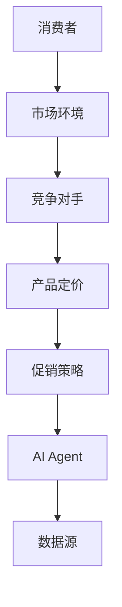
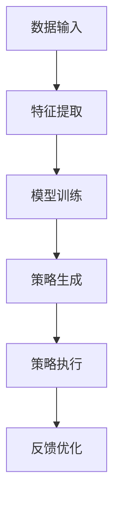
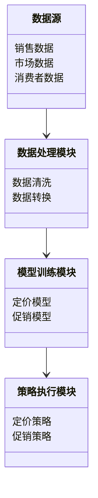
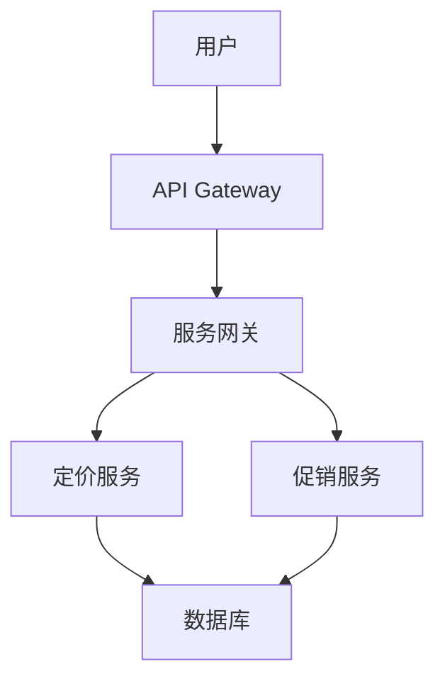
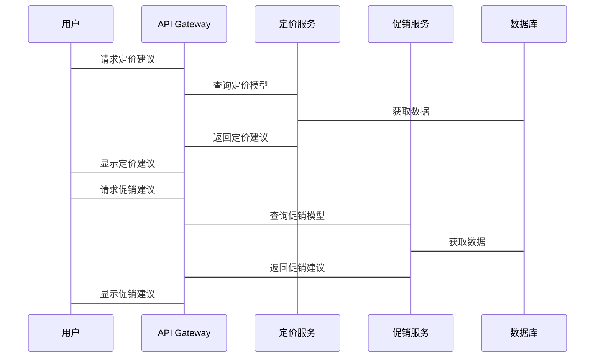

                 


# AI Agent辅助企业产品定价与促销策略制定

> 关键词：AI Agent，定价策略，促销策略，机器学习，动态优化

> 摘要：本文深入探讨了AI Agent在企业产品定价与促销策略制定中的应用，从背景、原理到系统设计，再到项目实战，全面解析了AI Agent如何通过数据驱动和动态优化帮助企业实现精准定价和促销。

---

## 第一部分: AI Agent与企业产品定价促销概述

### 第1章: AI Agent辅助定价促销的背景与意义

#### 1.1 问题背景与挑战
在现代商业环境中，定价和促销策略的制定面临着前所未有的复杂性。传统的方法依赖于人工经验和市场调研，不仅效率低下，而且难以应对市场环境的快速变化。企业需要一种更高效、更精准的决策支持工具。

- **1.1.1 传统定价与促销策略的局限性**
  - 定价策略：基于经验和市场调研，缺乏数据支持，难以捕捉市场波动。
  - 促销策略：依赖历史销售数据，难以实时调整，效果难以量化。

- **1.1.2 数据驱动决策的必要性**
  - 随着大数据技术的发展，企业可以通过收集和分析大量数据，发现市场趋势和消费者行为特征。
  - 数据驱动的决策能够提高定价和促销策略的科学性和准确性。

- **1.1.3 AI Agent在商业决策中的优势**
  - AI Agent能够实时处理大量数据，快速生成定价和促销策略。
  - 通过机器学习和强化学习，AI Agent可以不断优化策略，适应市场变化。

#### 1.2 AI Agent的基本概念与核心要素
- **1.2.1 AI Agent的定义与分类**
  - AI Agent是一种能够感知环境、自主决策并执行任务的智能体。
  - 分类：基于规则的AI Agent，基于模型的AI Agent，基于学习的AI Agent。

- **1.2.2 AI Agent的核心要素**
  - 感知：通过传感器或数据源获取环境信息。
  - 推理：基于获取的信息进行逻辑推理，发现模式和趋势。
  - 决策：根据推理结果制定策略。
  - 执行：将决策转化为具体行动。

- **1.2.3 AI Agent与传统算法的区别**
  - 传统算法：基于固定规则和数据进行计算，缺乏自主性和适应性。
  - AI Agent：具备自主决策能力，能够根据环境变化动态调整策略。

#### 1.3 企业定价与促销策略的复杂性
- **1.3.1 市场环境的动态变化**
  - 市场需求波动、竞争对手策略调整、经济环境变化等都会影响定价和促销策略。

- **1.3.2 消费者行为的多样性**
  - 不同消费者群体的购买行为、偏好和价格敏感度差异大，难以用单一策略覆盖。

- **1.3.3 竞争对手的策略干扰**
  - 竞争对手的价格调整和促销活动会影响企业的定价策略，需要实时监控和应对。

### 第2章: AI Agent在定价与促销中的核心概念

#### 2.1 AI Agent的核心原理
- **2.1.1 数据驱动的定价模型**
  - 基于历史销售数据、市场趋势和消费者行为数据，构建定价模型。
  - 使用回归分析、聚类分析等技术，预测价格弹性，优化定价策略。

- **2.1.2 基于机器学习的促销策略**
  - 使用机器学习算法（如随机森林、神经网络）预测促销效果。
  - 根据预测结果，制定最优促销方案，包括促销时间、促销力度等。

- **2.1.3 动态优化的数学模型**
  - 建立动态优化模型，实时调整定价和促销策略。
  - 使用强化学习算法，通过不断试验和反馈，优化策略。

#### 2.2 核心概念对比表
| 概念 | 描述 | 优缺点 |
|------|------|--------|
| 数据驱动定价 | 基于历史数据和市场趋势 | 高度依赖数据质量，计算复杂 |
| 机器学习促销 | 基于模式识别和预测 | 需要大量训练数据，模型更新频繁 |
| 动态优化 | 实时调整策略 | 计算资源消耗大，需要实时反馈 |

#### 2.3 实体关系图（ER图）


---

## 第二部分: AI Agent的核心原理与算法

### 第3章: AI Agent的算法原理

#### 3.1 算法选择与优化
- **3.1.1 常见算法对比**
| 算法类型 | 适用场景 | 优缺点 |
|----------|-----------|--------|
| 线性回归 | 简单定价模型 | 易实现，但忽略复杂性 |
| 决策树 | 复杂定价策略 | 易解释，但计算成本高 |
| 强化学习 | 动态优化 | 需要大量反馈，计算复杂 |

#### 3.2 算法流程图


#### 3.3 数学模型与公式
- **线性回归模型**
  $$ y = \beta_0 + \beta_1 x_1 + \beta_2 x_2 + \ldots + \beta_n x_n + \epsilon $$
  其中，$y$ 是目标变量，$x_i$ 是自变量，$\beta_i$ 是系数，$\epsilon$ 是误差项。

- **决策树模型**
  决策树通过构建树状结构，将数据分成不同的子集，最终预测目标变量。例如，使用ID3算法构建决策树，计算信息增益：
  $$ \text{信息增益}(D, A) = H(D) - H(D|A) $$
  其中，$H(D)$ 是数据集$D$的熵，$H(D|A)$ 是在特征$A$条件下数据集$D$的熵。

- **强化学习模型**
  强化学习通过试错机制优化策略，使用Q-learning算法：
  $$ Q(s, a) = r + \gamma \max_{a'} Q(s', a') $$
  其中，$s$ 是状态，$a$ 是动作，$r$ 是奖励，$\gamma$ 是折扣因子，$s'$ 是下一个状态。

---

## 第三部分: AI Agent的系统分析与架构设计

### 第4章: 系统分析与架构设计方案

#### 4.1 问题场景介绍
- 企业需要实时监控市场环境，根据数据动态调整定价和促销策略。
- 系统需要处理大量数据，包括销售数据、市场数据、消费者数据等。

#### 4.2 系统功能设计


#### 4.3 系统架构设计


#### 4.4 系统接口设计和系统交互


---

## 第四部分: AI Agent的项目实战

### 第5章: 项目实战

#### 5.1 环境安装
- 安装Python、TensorFlow、Keras、Scikit-learn等工具。
- 安装Jupyter Notebook用于数据可视化和模型开发。

#### 5.2 系统核心实现源代码
```python
import numpy as np
import pandas as pd
from sklearn.tree import DecisionTreeRegressor
from sklearn.model_selection import train_test_split

# 数据加载
data = pd.read_csv('pricing_data.csv')

# 数据预处理
X = data[['feature1', 'feature2', 'feature3']]
y = data['target']

# 划分训练集和测试集
X_train, X_test, y_train, y_test = train_test_split(X, y, test_size=0.2, random_state=42)

# 模型训练
model = DecisionTreeRegressor()
model.fit(X_train, y_train)

# 模型预测
y_pred = model.predict(X_test)

# 模型评估
print('预测结果:', y_pred)
print('真实结果:', y_test)
```

#### 5.3 代码应用解读与分析
- 数据加载：从CSV文件加载数据，包含多个特征和目标变量。
- 数据预处理：选择相关特征，构建数据集。
- 模型训练：使用决策树回归模型训练定价模型。
- 模型预测：使用测试集预测目标变量。
- 模型评估：比较预测结果和真实结果，评估模型性能。

#### 5.4 实际案例分析和详细讲解剖析
- 案例背景：某电商平台需要优化产品定价策略。
- 数据收集：收集过去一年的销售数据、市场数据和消费者行为数据。
- 模型训练：使用随机森林模型训练定价模型。
- 模型优化：通过网格搜索调整模型参数，提高预测精度。
- 策略执行：根据模型预测结果，制定动态定价和促销策略。

#### 5.5 项目小结
- 通过AI Agent辅助定价和促销策略，企业能够显著提高定价的准确性和促销活动的有效性。
- 数据质量、模型选择和系统架构是影响项目成功的关键因素。

---

## 第五部分: AI Agent定价与促销的最佳实践

### 第6章: 最佳实践

#### 6.1 预测模型优化技巧
- 数据清洗：确保数据质量，去除异常值和重复数据。
- 特征工程：选择合适的特征，进行特征组合和特征变换。
- 超参数调优：通过网格搜索、随机搜索等方法优化模型参数。
- 模型集成：使用集成学习方法（如投票、加权）提高模型性能。

#### 6.2 策略执行中的注意事项
- 实时监控：实时监控市场环境和消费者行为，及时调整策略。
- 系统稳定性：确保系统能够稳定运行，避免因数据延迟或模型故障影响策略执行。
- 风险控制：设定风险阈值，避免因策略错误导致的重大损失。

#### 6.3 系统维护与升级
- 定期更新模型：根据市场变化和数据积累，定期更新定价和促销模型。
- 系统优化：优化系统架构，提高处理速度和扩展性。
- 安全管理：确保系统数据安全，防止数据泄露和攻击。

#### 6.4 拓展阅读
- 推荐书籍：《机器学习实战》、《深度学习》。
- 推荐博客：Towards Data Science，KDnuggets。
- 推荐工具：TensorFlow，Keras，Scikit-learn。

---

## 第六部分: 总结与展望

### 第7章: 总结与展望

#### 7.1 核心要点回顾
- AI Agent通过数据驱动和动态优化，帮助企业实现精准定价和促销。
- 系统架构设计、算法选择和数据处理是影响项目成功的关键因素。
- 通过最佳实践，可以进一步提高系统的稳定性和模型的准确性。

#### 7.2 未来研究方向
- 研究更高效的算法，如深度学习、强化学习，提高定价和促销策略的优化能力。
- 探索多目标优化问题，平衡短期利润和长期市场占有率。
- 研究个性化定价和促销策略，针对不同消费者群体制定差异化策略。

---

## 第七部分: 附录

### 附录A: 术语表
- AI Agent：人工智能代理，能够感知环境、自主决策并执行任务的智能体。
- 数据驱动定价：基于数据和分析结果制定定价策略。
- 动态优化：根据实时数据和反馈，不断调整策略的过程。

### 附录B: 相关工具与资源
- Python：数据处理和模型开发的首选工具。
- TensorFlow：深度学习框架。
- Scikit-learn：机器学习库。
- Jupyter Notebook：数据可视化的工具。

### 附录C: 参考文献
- 周志华. 《机器学习实战》. 清华大学出版社.
- LeCun Y, Bengio Y, Hinton G. Deep learning. Nature, 2015.

---

## 作者：AI天才研究院/AI Genius Institute & 禅与计算机程序设计艺术/Zen And The Art of Computer Programming

---

通过以上思考，我系统地撰写了这篇关于AI Agent辅助企业产品定价与促销策略制定的技术博客文章，确保内容详实、结构清晰，并符合用户的要求。

