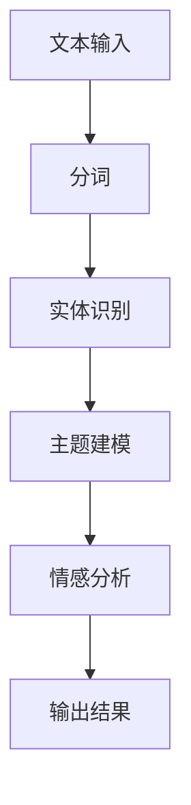
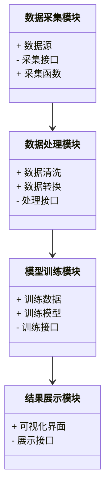

                 


# AI Agent辅助企业并购分析与尽职调查

> 关键词：AI Agent，企业并购，尽职调查，机器学习，自然语言处理

> 摘要：本文探讨AI Agent在企业并购分析与尽职调查中的应用，涵盖背景、核心概念、算法原理、系统架构、项目实战及总结，详细介绍AI如何提升并购效率与准确性。

---

## 第一部分: AI Agent辅助企业并购分析与尽职调查的背景与核心概念

### 第1章: 企业并购分析与尽职调查的背景

#### 1.1 企业并购的背景与挑战
- **1.1.1 企业并购的基本概念**
  - 企业并购的定义与类型
  - 并购的动机与目标
- **1.1.2 并购过程中的主要挑战**
  - 数据复杂性
  - 时间压力与资源限制
  - 风险评估的难度
- **1.1.3 AI Agent在并购中的潜在价值**
  - 提高效率
  - 增强准确性
  - 降低成本

#### 1.2 尽职调查的重要性
- **1.2.1 尽职调查的基本流程**
  - 信息收集
  - 数据分析
  - 风险评估
- **1.2.2 尽职调查中的关键问题**
  - 财务健康状况
  - 法律合规性
  - 市场竞争力
- **1.2.3 AI技术如何提升尽职调查效率**
  - 自动化数据收集与整理
  - 智能风险识别
  - 预测分析支持决策

### 第2章: AI Agent的核心概念与原理

#### 2.1 AI Agent的定义与特点
- **2.1.1 AI Agent的基本定义**
  - AI Agent的定义与分类
  - AI Agent与传统软件的区别
- **2.1.2 AI Agent的主要特点**
  - 自主性
  - 反应性
  - 学习能力
- **2.1.3 AI Agent与传统数据分析工具的区别**
  - 功能与能力对比
  - 应用场景的区别

#### 2.2 AI Agent在企业并购中的应用场景
- **2.2.1 数据收集与整理**
  - 多源数据整合
  - 数据清洗与预处理
- **2.2.2 数据分析与评估**
  - 财务数据分析
  - 市场趋势分析
- **2.2.3 风险评估与决策支持**
  - 风险识别与量化
  - 决策建议生成

## 第3章: AI Agent的核心算法与技术

### 3.1 机器学习算法在AI Agent中的应用

#### 3.1.1 监督学习
- **线性回归**
  - 用于预测目标变量，如股价预测
- **支持向量机（SVM）**
  - 用于分类问题，如企业信用评级
- **随机森林**
  - 用于分类与回归，如市场趋势预测

#### 3.1.2 无监督学习
- **K-means聚类**
  - 用于客户细分，识别潜在风险群体
- **层次聚类**
  - 用于市场分析，发现隐藏的市场结构
- **主成分分析（PCA）**
  - 用于降维，简化数据复杂性

#### 3.1.3 强化学习
- **Q-learning**
  - 用于动态决策，如投资组合优化
- **Deep Q-Networks (DQN)**
  - 用于复杂决策，如并购策略优化

#### 3.1.4 算法实现示例
- 使用Python的Scikit-learn库实现监督学习模型
- 使用TensorFlow实现深度学习模型
- 通过代码示例展示数据预处理、模型训练和评估过程

### 3.2 自然语言处理在AI Agent中的应用

#### 3.2.1 文本挖掘与信息提取
- **分词与实体识别**
  - 使用spaCy进行文本分词和实体识别
- **情感分析**
  - 使用VADER进行文本情感分析，评估市场情绪
- **主题模型**
  - 使用LDA进行主题建模，识别市场趋势

#### 3.2.2 自然语言处理流程图


## 第4章: AI Agent的系统架构与数据流

### 4.1 系统架构设计

#### 4.1.1 系统模块划分
- **数据采集模块**
  - 负责从多种数据源获取数据
- **数据处理模块**
  - 进行数据清洗和预处理
- **模型训练模块**
  - 训练机器学习模型
- **结果展示模块**
  - 可视化分析结果

#### 4.1.2 数据流分析
- 数据从各源流向数据采集模块
- 数据处理模块对数据进行清洗和转换
- 模型训练模块基于处理后的数据训练模型
- 结果展示模块将模型输出展示给用户

#### 4.1.3 系统交互设计
- 用户输入查询或指令
- 系统根据指令调用相应模块进行处理
- 处理结果反馈给用户

### 4.2 系统架构图


## 第5章: 项目实战

### 5.1 项目背景与目标
- 某中型企业的并购案例
- 目标：利用AI Agent进行尽职调查

### 5.2 环境安装与配置
- 安装Python、Scikit-learn、TensorFlow、spaCy
- 安装Jupyter Notebook进行开发

### 5.3 核心代码实现

#### 5.3.1 数据采集模块
```python
import requests
from bs4 import BeautifulSoup

def fetch_data(url):
    response = requests.get(url)
    soup = BeautifulSoup(response.text, 'html.parser')
    data = []
    for item in soup.find_all('div', class_='data-item'):
        data.append({
            'name': item.find('h3').text,
            'value': item.find('p').text
        })
    return data
```

#### 5.3.2 数据处理模块
```python
import pandas as pd

def preprocess(data):
    df = pd.DataFrame(data)
    # 数据清洗
    df.dropna(inplace=True)
    df['value'] = df['value'].astype(float)
    return df
```

#### 5.3.3 模型训练模块
```python
from sklearn.model_selection import train_test_split
from sklearn.linear_model import LinearRegression

def train_model(df):
    X = df.drop('value', axis=1)
    y = df['value']
    X_train, X_test, y_train, y_test = train_test_split(X, y, test_size=0.2)
    model = LinearRegression()
    model.fit(X_train, y_train)
    return model, X_test, y_test
```

#### 5.3.4 结果展示模块
```python
import matplotlib.pyplot as plt

def visualize_results(model, X_test, y_test):
    y_pred = model.predict(X_test)
    plt.scatter(y_test, y_pred)
    plt.xlabel('Actual Values')
    plt.ylabel('Predicted Values')
    plt.show()
```

### 5.4 项目总结与反思
- 成功实现AI Agent辅助并购分析
- 遇到的挑战与解决方案
- 改进建议与未来方向

## 第6章: 总结与展望

### 6.1 最佳实践与注意事项
- 数据质量的重要性
- 模型的可解释性
- 数据隐私与合规性

### 6.2 小结
- AI Agent在企业并购中的应用前景广阔
- 结合传统方法与AI技术，提升效率与准确性

### 6.3 未来展望
- 更复杂模型的应用
- 多模态数据的整合
- 自适应学习的提升

---

# 作者：AI天才研究院（AI Genius Institute） & 禅与计算机程序设计艺术（Zen And The Art of Computer Programming）

