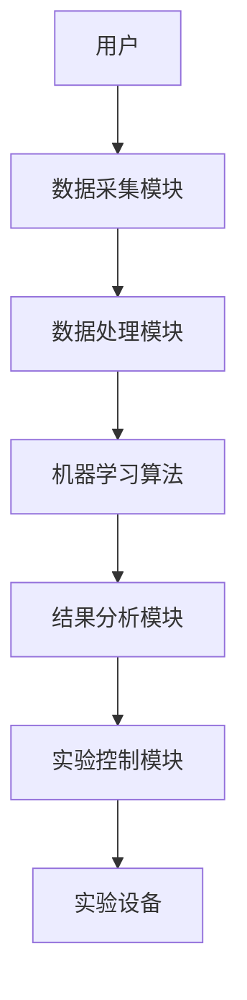

                 


# AI Agent辅助科学实验：自动化与数据分析

> 关键词：AI Agent, 科学实验, 自动化, 数据分析, 人工智能, 强化学习, 自然语言处理

> 摘要：随着人工智能技术的快速发展，AI Agent（人工智能代理）在科学实验中的应用变得越来越广泛。本文将详细介绍AI Agent在科学实验中的核心概念、算法原理、系统架构、实际应用案例以及最佳实践。通过分析AI Agent如何辅助实验设计、数据收集与分析，我们将揭示其在科学实验自动化中的巨大潜力，并为读者提供实用的指导和建议。

---

# 第1章: 引言

## 1.1 背景介绍
科学实验是推动人类认知进步的核心活动，但其实验过程复杂、数据量庞大、分析任务繁重。传统实验方法依赖人工操作和分析，效率低下且容易出错。近年来，随着人工智能技术的快速发展，AI Agent（人工智能代理）逐渐成为科学实验自动化的重要工具。

## 1.2 问题描述
科学实验中的数据收集、实验设计和结果分析环节存在以下问题：
- 数据量大，人工分析耗时且容易出错；
- 实验条件复杂，人工调节效率低下；
- 实验结果的分析需要专业知识，人工难以快速提取有效信息。

## 1.3 AI Agent的潜力
AI Agent具有以下特点，使其成为科学实验自动化的理想工具：
- 智能感知：能够理解实验环境并做出决策；
- 自动执行：能够独立完成实验操作；
- 数据分析：能够快速处理和分析大量数据。

## 1.4 目标与范围
本文旨在探讨AI Agent在科学实验中的应用，涵盖实验设计、数据收集、分析与可视化等环节。通过具体案例分析，揭示AI Agent在科学实验中的巨大潜力。

---

# 第2章: AI Agent的核心概念与技术

## 2.1 AI Agent的基本概念
AI Agent是一种智能实体，能够感知环境并采取行动以实现目标。它具备以下核心特征：
- **自主性**：能够在没有外部干预的情况下独立运行；
- **反应性**：能够实时感知环境并做出反应；
- **目标导向性**：具有明确的目标并为之努力。

## 2.2 AI Agent的核心技术
AI Agent的核心技术包括：
1. **机器学习**：用于模式识别和数据建模。
2. **自然语言处理**：用于理解和生成人类语言。
3. **强化学习**：用于复杂决策问题。

## 2.3 AI Agent的体系结构
AI Agent的体系结构主要分为以下三种：
1. **反应式架构**：基于当前感知做出实时反应。
2. **规划式架构**：通过预定义的目标生成行动计划。
3. **混合式架构**：结合反应式和规划式的特点。

---

# 第3章: AI Agent在科学实验中的应用场景

## 3.1 数据驱动的实验设计
### 3.1.1 数据收集与预处理
科学实验通常涉及大量数据的收集与预处理。AI Agent能够自动收集实验数据，并通过机器学习算法进行预处理，例如去噪和特征提取。

### 3.1.2 数据分析与可视化
AI Agent可以通过数据可视化工具（如Tableau）生成图表，帮助研究人员快速理解实验结果。

### 3.1.3 数据驱动的实验优化
通过分析历史实验数据，AI Agent可以预测最优的实验参数，从而提高实验效率。

## 3.2 实验过程的自动化控制
### 3.2.1 自动化实验设备的控制
AI Agent可以通过物联网技术控制实验设备，例如自动调节温度、湿度等参数。

### 3.2.2 实验条件的智能调节
通过强化学习算法，AI Agent可以实时调整实验条件以达到最佳实验效果。

### 3.2.3 实验过程的实时监控
AI Agent可以实时监控实验过程，并在出现异常时自动触发警报。

## 3.3 实验结果的智能分析
### 3.3.1 数据建模与预测
通过机器学习算法，AI Agent可以建立数学模型，预测实验结果。

### 3.3.2 异常检测与诊断
AI Agent可以通过异常检测算法识别实验结果中的异常值，并提供诊断建议。

### 3.3.3 结果的可视化与解释
AI Agent可以将实验结果以图表形式展示，并提供直观的解释。

---

# 第4章: AI Agent辅助科学实验的算法原理

## 4.1 强化学习算法
### 4.1.1 算法原理
强化学习是一种通过试错学习的算法，其核心在于通过与环境的交互来最大化累积奖励。以下是强化学习的基本流程：

1. **状态感知**：AI Agent感知当前环境状态。
2. **动作选择**：基于当前状态，选择一个动作。
3. **奖励反馈**：环境对AI Agent的动作给予奖励或惩罚。
4. **策略优化**：根据奖励反馈优化策略。

### 4.1.2 算法实现
以下是强化学习的简单实现代码：

```python
import numpy as np

class AI_Agent:
    def __init__(self, state_space_size, action_space_size):
        self.state_space_size = state_space_size
        self.action_space_size = action_space_size
        self.Q = np.zeros((state_space_size, action_space_size))
    
    def take_action(self, state):
        # 探索与利用策略
        if np.random.random() < 0.1:  # 探索概率
            action = np.random.randint(self.action_space_size)
        else:
            action = np.argmax(self.Q[state])
        return action
    
    def update_Q(self, state, action, reward):
        self.Q[state][action] = self.Q[state][action] * 0.9 + reward
```

### 4.1.3 应用场景
强化学习常用于需要动态调整的实验场景，例如优化实验参数。

---

## 4.2 机器学习算法
### 4.2.1 算法原理
机器学习算法通过训练数据建立模型，用于预测实验结果。常用的算法包括线性回归、支持向量机（SVM）和神经网络。

### 4.2.2 算法实现
以下是线性回归的简单实现代码：

```python
import numpy as np

def linear_regression(X, y):
    # 数据标准化
    X = (X - np.mean(X)) / np.std(X)
    # 计算系数
    theta = np.dot(np.dot(np.linalg.inv(np.dot(X.T, X)), X.T), y)
    return theta

# 示例数据
X = np.array([1, 2, 3, 4]).reshape(-1, 1)
y = np.array([2, 3, 4, 5])
theta = linear_regression(X, y)
print(theta)
```

### 4.2.3 应用场景
机器学习算法常用于实验数据分析和预测。

---

# 第5章: AI Agent辅助科学实验的系统架构

## 5.1 系统功能设计
AI Agent辅助科学实验的系统功能模块包括：
1. 数据采集模块：负责收集实验数据。
2. 数据处理模块：对数据进行预处理和分析。
3. 实验控制模块：控制实验设备并调整实验条件。
4. 结果分析模块：对实验结果进行建模和可视化。

### 5.1.1 数据采集模块
数据采集模块通过传感器收集实验数据，并将其传输到数据处理模块。

### 5.1.2 数据处理模块
数据处理模块使用机器学习算法对数据进行分析和建模。

### 5.1.3 实验控制模块
实验控制模块通过物联网技术控制实验设备，并实时调整实验条件。

### 5.1.4 结果分析模块
结果分析模块将实验结果以图表形式展示，并提供直观的解释。

## 5.2 系统架构设计
AI Agent辅助科学实验的系统架构如下：



## 5.3 系统接口设计
系统接口设计需要考虑模块之间的数据传输和通信协议。

---

# 第6章: AI Agent辅助科学实验的项目实战

## 6.1 环境配置
项目实战需要以下环境配置：
- 操作系统：Linux/Windows/MacOS
- 编程语言：Python 3.8+
- 依赖库：numpy, pandas, scikit-learn, matplotlib

## 6.2 核心代码实现
以下是AI Agent辅助科学实验的核心代码实现：

```python
import numpy as np
import pandas as pd
from sklearn.linear_model import LinearRegression
import matplotlib.pyplot as plt

# 数据加载与预处理
data = pd.read_csv('experiment_data.csv')
X = data[['temperature', 'pressure']]
y = data['result']

# 模型训练
model = LinearRegression()
model.fit(X, y)

# 模型预测
new_data = pd.DataFrame({'temperature': [50], 'pressure': [10]})
predicted_result = model.predict(new_data)

# 结果可视化
plt.scatter(X['temperature'], y)
plt.plot(X['temperature'], model.predict(X), color='red')
plt.xlabel('Temperature')
plt.ylabel('Result')
plt.show()
```

## 6.3 实际案例分析
以药物研发为例，AI Agent可以通过分析实验数据预测最佳的实验条件。

---

# 第7章: 最佳实践与注意事项

## 7.1 小结
AI Agent在科学实验中的应用前景广阔，能够显著提高实验效率和准确性。

## 7.2 注意事项
在实际应用中，需要注意以下几点：
1. 数据质量：确保数据的准确性和完整性。
2. 模型选择：根据实验需求选择合适的算法。
3. 安全性：确保实验设备的安全运行。

## 7.3 未来展望
随着AI技术的不断发展，AI Agent在科学实验中的应用将更加广泛和深入。

---

# 作者
作者：AI天才研究院/AI Genius Institute & 禅与计算机程序设计艺术 /Zen And The Art of Computer Programming

---

以上是《AI Agent辅助科学实验：自动化与数据分析》的技术博客文章的完整大纲和内容。

