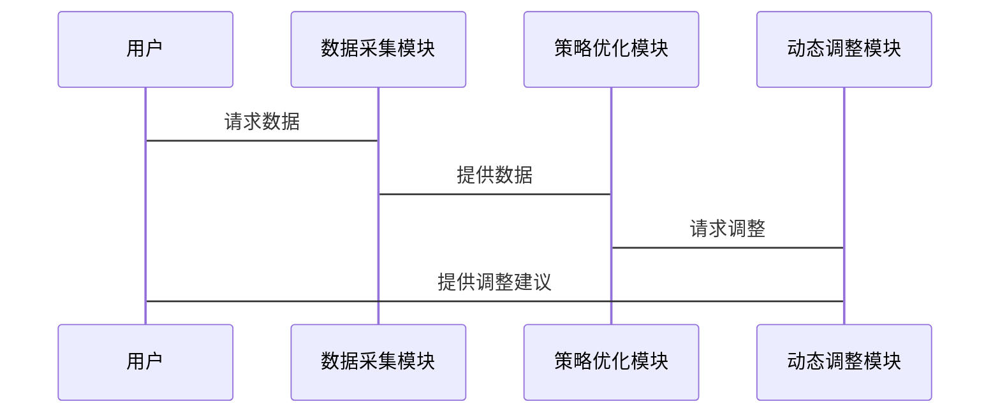

                 


# AI agents优化价值投资策略的动态调整

> 关键词：AI agents，价值投资，动态调整，Q-learning，投资策略优化，金融数据分析

> 摘要：本文详细探讨了AI agents在优化价值投资策略中的应用，重点分析了如何通过动态调整策略来应对市场变化。文章从AI agents的基本原理出发，结合Q-learning算法，提出了一种基于动态调整的优化方法，并通过系统设计和实战案例，展示了如何在实际投资中实现策略优化。

---

## 第一部分: AI agents优化价值投资策略的背景与核心概念

### 第1章: AI agents与价值投资概述

#### 1.1 AI agents的基本概念
- **1.1.1 AI agents的定义与分类**
  - AI agents是指能够感知环境并采取行动以实现目标的智能体，分为简单反射型、基于模型的、基于目标的和基于效用的四种类型。
- **1.1.2 AI agents的核心特征**
  - 感知能力：通过传感器或数据输入感知环境。
  - 决策能力：基于感知信息做出最优决策。
  - 学习能力：通过经验改进自身策略。
  - 行为能力：通过执行动作影响环境。
- **1.1.3 AI agents在金融领域的应用潜力**
  - 自动化交易、风险管理、投资组合优化、市场预测等。

#### 1.2 价值投资策略的基本原理
- **1.2.1 价值投资的定义与核心理念**
  - 价值投资是通过分析企业基本面，寻找被市场低估的投资标的。
- **1.2.2 价值投资的关键要素分析**
  - 企业盈利能力、财务健康状况、行业地位、管理团队等。
- **1.2.3 价值投资策略的动态调整需求**
  - 市场变化、企业基本面变化、投资者风险偏好变化。

#### 1.3 AI agents优化价值投资策略的必要性
- **1.3.1 传统价值投资策略的局限性**
  - 依赖人工判断，主观性强。
  - 无法实时捕捉市场变化。
  - 策略调整滞后。
- **1.3.2 AI agents在优化投资策略中的优势**
  - 数据处理能力强。
  - 能够实时调整策略。
  - 可以处理多维度信息。
- **1.3.3 动态调整策略的现实意义**
  - 提高投资效率。
  - 减少人为错误。
  - 适应市场波动。

#### 1.4 本章小结
- 介绍了AI agents的基本概念和价值投资的核心理念，分析了AI agents在优化价值投资策略中的优势和必要性。

---

## 第二部分: AI agents优化价值投资策略的核心概念与联系

### 第2章: AI agents的核心原理

#### 2.1 AI agents的基本工作原理
- **2.1.1 状态空间的定义与构建**
  - 状态空间是AI agents感知环境的所有可能状态的集合。
  - 在价值投资中，状态可以包括市场指数、企业基本面数据等。
- **2.1.2 动作空间的定义与选择**
  - 动作空间是AI agents可以执行的所有动作的集合。
  - 在价值投资中，动作可以包括买入、卖出、持有等。
- **2.1.3 奖励函数的设计与优化**
  - 奖励函数是用来衡量AI agents行为好坏的函数。
  - 在价值投资中，奖励可以是投资收益或亏损。

#### 2.2 价值函数与策略函数的数学模型
- **2.2.1 价值函数的定义与公式**
  - 价值函数表示在状态s下采取动作a后的预期收益。
  $$ V(s) = \max_a Q(s,a) $$
- **2.2.2 策略函数的定义与公式**
  - 策略函数表示在状态s下选择动作a的概率。
  $$ \pi(a|s) = \arg\max_a Q(s,a) $$

#### 2.3 AI agents的核心算法概述
- **2.3.1 Q-learning算法**
  - Q-learning是一种基于值函数的强化学习算法。
  - 通过不断更新Q表来优化策略。
- **2.3.2 Deep Q-Networks (DQN)算法**
  - 使用深度神经网络近似Q值函数。
  - 更适合处理高维状态空间。
- **2.3.3 Policy Gradient算法**
  - 直接优化策略函数。
  - 更适合处理连续动作空间。

#### 2.4 本章小结
- 介绍了AI agents的核心原理，包括状态空间、动作空间、奖励函数以及价值函数和策略函数的数学模型。

---

## 第三部分: AI agents优化价值投资策略的算法原理

### 第3章: 基于Q-learning的动态调整算法

#### 3.1 Q-learning算法的数学模型与公式
- **3.1.1 Q-learning的基本公式**
  $$ Q(s,a) = Q(s,a) + \alpha [r + \gamma \max Q(s',a') - Q(s,a)] $$
  - 其中，α是学习率，γ是折扣因子。
- **3.1.2 算法的收敛性分析**
  - Q-learning算法在离线情况下可以收敛到最优策略。
  - 在在线情况下需要考虑探索与利用的平衡。

#### 3.2 Q-learning算法在投资策略中的应用
- **3.2.1 算法实现步骤**
  1. 初始化Q表。
  2. 进行环境交互，获取状态s、动作a和奖励r。
  3. 更新Q值。
  4. 重复步骤2-3直到收敛。
- **3.2.2 算法的优化与改进**
  - 使用深度神经网络近似Q值函数。
  - 引入经验回放机制。
- **3.2.3 算法的收敛性与稳定性分析**
  - 算法在稳定环境下表现良好。
  - 需要处理市场中的不确定性。

#### 3.3 本章小结
- 详细讲解了Q-learning算法在价值投资中的应用，包括算法实现、优化和分析。

---

## 第四部分: AI agents优化价值投资策略的系统分析与架构设计

### 第4章: 优化价值投资策略的系统架构

#### 4.1 系统功能设计
- **4.1.1 数据采集模块**
  - 采集市场数据、企业基本面数据等。
- **4.1.2 策略优化模块**
  - 使用AI agents优化投资策略。
- **4.1.3 动态调整模块**
  - 根据市场变化动态调整策略。

#### 4.2 系统架构设计
- **4.2.1 系统架构图**
  ```mermaid
  graph TD
    A[用户] --> B[数据采集模块]
    B --> C[数据存储模块]
    C --> D[策略优化模块]
    D --> E[动态调整模块]
    E --> F[投资决策模块]
    F --> G[投资执行模块]
  ```

#### 4.3 系统接口设计
- **4.3.1 API接口**
  - 提供RESTful API供其他系统调用。
- **4.3.2 数据接口**
  - 数据接口用于与数据源对接。

#### 4.4 系统交互流程图


#### 4.5 本章小结
- 介绍了系统架构设计，包括功能设计、架构图和交互流程图。

---

## 第五部分: AI agents优化价值投资策略的项目实战

### 第5章: 项目实战与案例分析

#### 5.1 环境安装与配置
- **5.1.1 安装Python环境**
  - 使用Anaconda安装Python 3.8及以上版本。
- **5.1.2 安装依赖库**
  - 安装TensorFlow、Keras、OpenAI Gym等库。

#### 5.2 系统核心实现
- **5.2.1 数据采集模块**
  ```python
  import pandas as pd
  def get_data(start_date, end_date):
      df = pd.DataFrame()
      # 采集市场数据
      df['market_data'] = pd.date_range(start=start_date, end=end_date).values
      # 采集企业基本面数据
      df['fundamental_data'] = [i for i in range(len(df))]
      return df
  ```

- **5.2.2 策略优化模块**
  ```python
  import numpy as np
  def q_learning(env, num_episodes=1000):
      Q = np.zeros(env.observation_space.n, env.action_space.n)
      for episode in range(num_episodes):
          state = env.reset()
          while True:
              action = np.argmax(Q[state])
              next_state, reward, done = env.step(action)
              Q[state, action] += reward
              state = next_state
              if done:
                  break
      return Q
  ```

- **5.2.3 动态调整模块**
  ```python
  def adjust_strategy(Q, current_state):
      action = np.argmax(Q[current_state])
      return action
  ```

#### 5.3 案例分析
- **5.3.1 案例背景**
  - 假设市场出现突发情况，如行业政策变化。
- **5.3.2 案例实现**
  - 使用上述代码实现动态调整策略。
- **5.3.3 案例分析**
  - 通过分析案例，验证算法的有效性。

#### 5.4 本章小结
- 通过实战案例，展示了AI agents在优化价值投资策略中的应用。

---

## 第六部分: 总结与展望

### 第6章: 总结与展望

#### 6.1 最佳实践 tips
- **6.1.1 数据质量的重要性**
  - 数据是AI agents决策的基础，数据质量直接影响策略效果。
- **6.1.2 算法选择的注意事项**
  - 根据具体问题选择合适的算法。
- **6.1.3 系统设计的要点**
  - 系统设计需要考虑可扩展性、可维护性。

#### 6.2 本章小结
- 总结了全文内容，并展望了未来的研究方向。

---

## 作者：AI天才研究院/AI Genius Institute & 禅与计算机程序设计艺术 /Zen And The Art of Computer Programming

---

这篇文章详细探讨了AI agents在优化价值投资策略中的应用，通过理论分析和实战案例，展示了如何利用强化学习算法动态调整投资策略，以应对市场变化。希望本文能为读者提供有价值的参考和启发。

