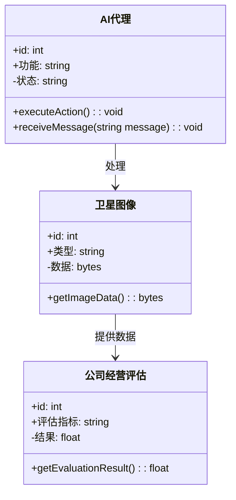
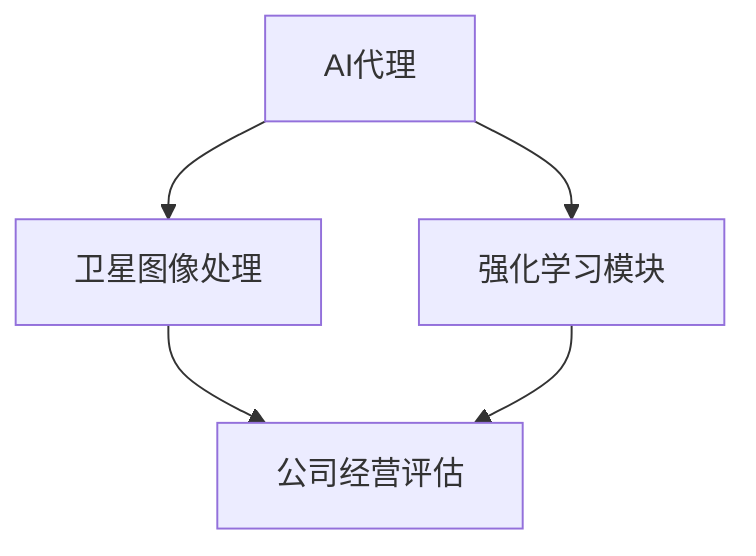
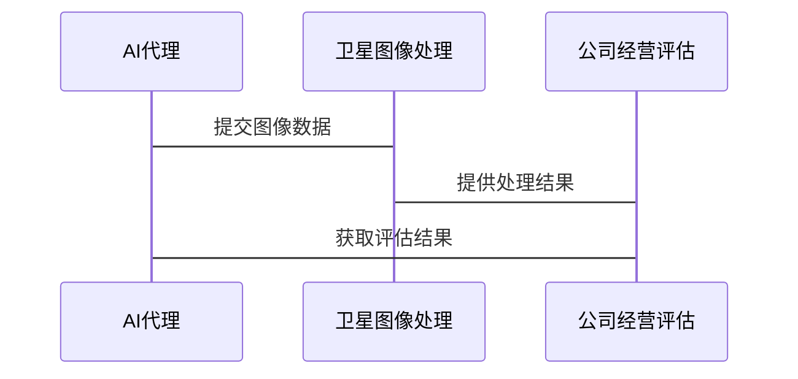

                 


# AI agents协作分析卫星图像：评估公司实际经营状况

> 关键词：AI agents, 卫星图像分析, 公司经营评估, 多代理协作, 强化学习, 图像处理, 经营数据分析

> 摘要：本文探讨了利用AI代理协作分析卫星图像以评估公司实际经营状况的方法。通过分析卫星图像中的关键指标，结合AI代理的多维度协作与强化学习算法，提出了有效的解决方案，并详细阐述了实现过程中的算法原理、系统架构及项目实战。

---

# 第一部分: AI agents协作分析卫星图像的背景与核心概念

## 第1章: 背景介绍

### 1.1 问题背景

#### 1.1.1 卫星图像分析的现状与挑战
卫星图像分析在多个领域具有重要作用，如环境监测、城市规划和军事侦察。然而，传统的图像分析方法依赖人工操作，效率低下且成本高昂。随着AI技术的发展，利用AI代理进行自动化分析成为可能。

#### 1.1.2 公司经营状况评估的传统方法与局限性
公司经营状况通常通过财务报表、销售数据等进行评估，但这些数据可能滞后且受主观因素影响。通过卫星图像分析可以获取更实时的经营数据，如工厂运营状态、物流情况等。

#### 1.1.3 AI技术在企业经营分析中的潜力
AI代理可以处理大量图像数据，发现隐藏的经营规律，为公司提供实时、客观的经营评估。

### 1.2 问题描述

#### 1.2.1 卫星图像分析的目标与任务
目标：通过分析卫星图像，识别公司经营相关的视觉特征，如工厂运行状态、物流运输情况等。
任务：开发AI代理，实现卫星图像的自动分析与多维度数据关联。

#### 1.2.2 公司经营状况评估的关键指标与数据来源
关键指标：生产效率、物流能力、员工数量等。
数据来源：卫星图像中的视觉特征，如厂区内车辆数量、建筑使用情况等。

#### 1.2.3 AI agents协作分析的必要性与可行性
必要性：AI代理可以处理大量图像数据，提供实时反馈。
可行性：AI技术在图像处理和多代理协作方面的成熟度较高。

### 1.3 问题解决思路

#### 1.3.1 AI agents在卫星图像分析中的角色与功能
- 数据采集与预处理：AI代理负责收集和清洗卫星图像数据。
- 特征提取：通过卷积神经网络提取图像中的关键特征。
- 经营评估：结合图像特征与公司经营数据，评估公司状况。

#### 1.3.2 多代理协作的优势与实现方式
优势：通过多代理协作，可以实现任务分解、并行处理和结果优化。
实现方式：基于强化学习的多代理协作机制，通过通信模块实现信息共享与协调。

#### 1.3.3 卫星图像与公司经营数据的关联分析方法
- 数据预处理：标准化图像数据和公司经营数据。
- 关联分析：使用统计分析和机器学习算法，发现数据间的关联关系。

### 1.4 边界与外延

#### 1.4.1 问题解决的边界条件与限制
- 数据来源：仅限于卫星图像数据。
- 数据范围：仅评估公司经营状况，不考虑其他因素。

#### 1.4.2 相关领域的外延与扩展
- 数据源扩展：结合其他数据源，如社交媒体、新闻数据。
- 应用场景扩展：应用于更多领域，如城市规划、资源监测。

#### 1.4.3 技术实现的可行性分析与风险评估
可行性分析：AI技术成熟，数据处理能力较强。
风险评估：数据隐私、计算资源消耗等。

### 1.5 核心概念与联系

#### 1.5.1 核心概念原理
AI代理：具备数据处理、特征提取和决策能力。
卫星图像：提供公司经营相关的视觉信息。
公司经营评估：通过图像分析得出公司经营状况。

#### 1.5.2 概念属性特征对比表格

| 概念       | 属性             | 特征                         |
|------------|------------------|------------------------------|
| AI代理     | 功能             | 数据处理、特征提取、决策     |
| 卫星图像   | 类型             | 高分辨率图像、多光谱图像     |
| 经营评估   | 方法             | 图像分析、数据关联、统计分析 |

#### 1.5.3 ER实体关系图架构
```mermaid
erd
    entity(AI代理) {
        id: int
       功能: string
        }
    entity(卫星图像) {
        id: int
        类型: string
        }
    entity(公司经营评估) {
        id: int
        评估指标: string
        }
    AI代理 -[+]-> 卫星图像
    卫星图像 -[+]-> 公司经营评估
```

---

## 第2章: AI agents协作算法

### 2.1 算法原理

#### 2.1.1 多代理协作的基本原理
通过强化学习实现多代理协作，各代理之间通过共享信息和策略，共同完成任务。

#### 2.1.2 基于强化学习的AI agents协作机制
- 状态表示：图像区域、任务目标。
- 动作选择：代理根据当前状态选择动作。
- 奖励机制：根据任务完成情况给予奖励。

#### 2.1.3 分布式计算与多线程处理
- 分布式计算：任务分解，多代理协作。
- 多线程处理：提高计算效率。

### 2.2 卫星图像分析算法

#### 2.2.1 目标检测算法
- 使用YOLO算法，检测图像中的目标。
- 使用Faster R-CNN进行目标检测。

#### 2.2.2 图像分割算法
- 使用U-Net进行图像分割。
- 采用Mask R-CNN进行语义分割。

#### 2.2.3 数据预处理
- 图像归一化：将图像像素值归一化到0-1范围。
- 数据增强：旋转、翻转、缩放图像。

#### 2.2.4 模型训练
- 训练数据：标注的卫星图像数据。
- 模型优化：调整学习率、批量大小等超参数。

### 2.3 算法实现

#### 2.3.1 使用Python的图像处理代码示例
```python
import cv2
import numpy as np

# 加载图像
image = cv2.imread('satellite.jpg')

# 图像归一化
normalized_image = image / 255.0

# 数据增强
transformed_image = cv2.flip(normalized_image, 1)
```

#### 2.3.2 使用Keras的目标检测模型
```python
from tensorflow.keras import layers, models

model = models.Sequential()
model.add(layers.Conv2D(32, (3, 3), activation='relu', input_shape=(256, 256, 3)))
model.add(layers.MaxPooling2D((2, 2)))
model.add(layers.Conv2D(64, (3, 3), activation='relu'))
model.add(layers.MaxPooling2D((2, 2)))
model.add(layers.Flatten())
model.add(layers.Dense(64, activation='relu'))
model.add(layers.Dense(1, activation='sigmoid'))
```

#### 2.3.3 强化学习的奖励机制
```python
# 定义奖励函数
def reward_function(state, action, next_state, done):
    if done and next_state['success']:
        return 1.0
    else:
        return 0.0
```

### 2.4 算法优化

#### 2.4.1 使用并行计算加速处理
- 使用多GPU并行训练。
- 优化模型结构，减少计算量。

#### 2.4.2 超参数调整
- 调整学习率、批量大小、训练轮数等。

#### 2.4.3 模型评估
- 使用验证集评估模型性能。
- 计算准确率、召回率、F1分数等指标。

---

## 第3章: 数学模型与公式

### 3.1 图像处理的数学模型

#### 3.1.1 图像增强的数学表达
- 灰度化处理：将RGB图像转换为灰度图像。
  $$ gray = 0.2989R + 0.5870G + 0.1140B $$

#### 3.1.2 图像降噪
- 使用高斯滤波器去除噪声。
  $$ f(x,y) = \sum_{i,j} w_{i,j} * g(x-i, y-j) $$

### 3.2 AI代理的强化学习模型

#### 3.2.1 状态空间
- 状态表示为图像特征向量。
  $$ s = (x_1, x_2, ..., x_n) $$

#### 3.2.2 动作空间
- 动作包括移动、旋转等操作。
  $$ a \in \{0, 1, 2, 3\} $$

#### 3.2.3 奖励函数
- 基于任务完成情况计算奖励。
  $$ R(s, a, s') = r \text{ 如果完成任务，否则 } 0 $$

---

## 第4章: 系统分析与架构设计

### 4.1 项目场景介绍

#### 4.1.1 项目背景
- 项目目标：开发AI代理协作分析卫星图像的系统。
- 项目范围：覆盖卫星图像采集、处理、分析全过程。

### 4.2 系统功能设计

#### 4.2.1 领域模型


#### 4.2.2 系统架构


### 4.3 系统接口设计

#### 4.3.1 API接口
- 接口名称：processImage
- 方法：POST
- 请求参数：图像数据
- 响应：处理结果

#### 4.3.2 数据格式
- 图像数据：JPEG格式
- 评估结果：JSON格式

### 4.4 系统交互设计

#### 4.4.1 序列图


---

## 第5章: 项目实战

### 5.1 环境安装

#### 5.1.1 安装Python环境
- 安装Python 3.8以上版本。
- 安装必要的库：numpy、pandas、cv2、tensorflow、keras。

#### 5.1.2 安装图像处理工具
- 安装OpenCV：`pip install opencv-python`
- 安装图像分割工具：`pip install segmentation_models`

### 5.2 系统核心实现

#### 5.2.1 AI代理实现
```python
class AIAgent:
    def __init__(self):
        self.state = 'idle'
    
    def executeAction(self, action):
        # 处理动作
        pass
    
    def receiveMessage(self, message):
        # 接收消息
        pass
```

#### 5.2.2 卫星图像处理实现
```python
class SatelliteImage:
    def __init__(self, image_path):
        self.image = cv2.imread(image_path)
    
    def preprocess(self):
        # 图像预处理
        return self.image / 255.0
    
    def detect_objects(self):
        # 目标检测
        return yolo.detect(self.image)
```

### 5.3 代码应用解读与分析

#### 5.3.1 代码结构
- AI代理类：处理与图像的交互。
- 卫星图像处理类：负责图像的预处理和目标检测。
- 强化学习模块：实现代理的协作机制。

#### 5.3.2 代码实现细节
- 使用多线程处理多个代理的协作。
- 实现消息传递机制，确保代理之间的通信。

### 5.4 案例分析与详细讲解

#### 5.4.1 案例背景
某公司厂区的卫星图像分析，评估其生产效率。

#### 5.4.2 数据分析
- 图像中车辆数量：反映物流情况。
- 建筑使用情况：反映生产状态。

#### 5.4.3 结果解读
- 车辆数量增加：物流能力提升。
- 建筑使用率提高：生产效率增加。

### 5.5 项目小结

#### 5.5.1 实现过程中的问题
- 数据预处理耗时较长。
- 多代理协作效率有待优化。

#### 5.5.2 解决方案
- 使用并行计算加速数据处理。
- 优化强化学习算法，提高协作效率。

---

## 第6章: 最佳实践、小结、注意事项与拓展阅读

### 6.1 最佳实践

#### 6.1.1 环境配置建议
- 使用虚拟环境管理依赖。
- 定期更新库版本。

#### 6.1.2 代码优化技巧
- 使用缓存技术减少重复计算。
- 优化算法复杂度。

### 6.2 小结

通过本文的详细讲解，读者可以了解AI代理协作分析卫星图像评估公司经营状况的实现过程。从背景分析、算法设计到系统实现，全面覆盖了相关知识。

### 6.3 注意事项

- 数据隐私：确保处理的数据符合隐私保护法规。
- 计算资源：保证足够的计算能力支持多代理协作。
- 模型优化：定期更新模型，提升准确率。

### 6.4 拓展阅读

- 推荐阅读《深度学习实战》、《强化学习导论》等书籍。
- 参考GitHub上的相关项目，学习实际实现。

---

# 作者：AI天才研究院 & 禅与计算机程序设计艺术

--- 

这篇文章通过详细阐述AI代理协作分析卫星图像评估公司经营状况的实现过程，为读者提供了从理论到实践的全面指导。通过背景分析、算法设计、系统实现和项目实战，帮助读者掌握相关技术，并能够应用于实际场景中。

