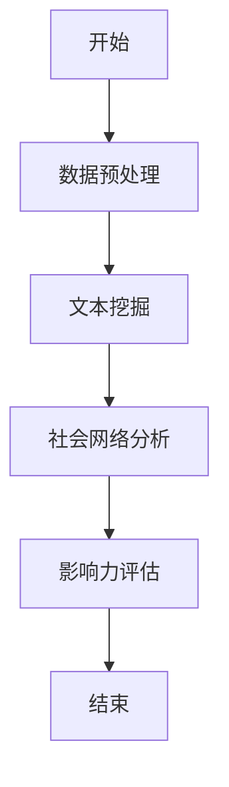
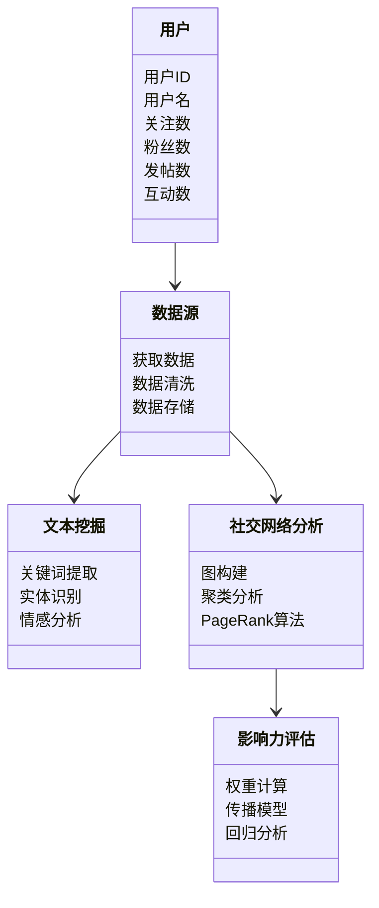
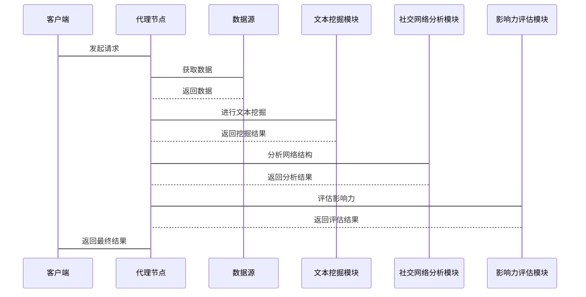

                 


# AI agents协作分析社交网络：评估公司的社会影响力

> 关键词：AI代理、社交网络分析、社会影响力评估、文本挖掘、社会网络分析、影响力评估

> 摘要：本文详细探讨了利用AI代理协作分析社交网络来评估公司社会影响力的方法。文章首先介绍了AI代理和社交网络分析的基本概念，然后深入分析了社会影响力评估的核心要素，接着从算法原理、系统架构、项目实战等多个维度详细阐述了AI代理协作分析的具体实现过程。通过实际案例分析，本文展示了如何利用AI代理协作技术来评估公司的社会影响力，并提出了相关建议和注意事项。

---

## 第1章 AI代理与社交网络分析概述

### 1.1 AI代理的基本概念

#### 1.1.1 什么是AI代理
AI代理（Artificial Intelligence Agent）是指能够感知环境并采取行动以实现目标的智能体。AI代理可以通过传感器获取信息，通过决策系统做出选择，并通过执行器与环境互动。AI代理的核心在于其自主性、反应性和智能性。

#### 1.1.2 AI代理的核心功能
AI代理的核心功能包括信息处理、决策制定、行动执行和学习优化。信息处理是指代理通过传感器获取数据并进行解析；决策制定是基于处理后的信息做出最佳选择；行动执行是通过执行器将决策转化为具体行动；学习优化则是通过经验积累不断改进性能。

#### 1.1.3 AI代理与传统算法的区别
AI代理与传统算法的区别主要体现在自主性和适应性上。AI代理能够主动感知环境并做出决策，而传统算法通常需要明确的规则和输入，无法自主调整行为。AI代理还具有学习能力，能够通过经验优化性能，而传统算法则不具备这一特点。

### 1.2 社交网络分析的背景

#### 1.2.1 社交网络的基本概念
社交网络是指由用户之间的关系构成的网络，用户之间通过关注、点赞、评论等方式建立联系。社交网络可以是结构化的（如图结构）或非结构化的（如文本描述）。

#### 1.2.2 社交网络分析的必要性
社交网络分析的必要性在于其能够揭示用户之间的关系、影响力和行为模式。通过分析社交网络，我们可以了解用户的行为动机、信息传播路径以及群体特征。

#### 1.2.3 社交网络分析的应用场景
社交网络分析的应用场景包括品牌监测、舆情分析、社交影响力评估、社群管理等。通过分析社交网络，企业可以更好地了解用户需求，优化产品和服务。

### 1.3 公司社会影响力评估的重要性

#### 1.3.1 企业社会影响力的定义
企业社会影响力是指企业在社会中的认知度、影响力和 reputation。它反映了企业在社会中的地位和对社会的贡献。

#### 1.3.2 社会影响力评估的挑战
社会影响力评估的挑战包括数据多样性、信息噪声、评估指标的主观性等。不同企业在不同领域的影响方式和程度不同，因此需要制定个性化的评估方法。

#### 1.3.3 评估社会影响力的意义
评估社会影响力的意义在于帮助企业更好地理解自身在社会中的角色和价值，优化品牌形象，提升公众认知度，同时为企业的战略决策提供数据支持。

### 1.4 本章小结
本章介绍了AI代理的基本概念、社交网络分析的背景以及公司社会影响力评估的重要性。AI代理作为一种智能化工具，能够帮助我们更高效地分析社交网络，评估公司的社会影响力。

---

## 第2章 AI代理协作分析的核心概念

### 2.1 AI代理协作的基本原理

#### 2.1.1 AI代理协作的定义
AI代理协作是指多个AI代理通过协同工作，共同完成复杂任务的过程。协作的核心在于信息共享、任务分配和结果整合。

#### 2.1.2 协作过程中的信息传递机制
在AI代理协作中，信息传递机制是关键。代理之间需要通过特定的协议和接口进行信息交换，确保协作过程的高效性和准确性。

#### 2.1.3 多代理协作的优势
多代理协作的优势在于能够充分发挥各代理的优势，提高整体系统的智能性和适应性。通过协作，系统可以处理更复杂的问题，提供更全面的解决方案。

### 2.2 社交网络分析的核心要素

#### 2.2.1 用户行为分析
用户行为分析包括用户的登录时间、活跃度、互动频率等。通过分析用户行为，可以了解用户的兴趣和需求。

#### 2.2.2 社交网络结构分析
社交网络结构分析包括节点分析、边分析和社区分析。节点分析用于识别关键用户，边分析用于了解用户之间的关系强度，社区分析用于发现用户群体。

#### 2.2.3 社会影响力评估指标
社会影响力评估指标包括影响力指数、传播广度、互动频率等。影响力指数反映了用户在社交网络中的影响力，传播广度反映了信息的扩散范围，互动频率反映了用户的活跃程度。

### 2.3 AI代理协作与社交网络分析的关系

#### 2.3.1 协作分析的必要性
协作分析的必要性在于社交网络的复杂性和多样性。通过AI代理协作，可以更全面地分析用户行为和网络结构，提高评估的准确性和效率。

#### 2.3.2 协作分析的核心流程
协作分析的核心流程包括数据收集、信息处理、结果整合和反馈优化。数据收集是通过API获取社交网络数据，信息处理是通过AI代理对数据进行分析，结果整合是将分析结果进行汇总，反馈优化是根据结果优化协作流程。

#### 2.3.3 协作分析的实现方式
协作分析的实现方式包括分布式计算、协同推理和实时反馈。分布式计算通过多代理协同完成任务，协同推理通过共享知识和经验提高分析效率，实时反馈通过动态调整策略优化协作过程。

### 2.4 本章小结
本章详细介绍了AI代理协作的基本原理、社交网络分析的核心要素以及AI代理协作与社交网络分析的关系。通过协作分析，可以更高效地评估公司的社会影响力。

---

## 第3章 AI代理协作分析的算法原理

### 3.1 文本挖掘算法

#### 3.1.1 基于文本挖掘的关键信息提取
关键信息提取是通过自然语言处理技术从文本中提取有用的信息。常用的关键信息提取方法包括关键词提取、实体识别和情感分析。

#### 3.1.2 基于情感分析的文本处理
情感分析是通过分析文本的情感倾向来判断用户的主观态度。情感分析可以分为正面、负面和中性三种类型，常用于品牌监测和舆情分析。

#### 3.1.3 基于主题模型的文本分析
主题模型是一种无监督学习方法，用于发现文本中的主题分布。常用的主题模型包括LDA（Latent Dirichlet Allocation）和LSA（Latent Semantic Analysis）。

### 3.2 社会网络分析算法

#### 3.2.1 基于图论的社交网络分析
基于图论的社交网络分析是通过构建图结构来分析用户之间的关系。常用的图论算法包括深度优先搜索（DFS）、广度优先搜索（BFS）和PageRank算法。

#### 3.2.2 基于聚类分析的社交网络分组
聚类分析是一种无监督学习方法，用于将用户分成不同的群体。常用的聚类算法包括K-means、层次聚类和DBSCAN。

#### 3.2.3 基于PageRank的影响力排序
PageRank算法是一种基于图论的排序算法，常用于评估用户在社交网络中的影响力。PageRank算法通过计算用户之间的链接权重来确定影响力排名。

### 3.3 社会影响力评估算法

#### 3.3.1 基于权重的影响力计算
基于权重的影响力计算是通过给用户的行为赋予不同的权重来评估其影响力。常用的权重计算方法包括TF-IDF（Term Frequency-Inverse Document Frequency）和BM25。

#### 3.3.2 基于传播模型的影响力预测
传播模型是一种模拟信息传播过程的模型，常用于预测信息的传播范围和速度。常用的传播模型包括SI模型、SIR模型和SEIR模型。

#### 3.3.3 基于回归分析的影响力评估
回归分析是一种统计方法，用于通过多个变量的线性关系来预测目标变量。在影响力评估中，回归分析可以用于预测用户行为对影响力的影响。

### 3.4 算法流程图


### 3.5 本章小结
本章详细介绍了AI代理协作分析中的文本挖掘算法、社会网络分析算法和社会影响力评估算法。通过这些算法的协作，可以实现对公司社会影响力的全面评估。

---

## 第4章 系统分析与架构设计方案

### 4.1 问题场景介绍
本章以一家互联网公司的社交网络影响力评估为背景，介绍如何利用AI代理协作技术来实现评估目标。

### 4.2 项目介绍

#### 4.2.1 项目目标
项目的最终目标是通过AI代理协作分析社交网络数据，评估公司的社会影响力，并为后续的品牌优化和市场策略提供数据支持。

#### 4.2.2 项目范围
项目的范围包括数据收集、数据处理、影响力评估和结果展示。数据收集包括从社交平台获取用户数据，数据处理包括清洗和转换，影响力评估包括文本挖掘和社会网络分析，结果展示包括可视化和报告生成。

### 4.3 系统功能设计

#### 4.3.1 领域模型（Mermaid 类图）


#### 4.3.2 系统架构设计（Mermaid架构图）


#### 4.3.3 系统接口设计
系统接口设计包括数据源接口、文本挖掘接口、社交网络分析接口和影响力评估接口。每个接口都有清晰的输入和输出定义，确保模块之间的协同工作。

#### 4.3.4 系统交互（Mermaid序列图）


### 4.4 本章小结
本章详细介绍了系统的架构设计和功能模块，展示了如何通过AI代理协作技术实现对公司社会影响力的评估。

---

## 第5章 项目实战

### 5.1 环境安装

#### 5.1.1 安装Python
安装Python 3.8或更高版本，确保支持异步编程和网络请求。

#### 5.1.2 安装依赖库
安装必要的依赖库，如`requests`用于HTTP请求，`networkx`用于图分析，`textblob`用于文本处理。

### 5.2 核心代码实现

#### 5.2.1 数据收集模块
```python
import requests
from bs4 import BeautifulSoup

def collect_data(url):
    response = requests.get(url)
    soup = BeautifulSoup(response.text, 'html.parser')
    data = []
    for item in soup.find_all('div', class_='user-item'):
        user_id = item.get('data-id')
        username = item.find('span', class_='username').text
        data.append({'id': user_id, 'username': username})
    return data
```

#### 5.2.2 文本挖掘模块
```python
from textblob import TextBlob

def analyze_sentiment(text):
    blob = TextBlob(text)
    return blob.sentiment.polarity

def extract_keywords(text):
    blob = TextBlob(text)
    return blob.noun_phrases
```

#### 5.2.3 社交网络分析模块
```python
import networkx as nx

def build_graph(users, edges):
    G = nx.Graph()
    G.add_nodes_from(users)
    G.add_edges_from(edges)
    return G
```

#### 5.2.4 影响力评估模块
```python
def calculate_influence(G):
    return nx.pagerank(G)
```

### 5.3 代码应用解读与分析
通过上述代码，我们可以实现数据的收集、处理和分析。数据收集模块从社交平台获取用户数据，文本挖掘模块对文本进行情感分析和关键词提取，社交网络分析模块构建图结构并进行分析，影响力评估模块计算用户的影响力排名。

### 5.4 案例分析和详细讲解剖析
以某公司为例，通过上述代码和算法，我们可以分析用户的影响力分布，发现关键用户，优化品牌传播策略。

### 5.5 本章小结
本章通过实际案例展示了AI代理协作分析社交网络的具体实现过程，帮助读者更好地理解和应用相关技术。

---

## 第6章 最佳实践与小结

### 6.1 关键点总结
AI代理协作分析的关键在于数据的全面性、算法的准确性以及系统的高效性。通过多代理协作，可以实现对社交网络的全面分析，准确评估公司的社会影响力。

### 6.2 小结
通过对社交网络的分析，我们可以更好地理解用户行为和影响力分布，为公司的品牌管理和市场策略提供数据支持。

### 6.3 注意事项
在实际应用中，需要注意数据的合法性和隐私保护，避免数据泄露和滥用。同时，要根据具体需求选择合适的算法和工具，确保系统的稳定性和高效性。

### 6.4 拓展阅读
推荐阅读相关领域的书籍和论文，深入学习社交网络分析和AI代理协作的技术细节，探索更多应用场景。

---

## 作者信息

作者：AI天才研究院/AI Genius Institute & 禅与计算机程序设计艺术/Zen And The Art of Computer Programming

---

以上是完整的技术博客文章内容，涵盖了从背景介绍到项目实战的各个环节，确保读者能够全面理解和掌握AI代理协作分析社交网络的核心技术和实践方法。

