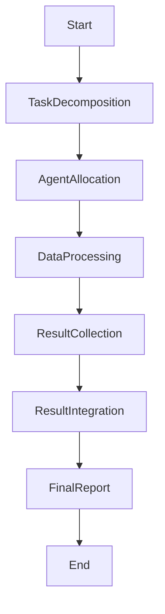
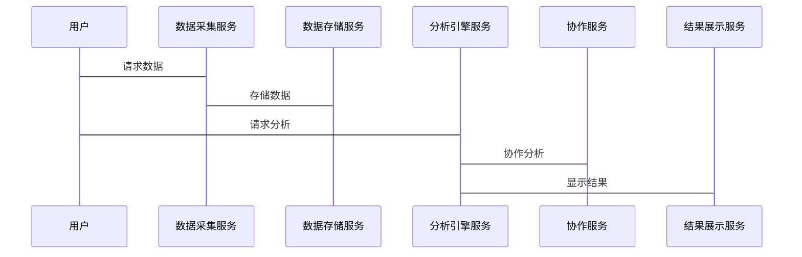

                 


# AI agents协作进行全球宏观经济分析：把握大趋势

## 关键词：AI代理, 宏观经济分析, 分布式计算, 强化学习, 实时数据分析

## 摘要：  
本文深入探讨了AI代理在宏观经济分析中的协作机制，介绍了其核心概念、算法原理、系统架构及实际应用案例。通过分析宏观经济数据，展示了AI代理如何协作进行实时数据分析，预测经济趋势，并提出了优化建议。文章还详细讲解了基于规则的决策树和强化学习等算法，并通过Python代码实现，帮助读者理解AI代理协作的实现过程。

---

# 第一部分: AI代理协作的背景与概念

## 第1章: AI代理的基本概念与宏观经济分析

### 1.1 AI代理的基本概念
#### 1.1.1 什么是AI代理
AI代理（AI Agents）是指能够感知环境、做出决策并采取行动的智能实体。它们可以是软件程序、机器人或其他智能系统，具备以下特点：
- **自主性**：能够自主决策。
- **反应性**：能实时感知环境变化并做出反应。
- **目标导向**：为了实现特定目标而行动。

#### 1.1.2 AI代理的类型与特点
AI代理可以分为以下几类：
1. **反应式代理**：基于当前环境输入做出反应，如实时数据分析工具。
2. **认知式代理**：具备推理和规划能力，如复杂的经济预测模型。
3. **学习型代理**：能够从数据中学习并改进性能，如机器学习模型。

#### 1.1.3 AI代理在宏观经济分析中的应用
AI代理在宏观经济分析中的应用主要体现在数据处理、趋势预测和决策支持等方面。例如，多个AI代理可以协同工作，分别分析不同经济指标（如GDP、通胀率、就业率等），然后汇总结果生成综合经济报告。

### 1.2 全球宏观经济分析的基本框架
#### 1.2.1 宏观经济分析的主要指标
宏观经济分析主要关注以下指标：
- **GDP（国内生产总值）**：衡量一个国家或地区的经济规模。
- **通胀率**：物价水平的变化情况。
- **失业率**：劳动力市场的健康状况。
- **贸易平衡**：进出口差额。

#### 1.2.2 宏观经济分析的复杂性
宏观经济分析涉及多个变量之间的复杂关系，例如：
- 消费者行为影响市场需求，进而影响GDP。
- 货币政策和财政政策对经济周期有调节作用。

#### 1.2.3 AI代理协作的优势
AI代理协作能够显著提高宏观经济分析的效率和准确性：
- **分布式计算**：多个代理可以同时处理不同数据源，加快分析速度。
- **多维度分析**：不同代理可以专注于不同的经济指标，提供全面的分析结果。
- **实时更新**：AI代理能够实时获取最新数据，确保分析结果的及时性。

---

## 第2章: AI代理协作的核心概念与联系

### 2.1 AI代理协作的核心原理
#### 2.1.1 代理协作的基本模型
AI代理协作的基本模型包括以下步骤：
1. **任务分解**：将宏观经济分析任务分解为多个子任务。
2. **代理分配**：将子任务分配给不同的AI代理。
3. **数据处理**：每个代理处理分配的数据并生成结果。
4. **结果整合**：将所有代理的结果整合为最终的宏观经济分析报告。

#### 2.1.2 代理之间的信息传递机制
信息传递机制是AI代理协作的关键：
- **数据共享**：代理之间共享必要的数据和信息。
- **通信协议**：通过特定协议确保数据传输的准确性和安全性。
- **协调机制**：通过协调机制确保代理之间的协同工作。

#### 2.1.3 代理协作的目标函数
目标函数定义了宏观经济分析的任务目标，例如：
$$\text{最小化预测误差} \quad \text{或} \quad \text{最大化预测准确率}$$

### 2.2 AI代理协作的关键要素
#### 2.2.1 数据源的多样性
AI代理协作需要处理多种类型的数据源，例如：
- **结构化数据**：如表格数据（GDP、通胀率）。
- **非结构化数据**：如文本数据（新闻报道、政策文件）。
- **实时数据**：如金融市场数据。

#### 2.2.2 代理的独立性与协作性
AI代理需要在独立性和协作性之间找到平衡：
- **独立性**：每个代理专注于特定任务，确保高效性。
- **协作性**：代理之间能够共享信息和协调行动，确保结果的全面性。

#### 2.2.3 结果的整合与优化
结果整合与优化是AI代理协作的重要环节：
- **数据融合**：将不同代理的分析结果进行融合，消除冗余和矛盾。
- **优化算法**：使用优化算法（如遗传算法）进一步优化结果。

### 2.3 AI代理协作的流程图


---

## 第3章: AI代理协作的算法原理

### 3.1 分布式计算与协作算法
#### 3.1.1 分布式计算的基本概念
分布式计算是一种将计算任务分发到多个计算节点并行执行的计算模式，具有以下优点：
- **提高计算效率**：多个节点同时处理任务，加快计算速度。
- **增强容错性**：任务分布在多个节点上，单个节点故障不影响整个计算过程。

#### 3.1.2 分布式协作算法的实现
分布式协作算法的实现步骤如下：
1. **任务分配**：将任务分解为多个子任务，并分配给不同的计算节点。
2. **数据分发**：将数据分发到不同的计算节点。
3. **子任务计算**：每个节点独立计算分配的任务。
4. **结果汇总**：将所有节点的结果汇总到中央节点。
5. **结果整合**：中央节点整合所有结果，生成最终结果。

#### 3.1.3 分布式算法的优缺点
- **优点**：
  - 提高计算效率。
  - 增强系统的可扩展性。
- **缺点**：
  - 增加了系统的复杂性。
  - 需要处理节点之间的通信开销。

### 3.2 基于规则的协作算法
#### 3.2.1 基于规则的决策树
基于规则的决策树是一种常见的机器学习算法，适用于分类和回归任务。决策树的构建过程如下：
1. **特征选择**：选择能够最好地分割数据的特征。
2. **分裂数据**：根据选择的特征将数据集分割成子集。
3. **递归构建树**：对每个子集递归地构建决策树。
4. **剪枝**：去除可能导致过拟合的节点。

#### 3.2.2 规则的制定与优化
规则的制定与优化是基于规则的协作算法的核心：
- **规则制定**：根据领域知识和数据特征制定规则。
- **规则优化**：通过交叉验证等方法优化规则，提高准确率。

#### 3.2.3 规则在宏观经济分析中的应用
例如，可以制定以下规则：
- 如果GDP增长率大于5%，则预测经济 overheating。
- 如果通胀率高于目标水平，建议采取紧缩货币政策。

### 3.3 强化学习在代理协作中的应用
#### 3.3.1 强化学习的基本原理
强化学习是一种通过试错机制学习策略的机器学习方法，主要由以下部分组成：
- **状态空间**：表示环境的状态。
- **动作空间**：表示可能采取的动作。
- **奖励函数**：定义每个动作的奖励值。

#### 3.3.2 在代理协作中的应用
强化学习可以应用于代理协作的以下方面：
- **任务分配**：通过强化学习优化任务分配策略。
- **数据处理**：通过强化学习优化数据处理流程。
- **结果整合**：通过强化学习优化结果整合策略。

#### 3.3.3 强化学习的训练过程
强化学习的训练过程包括以下几个步骤：
1. **初始化**：初始化智能体的参数。
2. **与环境交互**：智能体根据当前状态选择动作，并与环境交互。
3. **获取奖励**：根据动作的效果获得奖励。
4. **更新策略**：根据奖励更新智能体的策略。

### 3.4 算法实现的Python代码
以下是一个基于规则的决策树的Python代码示例：
```python
from sklearn.tree import DecisionTreeClassifier
from sklearn.model_selection import train_test_split
from sklearn.metrics import accuracy_score

# 数据加载与预处理
data = ...  # 加载数据
X = data.drop('target', axis=1)
y = data['target']

# 数据分割
X_train, X_test, y_train, y_test = train_test_split(X, y, test_size=0.2)

# 模型训练
model = DecisionTreeClassifier()
model.fit(X_train, y_train)

# 模型预测
y_pred = model.predict(X_test)

# 模型评估
print("准确率:", accuracy_score(y_test, y_pred))
```

---

## 第4章: AI代理协作的系统分析与架构设计

### 4.1 宏观经济分析的场景介绍
宏观经济分析的场景包括：
- **实时监控**：实时监控经济指标的变化。
- **趋势预测**：预测未来经济走势。
- **政策模拟**：模拟政策变化对经济的影响。

### 4.2 系统功能设计
系统功能设计包括以下几个方面：
1. **数据采集模块**：负责采集宏观经济数据。
2. **分析引擎模块**：负责对数据进行分析和处理。
3. **协作机制模块**：负责代理之间的协作和通信。
4. **结果展示模块**：负责展示分析结果。

### 4.3 系统架构设计
系统架构设计采用微服务架构，主要包括以下几个部分：
1. **数据采集服务**：负责从不同数据源采集数据。
2. **数据存储服务**：负责存储采集的数据。
3. **分析引擎服务**：负责对数据进行分析和处理。
4. **协作服务**：负责代理之间的协作和通信。
5. **结果展示服务**：负责展示分析结果。

### 4.4 系统交互流程图


---

## 第5章: AI代理协作的项目实战

### 5.1 环境配置
#### 5.1.1 安装必要的库
需要安装以下Python库：
- `pandas`：数据处理库。
- `numpy`：数值计算库。
- `scikit-learn`：机器学习库。
- `mermaid`：图表生成库。

#### 5.1.2 配置开发环境
推荐使用Jupyter Notebook作为开发环境，方便数据处理和可视化。

### 5.2 系统核心实现
#### 5.2.1 数据采集与预处理
```python
import pandas as pd
import numpy as np

# 数据加载
data = pd.read_csv('macro_economic.csv')

# 数据预处理
data = data.dropna()
data = (data - data.mean()) / data.std()  # 标准化处理
```

#### 5.2.2 模型训练与预测
```python
from sklearn.ensemble import RandomForestRegressor

# 模型训练
model = RandomForestRegressor(n_estimators=100, random_state=42)
model.fit(X_train, y_train)

# 模型预测
y_pred = model.predict(X_test)
```

#### 5.2.3 结果展示
```python
import matplotlib.pyplot as plt

plt.figure(figsize=(10, 6))
plt.plot(y_test, label='实际值')
plt.plot(y_pred, label='预测值')
plt.title('宏观经济趋势预测')
plt.xlabel('时间')
plt.ylabel('值')
plt.legend()
plt.show()
```

### 5.3 项目小结
通过本项目，我们实现了基于AI代理协作的宏观经济分析系统。系统能够实时采集和处理宏观经济数据，利用分布式计算和机器学习算法进行分析和预测，并通过可视化展示分析结果。

---

## 第6章: 总结与展望

### 6.1 最佳实践 tips
- **数据质量**：确保数据的准确性和完整性。
- **模型优化**：通过交叉验证等方法优化模型性能。
- **系统维护**：定期更新模型和数据源，确保系统的准确性和可靠性。

### 6.2 小结
本文详细介绍了AI代理协作在宏观经济分析中的应用，包括核心概念、算法原理、系统架构和项目实战。通过本文的学习，读者可以掌握AI代理协作的基本原理和实现方法，并能够在实际应用中灵活运用。

### 6.3 注意事项
- **数据隐私**：注意保护数据隐私，遵守相关法律法规。
- **系统安全**：确保系统的安全性，防止数据泄露和攻击。

### 6.4 拓展阅读
- **分布式计算**：深入学习分布式计算的相关知识。
- **强化学习**：进一步研究强化学习在宏观经济分析中的应用。
- **实时数据分析**：探索实时数据分析技术在宏观经济分析中的应用。

---

## 作者：AI天才研究院/AI Genius Institute & 禅与计算机程序设计艺术 /Zen And The Art of Computer Programming

