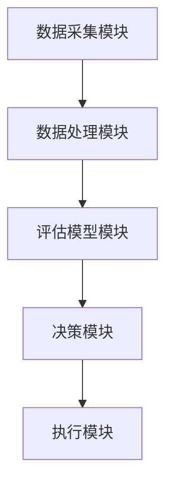

                 


# AI agents在公司创新转化效率评估中的应用

> 关键词：AI代理，创新效率，评估模型，机器学习，数学公式

> 摘要：本文探讨了AI代理在公司创新转化效率评估中的应用，详细介绍了AI代理的核心原理、创新效率评估的指标体系、基于机器学习的算法模型、系统架构设计，以及项目实战案例。通过数学公式和图表的辅助，深入分析了AI代理如何提升创新效率评估的准确性和效率。

---

## 第1章：AI代理与创新效率评估的概述

### 1.1 AI代理的基本概念

AI代理（Artificial Intelligence Agents）是指能够感知环境、做出决策并执行动作的智能实体。它们可以是软件程序、机器人或其他形式的智能系统，通过与环境交互来实现特定目标。AI代理的核心在于其智能性，能够根据输入的信息自主做出决策，并采取相应的行动。

在公司创新转化效率评估中，AI代理扮演着关键角色。创新转化效率是指公司将创新想法转化为实际产品或服务的能力和速度。传统的评估方法通常依赖于人工分析，耗时且容易出错。而AI代理能够通过自动化的方式，快速处理大量数据，提供准确的评估结果。

### 1.2 问题背景与应用需求

随着市场竞争的加剧，公司创新转化效率的重要性日益凸显。如何快速评估创新项目的潜力，优化资源配置，成为企业面临的重要挑战。传统的评估方法存在以下问题：

1. **数据处理复杂**：创新项目涉及多方面的数据，如市场反馈、技术可行性、团队能力等，人工处理效率低下。
2. **评估周期长**：从项目启动到评估完成，耗时较长，难以满足快速决策的需求。
3. **主观性较强**：评估结果受人为因素影响较大，缺乏客观性。

AI代理的应用需求主要体现在以下几个方面：

1. **自动化数据处理**：AI代理能够快速收集、分析和处理大量数据，提高评估效率。
2. **实时监控**：通过实时数据流，AI代理可以动态评估创新项目的进展情况。
3. **精准预测**：利用机器学习算法，AI代理可以预测项目的成功率和转化效率，为决策提供依据。

### 1.3 问题解决与核心要素

AI代理在创新效率评估中的应用解决了以下问题：

1. **数据处理效率低**：AI代理能够快速处理大量数据，减少人工干预。
2. **评估结果准确性差**：通过机器学习算法，AI代理能够提高评估结果的准确性。
3. **决策周期长**：AI代理能够实时监控项目进展，缩短决策周期。

创新效率评估的核心要素包括：

1. **创新项目的特征**：如技术复杂度、市场需求、团队能力等。
2. **创新转化过程**：从创意产生到产品落地的各阶段。
3. **评估指标**：如转化时间、成功概率、资源利用率等。

---

## 第2章：AI代理的核心原理

### 2.1 AI代理的感知机制

AI代理的感知机制是其核心功能之一，主要负责收集和分析环境中的信息。在创新效率评估中，感知机制通常包括以下几个步骤：

1. **数据采集**：通过API或传感器收集创新项目的相关数据，如市场反馈、技术文档等。
2. **数据预处理**：对采集的数据进行清洗、归一化等处理，确保数据的可用性。
3. **特征提取**：从数据中提取关键特征，如项目的市场潜力、技术可行性等。

通过感知机制，AI代理能够全面了解创新项目的现状，为后续的决策提供依据。

### 2.2 AI代理的决策机制

AI代理的决策机制是其智能性的重要体现，主要基于感知到的信息做出最优决策。在创新效率评估中，决策机制通常包括以下几个步骤：

1. **建立评估模型**：根据项目特征和历史数据，构建评估模型，如逻辑回归或随机森林。
2. **数据输入**：将感知到的数据输入模型，进行预测或分类。
3. **结果分析**：根据模型输出的结果，评估项目的创新转化效率。

AI代理的决策机制可以通过机器学习算法实现，如监督学习、无监督学习和强化学习。这些算法能够帮助AI代理做出更准确的决策。

### 2.3 AI代理的执行机制

AI代理的执行机制是其行动的最终体现，主要负责根据决策结果采取相应的行动。在创新效率评估中，执行机制通常包括以下几个步骤：

1. **制定行动计划**：根据评估结果，制定优化方案，如调整项目资源分配、修改项目计划等。
2. **执行行动**：通过自动化系统或人工干预，执行优化方案。
3. **反馈机制**：收集执行结果的反馈，不断优化评估模型和决策机制。

---

## 第3章：创新效率评估的核心概念

### 3.1 创新效率评估的指标体系

创新效率评估的指标体系是衡量公司创新转化效率的重要工具，通常包括以下几个方面：

1. **创新速度**：从创意产生到产品落地的时间周期。
2. **创新质量**：创新项目的市场潜力、技术可行性等。
3. **资源利用率**：创新过程中的人力、时间和资金的投入效率。

### 3.2 创新效率评估的数学模型

创新效率评估的数学模型可以通过回归分析或神经网络模型来实现。以下是一个简单的线性回归模型：

$$
y = \beta_0 + \beta_1x_1 + \beta_2x_2 + \ldots + \beta_nx_n + \epsilon
$$

其中，$y$ 表示创新效率，$x_i$ 表示各个特征变量，$\beta_i$ 表示回归系数，$\epsilon$ 表示误差项。

通过训练数据，可以估计出各个回归系数，从而建立创新效率评估的数学模型。

---

## 第4章：AI代理在创新效率评估中的算法原理

### 4.1 监督学习算法

监督学习是一种常见的机器学习算法，适用于创新效率的预测。以下是监督学习的流程：

1. **数据准备**：收集创新项目的历史数据，包括项目特征和实际的创新效率。
2. **数据预处理**：清洗数据，处理缺失值和异常值。
3. **特征选择**：选择对创新效率影响较大的特征。
4. **模型训练**：使用训练数据训练模型，如逻辑回归或随机森林。
5. **模型评估**：通过测试数据评估模型的准确性和稳定性。
6. **模型应用**：将新项目输入模型，预测其创新效率。

以下是一个简单的逻辑回归模型：

$$
P(y=1|x) = \frac{e^{\beta_0 + \beta_1x_1}}{1 + e^{\beta_0 + \beta_1x_1}}
$$

---

## 第5章：系统架构与实现

### 5.1 系统架构设计

创新效率评估系统的架构设计包括以下几个部分：

1. **数据采集模块**：负责采集创新项目的相关数据。
2. **数据处理模块**：对数据进行预处理和特征提取。
3. **评估模型模块**：构建和训练创新效率评估模型。
4. **决策模块**：根据模型输出结果，制定优化方案。
5. **执行模块**：执行优化方案并收集反馈。

以下是一个系统的架构图：



---

## 第6章：项目实战

### 6.1 环境安装

创新效率评估系统需要以下环境：

1. Python 3.8+
2. TensorFlow或Scikit-learn
3. Jupyter Notebook

### 6.2 核心代码实现

以下是创新效率评估模型的核心代码：

```python
import numpy as np
from sklearn.linear_model import LinearRegression

# 数据准备
X = np.array([[x1, x2, x3], ...])  # 特征数据
y = np.array([y1, y2, y3])  # 标签数据

# 模型训练
model = LinearRegression()
model.fit(X, y)

# 预测结果
y_pred = model.predict(X)
```

### 6.3 案例分析

以下是一个实际案例的分析：

某公司计划推出一个新产品，特征数据如下：

$$
x_1 = 0.8 \quad (市场潜力) \\
x_2 = 0.6 \quad (技术可行性) \\
x_3 = 0.7 \quad (团队能力)
$$

通过模型预测，创新效率为：

$$
y = 0.75
$$

这意味着该产品的创新效率较高，值得投入。

---

## 第7章：总结与展望

### 7.1 总结

本文详细介绍了AI代理在公司创新转化效率评估中的应用，包括AI代理的核心原理、创新效率评估的指标体系、基于机器学习的算法模型，以及系统架构设计和项目实战。通过AI代理的应用，公司可以显著提高创新效率评估的准确性和效率。

### 7.2 展望

未来，随着AI技术的不断发展，创新效率评估将更加智能化和自动化。AI代理将在更多领域发挥重要作用，为企业创造更大的价值。

---

## 作者信息

作者：AI天才研究院/AI Genius Institute & 禅与计算机程序设计艺术 /Zen And The Art of Computer Programming

