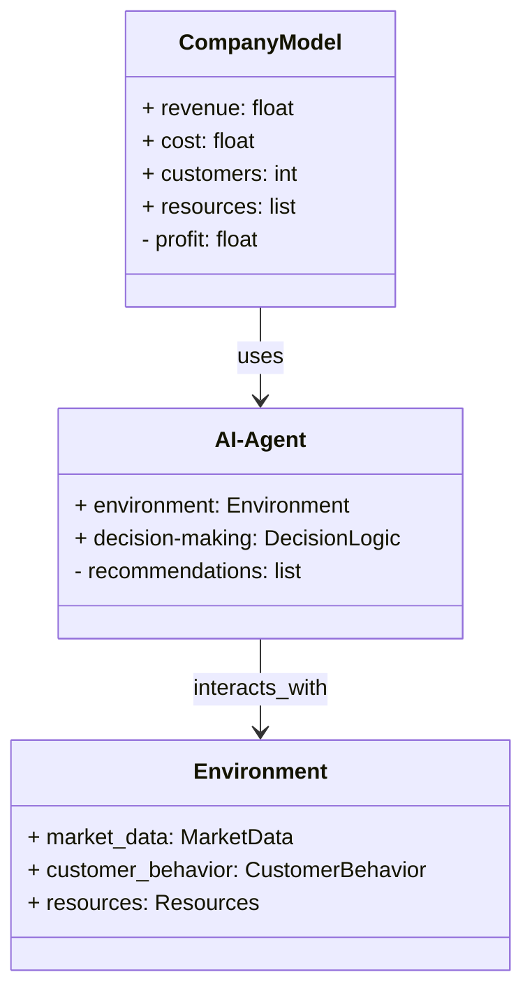
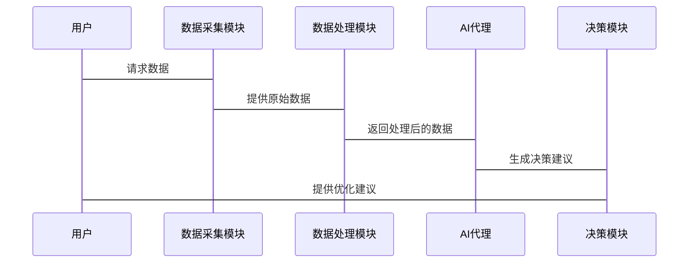

                 


# AI Agents在公司商业模式可持续性评估中的应用

> **关键词**：AI代理，商业模式，可持续性评估，算法原理，系统架构

> **摘要**：随着人工智能技术的快速发展，AI代理在公司商业模式的可持续性评估中展现出巨大的潜力。本文从AI代理的基本概念出发，详细探讨其在商业模式评估中的应用，分析其核心原理、算法模型、系统架构，并通过实际案例展示其在项目中的具体应用。通过本文，读者可以全面了解AI代理如何助力公司实现商业模式的可持续性优化。

---

## 第一部分：AI代理与公司商业模式可持续性评估概述

### 第1章：AI代理与公司商业模式可持续性评估概述

#### 1.1 AI代理的基本概念

##### 1.1.1 AI代理的定义
AI代理（Artificial Intelligence Agents）是指具有感知环境、理解需求、做出决策并执行操作的智能实体。它们能够通过数据驱动的方式，模拟人类的决策过程，从而在商业环境中提供支持。

##### 1.1.2 AI代理的核心特征
- **自主性**：AI代理能够在没有外部干预的情况下独立运作。
- **反应性**：能够实时感知环境变化并做出相应调整。
- **目标导向**：基于预设目标优化决策过程。
- **学习能力**：通过机器学习算法不断优化自身性能。

##### 1.1.3 AI代理在商业中的应用潜力
AI代理在商业中的应用包括客户行为预测、市场趋势分析、供应链优化等。它们能够提高效率、降低成本，并为企业提供数据驱动的决策支持。

#### 1.2 公司商业模式的定义与可持续性评估

##### 1.2.1 商业模式的基本构成
商业模式是企业实现价值创造和传递的方式，主要包括价值主张、客户关系、资源分配和收益方式四个核心要素。

##### 1.2.2 可持续性评估的必要性
可持续性评估旨在确保商业模式在经济、社会和环境三个维度上的长期可行性和价值最大化。它是企业实现长期发展的关键因素。

##### 1.2.3 AI代理在可持续性评估中的作用
AI代理能够通过数据分析和预测模型，评估商业模式的可持续性，识别潜在风险，并提出优化建议。

#### 1.3 本章小结
本章介绍了AI代理的基本概念及其在商业中的应用潜力，重点阐述了公司商业模式的定义和可持续性评估的必要性。AI代理作为技术工具，能够有效支持商业模式的优化和可持续性评估。

---

## 第二部分：AI代理的核心原理与数学模型

### 第2章：AI代理的核心原理

#### 2.1 AI代理的感知与决策机制

##### 2.1.1 环境感知
AI代理通过传感器、数据源等渠道获取环境信息，包括客户数据、市场趋势等。

##### 2.1.2 信息处理
通过自然语言处理（NLP）、计算机视觉等技术对获取的信息进行处理和分析。

##### 2.1.3 决策制定
基于处理后的信息，AI代理运用机器学习模型生成决策，并通过反馈机制优化决策过程。

#### 2.2 常见的AI代理算法

##### 2.2.1 强化学习算法
强化学习（Reinforcement Learning）通过奖励机制训练AI代理，使其在与环境的交互中逐步优化决策策略。

##### 2.2.2 深度学习模型
深度学习（Deep Learning）通过多层神经网络结构，从大量数据中提取特征并生成决策。

##### 2.2.3 其他相关算法
包括支持向量机（SVM）、决策树（Decision Tree）等。

#### 2.3 AI代理与可持续性评估的结合

##### 2.3.1 代理如何影响商业模式
AI代理能够优化资源配置、预测市场需求，并提出创新的商业模式。

##### 2.3.2 可持续性评估的代理模型
构建基于AI代理的评估模型，通过模拟不同情景下的表现，评估商业模式的可持续性。

#### 2.4 本章小结
本章详细讲解了AI代理的核心原理，包括感知、决策和算法选择。通过强化学习和深度学习等技术，AI代理能够有效支持商业模式的可持续性评估。

---

### 第3章：数学模型与公式

#### 3.1 可持续性评估的数学模型

##### 3.1.1 模型的基本结构
可持续性评估模型通常包括目标函数、约束条件和决策变量。

##### 3.1.2 相关变量的定义
- **目标函数**：表示企业追求的优化目标，如最大化收益或最小化成本。
- **决策变量**：表示可以调整的参数，如产品定价、营销策略等。
- **约束条件**：表示模型运行的限制条件，如预算限制、政策法规等。

##### 3.1.3 模型的假设条件
模型假设数据充分、决策变量可调整、目标函数明确等。

#### 3.2 AI代理决策的数学表达

##### 3.2.1 决策函数的定义
决策函数表示AI代理根据输入信息生成决策的过程，通常用数学函数表示。

##### 3.2.2 目标函数的构建
目标函数用于衡量AI代理决策的优劣，通常为最大化或最小化问题。

##### 3.2.3 约束条件的设定
约束条件确保AI代理的决策符合实际可行的范围。

#### 3.3 优化算法的数学推导

##### 3.3.1 线性规划模型
线性规划模型用于解决目标函数和约束条件均为线性的情况，如下：
$$ \text{最大化} \quad c^T x $$
$$ \text{满足} \quad A x \leq b $$
$$ x \geq 0 $$

##### 3.3.2 动态规划模型
动态规划模型适用于多阶段决策问题，通过分解问题，逐阶段优化决策。

##### 3.3.3 其他优化方法
包括遗传算法、模拟退火等，用于处理复杂的非线性优化问题。

#### 3.4 本章小结
本章通过数学模型和公式，详细描述了AI代理在可持续性评估中的决策过程。线性规划和动态规划等方法为模型的构建和优化提供了理论基础。

---

## 第三部分：系统分析与架构设计

### 第4章：系统分析与架构设计

#### 4.1 问题场景介绍

##### 4.1.1 问题背景
企业需要优化其商业模式，以确保在经济、社会和环境三个维度上的可持续性。

##### 4.1.2 问题目标
通过AI代理技术，优化资源配置，降低运营成本，提高客户满意度。

##### 4.1.3 问题约束
数据隐私、计算资源限制、模型准确性的要求。

#### 4.2 系统功能设计

##### 4.2.1 领域模型设计（Mermaid类图）



##### 4.2.2 功能模块划分
- 数据采集模块：收集市场数据、客户反馈等。
- 数据处理模块：对数据进行清洗、转换和分析。
- 决策模块：基于模型生成决策建议。
- 反馈模块：根据结果调整模型参数。

##### 4.2.3 模块间交互关系
模块之间通过数据传递和调用API进行交互，确保系统高效运行。

#### 4.3 系统架构设计

##### 4.3.1 分层架构设计（Mermaid架构图）

```mermaid
archi
    顶层架构
    中间层
    底层架构
```

##### 4.3.2 组件间的依赖关系
AI代理依赖数据采集、数据处理和反馈模块，各模块协同工作。

##### 4.3.3 系统扩展性考虑
通过模块化设计，确保系统在需求变化时能够方便扩展。

#### 4.4 系统接口与交互设计

##### 4.4.1 主要接口定义
- 数据接口：用于数据采集和传输。
- API接口：用于与其他系统交互。

##### 4.4.2 接口交互流程（Mermaid序列图）



##### 4.4.3 接口设计原则
- 明确接口的功能和数据格式。
- 确保接口的可扩展性和兼容性。

#### 4.5 本章小结
本章通过系统分析和架构设计，展示了如何构建一个基于AI代理的可持续性评估系统。通过模块化设计和明确的接口定义，确保系统的高效运行和扩展性。

---

## 第四部分：项目实战与案例分析

### 第5章：项目实战

#### 5.1 环境安装与配置

##### 5.1.1 开发环境的选择
推荐使用Python、Jupyter Notebook和相关AI库（如TensorFlow、PyTorch）进行开发。

##### 5.1.2 依赖库的安装
安装必要的库，如pandas、numpy、scikit-learn等。

##### 5.1.3 工具链的配置
配置Jupyter Notebook、Git版本控制工具等。

#### 5.2 系统核心实现

##### 5.2.1 核心算法的实现
实现强化学习算法，训练AI代理做出最优决策。

##### 5.2.2 数据处理模块的实现
编写数据清洗和特征提取的代码，确保数据质量。

##### 5.2.3 界面设计与交互实现
设计用户友好的界面，方便用户与AI代理进行交互。

#### 5.3 代码实现与解读

##### 5.3.1 数据处理代码
```python
import pandas as pd
data = pd.read_csv('data.csv')
data.dropna(inplace=True)
```

##### 5.3.2 AI代理决策代码
```python
class AI-Agent:
    def __init__(self):
        self.model = self.build_model()
    
    def build_model(self):
        # 构建强化学习模型
        pass
    
    def make_decision(self, state):
        # 根据状态生成决策
        pass
```

##### 5.3.3 模型优化代码
```python
def optimize_model():
    # 使用遗传算法优化模型参数
    pass
```

#### 5.4 实际案例分析与结果展示

##### 5.4.1 案例背景
假设某公司希望优化其产品定价策略，以提高利润率。

##### 5.4.2 数据分析结果
AI代理分析市场需求，预测不同定价下的销售情况和利润。

##### 5.4.3 优化建议
根据分析结果，AI代理建议调整定价策略，以实现利润最大化。

#### 5.5 项目小结
本章通过实际案例展示了AI代理在商业模式优化中的应用。通过数据处理、模型训练和结果分析，AI代理能够为企业提供有效的优化建议。

---

## 第五部分：总结与展望

### 第6章：总结与展望

#### 6.1 本章总结
本文详细探讨了AI代理在公司商业模式可持续性评估中的应用，从理论基础到实际应用，全面分析了其潜力和价值。

#### 6.2 未来研究方向
未来的研究可以探索更复杂的模型，如多智能体系统，以及在更多行业的应用。

#### 6.3 最佳实践 tips
- 确保数据质量，选择合适的模型。
- 定期更新模型，适应环境变化。
- 结合人类专家意见，提高决策的准确性。

#### 6.4 本章小结
本文为读者提供了关于AI代理在商业模式可持续性评估中的全面视角，未来的研究将进一步深化其应用。

---

**作者：AI天才研究院 & 禅与计算机程序设计艺术**

