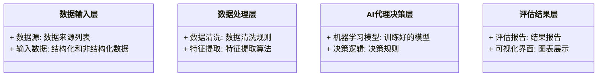

                 


# AI Agents在公司社会责任评估中的应用

> 关键词：AI代理，公司社会责任，评估方法，数据驱动，智能化决策

> 摘要：随着人工智能技术的迅速发展，AI代理在公司社会责任评估中的应用越来越广泛。本文将详细探讨AI代理在公司社会责任评估中的应用，从核心概念到算法原理，从系统设计到项目实战，全面解析AI代理如何帮助公司更高效、更准确地进行社会责任评估。

---

# 第一部分: AI 代理与公司社会责任评估的背景介绍

## 第1章: 问题背景与描述

### 1.1 问题背景

#### 1.1.1 公司社会责任的定义与重要性
公司社会责任（Corporate Social Responsibility, CSR）是指企业在追求经济效益的同时，还需要关注社会、环境和治理（ESG）方面的影响。随着全球化和信息化的快速发展，企业社会责任已成为衡量企业价值的重要指标，直接影响企业的声誉、市场竞争力和社会认可度。

#### 1.1.2 传统社会责任评估的局限性
传统的社会责任评估方法通常依赖人工数据收集和分析，存在以下问题：
- 数据来源分散，难以整合；
- 评估标准不统一，结果缺乏客观性；
- 评估周期长，难以及时反映企业动态；
- 评估成本高，难以覆盖大量企业。

#### 1.1.3 AI代理技术的兴起与潜力
AI代理（AI Agents）是一种能够感知环境、自主决策并执行任务的智能体。随着机器学习、自然语言处理和大数据技术的快速发展，AI代理在数据处理、信息分析和决策优化方面展现出巨大潜力。AI代理可以高效地处理海量数据，提供实时反馈，从而显著提升社会责任评估的效率和准确性。

### 1.2 问题描述

#### 1.2.1 社会责任评估的核心挑战
- 数据多样性与复杂性：社会责任涉及环境、社会和治理等多个方面，数据来源广泛且类型多样。
- 评估标准的动态变化：不同行业和地区的社会责任评估标准存在差异，且随着政策和市场的变化而不断调整。
- 评估结果的可解释性：复杂的算法可能导致评估结果缺乏透明性和可解释性，影响企业的信任和接受度。

#### 1.2.2 数据驱动评估的必要性
通过收集和分析大量的结构化和非结构化数据，数据驱动的方法可以提供更全面、更客观的社会责任评估结果。然而，如何高效地处理和分析这些数据，是数据驱动评估的核心挑战。

#### 1.2.3 AI代理在评估中的角色定位
AI代理在社会责任评估中扮演多重角色：
- 数据收集与预处理：代理可以自动从多个来源收集数据，并进行清洗和预处理。
- 智能分析与决策：代理可以利用机器学习模型对数据进行分析，生成评估结果。
- 结果输出与反馈：代理可以将评估结果以用户友好的形式呈现，并根据反馈优化后续评估过程。

## 第2章: AI代理与社会责任评估的结合

### 2.1 AI代理的核心概念

#### 2.1.1 AI代理的定义与分类
AI代理是一种能够感知环境、自主决策并执行任务的智能体。根据智能水平，AI代理可以分为以下几类：
- **反应式代理**：基于当前感知做出反应，适用于简单任务。
- **认知式代理**：具备推理、规划和学习能力，适用于复杂任务。
- **协作式代理**：能够与其他代理或人类协同工作，优化整体性能。

#### 2.1.2 AI代理的基本特征
- **自主性**：代理能够自主决策，无需外部干预。
- **反应性**：代理能够实时感知环境变化并做出反应。
- **学习能力**：代理能够通过经验优化自身的决策能力。
- **协作性**：代理能够与其他代理或人类协同完成任务。

#### 2.1.3 AI代理的决策机制
AI代理的决策机制通常包括以下步骤：
1. **感知环境**：通过传感器或数据接口获取环境信息。
2. **状态表示**：将感知到的信息转化为内部状态表示。
3. **决策推理**：基于状态表示和预设的目标，生成决策方案。
4. **执行决策**：将决策方案转化为具体行动。
5. **反馈学习**：根据执行结果更新知识库或优化决策模型。

### 2.2 AI代理在社会责任评估中的应用

#### 2.2.1 数据收集与处理
AI代理可以从多种数据源（如企业报告、新闻媒体、社交媒体等）收集与社会责任相关的数据，并通过自然语言处理技术提取关键信息。

#### 2.2.2 智能分析与决策
利用机器学习模型，AI代理可以对收集到的数据进行分类、聚类和预测，生成初步的评估结果。

#### 2.2.3 结果输出与反馈
AI代理将评估结果以可视化形式呈现，并根据用户反馈优化后续评估过程。

## 第3章: AI代理在社会责任评估中的边界与外延

### 3.1 应用场景的边界

#### 3.1.1 数据范围的限制
AI代理在社会责任评估中的应用受到数据质量和数量的限制。例如，某些行业或地区的数据可能不完整或不可靠。

#### 3.1.2 评估指标的选择
社会责任评估涉及多个指标，如环境影响、员工福利、供应链管理等。AI代理需要根据具体应用场景选择合适的评估指标。

#### 3.1.3 代理决策的范围
AI代理在决策过程中需要明确其权限和责任范围，避免越权或决策失误。

### 3.2 应用范围的外延

#### 3.2.1 行业间的差异
不同行业在社会责任评估中的侧重点不同，例如制造业可能更关注环境影响，而金融行业可能更关注治理结构。

#### 3.2.2 地域文化的影响
不同地区的文化和社会价值观差异可能导致社会责任评估标准的差异，AI代理需要具备跨文化适应能力。

#### 3.2.3 技术发展的推动
随着技术的不断进步，AI代理在社会责任评估中的应用将更加广泛和深入，例如引入区块链技术确保数据透明性。

---

# 第二部分: AI代理与社会责任评估的核心概念与联系

## 第4章: 核心概念的原理与特征

### 4.1 核心概念的原理

#### 4.1.1 数据驱动的评估逻辑
数据驱动的评估逻辑依赖于高质量的数据输入和高效的算法模型。AI代理通过收集和分析数据，生成客观的评估结果。

#### 4.1.2 AI代理的决策机制
AI代理的决策机制包括感知、推理和执行三个阶段，每个阶段都有其独特的逻辑和方法。

#### 4.1.3 结果生成的优化策略
通过机器学习和优化算法，AI代理可以不断优化评估结果的准确性和可解释性。

### 4.2 核心概念的属性特征对比

#### 4.2.1 数据特征对比表

| 数据特征 | 传统评估 | AI代理评估 |
|----------|----------|------------|
| 数据来源 | 单一来源 | 多源融合    |
| 数据类型 | 结构化数据 | 结构化+非结构化 |
| 数据量   | 数据量小 | 数据量大    |

#### 4.2.2 代理行为特征对比表

| 行为特征 | 传统评估 | AI代理评估 |
|----------|----------|------------|
| 自动化程度 | 低       | 高         |
| 决策速度  | 慢       | 快         |
| 可扩展性  | 有限     | 强          |

## 第5章: 实体关系与架构设计

### 5.1 实体关系图


### 5.2 系统架构图


---

# 第三部分: 算法原理讲解

## 第6章: 算法原理与实现

### 6.1 算法原理

#### 6.1.1 机器学习模型选择
在社会责任评估中，常用的机器学习模型包括支持向量机（SVM）、随机森林（Random Forest）和神经网络（Neural Networks）等。

#### 6.1.2 算法流程图


#### 6.1.3 数学模型与公式
以下是一个简单的线性回归模型公式：

$$ y = \beta_0 + \beta_1 x + \epsilon $$

其中，$y$ 是预测结果，$x$ 是自变量，$\beta_0$ 和 $\beta_1$ 是模型参数，$\epsilon$ 是误差项。

### 6.2 Python代码实现

```python
import pandas as pd
from sklearn.model import LinearRegression

# 数据预处理
data = pd.read_csv('csr_data.csv')
X = data[['环境影响', '员工福利', '供应链管理']]
y = data['社会责任评分']

# 模型训练
model = LinearRegression()
model.fit(X, y)

# 结果预测
new_data = pd.DataFrame({'环境影响': [0.8], '员工福利': [0.7], '供应链管理': [0.6]})
predicted_score = model.predict(new_data)
print(predicted_score)
```

---

# 第四部分: 系统分析与架构设计方案

## 第7章: 系统设计与实现

### 7.1 问题场景介绍
假设我们正在为一家跨国企业设计一个社会责任评估系统，该系统需要实时监控和评估企业在环境、社会和治理方面的表现。

### 7.2 系统功能设计

#### 7.2.1 领域模型类图



### 7.3 系统架构图


---

# 第五部分: 项目实战

## 第8章: 项目实战与案例分析

### 8.1 项目实战

#### 8.1.1 环境安装
```bash
pip install pandas scikit-learn
```

#### 8.1.2 核心代码实现
```python
import pandas as pd
from sklearn.model import LinearRegression

# 数据预处理
data = pd.read_csv('csr_data.csv')
X = data[['环境影响', '员工福利', '供应链管理']]
y = data['社会责任评分']

# 模型训练
model = LinearRegression()
model.fit(X, y)

# 结果预测
new_data = pd.DataFrame({'环境影响': [0.8], '员工福利': [0.7], '供应链管理': [0.6]})
predicted_score = model.predict(new_data)
print(predicted_score)
```

### 8.2 实际案例分析

#### 8.2.1 案例背景
某跨国企业希望评估其在环境、社会和治理方面的表现，以提升企业形象和市场竞争力。

#### 8.2.2 数据分析与解读
通过AI代理分析，发现该企业在环境影响方面表现较好，但在员工福利方面存在改进空间。

---

# 第六部分: 最佳实践与总结

## 第9章: 最佳实践与总结

### 9.1 小结
AI代理在公司社会责任评估中的应用显著提高了评估效率和准确性，为企业提供了更全面的决策支持。

### 9.2 注意事项
- 数据质量和完整性直接影响评估结果，需确保数据来源可靠。
- 评估标准的动态变化要求系统具备灵活性和适应性。
- 评估结果的可解释性是用户信任的关键，需优化模型的透明度。

### 9.3 拓展阅读
- 《人工智能在企业治理中的应用》
- 《机器学习在社会责任评估中的实践》
- 《大数据技术在公司风险管理中的应用》

---

# 作者：AI天才研究院/AI Genius Institute & 禅与计算机程序设计艺术/Zen And The Art of Computer Programming

---

本文通过详细探讨AI代理在公司社会责任评估中的应用，从背景介绍到算法实现，从系统设计到项目实战，全面解析了AI代理在社会责任评估中的潜力和价值。希望本文能为相关领域的研究和实践提供有价值的参考和启发。

